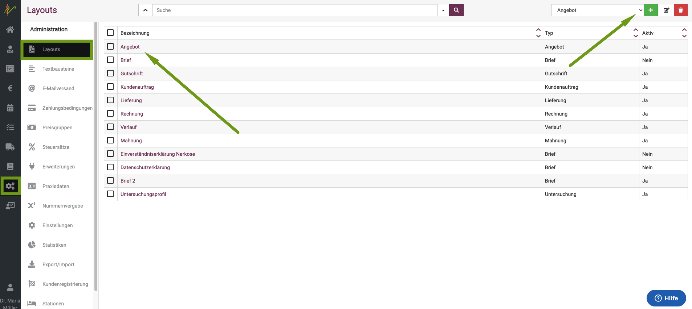
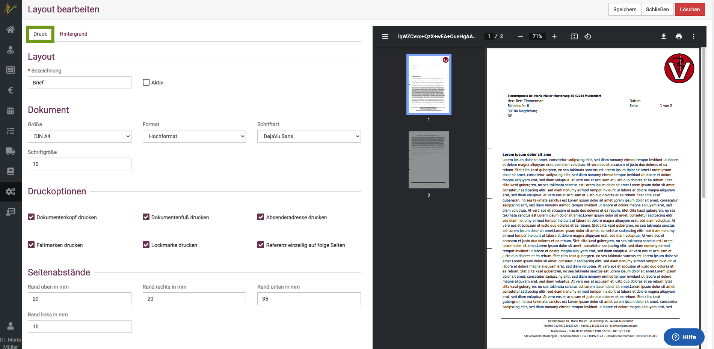
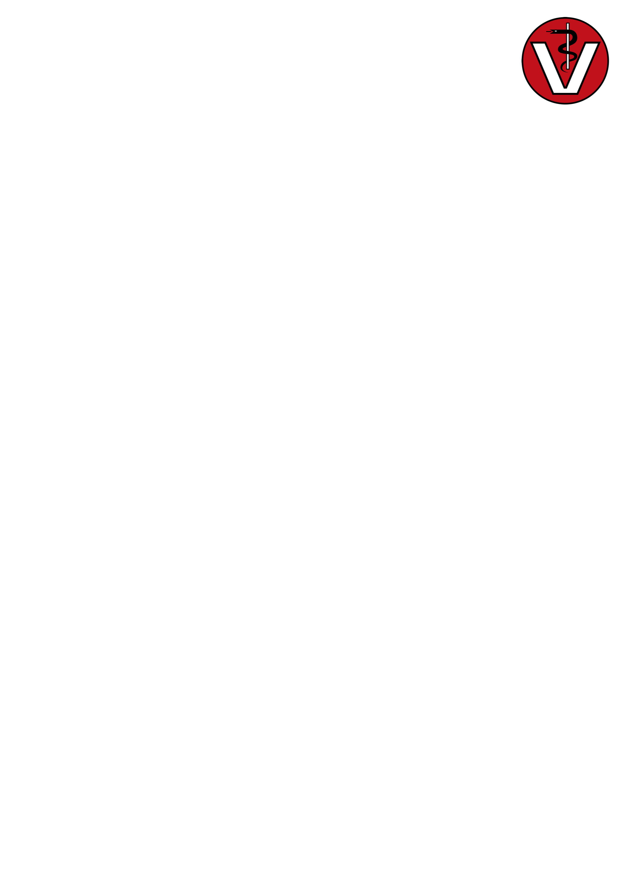
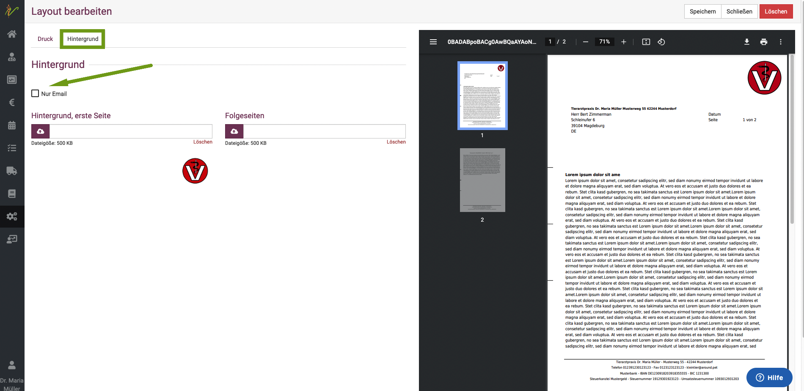
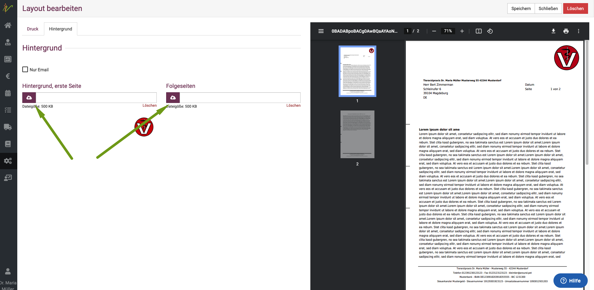
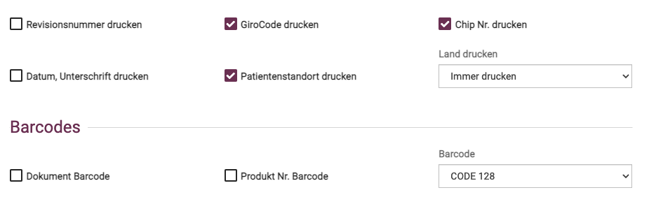
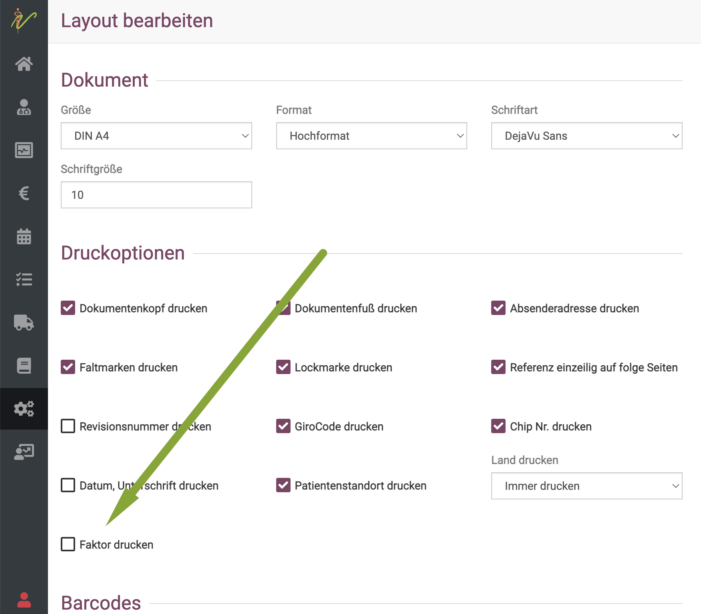
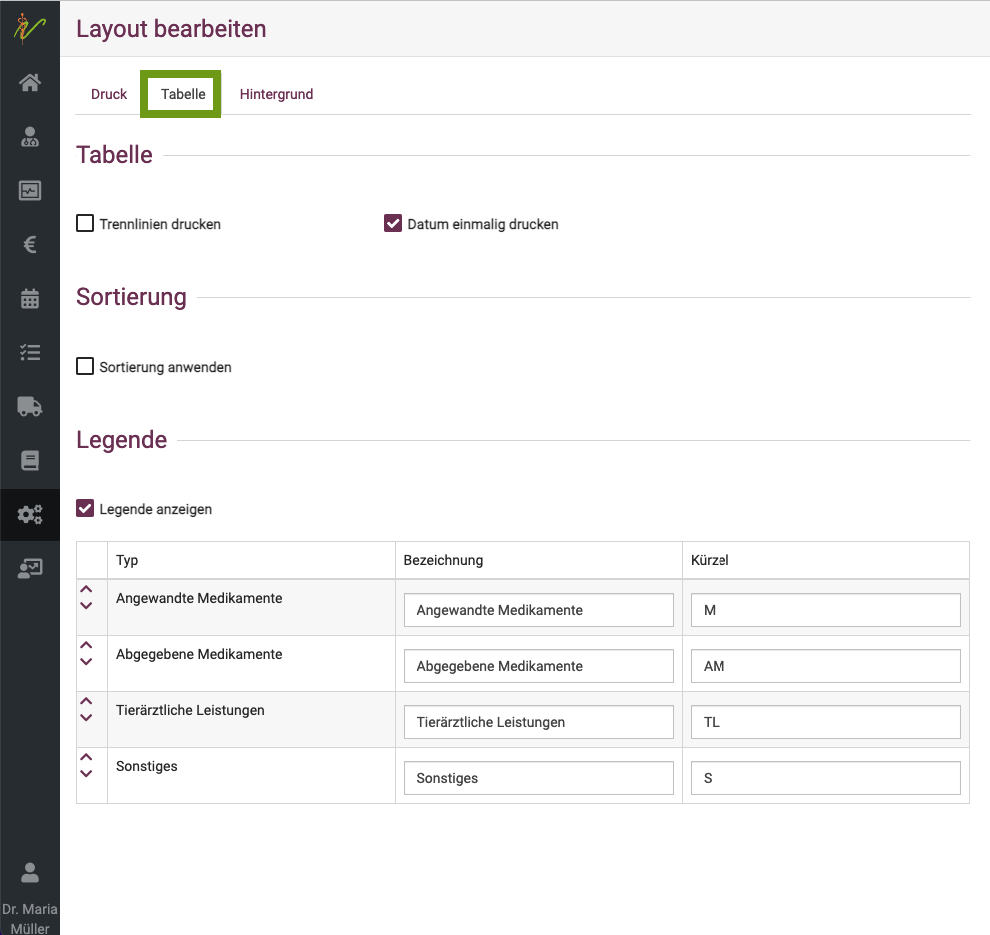

# Layouts / Logo hinterlegen

:::tip Hinweis 

Anders als in anderen Programmen kann bei debevet nicht das Logo als jpeg/png einzeln hinterlegt werden um dann für Dokumente 
genutzt zu werden. Da immer wieder Kunden sich beispielsweise nur ein Wasserzeichen im Hintergrund oder Ähnliches wünschen, haben wir uns für 
einen anderen Weg entschieden:   
Sie hinterlegen das komplette "Briefpapier" mit Ihrem Logo an der Stelle, an der Sie es haben wollen. 
Sie müssen also das Logo in eine DinA 4 große png Datei so "einbauen", wie Sie es nutzen möchten. Deswegen heißt es im debevet nicht Logo,
sondern unter **Layouts** nennt es sich **Hintergrund**.

::: 

Die debevet Software bietet Ihnen die Möglichkeit, diverse Dokumente (zum Beispiel Angebot, Rechnung und Brief) mit
Ihrem indivdiduellen Design zu versehen und so anzeigen zu lassen, wie Sie es sich wünschen. 

Klicken Sie hierzu auf **Administration** und **Layouts**. 

  

Bereits bestehende Layouts können Sie nun bearbeiten, indem Sie auf den Namen in der Spalte **Bezeichnung** klicken.

## Neues Layout anlegen  

Wenn Sie ein komplett neues Layout anlegen wollen, wählen Sie oben rechts am **Dropdown-Pfeil** den Typ Dokument aus und klicken 
anschließend das **grüne Plus-Symbol**. Sie gelangen nun auf die Detailseite (ebenso wie beim Bearbeiten eines Layouts)

## Normale Dokumente

Dies sind z. B. Brief, Angebot, Einverständniserklärungen, Verlauf, Untersuchungen. Diese Dokumente bieten nur zwei Reiter 
in der Bearbeitung: 
* Druck 
* Hintergrund   

### 1. Druck

Unter dem Reiter **Druck** können Sie diverse Einstellungen vornehmen.

**Bezeichnung** : hier können Sie einen eindeutigen Namen für dieses Layout eingeben  
**Aktiv**  Wenn sie hier den Haken setzen, kann dieses Layout aktiv genutzt werden

Einstellungen **Dokument**  

Hier können Sie Größe, Format (Hochformat, Querformat), Schriftart und Schriftgröße festlegen.   

**Druckoptionen**  

Hier können Sie verschiedene Druckeinstellungen für das Layout setzen.  

  

**Seitenabstände**  

Hier ist bereits ein sinnvoller Standard vorgegeben, aber auf Wunsch kann dieser geändert werden. Wenn Sie den Haken bei 
**Seitenabstände auf erste Seite unterschiedlich** setzen, öffnet sich noch ein Feld, in dem dann die Abstände der ersten Seite
festgelegt werden können.  

**Ausrichtungen**  

Hier setzen Sie die Abstände, die die Anschrift nach oben und nach links hat. Achten Sie dabei darauf, wenn Sie Dinge per Post versenden,
damit bei Nutzung von Fenster-Briefumschlägen diese korrekt lesbar sind!

### 2. Hintergrund  / Logo

Wenn Sie für bestimmte Dokumente Ihr Logo nutzen möchten, so muss dieses als Hintergrund hinterlegt werden. Dabei nutzen Sie bitte nicht nur die Logo-Datei,
sondern fügen diese in eine DinA4 große Fläche ein und positionieren es so, wie gewünscht. 

:::tip Tipp:  

Besonders einfach geht dies, indem Sie in einem Präsentationsprogramm (beispielsweise Powerpoint, Keynote oder andere Varianten) eine Folie mit den DinA4 hochkant 
Maßen erstellen. Dort fügen Sie dann Ihr Logo ein, positionieren und verändern es wie gewünscht (beispielsweise weniger Deckkraft und Nutzung über volle Fläche als Wasserzeichen)
und exportieren diese Folie dann als png.  

:::

Ihr Logo wird also nicht einzeln hinterlegt, sondern vorher in **eine png Datei in DIN A 4** Größe eingebunden und dann als "Briefpapier" genutzt.
Sie müssen diesen Hintergrund dann einmalig an jedem Layout, also jedem Dokument hinterlegen, für welches es genutzt werden soll. Das mag etwas umständlich wirken, 
bietet Ihnen aber die optimale und individuelle Möglichkeit, jedes Design anzupassen.

Hier ein Beispiel- Dokument 

:::tip Beispiel Hintergrund    

:::

Sie können ein abweichendes Dokument als erste Seite setzen, wenn Sie dies wünschen. Außerdem gibt es die Möglichkeit, 
den Hintergrund nur dann zu nutzen, wenn Sie die Dokumente via Mail verschicken. Setzen Sie in diesem Fall die **Checkbox** auf 
**nur Email**.

  

Um die Dokumente hochzuladen, klicken Sie auf das Wolkensymbol.  

## Rechnungen Layout  

Bei allen Dokumenten, die Rechnungsposten/Leistungen/Produkte beinhalten, haben Sie noch weitere Layout Möglichkeiten. 

(Beispiele: Gutschriften, Rechnungen, Angebote/Kostenvoranschläge, Mahnung)

Unter dem Reiter **Druck** gibt es noch weitere Optionsfelder:  

  

Dort haben Sie beispielsweise die Möglichkeit, einen Girocode aufzudrucken, den der Kunde direkt scannen kann, um die
Rechnung einfacher zu überweisen. 

### Chipnummer auf die Rechnung drucken

Auch können Sie den Patientenstandort und die Chipnummer mit auf die Rechnung drucken.  Aktivieren Sie dazu im Bereich "Druck" am
Layout der Rechnung die entsprechende Checkbox und speichern anschließend.

Eine weitere Option, die nach Wunsch eingefügt werden kann, ist der Faktor, also der Satz, mit dem Sie die einzelnen GOT Posten abgerechnet haben mit 
zu drucken. Dies ist laut GOT nicht vorgeschrieben, aber wenn Sie es wünschen, können Sie dies einstellen, indem Sie den Haken bei **Faktor** setzen.  

Reiter **Tabelle**

Sie haben für Rechnungen/Lieferungen/Angebote und Mahnungen die Möglichkeit, die Darstellung der Rechnungsposten am Reiter 
**Tabelle** zu ändern.  

  

In der Vorschau können Sie dann direkt sehen, was sich bei welcher Option ändert. 

