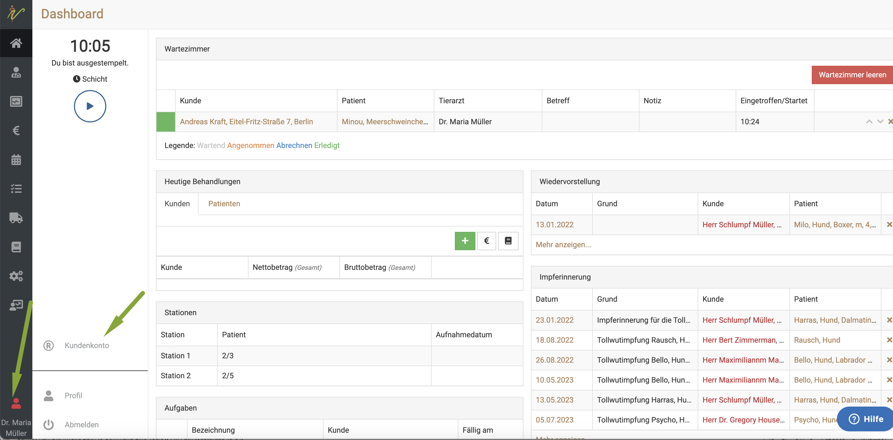
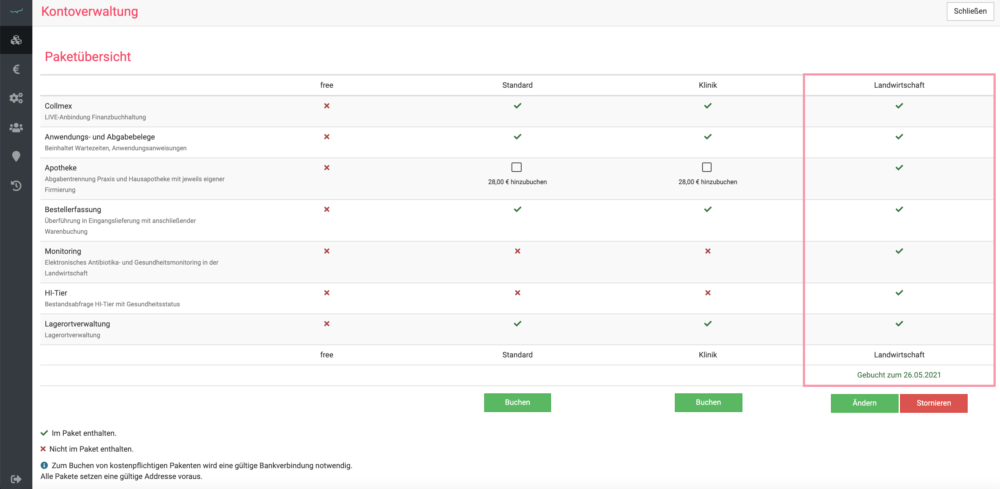
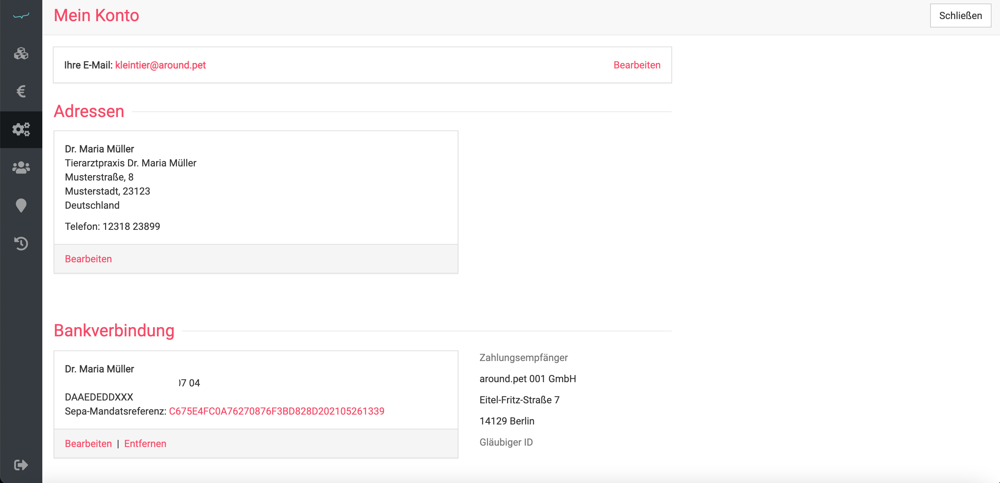
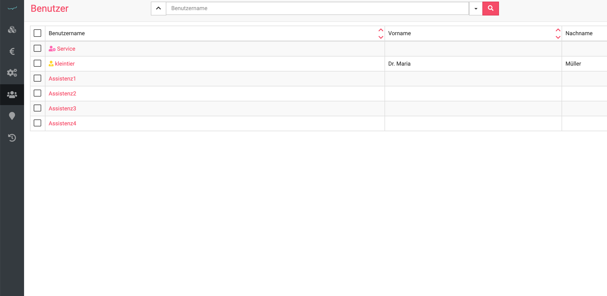
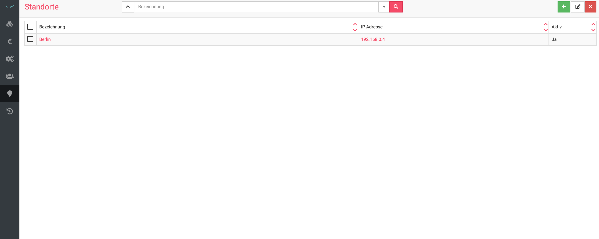
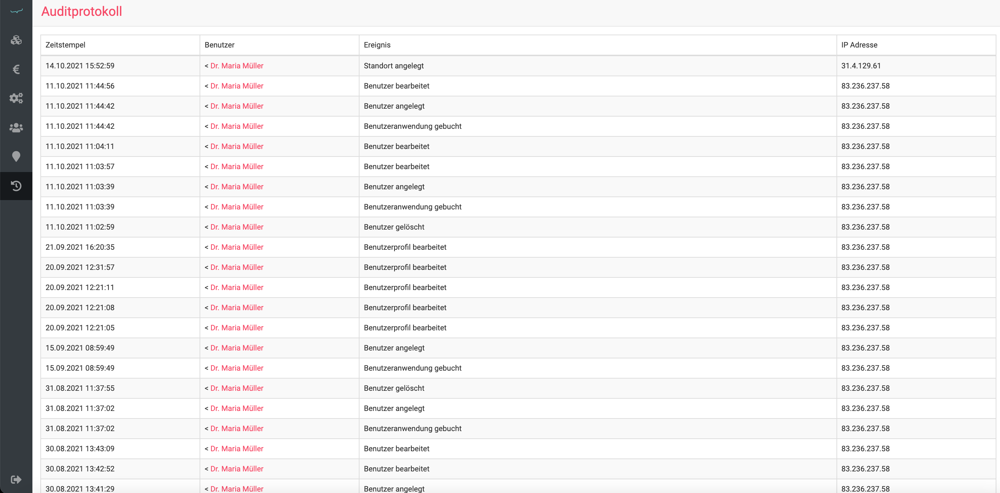
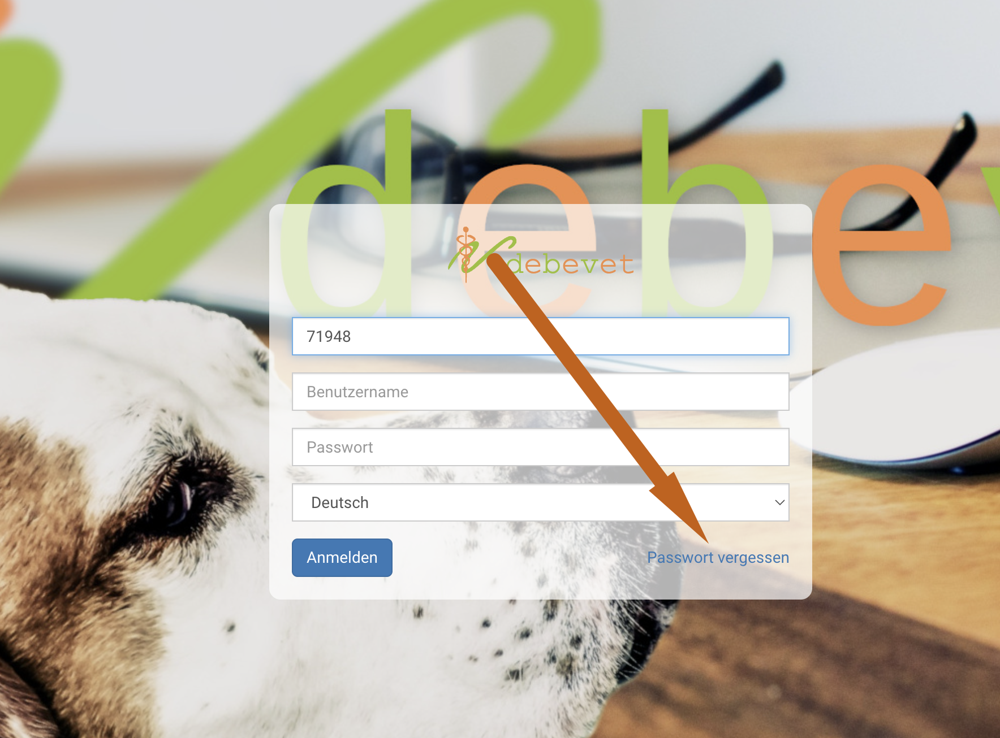
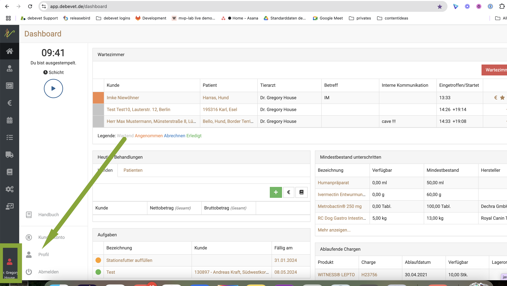
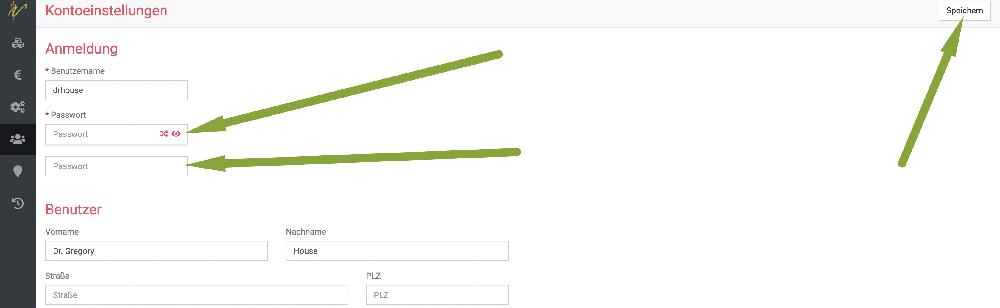

# Kundenkonto  

Wenn Sie unten links auf Ihren Benutzernamen und das Personensymbol klicken, haben Sie die Option **Kundenkonto**.
Dort können Sie verschiedene Optionen einstellen und einsehen.  

## Anwendungen /Abonnement verwalten

Hier können Sie sehen, welches debevet Paket, Abo Sie aktuell nutzen und welche Anwendungen darin enthalten sind.

Das Abo kann hier verändert und umgebucht werden.

Falls Sie ein höheres Paket buchen möchten, können Sie dies hier vornehmen. Sie können auch direkt sehen, welche kompatiblen 
Anwendungen dann mit dem jeweiligen Paket nutzbar wären. 

## Mein Konto

In diesem Bereich können Sie Ihre Rechnungsadresse ändern und Ihre SEPA Daten /Bankverbindung ändern.   

   

## Benutzer  

Hier können Sie Ihre Benutzer verwalten und neue Benutzer anlegen. Siehe 

[Benutzerverwaltugn](/docs/Administration/Administration#benutzerverwaltung)  

  

## Standorte

Wenn Sie über mehrere Standorte verfügen, können Sie diese in diesem Bereich hinzufügen bzw. Ihre Standorte anlegen.

  

## Auditprotokoll  

In diesem Bereich können Sie Aktivitäten einsehen, die rund um den Benutzer stattgefunden haben. Diese sind mit einem 
Zeitstempel, einem Benutzer, dem Ereignis und einer IP-Adresse dargestellt.   

   

## Passwort vergessen oder Passwort ändern   

Wenn Sie Ihr Passwort vergessen haben, nutzen Sie bitte beim Login die "Passwort vergessen" Funktion.   

  

In diesem Fall wird Ihnen ein neues Passwort zugeschickt. 

Sie möchten gern ein "Wunsch Passwort" setzen? Auch dies ist möglich, gehen Sie wie folgt vor:   

Klicken Sie unten links auf das Benutzersymbol mit Ihrem Benutzernamen und dann "Profil".   

  

Nun können Sie Ihr neues Passwort zweimal eingeben und anschließend speichern.    

