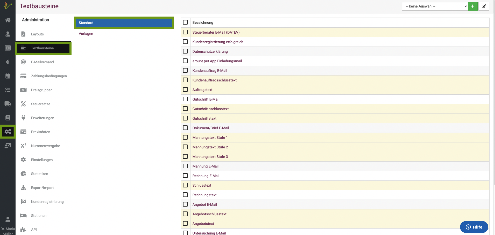
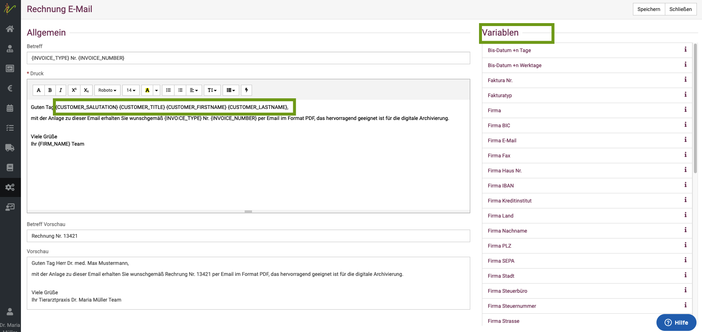
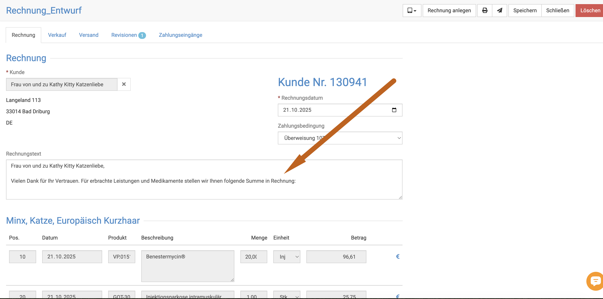
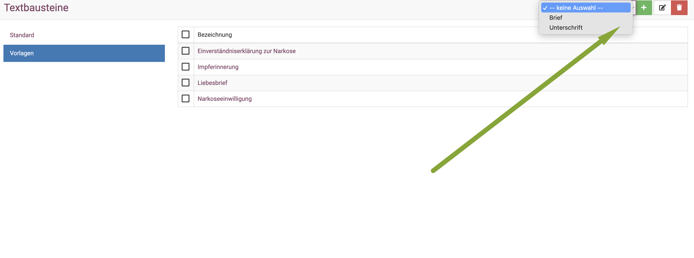
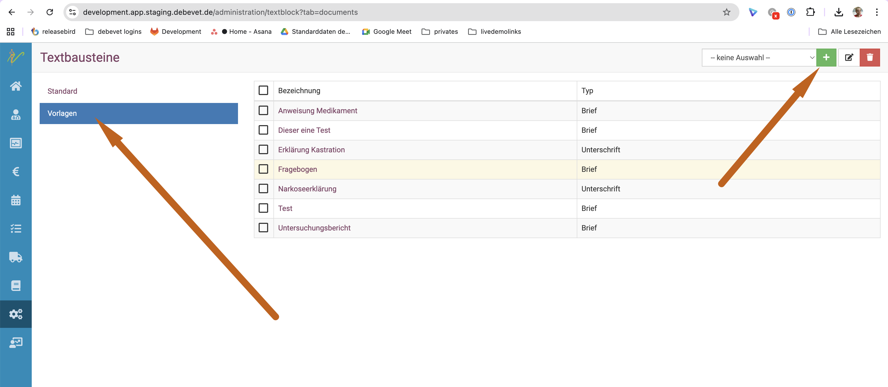
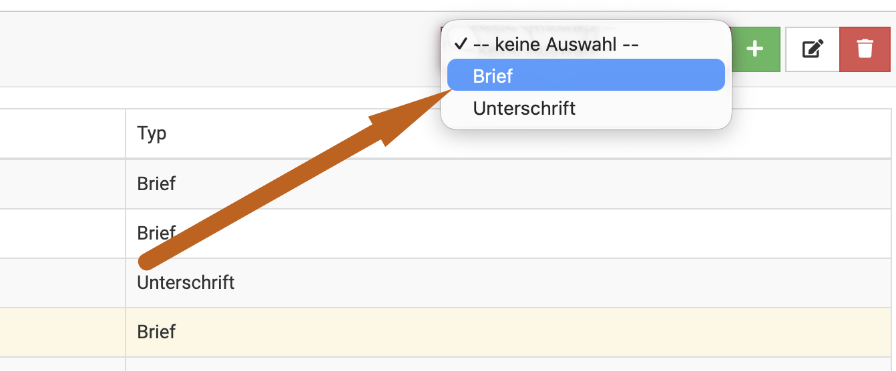

# Textbausteine   

## Textbausteine allgemein

Für alle Standard Dokumente und Emails sind Standardtexte in debevet hinterlegt. Natürlich können Sie die Textte für Rechnung, Mahnung, Angebote,
Untersuchungs-Emails und viele andere auch individuell ändern.  

Klicken Sie auf **Administration** und dann **Textbausteine**.  

   

Hier können verschiedene Textvorlagen individuell angepasst und verändert werden.

## Rechnungstext anlegen 

Unter **Standard** finden Sie alle normalen Standard Texte. Um einen beliebigen Text zu verändern, klicken Sie auf den Namen des
Textes (Beispiel hier Rechnungsemail).  

Sie können hier einen Text anlegen, der auf Rechnungen als "Einleitung" global auf jeder Rechnung aufgedruckt bzw. ins pdf gesetzt wird. 
Dies wäre "Rechnungstext".   

Ebenso können Sie (wie hier in meinem Beispiel) den Text ändern, der in der Mail genutzt wird, in der die Rechnung verschickt wird.  Dieser ist 
dann in der Mail zu lesen, das angehängte pdf enthält als Einleitung aber "Rechnungstext". Bitte unterscheiden Sie diese Texte entsprechend.

Im oberen Feld sehen Sie die Bearbeitungsmaske, in der die Variablen eingefügt werden und der Text beliebig geschrieben werden kann.  

Rechts finden Sie eine Liste mit vielen Variablen, so dass Sie alle möglichen Informationen zum Kunden oder Patienten dort 
einfügen können.

Im unteren Feld sehen Sie eine Vorschau. 

Wenn Sie fertig sind mit Ihren Änderungen, klicken Sie oben rechts auf **Speichern**.     

:::caution Achtung: 

Aktuell funktionieren die Variablen leider nur für Rechnungs-Mailtexte, nicht im Rechnungstext!   

:::   

### Rechnungstext pro Kunde/Rechnung ändern  

Immer wieder erreichen uns Anfragen, ob wir Dosierungen oder andere Anleitungen oder Hinweise auf die Rechnung drucken lassen können. 
Besondere "Rechnungsanmerkungen" haben wir aktuell nicht als Möglichkeit anzubieten, aber jeder Rechnungstext kann pro Rechnung noch ein Text hinzugefügt 
oder verändert werden. 

Beispiele wären:  
* dem Kunden eine Dosierung auf die Rechnung schreiben  
* Hinweise auf die Rechnung schreiben  

Dies kann in der Erstellung der Rechnung erfolgen. Sie rechnen also wie gewohnt ab und ergänzen dann in der "Voransicht" im 
Feld "Rechnungstext" die entsprechenden Texte.   

   

Speichern Sie dann einmal und der Text erscheint dann auf der fertigen Rechnung.

## Briefe und Dokumente zur Unterschrift

Die Sektion **Vorlagen** in diesem Teil  (Textbausteine) beinhaltet die Vorlagen für Briefe oder Unterschriftsdokumente. 
Dabei ist es wichtig, den Unterschied zwischen beiden zu verstehen.  

Wenn Sie eine neue Vorlage erstellen, ist es wichtig, zu entscheiden, wie diese genutzt werden soll. 
Klicken Sie oben rechts auf den **Dropdown-Pfeil** um zu wählen, welche Art die Vorlage werden soll. 

* *Briefe* sind die Dokumente, die in der Behandlung verschickt werden können/ausgedruckt werden können
* *Unterschrift* dies sind Dokumente, die vor Ort ans Tablet zur Unterschrift gesendet werden können

Die Funtkionsweise der Vorlagen mit den Variablen ist dieselbe, um zu erfahren, wie diese Briefe aus der Behandlung heraus genutzt 
werden können, schauen Sie hier: 

[Brief an Patienten](/docs/Patienten/Behandlung#briefmail-an-den-patienten-anlegen)

Um zu Erfahren, wie Sie die Dokumente zum Unterschreiben ans Tablet senden können, schauen Sie hier:  

[Tablet nutzen](/docs/Administration/Tablet)  

:::caution  Achtung  

Wenn Sie bespielsweise eine Narkoseeinwilligung vor Ort oder vorab via Mail nutzen wollen, muss diese als Typ **Brief** angelegt werden. Wenn 
Sie parallel noch einmal eine Narkoseeinwilligung via Tablet zum Unterschreiben nutzen wollen, müssen Sie diese noch einmal als Typ **Unterschrift** anlegen. 
Es macht Sinn, diese dann klar zu benennen!  

:::

## Bescheinigungen, Gutachten, Rezepte   

Ebenso können Sie sich selbst Texte anlegen, die Sie mit den Daten des Kunden und Patienten bereits automatisch füllen lassen. 

Beispiele hierfür können sein:  
* Euthanasiebescheinigung  
* Rezepte 
* Rezepte Humammedikamente  
* Gutachten 
* Gesundheitsbescheinigungen  
* Überweisungen  
* Berichte 
 
Klicken Sie erneut "Zahnräder" und dann "Textbausteine". Klicken Sie nun oben rechts das grüne Plussymbol, um eine neue Bescheinigung anzulegen.   

   

Aus dem Dropdown wählen Sie den Typ "Brief" (das ist nur der Name, den es bei debevet hat, es ist dann individuell benennbar für Sie!)   

  

Nun können Sie das Dokument entsprechend benennen, z.B. "Rezept" oder "Euthanasiebescheinigung". Sie können wie oben beschrieben 
Variablen nutzen und alles so anpassen, wie Sie es nutzen möchten und müssen.   

Speichern Sie das Dokument. Das Dokument kann dann in jeder Behandlung als "Brief" erzeugt werden.  

Wie Sie dies nutzen, erfahren Sie hier:   
[Briefe am Patienten erstellen](https://handbuch.debevet.de/docs/Patienten/Behandlung#briefmail-an-den-patienten-anlegen)