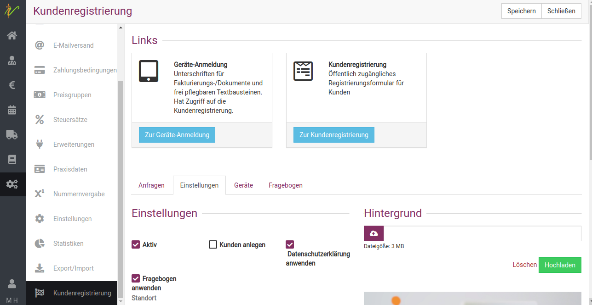
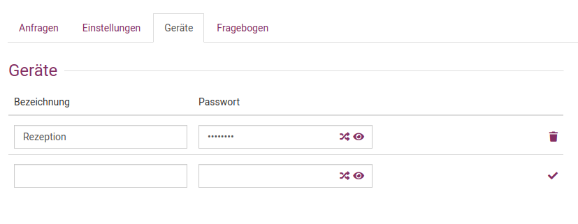
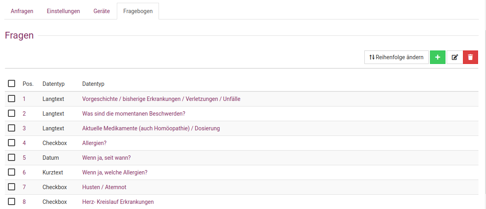
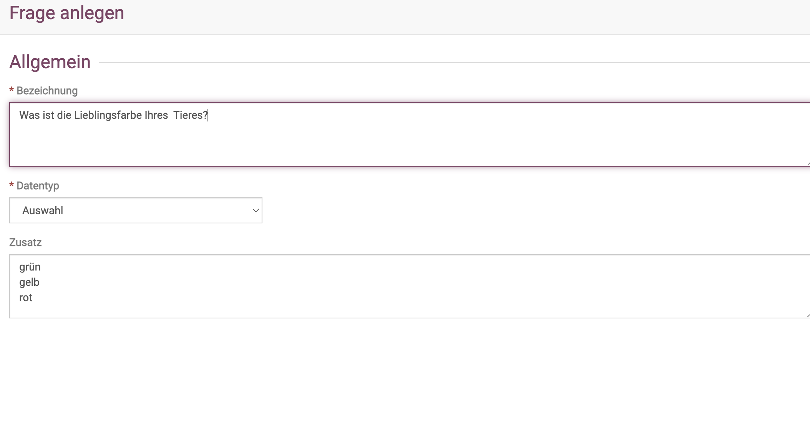
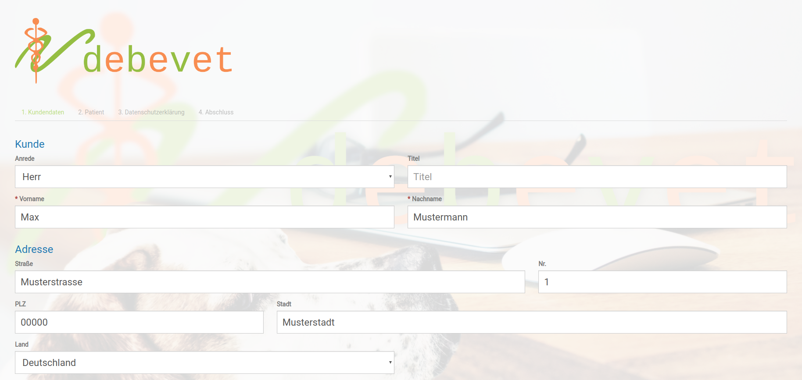
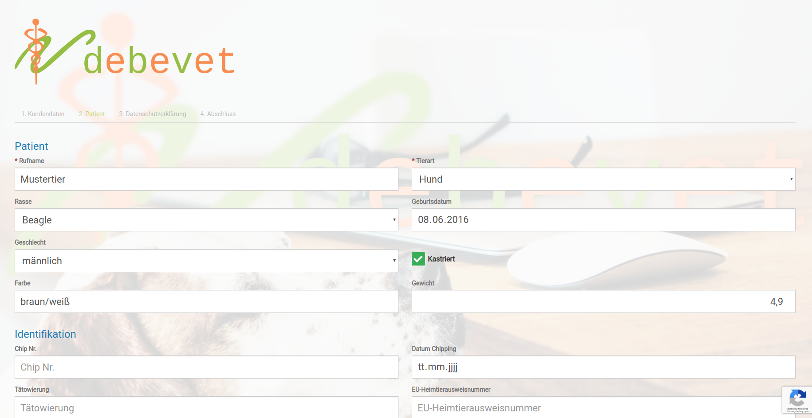
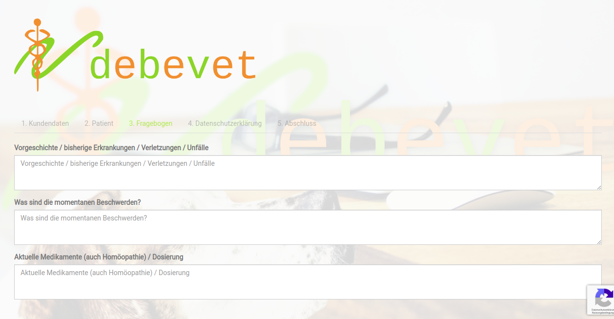
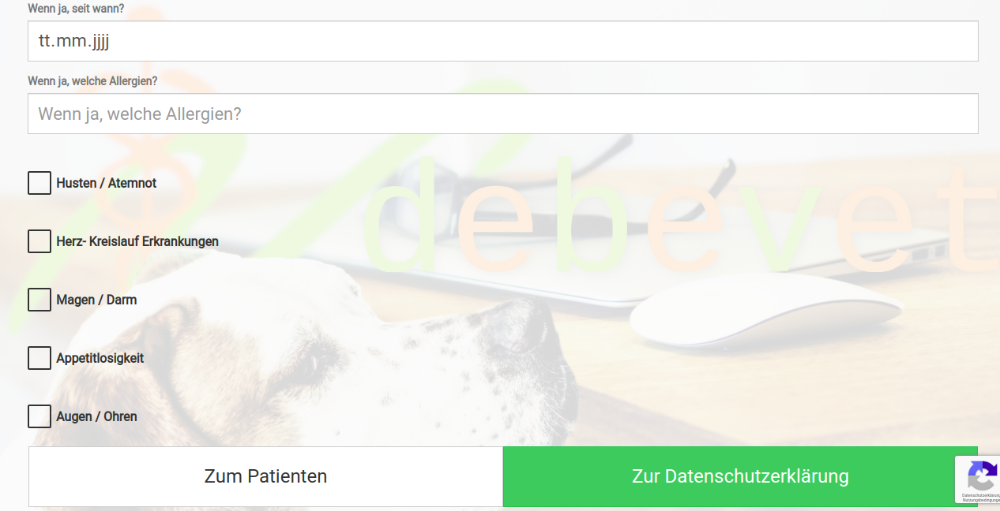
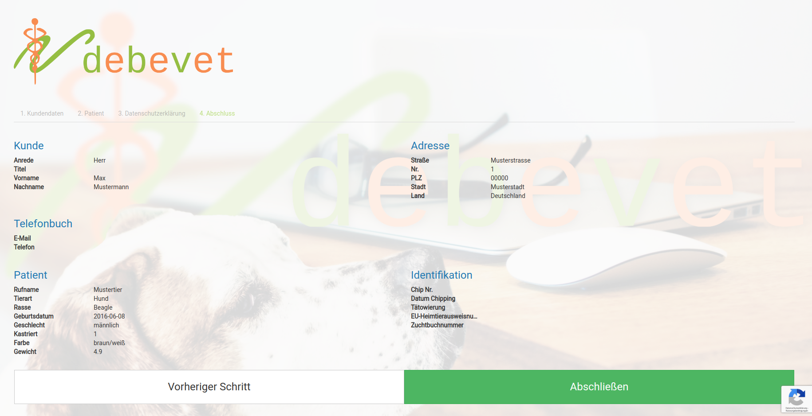
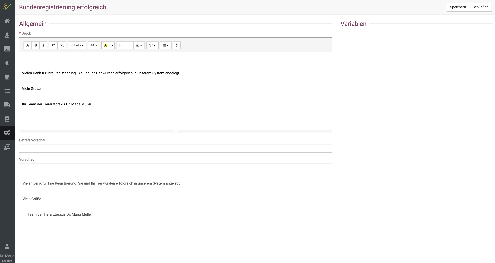

# Kundenregistrierung

Kunden können sich in der debevet Software selbst registrieren. Das bedeutet für Sie eine deutliche Erleichterung in der Anmeldung,
da Sie die Daten zum Tier und Halter nicht selbst eingeben müssen. Sie haben im debevet dafür 2 Möglichkeiten:

* Vorab oder in der Praxis über einen Link im Netz via Browser den Kunden die Daten eingeben lassen
* In Ihrer Praxis z.B. Tablets ausgeben, an denen der Kunde direkt die Daten eingeben und unterschreiben kann (Datenschutz)

Wenn Sie den ersten Weg wählen, empfiehlt es sich, die Einstellungen in der Kundenregistrierung so zu setzen, dass diese Registrierungen
als "Anfragen" angelegt werden, und nicht direkt als Kunde.

Bei der Variante "vor Ort am Tablet" ist es nützlich, dass der Kunde direkt als Kunde angelegt wird und dann direkt ins digitale Wartezimmer
gesetzt wird.

Doch zuerst müssen Sie die Kundenregistrierung anlegen, dabei können Sie einen individuellen Fragebogen und Datenschutzvereinbarungen oder
sonstige Vereinbarungen hinterlegen, die der Kunde akzeptieren muss.

Klicken Sie **Administration** und dann **Kundenregistrierung**.

  

## Einstellungen 

Unter Einstellungen können Sie verschiedene Optionen auswählen.

**Aktiv:**
Ist "Aktiv" ausgewählt, können sich Ihre Kunden über den Registrierungs-Link registrieren.

**Kunden anlegen:**
Ist das Häkchen unter "Kunden anlegen" aktiv, so werden Ihre Kunden direkt ins Wartezimmer übertragen. Falls nicht, erscheinen diese Kunden unter "Kundenregistrierungsanfragen" im Dashboard.

**Datenschutzerklärung anwenden:**
Wählen Sie diesen Punkt aus, wenn die Datenschutzerklärung eingeblendet werden soll. Den Text zur Datenschutzerklärung können Sie unter **Administration**
und dort unter **Textbausteine** hinterlegen.

:::tip Tipp: 

Besonders praktisch falls Sie ein Tablet rausgeben an die Patienten vor Ort: Sie können die Datenschutzvereinbarung dann direkt im debevet
digital unterschreiben lassen!  

:::  

**Fragebogen anwenden:**
Wählen Sie diesen Punkt aus, wenn der Fragebogen in der Kundenregistrierung angezeigt werden soll.

**Hintergrund:**
Wird als Hintergrund für die Kundenregistrierung und das digitale Unterschreiben verwendet. Der Hintergrund wird mit 15% Deckkraft dargestellt.

**Logo:**
Wird als Logo für die Kundenregistrierung und das digitale Unterschreiben verwendet.

## Geräte einrichten 

Wenn Sie vor Ort den Kunden digital unterschreiben und/oder ausfüllen lassen wollen, müssen Sie das Gerät einmal generell einrichten.  
Klicken Sie **Administration** und dann **Kundenregistrierung**. Wählen Sie dort nun den Reiter **Geräte**.   

Geben Sie dem Tablet einen sinnvollen Namen, vor allem, falls Sie mehrere Geräte nutzen möchten. Vergeben Sie außerdem ein sicheres Passwort und merken/speichern 
sich dieses!

## Fragebogen einrichten  

Den Fragebogen für Ihre Kunden können Sie mit debevet sehr individuell gestalten. 

Klicken Sie **Administration** und dann **Kundenregistrierung**. Dort wählen Sie den Reiter **Fragebogen**. 

Nun haben Sie die Möglichkeit, neue Fragen anzulegen und deren Reihenfolge beliebig jederzeit zu ändern.  

  

Wenn Sie eine neue Frage hinzufügen möchten, klicken Sie oben rechts das grüne **Plus-Symbol**. Es öffnet sich eine neue Seite, in der
die Frage genauer beschrieben werden kann.  

Im Feld **Bezeichnung** tragen Sie die Frage ein.  

Wenn Sie auf den **Dropdown-Pfeil** am Feld **Datentyp** klicken, bekommen Sie mehrere Möglichkeiten angezeigt.  

* Auswahl (mehere Auwahlmöglichkeiten, diese bitte in das Feld **Zusatz** untereinander schreiben)
* Checkbox 
* Datum  
* Kurztext  
* Langtext  
* Zahl   

Hier ein (nicht ganz ernst gemeintes ;) ) Beispiel für eine Auswahl:  

  

So können Sie alle Daten abfragen, die Sie gern vorab haben möchten.  

## Kunden- und Patientendaten eingeben lassen  

Egal, ob Sie es vor Ort am Tablet oder über einen Weblink (evtl. auf Ihrer Webseite) nutzen, Ihre Kunden werden Schritt für Schritt
durch die Eingabemasken geleitet. 
Dabei geben Sie im ersten Schritt die Kundendaten ein:  

  

In der nächsten Maske folgen dann alle wichtigen Daten zum Tier:  

  

Anschließend werden, wenn Sie dies gesetzt haben, der Fragebogen und Datenschutzerklärung nacheinander angezeigt und ausgefüllt/akzeptiert.  

  

  

Am Tablet (oder auch am PC mit der Maus) können die Kunden dann die Datenschutzerklärung direkt unterschreiben.  

Anschließend werden dem Kunden noch einmal alle Daten zur Kontrolle angezeigt und die Registrierung kann abgeschlossen werden.  

  

## Bestätigung der Registrierung 

Sie können in debevet einen eigenen Text hinterlegen, den Sie den Kunden nach Abschluss der Registrierung anzeigen lassen wollen.  
Hinterlegen Sie diesen unter **Administration** und **Textbausteine** und dort den Textbaustein **Kundenregistrierung erfolgreich**.  

  

