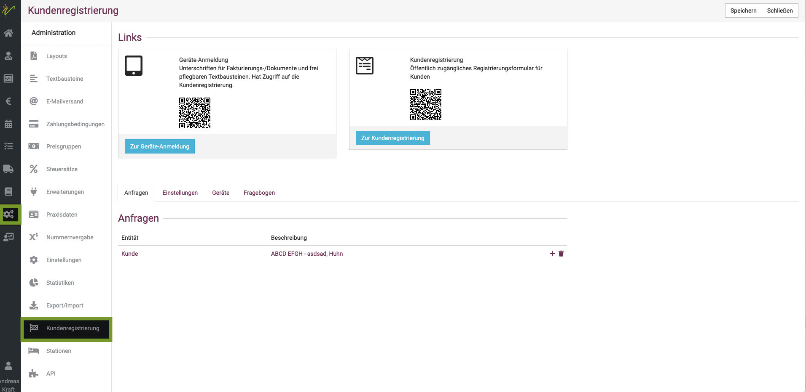
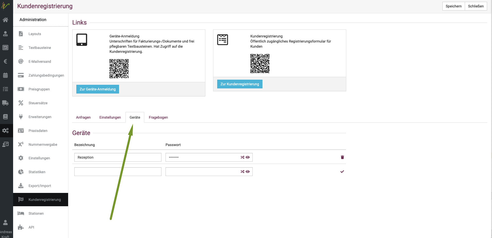
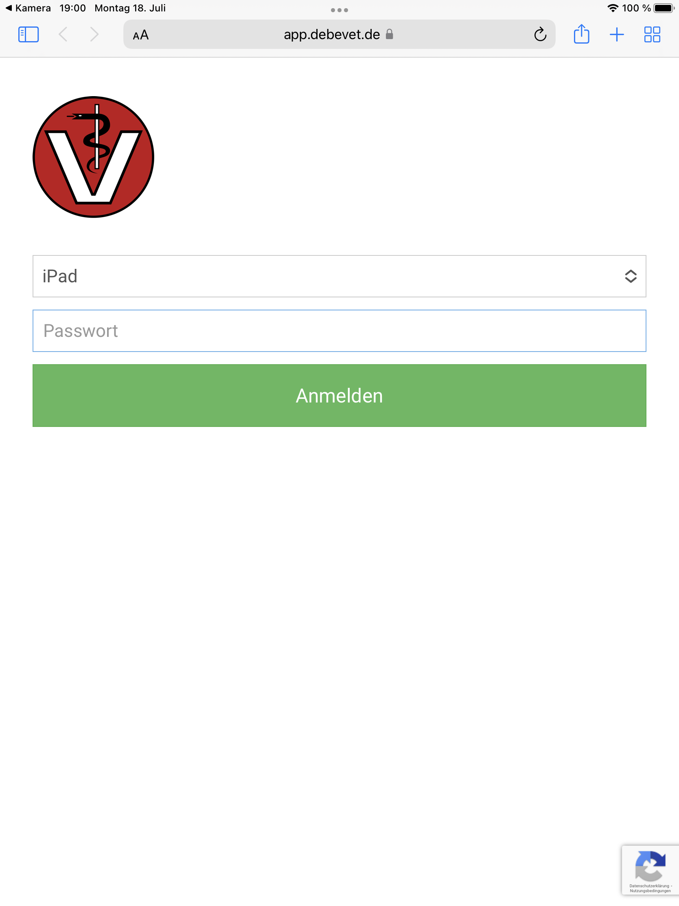
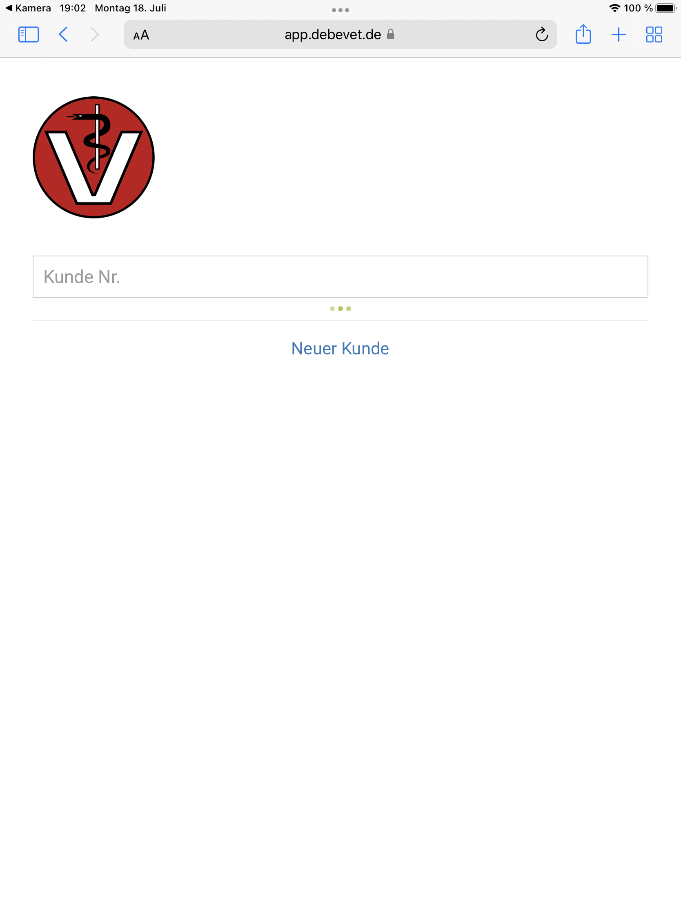
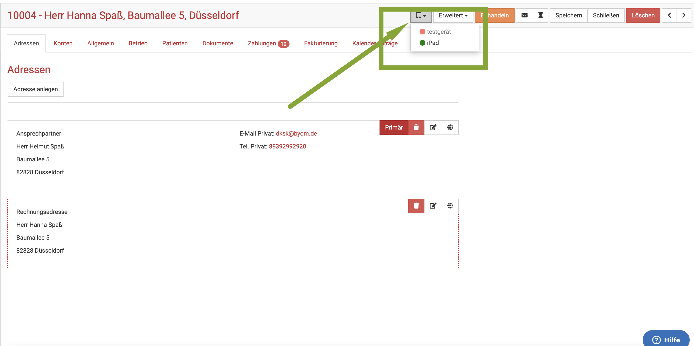
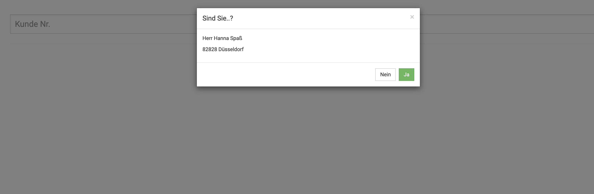
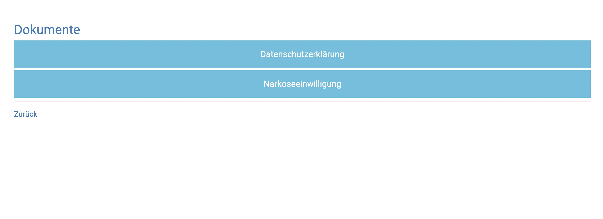
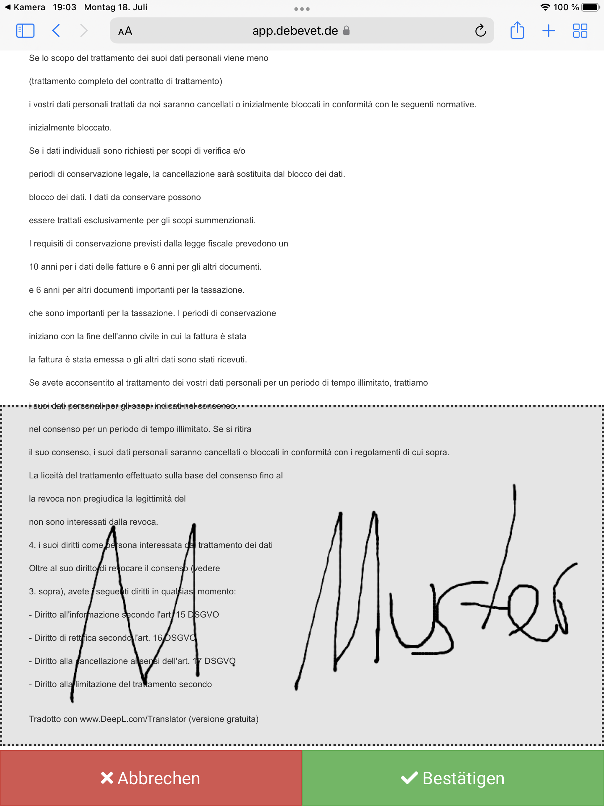
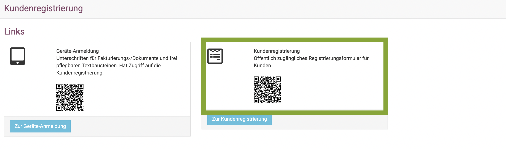

# Tablet / Handy nutzen

Wenn Sie ein Tablet für Ihre Praxis nutzen möchten, beispielsweise zum digitalen unterschreiben oder ausfüllen der Kundenregistrierung,
müssen Sie dieses (oder mehrere) vorab im debevet anmelden.  

## Gerät (Tablet) im debevet aktivieren

Klicken Sie hierzu auf
**Administration** (Zahnradsymbol) und dann **Kundenregistrierung**.

Klicken Sie dann auf den Reiter **Geräte**   
Geben Sie einen Namen für das Gerät ein und setzen ein Passwort. Bitte klicken Sie danach unbedingt den Haken an, um beides zu aktivieren.

:::tip   Tipp

Wenn Sie mehrere Geräte angemeldet haben, z.B. noch ein Tablet zum Unterschreiben, eines zur Zahlung via Sumup, geben Sie den Geräten eindeutige Namen.

:::

## Gerät (Tablet) anmelden 

Wenn sie nun mit dem Tablet mit einem QR Codescanner (zumeist vorinstalliert, sonst im Appstore/Google Play herunterladen) den linken 
Code in der Kachel  **Geräteanmeldung** scannen, müssen Sie das Passwort für das wie oben beschrieben eingerichtete Gerät eingeben.  

Nun ist das Gerät aktiv und kann genutzt werden. 

## Den Kunden digital unterschreiben lassen  

Sie können nun alle Dokumente, die Sie im Sektor **Vorlagen** als **Unterschrift Dokument** hinterlegt haben, am Kunden aufrufen. 
Diese Dokumente kann der Kunde dann unterschreiben.  

Es gibt zwei Möglichkeiten, wie Sie diese dem Kunden zur Verfügung stellen an Ihrem Tablet:

### 1. Eingabe der Kundennummer  

Wenn Sie den QR Code gescannt haben und das Passwort eingegeben haben, geben Sie die Kundennummer in das Suchenfeld ein und drücken Sie die **Entertaste**.  

### 2. Aus dem Kunden direkt  

Sie können auch den Kunden im debevet (also Ihrer normalen Nutzung am PC/Laptop etc.) öffnen und dann oben auf das Tablet-Symbol klicken.
Dort öffnet sich dann eine kleine Liste mit allen angelegten Geräten. Diese sind mit rot, gelb oder grün gekennzeichnet, so dass Sie direkt sehen,
ob das Tablet aktiv und angemeldet ist (grün). Klicken Sie dann auf den Namen des Tablets.  

  

Nun können Sie das Tablet (oder Smartphone falls Sie dieses aktiv nutzen und angemeldet haben) dem Kunden geben. Dieser wird nun gefragt, ob er
Herr/Frau xxx ist. Nach Bestätigung werden die Dokumente aufgelistet, die Sie unter **Vorlagen** und **Unterschrift** bei **Textbausteine** angelegt haben.

Nach Auswahl des gewünschen Dokumentes kann der Kunde unterschreiben.

  

  

## Kundenregistrierung vor Ort am Tablet  

Wenn Sie den Kunden in Ihrer Praxis vor Ort das Tablet mit ins Wartezimmer geben möchten, damit diese daran Ihre Daten als Neukunden
eingeben können, haben Sie 2 Möglichkeiten, diese Funktion zu starten.

Stellen Sie zunächst sicher, dass das Tablet aktiviert und angemeldet ist. 

### 1. Barcode scannen  

Öffnen Sie die Seite **Administration** und dann **Kundenregistrierung**. Scannen Sie dann mit dem QR Code Reader des Tablets den rechten
Barcode (zur Kundenregistrierung) und geben Sie dem Kunden dann das Tablet.

### 2. Nach der Anmeldung des Tablets

Wenn Sie das Tablet angemeldet haben (gescannter linker Code) und es so aktiviert mit der geöffneten Browser Seite bei Ihnen an der
Anmeldung liegt, können sie auch einfach auf "Neuer Kunde" am Tablet tippen und es dann dem Kunden in die Hand geben zum Ausfüllen seiner Daten.  

  

:::tip Tipp:

Speichern Sie sich doch als Startseite auf Ihrem Tablet im Browser direkt den Anmeldelink aus dem debevet, damit Sie dieses schneller
anmelden können!  

:::   

