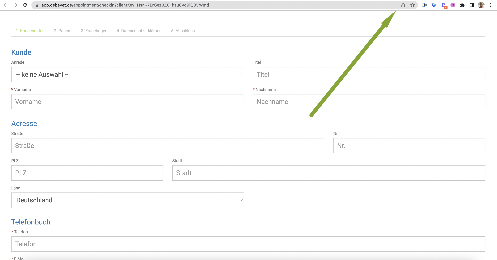
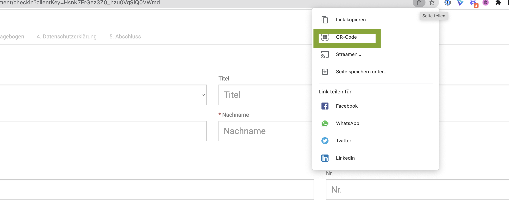
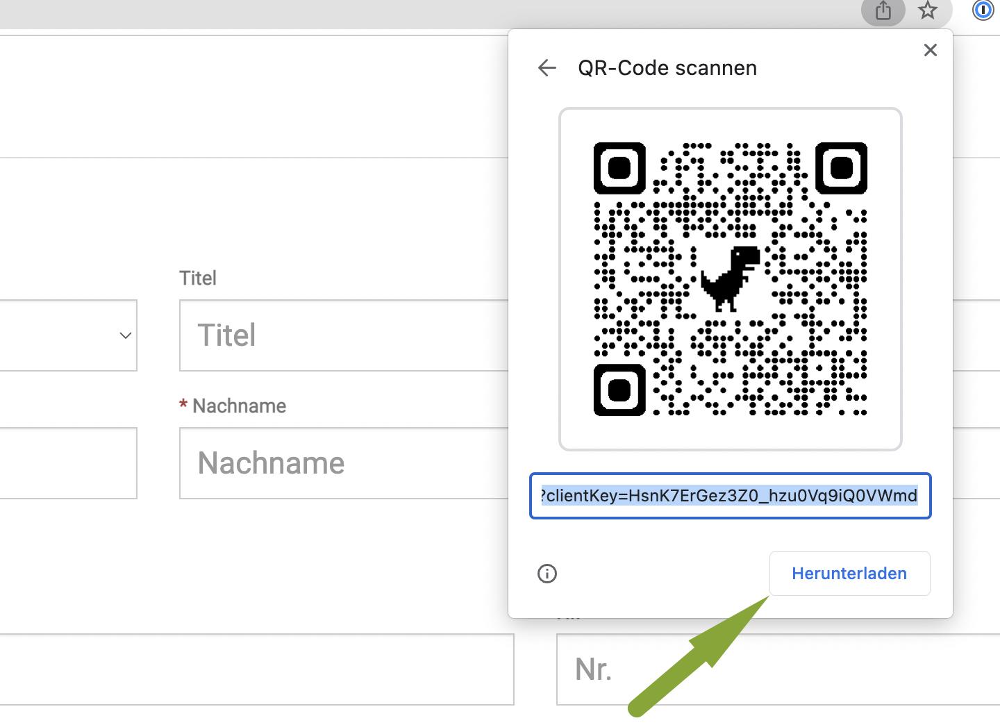

# Tablet / Handy nutzen

Wenn Sie ein Tablet für Ihre Praxis nutzen möchten, beispielsweise zum digitalen unterschreiben oder ausfüllen der Kundenregistrierung,
müssen Sie dieses (oder mehrere) vorab im debevet anmelden.  

## Gerät (Tablet) im debevet aktivieren

Klicken Sie hierzu auf
**Administration** (Zahnradsymbol) und dann **Kundenregistrierung**.

Klicken Sie dann auf den Reiter **Geräte**   
Geben Sie einen Namen für das Gerät ein und setzen ein Passwort. Bitte klicken Sie danach unbedingt den Haken an, um beides zu aktivieren.
KLicken sie anschließend oben rechts auf **Speichern**

:::tip   Tipp

Wenn Sie mehrere Geräte angemeldet haben, z.B. noch ein Tablet zum Unterschreiben, eines zur Zahlung via Sumup, geben Sie den Geräten eindeutige Namen.

:::

## Gerät (Tablet) anmelden 

Wenn sie nun mit dem Tablet mit einem QR Codescanner (zumeist vorinstalliert, sonst im Appstore/Google Play herunterladen) den linken 
Code in der Kachel  **Geräteanmeldung** scannen, müssen Sie das Passwort für das wie oben beschrieben eingerichtete Gerät eingeben.  

Anschließend klicken Sie auf **Anmelden** auf dem Tablet.

Nun ist das Gerät aktiv und kann genutzt werden.  

## Den Kunden digital unterschreiben lassen  

Sie können nun alle Dokumente, die Sie im Sektor **Vorlagen** als **Unterschrift Dokument** hinterlegt haben, am Kunden aufrufen. 
Diese Dokumente kann der Kunde dann unterschreiben.  

Hier finden Sie die Anleitung zum Erstellen der zu unterschreibenden Dokumente: 

https://handbuch.debevet.de/docs/Administration/Textbausteine

Um das erstellte Dokument dann unterschreiben zu lassen, gehen Sie wie folgt vor:

Öffnen Sie die Kartei des Kunden aus der Kundenliste. 

Klicken Sie dann oben auf das Tablet-Symbol. 

Dort öffnet sich dann eine kleine Liste mit allen angelegten Geräten. Diese sind mit rot, gelb oder grün gekennzeichnet, so dass Sie direkt sehen,
ob das Tablet aktiv und angemeldet ist (grün). Klicken Sie dann auf den Namen des Tablets.  

  

Nun können Sie das Tablet (oder Smartphone falls Sie dieses aktiv nutzen und angemeldet haben) dem Kunden geben. Dieser wird nun gefragt, ob er
Herr/Frau xxx ist. Nach Bestätigung werden die Dokumente aufgelistet, die Sie unter **Vorlagen** und **Unterschrift** bei **Textbausteine** angelegt haben.

Nach Auswahl des gewünschten Dokumentes kann der Kunde unterschreiben.

  

  

:::tip Tipp: 

Die unterschriebenen Dokumente sind dann automatisch in der Kundendatei in den Dokumenten hinterlegt!

:::  

## Kundenregistrierung vor Ort am Tablet  

Wenn Sie den Kunden in Ihrer Praxis vor Ort das Tablet mit ins Wartezimmer geben möchten, damit diese daran Ihre Daten als Neukunden
eingeben können, haben Sie 2 Möglichkeiten, diese Funktion zu starten.

Stellen Sie zunächst sicher, dass das Tablet aktiviert und angemeldet ist. 

### 1. QR Code scannen  

Öffnen Sie die Seite **Administration** und dann **Kundenregistrierung**. Scannen Sie dann mit dem QR Code Reader des Tablets den rechten
Barcode (zur Kundenregistrierung) und geben Sie dem Kunden dann das Tablet.

### 2. Nach der Anmeldung des Tablets

Wenn Sie das Tablet angemeldet haben (gescannter linker Code) und es so aktiviert mit der geöffneten Browser Seite bei Ihnen an der
Anmeldung liegt, können sie auch einfach auf "Neuer Kunde" am Tablet tippen und es dann dem Kunden in die Hand geben zum Ausfüllen seiner Daten.  

  

:::tip Tipp:

Speichern Sie sich doch als Startseite auf Ihrem Tablet im Browser direkt den Anmeldelink aus dem debevet, damit Sie dieses schneller
anmelden können!  

:::   

## Den Kunden das eigene Smartphone nutzen lassen 

Eine tolle Variante ist es, den Link zur Kundenregistrierung in einen QR-Code umzuwandeln und diesen im Wartezimmer aufzuhängen!

Auf diese Art kann jeder neue Kunde diesen Code mit seinem Smartphone/ Handy scannen und dann alle Daten selbst eingeben.

Um den Link zu Ihrer Kundenregistrierung umzuwandeln, öffnen Sie die debevet Anwendung (dies reicht auch einmalig!) im Chrome Browser. 

Klicken Sie **Administration** und dann **Kundenregistrierung**.   

Nun klicken Sie auf den blauen Button **zur Kundenregistrierung**. 

Nun öffnet sich Ihre Kundenregistrierung im Browser- Klicken Sie nun oben rechts auf das **Teilen** Symbol.  

  

Dann wählen Sie **QR-Code**.   

  

Den nun erzeugten Code können Sie herunterladen und dann drucken.  

