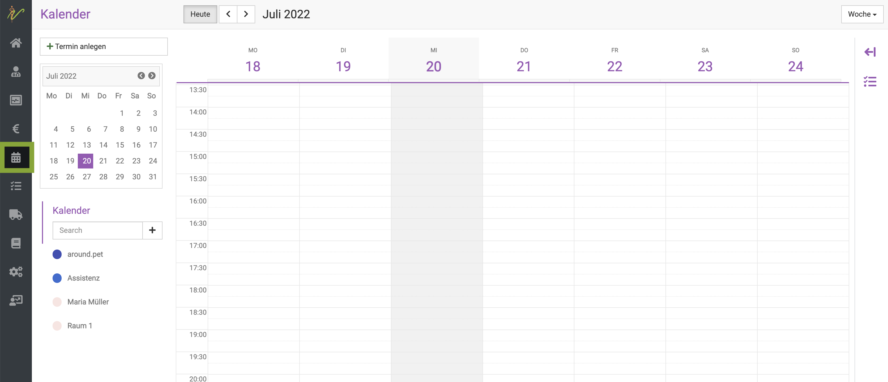
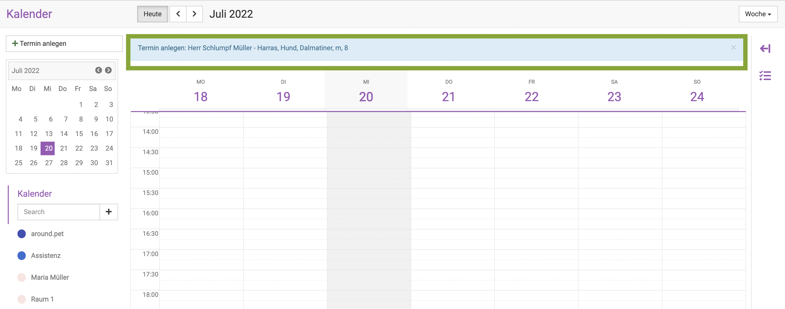
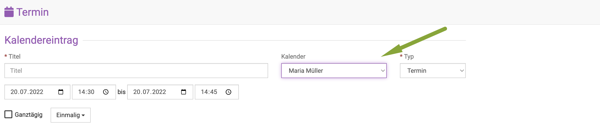

# Kalender nutzen

Der debevet Kalender bietet Ihnen die Möglichkeit, Termine zu hinterlegen, dabei können für mehrere Kollegen je eigene Kalender 
genutzt werden.

Termine können entweder direkt im Kalender eingetragen werden, oder vom Patienten aus. 

Variante 1:  

Klicken Sie **Kalender**, dann öffnet sich der Kalender.  

   

Um einen neuen Termin zu erstellen, klicken Sie entweder oben links auf **Termin anlegen** oder klicken Sie auf eine Kachel an der gewünschten Uhrzeit 
im Kalender. 

  

Nun öffnet sich die Maske für die Terminerstellung.  

Nun müssen Sie eine Beschreibung eingeben, den Kunden wählen, den Patienten wählen und den Typ des Termins wählen ( Standard ist erst einmal 
Termin gesetzt, dies kann aber auf **Anruf** geändert werden).  

  

Variante 2: (die schnellere Variante)

Um direkt aus der Behandulung am Patienten einen Termin zu erstellen, klicken Sie in der Behandlung auf das kleine **Kalender-Symbol** 

  

Nun öffnet sich die Startseite des Kalenders, allerdings können Sie oben in blau sehen, dass bereits ein Kunde vorausgewählt wurde. Wenn Sie nun eine Uhrzeit 
anklicken oder **Termin anlegen**, sind die Daten des Kunden bereits eingetragen und müssen nicht mehr gewählt werden.   

   

:::caution Achtung:  

Achten Sie darauf, dass die Termine im korrekten Kalender, also Benutzer hinterlegt werden, falls mehrere vorhanden sind.  

:::
  
## Kalender synchronisieren 

Wenn Sie Ihren persönlichen Kalender mit dem debenvet Kalender synchronisieren möchte, können Sie dieses selbst einrichten.  

### Kalender mit dem iPhone oder iPad synchronisiseren  

Debevet bietet Ihnen die Möglichkeit, sowohl ausgewählte debevet-Kalender als auch Ihre Kundendaten mit Ihrem
iPhone oder iPad zu synchronisieren. Termine können ebenfalls mit dem Smartphone erstellt werden und werden nach 
debevet geschrieben. Kundendaten werden lediglich zum Lesen synchronisiert.   

Öffnen Sie an Ihrem Mobilgerät die **Einstellungen** und wählen den Einstellungspunkt **Kalender**. 
Wählen Sie **Accounts** und dann **Account hinzufügen**.  

 

Nun wählen Sie ganz unten **Andere**.  
Dann wählen Sie **CalDAV Account hinzufügen**.  

  

Füllen Sie die Felder aus. Als Server geben Sie **sync.debevet.de** ein.

Der Benutzername setzt sich aus Ihrer Praxisnummer und dem jeweiligen Benutzernamen zusammen:
Wenn ihre Praxisnummer 012345 und Ihr Benutzername mustm wäre, müssten Sie in das Eingabefeld 012345_mustm eingeben.

Das Passwort ist das Passwort des jeweiligen Benutzers. Die Beschreibung können Sie für sich frei wählen. Drücken Sie nun oben rechts auf **Weiter**.  

   

Sollten sie eine Meldung wie die folgende sehen, klicken Sie auf **Fortfahren**.  

  

### Kalender mit Android synchronisieren  

