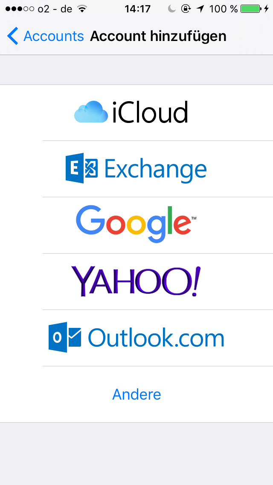

# Kalender synchronisieren  

Wenn Sie Ihren persönlichen Kalender mit dem debenvet Kalender synchronisieren möchte, können Sie dieses selbst einrichten.  

## Kalender mit dem iPhone oder iPad synchronisiseren  

Debevet bietet Ihnen die Möglichkeit, sowohl ausgewählte debevet-Kalender als auch Ihre Kundendaten mit Ihrem
iPhone oder iPad zu synchronisieren. Termine können ebenfalls mit dem Smartphone erstellt werden und werden nach 
debevet geschrieben. Kundendaten werden lediglich zum Lesen synchronisiert.   

Öffnen Sie an Ihrem Mobilgerät die **Einstellungen** und wählen den Einstellungspunkt **Kalender**. 
Wählen Sie **Accounts** und dann **Account hinzufügen**.  

 

Nun wählen Sie ganz unten **Andere**.  
Dann wählen Sie **CalDAV Account hinzufügen**.  

  

Füllen Sie die Felder aus. Als Server geben Sie **sync.debevet.de** ein.

Der Benutzername setzt sich aus Ihrer Praxisnummer und dem jeweiligen Benutzernamen zusammen:
Wenn ihre Praxisnummer 012345 und Ihr Benutzername mustm wäre, müssten Sie in das Eingabefeld 012345_mustm eingeben.

Das Passwort ist das Passwort des jeweiligen Benutzers. Die Beschreibung können Sie für sich frei wählen. Drücken Sie nun oben rechts auf **Weiter**.  

   

Sollten sie eine Meldung wie die folgende sehen, klicken Sie auf **Fortfahren**.  

  

