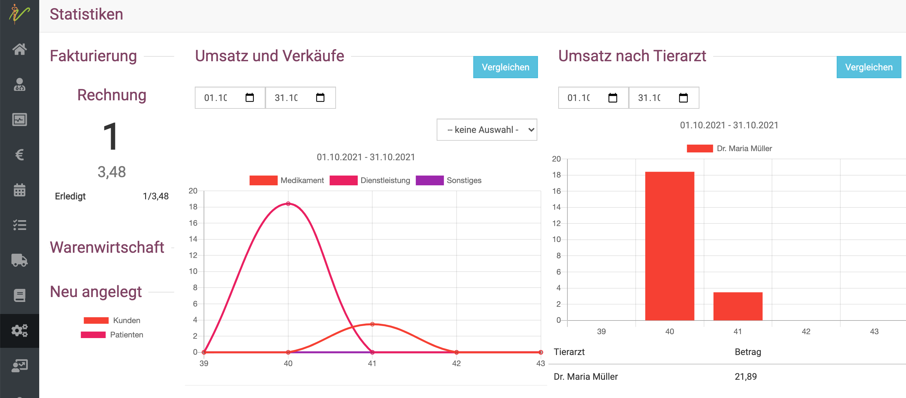
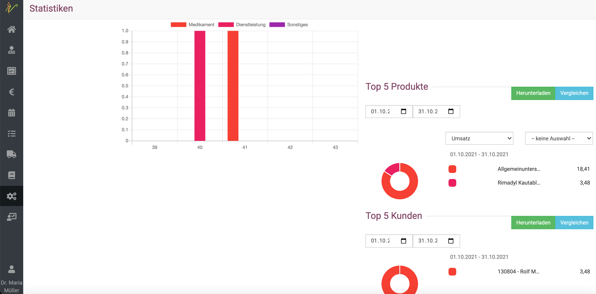
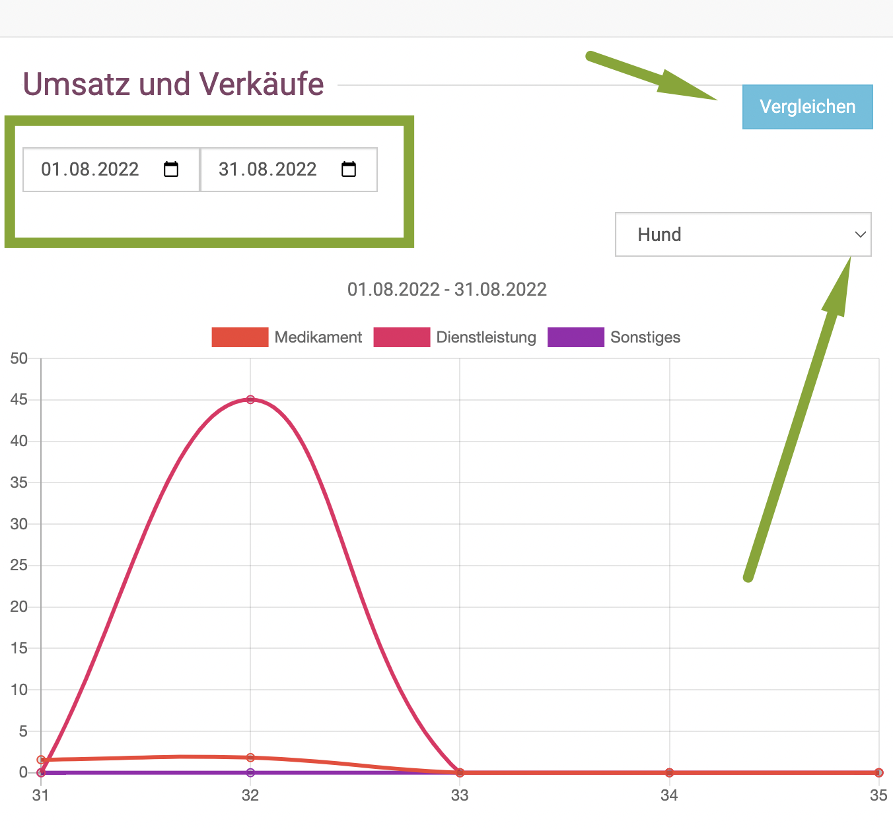
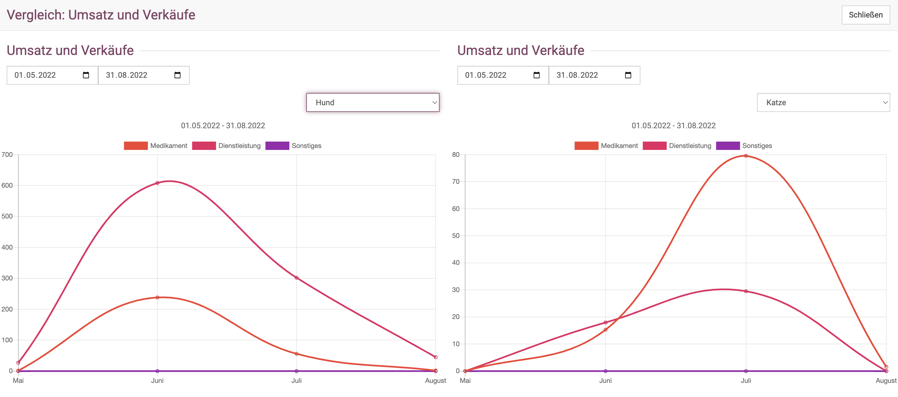
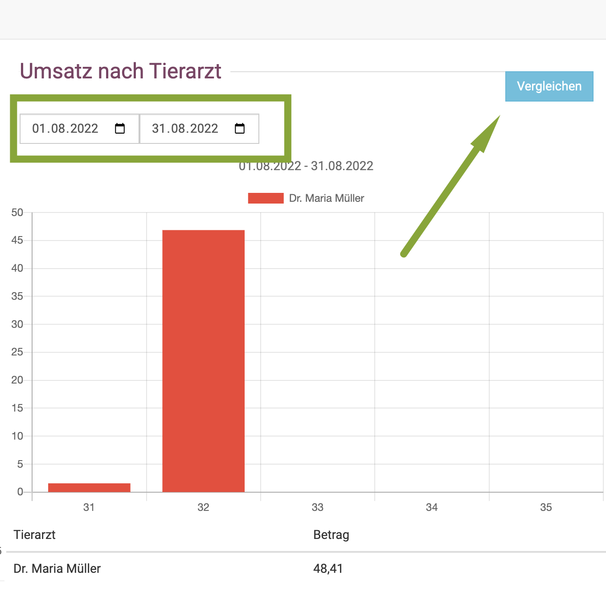

# Statistiken

Unter **Administration** und dann **Statistiken** können Sie Ihre Umsätze und Verkäufe gefiltert nach Medikamenten, Dienstleistung, Tierart und
Sonstige darstellen.

Darüber hinaus können Sie die Umsätze nach Tierarzt einsehen.

Auch die Top 5 Produkte und Top 5 Kunden können angezeigt werden.

  

## Umsätze und Verkäufe nach Tierart 

In der Übersichtsansicht der Statistiken sehen Sie direkt die Umsätze und Verkäufe, zunächst gesamt. Diese können dann mit Klick auf den 
**Dropdown-Pfeil** je nach Tierart anzeigen lassen.

Sie können sich den gewünschten **Datumsbereich** anzeigen lassen. 

Wenn Sie auf den **Blauen Button "Vergleichen"** klicken, können Sie in einer neuen Ansicht zwei Tierarten im selben Zeitraum vergleichen,
oder beispielsweise die selbe Tierart in zwei Datumsbereichen /Monaten vergleichen.

## Umsätze der Tierärzte  

Die Übersicht bei den Statistiken zeigt direkt die Umsätze im gewünschten **Datumsbereich** an, auch hier können Sie auf "Vergleichen" klicken,
um zwei Ansichten direkt nebeneinander vergleichen zu lassen. 

  

## Umsätze nach Dienstleistung/Medikamenten/Sonstige
