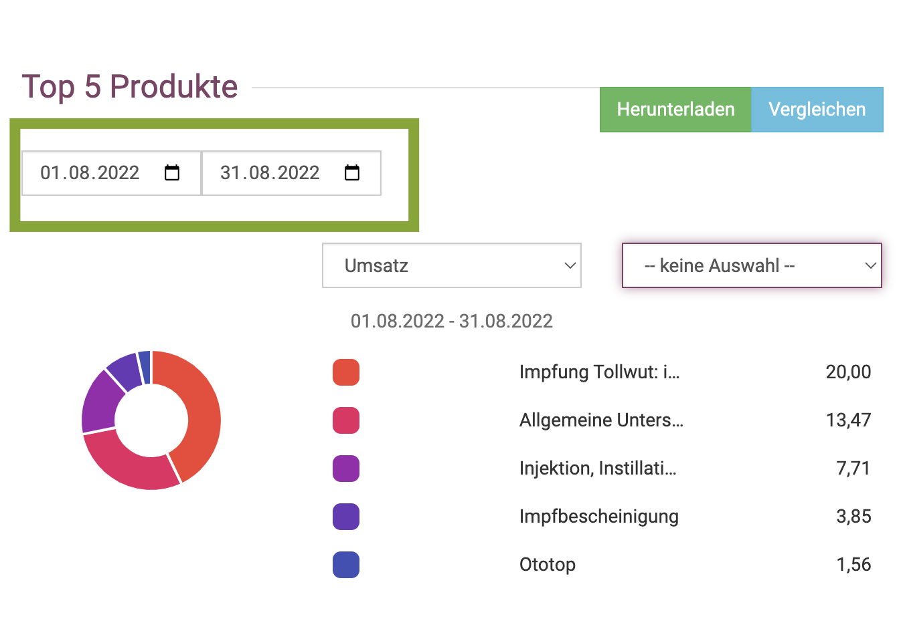
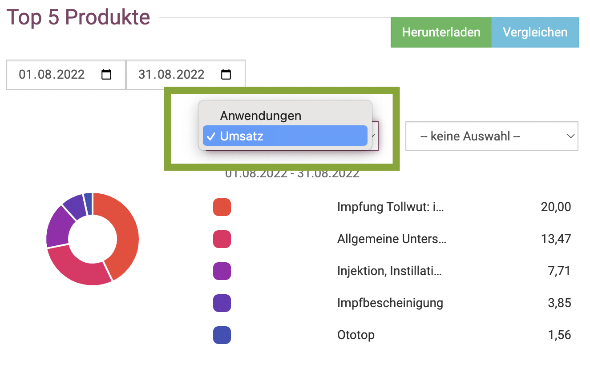
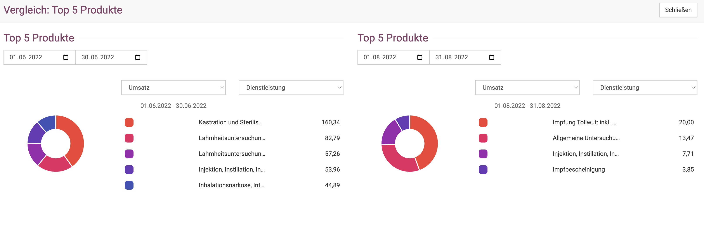

(# Statistiken

Unter **Administration** und dann **Statistiken** können Sie Ihre Umsätze und Verkäufe gefiltert nach Medikamenten, Dienstleistung, Tierart und
Sonstige darstellen.

Darüber hinaus können Sie die Umsätze nach Tierarzt einsehen.

Auch die Top 5 Produkte und Top 5 Kunden können angezeigt werden.

  

## Umsätze und Verkäufe nach Tierart 

In der Übersichtsansicht der Statistiken sehen Sie direkt die Umsätze und Verkäufe, zunächst gesamt. Diese können dann mit Klick auf den 
**Dropdown-Pfeil** je nach Tierart anzeigen lassen.

Sie können sich den gewünschten **Datumsbereich** anzeigen lassen. 

Wenn Sie auf den **Blauen Button "Vergleichen"** klicken, können Sie in einer neuen Ansicht zwei Tierarten im selben Zeitraum vergleichen,
oder beispielsweise die selbe Tierart in zwei Datumsbereichen /Monaten vergleichen.

## Umsätze der Tierärzte  

Die Übersicht bei den Statistiken zeigt direkt die Umsätze im gewünschten **Datumsbereich** an, auch hier können Sie auf "Vergleichen" klicken,
um zwei Ansichten direkt nebeneinander vergleichen zu lassen. (Beispielbild aus unserem Testaccount mit nur einem Tierarzt)

  

## Umsätze nach Dienstleistung/Medikamenten/Sonstige

Wenn Sie auf der Statistik Seite ein wenig nach unten scrollen, sehen Sie die "Top 5 Produkte". Darunter fallen Dienstleistungen,
Medikamente und Sonstiges. Die Standardansicht im Überblick zeigt zunähst die Top5 aus allen drei Kategorien.
Mit Klick auf den *Dropdown-Pfeil** können Sie diese Darstellung jedoch auch filtern nach den Kategorien.   

Setzen Sie den gewünschten *+Datumsbereich**, für den Sie die Top 5 Produkte sehen wollen.  

   

Dabei können Sie entweder den Umsatz der jeweiligen Kategorie oder aber die Anwendungshäufigkeit darstellen lassen, indem Sie auf den **Dropdownpfeil* am 
Feld **Umsatz** klicken.   

Sie möchten mehr als nur die ersten 5 Dienstleistungen oder Medikamente in der Statistik sehen, statistisch auswerten?  

In diesem Fall wählen Sie den gewünschten **Datumsbereich**, wählen die Kategorie (z.B. Dienstleistungen) und klicken dann auf **Herunterladen**.  

In der nun erstelen CSV Datei, die Sie mit Excel oder Numbers öffnen können, haben Sie die Auflistung aller Dienstleistungen für den gewählten 
Zeitraum.  

Auch hier können Sie mit klick auf **Vergleichen* verschiedene Kategorien im selben Zeitraum oder aber dieselbe Kategorie im Vergleich zwischen 
beispielsweise zwei Monaten darstellen lassen.  

 
