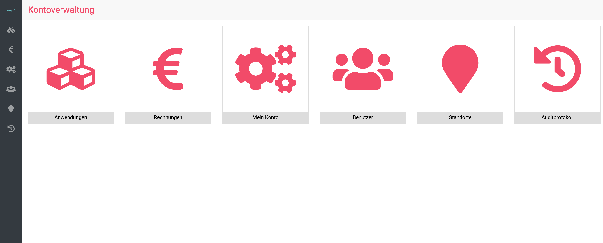

# Ende der Testphase

Immer wieder schreiben uns Kunden an, dass Sie am Ende der Testphase "nicht mehr ins debevet kommen".  

Eigentlich erreicht Sie vor Ablauf der Testphase bereits eine Anleitung, wie Sie bei Weiternutzung Ihr gewünschtes Paket 
buchen können/müssen. Da wir niemanden proaktiv zu einer Nutzung "zwingen", müssen Sie dies selbst erledigen.  

Wenn Sie sich wie gewohnt einloggen, gelangen Sie nach Ablauf der Testphase nicht mehr in das Dashboard, sondern sehen nur 
den Bereich des Kundenkontos, der so aussieht:

  

Gehen Sie bitte nun wie folgt vor:  

1. Klicken Sie auf **Anwendungen**
2. Klicken Sie bei Ihrer gewünschten Paketversion auf **Buchen**

Geben Sie Ihre Kontodaten ein, wenn noch nicht erfolgt, denn eine Zahlung ist bei uns nur via SEPA Lastschrift möglich.

