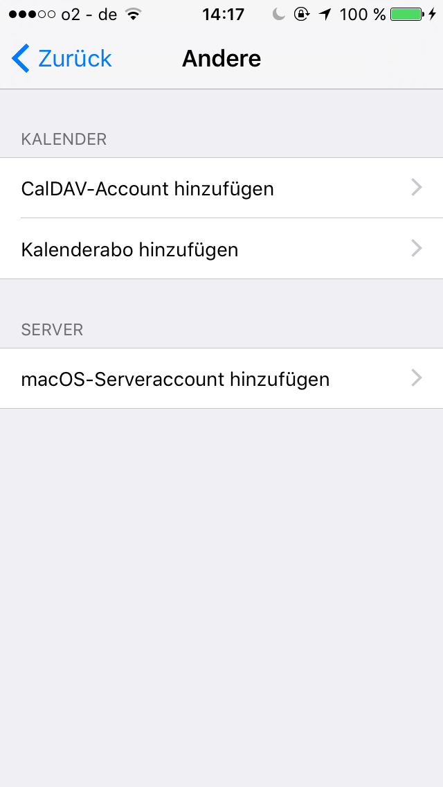
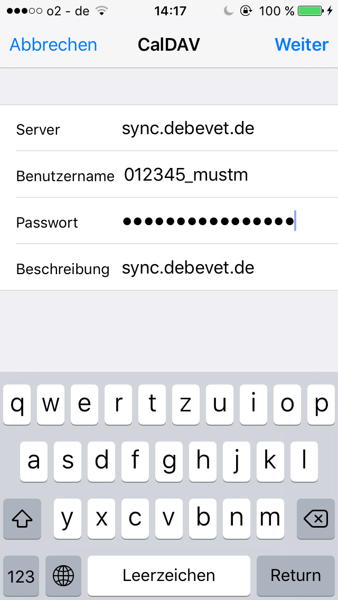
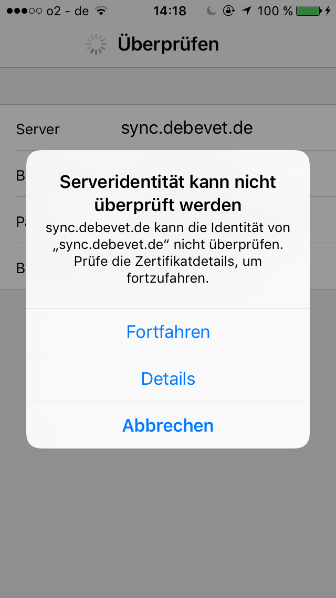

# Kalender nutzen

Der debevet Kalender bietet Ihnen die Möglichkeit, Termine zu hinterlegen, dabei können für mehrere Kollegen je eigene Kalender 
genutzt werden. 

## Kalender erstellen

Um einem Benutzer einen Kalender zu erstellen, klicken Sie auf das **Kalender-Symbol** links in der Leiste. Klicken Sie nun auf das **Plus-Symbol**. 

  

Nun öffnet sich die Detailansicht und Sie können alle Attribute für den Kalender wählen: 

* Titel des Kalenders (evtl. sinnvoll, den Namen des Nutzers zu nehmen)
* Benutzer (also den Mitarbeiter)
* Farbe des Kalenders
* Style (ob die Farbe als Rahmen oder Hintergrund genutzt werden soll)
* Schriftfarbe (schwarz, weiß oder hoher Kontrast)

Klicken Sie anschließend oben rechts auf **Speichern**. 
Der Kalender steht nun zur Verfügung.

## Termin erstellen 

Termine können entweder direkt im Kalender eingetragen werden, oder vom Patienten aus. 

Variante 1:  

Klicken Sie **Kalender**, dann öffnet sich der Kalender.  

   

Um einen neuen Termin zu erstellen, klicken Sie entweder oben links auf **Termin anlegen** oder klicken Sie auf eine Kachel an der gewünschten Uhrzeit 
im Kalender. 

  

Nun öffnet sich die Maske für die Terminerstellung.  

Nun müssen Sie eine Beschreibung eingeben, den Kunden wählen, den Patienten wählen und den Typ des Termins wählen ( Standard ist erst einmal 
Termin gesetzt, dies kann aber auf **Anruf** geändert werden).  

  

Variante 2: (die schnellere Variante)

Um direkt aus der Behandlung am Patienten einen Termin zu erstellen, klicken Sie in der Behandlung auf das kleine **Kalender-Symbol** 

  

Nun öffnet sich die Startseite des Kalenders, allerdings können Sie oben in blau sehen, dass bereits ein Kunde vorausgewählt wurde. Wenn Sie nun eine Uhrzeit 
anklicken oder **Termin anlegen**, sind die Daten des Kunden bereits eingetragen und müssen nicht mehr gewählt werden.   

   

:::caution Achtung:  

Achten Sie darauf, dass die Termine im korrekten Kalender, also Benutzer hinterlegt werden, falls mehrere vorhanden sind.  

:::
  
## Kalender synchronisieren 

Wenn Sie Ihren persönlichen Kalender mit dem debenvet Kalender synchronisieren möchte, können Sie dieses selbst einrichten.  

### Kalender mit dem iPhone oder iPad synchronisiseren  

Debevet bietet Ihnen die Möglichkeit, sowohl ausgewählte debevet-Kalender als auch Ihre Kundendaten mit Ihrem
iPhone oder iPad zu synchronisieren. Termine können ebenfalls mit dem Smartphone erstellt werden und werden nach 
debevet geschrieben. Kundendaten werden lediglich zum Lesen synchronisiert.   

Öffnen Sie an Ihrem Mobilgerät die **Einstellungen** und wählen den Einstellungspunkt **Kalender**. 
Wählen Sie **Accounts** und dann **Account hinzufügen**.  

 

Nun wählen Sie ganz unten **Andere**.  
Dann wählen Sie **CalDAV Account hinzufügen**.  

  

Füllen Sie die Felder aus. Als Server geben Sie **sync.debevet.de** ein.

Der Benutzername setzt sich aus Ihrer Praxisnummer und dem jeweiligen Benutzernamen zusammen:
Wenn ihre Praxisnummer 012345 und Ihr Benutzername mustm wäre, müssten Sie in das Eingabefeld 012345_mustm eingeben.

Das Passwort ist das Passwort des jeweiligen Benutzers. Die Beschreibung können Sie für sich frei wählen. Drücken Sie nun oben rechts auf **Weiter**.  

   

Sollten sie eine Meldung wie die folgende sehen, klicken Sie auf **Fortfahren**.  

  

### Kalender mit Android synchronisieren   

Mithilfe von CalDAV-Anwendungen, wie z.B. DAVdroid, können Sie Ihren Praxis-Kalender und Ihre Kunden mit dem Kalender
oder der Kontaktliste Ihres Smartphones oder Tablets synchronisieren. Ebenfalls können Termine nach debevet geschrieben werden. 
Kontaktinformationen (Name, Anschrift etc.) können aktuell nur gelesen über das Android-Gerät aber nicht verändert werden.   

### Zugriffsrechte gewähren 

Bevor Sie DAVdroid oder eine ähnliche Anwendung auf Ihrem Smartphone einrichten können, müssen Sie dem jeweiligen Benutzer die Zugriffsrechte gewähren.

Wählen Sie hierzu unten links mit Klick auf das Personensymbol bei Ihrem Nutzernamen den Menüpunkt **Kundenkonto** und dann **Benutzer**.    

  

Alle Benutzer, die mit Ihrer Praxis verknüpft sind, werden aufgelistet.
Wählen Sie nun aus der Liste den gewünschten Benutzer aus und öffnen seine Bearbeitungsseite, indem Sie auf den Link in der Spalte Benutzername klicken.  

Drücken Sie nun oben rechts auf **Zugriffsrechte**. Sofern sie noch nicht aktiviert sind, wählen Sie die Checkboxen bei **Kalender** und ggf. bei **Kontakte** an.  

   

### DAVdroid einrichten  

Wenn Sie DAVdroid installiert und gestartet haben, melden Sie sich folgendermaßen an:

In das Feld Basis-URL geben Sie "sync.debevet.de" ein

Der Benutzername setzt sich aus Ihrer Praxisnummer und dem jeweiligen Benutzernamen zusammen: Wenn Ihre Praxisnummer 012345 und Ihr Benutzername benutzer wäre, müssten Sie in das Eingabefeld von DAVdroid 012345_benutzer eingeben.

Das Passwort ist das Passwort des jeweiligen Benutzers.  

  

