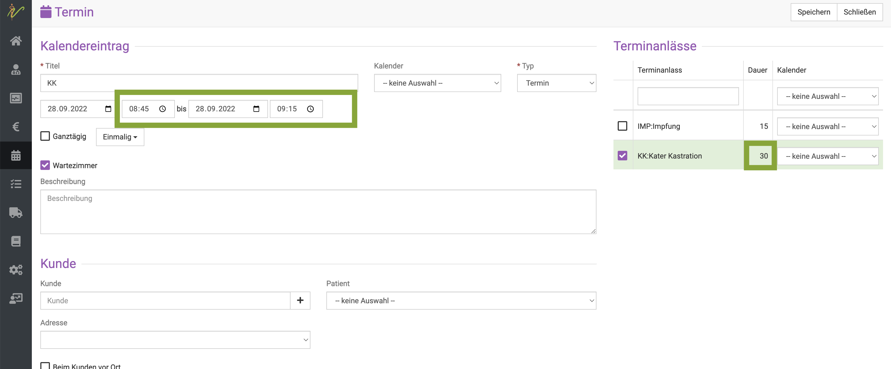

# Terminanlässe 

Unsere debevet Software bietet seit  September 2022 die Möglichkeit, verschiedene Terminanlässe zu erstellen. Jeden Terminanlass
können Sie auf Wunsch auch als online buchbar einstellen, damit Sie in Ihrer Praxis Zeit und Ressourcen für die telefonische 
Terminvergabe sparen können.

Einem Terminanlass können Sie folgende Attribute zuweisen:
* einen Kalender, also den Behandler, in dessen Kalender es eingetragen wird (wenn bestimmte Dienstleistungen nur von einem Tierarzt angeboten werden)
* eine Termindauer
* den Grund des Anlasses (z.B. Impfung, Wurmkur, Kastration Kater, Lahmheitsuntersuchung, Chiropraktische Behandlung etc.)
* eine individuelle Stornierungsfrist in Stunden 
* Zeiten, in denen dieser Terminanlass buchbar werden soll (von extern, also online, außerhalb der Zeiten kann dieser dennoch manuell
erstellt werden)

Vorteile, die sich Ihnen dadurch bieten sind vor allem die schnellere Anlage von Terminen im Praxis Kalender und bessere Strukturierung der
Termine.

:::caution Achtung: 

Bitte denken Sie daran, dass Termine nur dann online buchbar sind, wenn der entsprechende Mitarbeiter, der den Terminanlass anbietet, im Arbeitszeitplan
als verfügbar eingetragen ist.  

:::  

## Terminanlass erstellen 

Als erstes müssen Sie die gewünschten Terminanlässe erstellen. Klicken Sie dazu auf **Administration** (Zahnradsymbol) und dann
**Terminanlässe**. 

  

Nun klicken Sie oben rechts auf das **grüne Plus-Symbol** um einen neuen Terminanlass anzulegen.  

  

Nun öffnet sich die Detailansicht und Sie können alle Informationen zum Terminanlass hinterlegen. 
* Kürzel
* Anlass/Name des Terminanlasses (z. B. Impfung)
* Kalender, also Nutzer, der es anbieten soll
* Termindauer (diese Zeit wird dann automatisch als Dauer gesetzt und muss nicht mehr manuell gesetzt werden)
* Checkbox Extern buchbar (bedeutet, dass der Kunde den Termin selbst buchen kann)
* Zeiten, zu denen der Terminanlass extern buchbar sein soll

Klicken Sie anschließend oben rechts auf **Speichern**.  

:::tip Tipp: 

Wenn Sie möchten, dass diese Terminart durch mehrere Angestellte durchgeführt werden kann, wählen Sie mehrere Benutzer (Kalender) aus.  

  

::: 

In der Übersichtsseite sehen Sie nun die erstellten Terminanlässe mit kleinen Symbolen, die Ihnen direkt einen Überblick geben:

* Weltkugel: ist extern buchbar 
* Termindauer
* Kalender, also welcher Tierarzt diesen Terminanlass anbieten kann (Farbsymbol)  

Sie können so viele Terminanlässe erstellen, wie Sie wollen.

## Termin erstellen mit Terminanlass 

Nun ist es viel leichter, schnell einen Termin mit einem Terminanlass zu erstellen.
Wenn Sie den Termin erstellen wollen, gehen Sie vor, wie gewohnt, klicken Sie am gewünschten Tag und Uhrzeit einmal in den Kalender, um das 
Detailfeld zu öffnen.  

Nun können Sie rechts an dem gewünschten Terminanlass die **Checkbox aktivieren**. 

  

Die Zeitdauer des Termins wird direkt automatisch entsprechend des Anlasses eingestellt.  

  

Wie gewohnt können Sie wählen, ob der Kunde zum Termin direkt automatisch ins Wartezimmer gesetzt werden soll. 

Wählen Sie außerdem noch aus, welcher Behandler (also Benutzer bzw. dessen Kalender) hier genutzt werden soll. Klicken Sie dazu rechts am
Terminanlass aus den Dropdownpfeil und wählen einen Kalender aus.  

:::tip Tipp:  

Wenn sie bereits sehr viele Terminanlässe erstellt haben, können Sie oben in das kleine Suchenfeld die ersten Buchstaben des Terminanlasses 
eingeben und die Auswahl wird direkt gefiltert.   

  

:::  

Wählen Sie nun noch wie gewohnt unten den Kunden und den Patienten aus und klicken oben rechts auf **Speichern**. 

## Terminanlässe mit zwei Tierärzten vereinbaren  

Sie haben auch die Möglichkeit, direkt zwei oder mehr Terminanlässe an einem Kunden direkt anzulegen. Diese können sogar direkt mit
zwei (oder mehr) verschiedenen Ärzten angelegt werden. 

Wählen Sie dazu einfach an jedem Terminanlass den entsprechenden Behandler aus.   

  

In der Kalendervorschau erkennen Sie an einer kleinen Zwei und an der Nutzung zweier Kürzel, dass hier der Termin "aufgeteilt" ist.   
Anhand der Kalenderfarbe erkennen Sie, dass es keinem einzelnen Behandler zugewiesen ist, sondern "neutral", also mehreren. 

  

