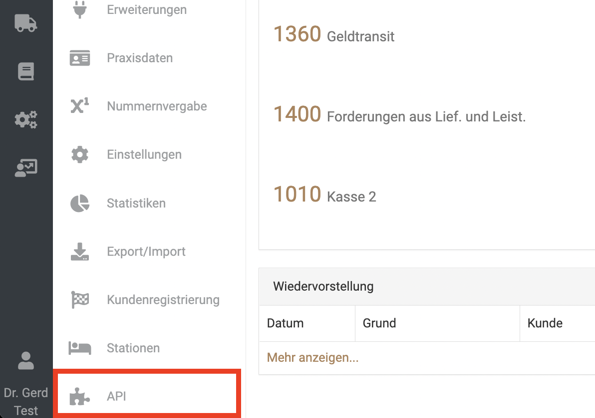
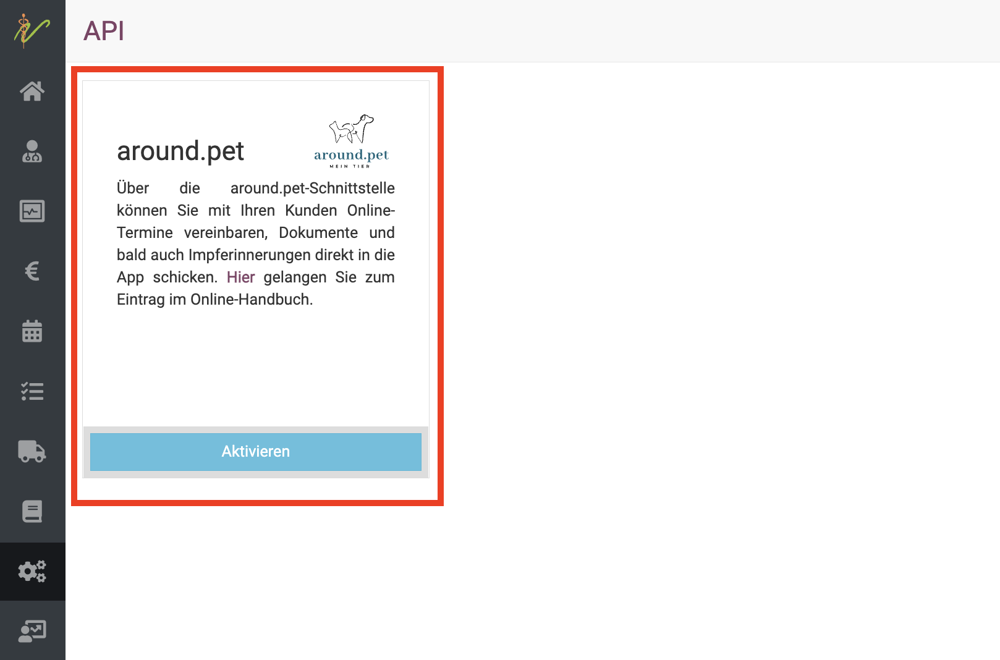
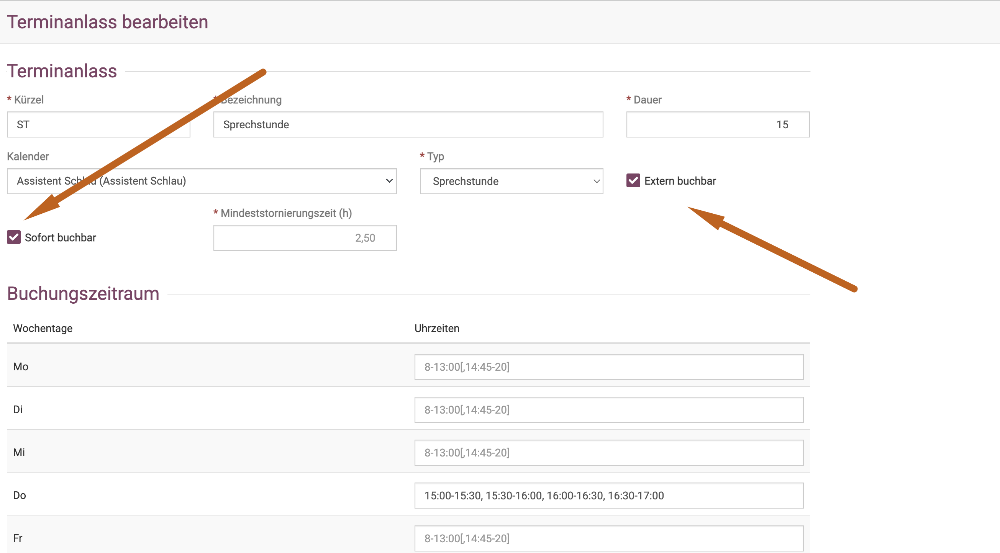
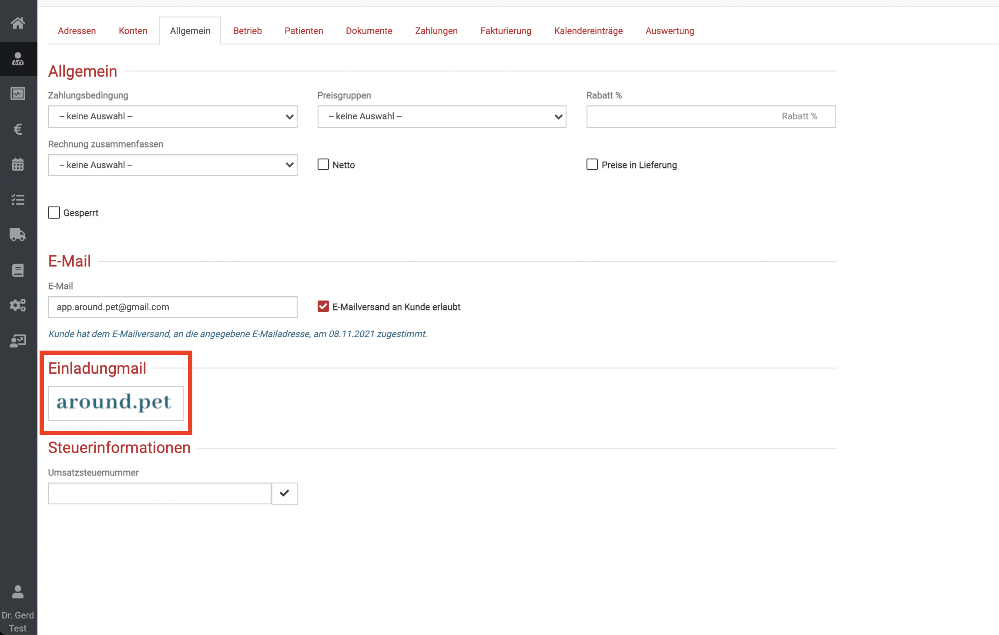
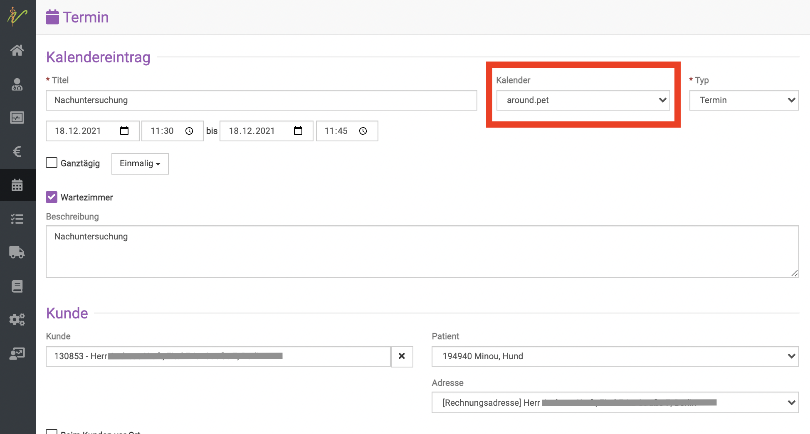
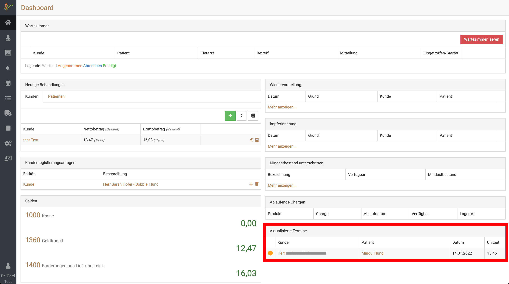
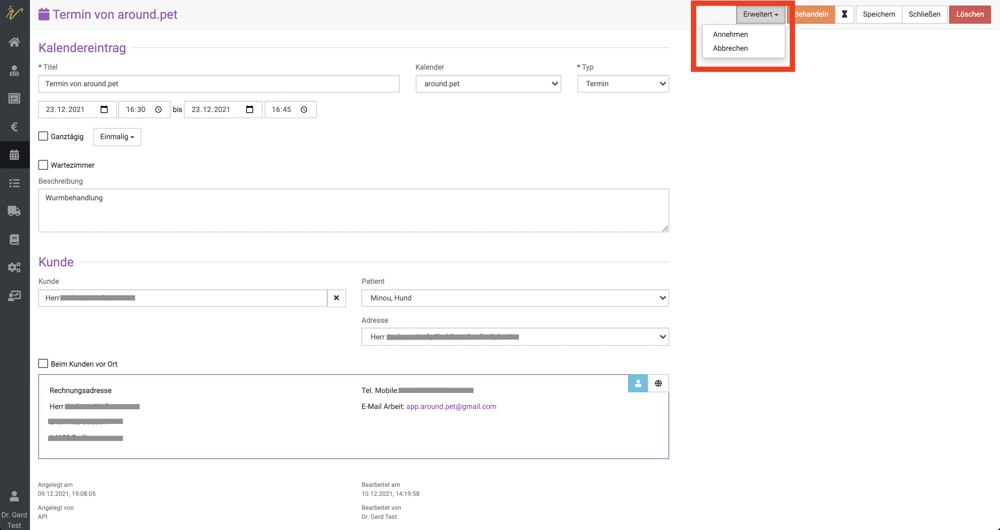
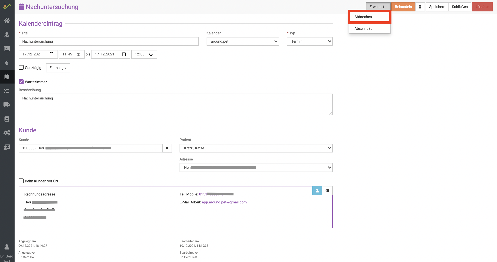
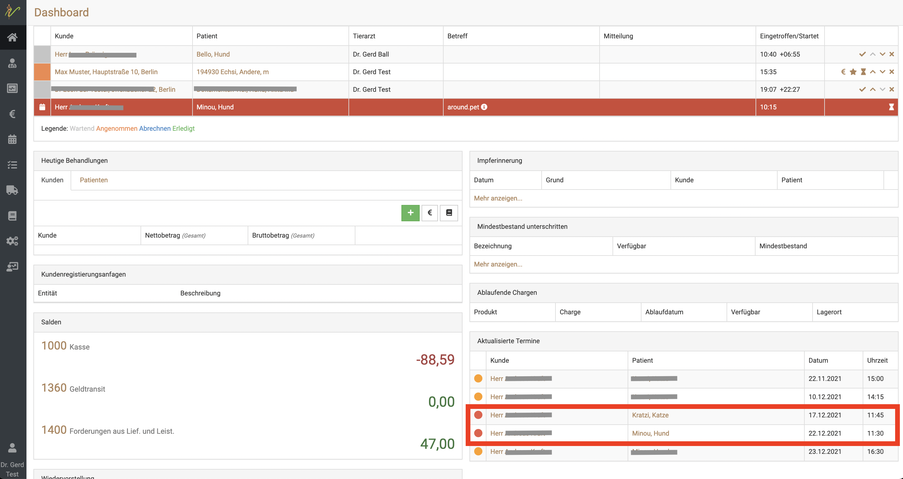
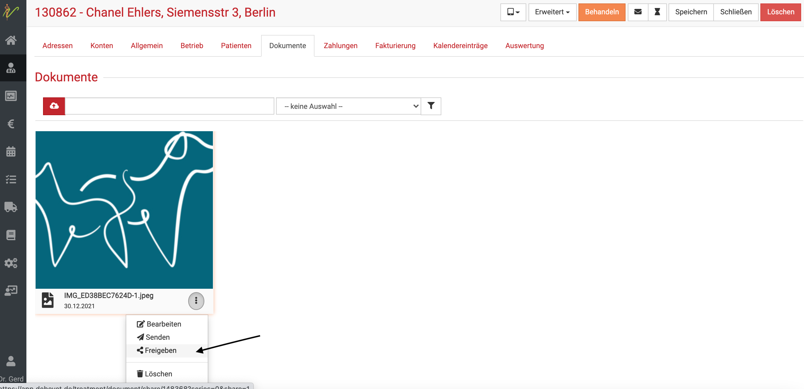

# Online Termine vergeben

Die debevet Software bietet Ihnen ein ideales System zur Vergabe von Terminen via Online Buchung. Dabei steht ab ca. Juli 2023 ein 
Webwidget zur Verfügung, ansonsten kann auch über die around.pet App gebucht werden. Beide sind miteinander verbunden, so dass Ihre Kunden (und Sie)
wählen können, ob und wie Sie welche Möglichkeit nutzen können. Das eine schließt das andere nicht aus und unsere Empfehlung ist,
einfach beides anzubieten, je nach Vorlieben können Ihre Kunden dann wählen.

Dabei wird unterschieden (und das stellen Sie selbst ein) in   

* Terminanfragen (die Sie dann bestätigen müssen))
* Direkte Terminbuchung (ohne, dass Sie noch etwas manuell tun müssen, ist der Termin fix eingebucht)

## around.pet Schnittstelle aktivieren

Zunächst müssen Sie in der debevet Software die around.pet Verbindung einmalig einrichten. Klicken Sie dazu auf **Administration** und dann
**API**.

Gehen Sie auf den Button aktivieren und setzen Sie den Haken bei "Ich akzeptiere die Nutzungsbedingungen des Anbieters".
Anschließend können Sie die Schnittstelle aktivieren.

   

## Zeiten für Termine vorgeben

Damit die Termine buchbar sind, muss der Mitarbeiter, der diese Termine anbietet, in der Zeit in der Arbeitszeitplanung unbedingt eine aktive 
Schicht haben.  

:::danger ACHTUNG!   

Es reicht nicht, dass die Praxis einfach nur geöffnet ist, auch nicht, wenn Sie nur sich selbst als Mitarbeiter nutzen!   

:::  

Lesen Sie in der Sektion **Arbeitszeitplanung**, wie Sie sich selbst oder Mitarbeiter einplanen. Keine Angst, das ist nicht schwierig!   

https://handbuch.debevet.de/docs/Zeiterfassung/Zeiterfassung#arbeitszeitplanung  

## Mögliche Buchungsvarianten /Zeitvorgaben  

Sie können an den buchbaren Terminanlässen immer selbst entscheiden, ob diese   
* Extern buchbar sein sollen (also über Web oder App) 
* Sofort buchbar sein soll (oder Sie es als Termin-Anfrage nutzen wollen)  

Bei Termin-Anfragen müssen Sie die Termine noch einmal bestätigen, bei "Sofort buchbar" wird der Termin direkt fest eingebucht ohne, 
dass Sie manuell noch einmal tätig werden müssen.

## Tierbesitzer zur App einladen 

:::caution Hinweis: 

Hinweis: Es ist wichtig, dass sich der Kunde mit der E-Mail zu der Sie die Einladung schicken bei der around.pet App
registriert. Nur dann kann die richtige Zuordnung stattfinden.  

:::  

1. Gehen Sie auf das Profil des Kunden.

2. Gehen auf den Reiter "Allgemein".

3. Gehen Sie im Bereich Einladungsmail auf den Button „around.pet“. Dadurch wird an die hinterlegte E-Mail-Adresse des Kunden eine Einladungsmail versendet.  

  

## Neukunden über die App  

Kunden, die die App nutzen, bekommen in der Liste der Tierärzte Ihre Praxis angezeigt und können sich über die App mit Ihnen verbinden.  

Wenn die Kunden alle Daten angeben, werden Sie als Kunden bei Ihnen angelegt, das spart Ihnen den Aufwand des Anlegens/Registrierens vor Ort!  

:::tip Tipp:  

Wenn Sie unter **Administration** → **Textbausteine** → **Datenschutzerklärung** einen entsprechenden
Text hinterlegt haben, kann der Kunde diesen lesen und stimmt mit seiner Verbindung mit Ihnen der Datenschutzerklärung zu. 
Diese wird bei Ihrem debevet unter Dokumente des Kunden dann mit entsprechendem Datum als Nachweis für Sie gespeichert.  

::: 

## Terminanzeige für Kunden in der App  

:::tip Tipp:  
Der Kunde erhält 25h und 1h bevor der Termin stattfindet eine Push-Nachricht durch die App.
Deshalb ist es wichtig, dass der Kunde die Benachrichtigungen für die around.pet App auf seinem Smartphone aktiviert.  

:::  

Erstellen Sie wie gewohnt einen Termin für einen Kunden und seinen Patienten. **Der Kunde sieht bei sich den Inhalt im Feld
Beschreibung des Kalendereintrages als Grund des Termines. Das Feld des Titels eines Kalendereintrages sehen nur Sie.**

1. Wählen Sie den Kunden der die around.pet App nutzt und dessen Tier.

2. Wählen Sie bei Kalender around.pet und speichern Sie den Kalendereintrag.

3. Der Kunde erhält sofort eine Benachrichtigung auf sein Handy mit den Details zu seinem nächsten Termin, wenn er mit Ihnen verbunden ist.  

  

## Terminanfragen vom Kunden annehmen  

Auf Ihrem Dashboard gibt es ein Fenster für **Aktualisierte Termine**. Dort sehen Sie alle Terminanfragen von Kunden, die über die 
around.pet App hereinkommen.  

  

Klicken Sie auf den Patienten- oder Kundennamen und klicken dann oben rechts **Erweitert**. 

Nun können Sie die **Terminanfrage annehmen**.    

  

Der Eintrag ist dann aus dem Dashboard Feld **Aktualisierte Termine** verschwunden. 

## Termin absagen oder Anfrage ablehnen  

In der Detailansicht eines Termines können Sie über **Erweitert** eine Terminanfrage bzw. einen Termin durch 
Klick auf **Abbrechen** absagen. Der Patientenbesitzer erhält sofort eine Benachrichtigung.  

  

## Terminabsage durch Kunden  

Wenn Kunden durch die App einen Termin abgsagen, erscheint dieser in **Rot** auf der Liste **Aktualisierte Termine** auf 
Ihrem Dashboard.  

:::caution Hinweis:   

Ihr Kunde hat diese Möglichkeit nur, wenn der Termin mit Ihnen mehr als 24h in der Zukunft liegt. 
Wenn der Termin in weniger als 24h stattfindet, bekommt er den Hinweis, dass er sich per Telefon bei Ihnen melden muss.  

::: 

  

## Termin ändern  

Wenn Sie wie gewohnt im Kalender den Eintrag (z.B. Datum, Uhrzeit) ändern, bekommt Ihr Kunde dieses direkt via Push Nachricht angezeigt!

## Dokumenten Service  

Sie können alle Dokumente wie z. B. Röntgen, Laborergebnisse, Untersuchungsprofile usw. direkt für Ihren Kunden freigeben.
Diese werden dann direkt in der App für den Kunden verfügbar und können nicht wie als Email evtl. gelöscht werden und sind dann für den 
Kunden nicht mehr verfügbar.  

