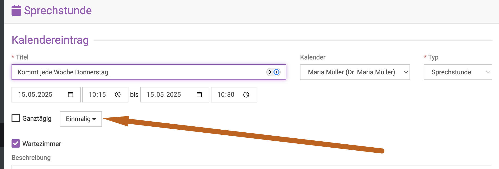
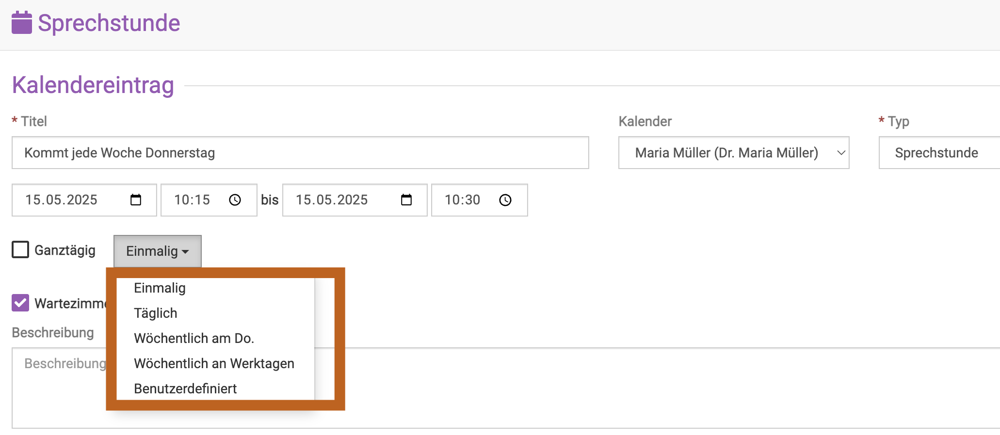
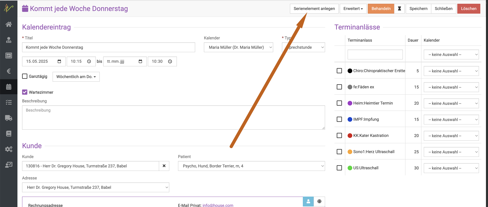
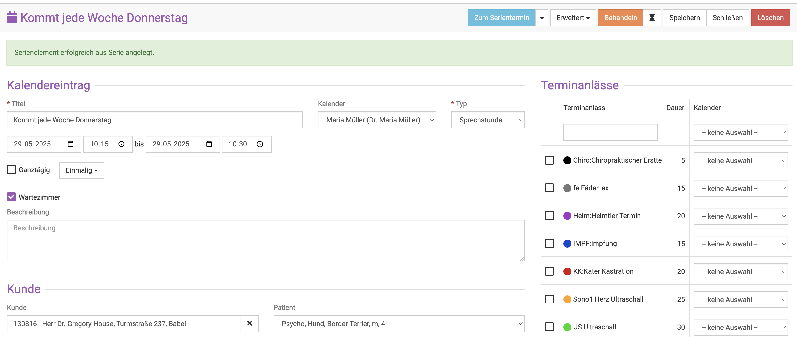
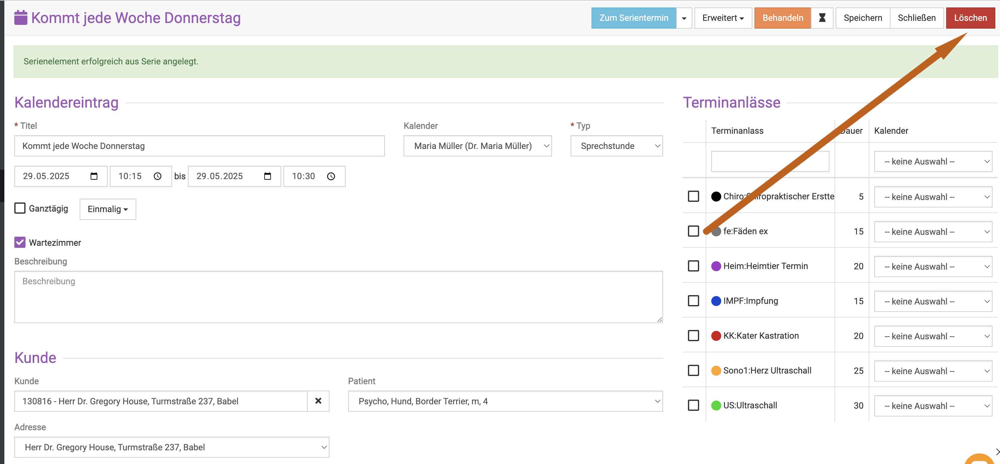

# Serientermine anlegen

Wir bieten natürlich in unserem Kalender auch die Variante, dass Sie für Ihre Praxis Serientermine anlegen können.
Dies können Dinge sein, die Sie selbst als "Private" Termine eintragen wollen, damit diese
immer geblockt sind für externe Buchungen, oder aber Kundentermine, die jede Woche stattfinden.  

## Wiederholenden Termin anlegen  

Um einen Serientermin, sogenannten "sich wiederholenden Termin" anzulegen, können Sie beim Anlegen des Termins (und dabei ist 
es egal, ob Sie diesen aus dem Kalender oder aus der Patientenakte anlegen) am Dropdownfeld "Einmalig" eine andere Wiederholungsrate wählen.   

  

Nun sehen Sie eine Auswahl, in meinem Beispiel legen wir den Termin wöchentlich am Donnerstag an. Sie können aber eine beliebige Auswahl selbst 
festlegen.   

   

Wenn Sie alle Daten eingetragen haben, speichern Sie den Termin, indem Sie oben rechts auf Speichern klicken. 

Der Termin ist nun als sich wiederholend angelegt.   

:::caution Achtung: 

Bitte beachten Sie, dass es sich in diesem Schritt des Anlegens zuerst um eine gesamte "Kette" von Terminen handelt- wenn Sie 
einen Termin dieser Serie löschen, wird die Software (nach vorherigem Hinweis) immer ALLE Termine der Serie löschen.  
Wenn Sie die Termine zwar wiederholend, aber "entkettet" wünschen, absolvieren Sie bitte den nächsten Schritt.   

:::   

## Einzelne Termine aus einer Serie löschen   

Um einen einzelnen Termin aus einer Serienterminreihe zu entfernen, müssen Sie den Termin, den Sie löschen wollen zunächst als
"Serienelement" anlegen.    
Rufen Sie den Termin im Kalender auf, der aus der Serie gelöscht werden soll:   

Klicken Sie nun auf "Serienelement anlegen"   

   

Sie sehen anschließend die Erfolgsmeldung in der Button, den Sie geklickt hatten ändert sich:   
 
   

Nun können Sie den einzelnen Eintrag löschen, ohne, dass die Serie gesamt gelöscht wird. Klicken Sie dazu oben rechts auf "löschen".   

