# Produkte  

Unter Produkte versteht debevet alle Dienstleistungen, alle GOT Leistungen, alle Medikamtene und sonstiges, was Sie abrechnen,
abgeben oder verkaufen wollen. 

In diesem Sektor können Sie Produkte suchen, anlegen, ändern oder löschen. Außerdem gelangen Sie über die Bearbeitungsseite des 
Produktes zu Informationen und Daten, die zu dem jeweiligen Produkt in Beziehung stehen, wie Anwendungsanweisungen, 
Warenbestände und Lagerorte.  
Um in den Bereich zu gelangen, klicken Sie **Warenwirtschaft** und dann **Produkte**.  

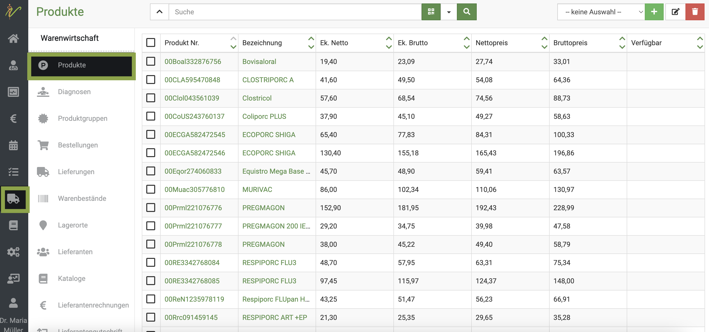

## Neue Produkte anlegen  

Falls Sie neben den aus den Katalogen importierten Produkten noch eigene Produkte haben, die Sie anlegen wollen, können Sie beliebig
viele eigene Produkte anlegen.  

Wählen Sie zunächst aus dem Dropdownmenü rechts oben aus, welche Produktart Sie hinzufügen möchten (Medikament, Dienstleistung 
oder Sonstiges). Klicken Sie nun auf das grüne 'Plussymbol', um auf die Seite zur Eingabe eines neuen Produktes zu gelangen.    

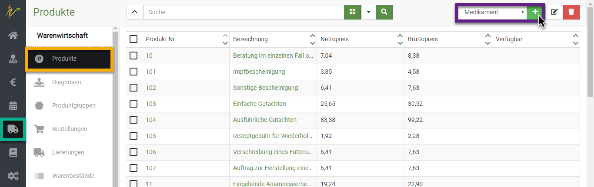   

Geben Sie in der Eingabeseite die gewünschten Informationen ein und speichern Sie das neue Produkt anschließend, 
in dem Sie oben rechts auf 'Speichern' klicken.   

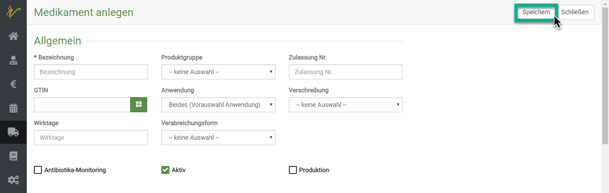   

:::caution Achtung  

Bevor Sie ein Produkt speichern können, müssen Sie ganz unten die Checkbox aktivieren, um damit die Richtigkeit der Preise 
zu bestätigen.  

:::  

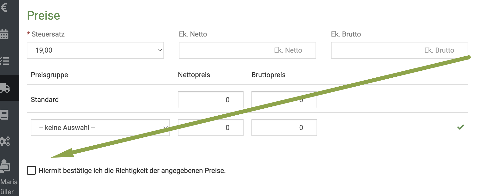  

### Inventurpflicht  

Eine praktische Funktion ist die Checkbox **Inventurpflichtig** bei Medikamenten. Wenn Sie dieses Feld aktivieren, wird bei
der Nutzung/Abrechnung bei der Behandlung (oder der Abgabe) eines Tieres mit diesem Medikament automatisch eine Chargennummer
gesetzt.   

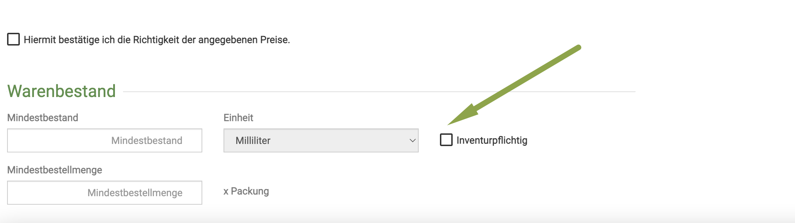

:::caution Achtung  

Wenn Sie mehrere angebrochene Packungen (z.B. in verschiedenen Räumen, oder in einem Notfallkoffer) nutzen, müssen Sie 
dennoch kontrollieren, dass Sie die richtige Charge nutzen und diese evtl. sonst manuell ändern.  

:::   

### Mindestbestand nutzen  

Um einen schnelleren Überblick zu haben, welche Medikamente nach bestellt werden sollten, können Sie für die Medikamente (oder Futter) 
auch Mindestbestände ganz unten am Produkt hinterlegen. Wenn Sie in Ihrer Dashboard-Ansicht den Haken gesetzt haben, wird Ihnen
immer direkt angezeigt, welche Medikamente bestellt werden müssen.   

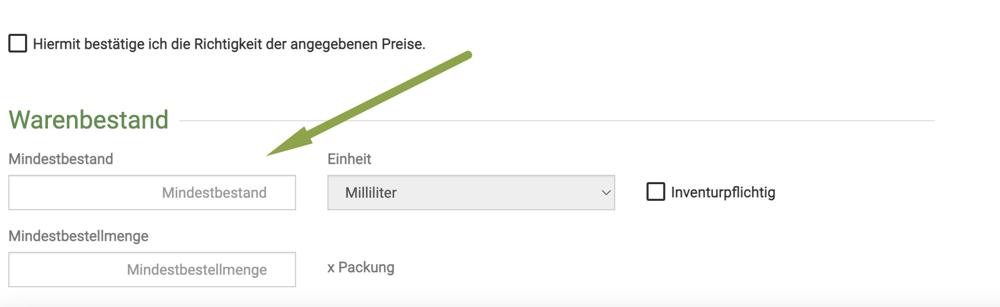  

### Wartezeiten  

Damit Ihre AUA Belege sauber ausgefüllt sind, müssen bei lebensmittelliefernden Tieren die Wartezeiten korrekt hinterlegt sein.   

Klicken Sie am Produkt den Reiter **Wartezeiten**, um diese dann individuell nach Tierart setzen oder ändern zu können. 
Denken Sie daran, nach der Eingabe erst den **grünen Haken** zu klicken und anschließend oben rechts auf **Speichern** zu klicken.

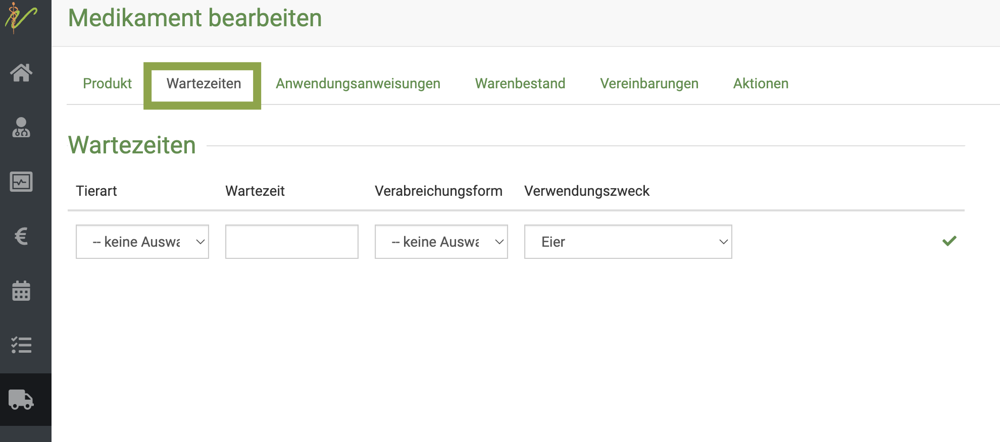  

:::danger  ACHTUNG  

Die Wartezeiten werden leider nicht zuverlässig KORREKT aus der Barsoi Liste überliefert, die Angaben können also falsch sein. 
Wir raten deswegen dringend zur manuellen Überprüfung. Denken Sie in dem Fall daran, die automatische Aktualisierung mit dem Katalog
zu deaktivieren, damit Ihre Änderungen nicht wieder überschrieben werden.   

:::

### Anwendungsanweisungen

Für Medikamente, die Sie abgeben, sind Sie verpflichtet, die Anwendungshinweise mit auf den AUA Beleg zu schreiben. Damit dieser
im debevet dann automatisch korrekt ausgefüllt ist, können und müssen Sie die Anwendungshinweise am Medikament hinterlegen.  
Klicken Sie hierzu den Reiter **Anwendungsanweisungen** und hinterlegen dort die entsprechenden Daten.  
Dabei müssen folgende Felder gesetzt werden:  

* **Bezeichnung**  
* **Tierart**  
* **Menge** 
* **Anzahl d.**  
* **Intervall** Alle wieviel Stunden muss das Medikament gegeben werden? (bei einmal tägl. z.B. 24 setzen)
* **Verabreichungsform** hier wählen Sie via Dropdown, wie das Medikament zu verabreichen ist
* **Beginn**  

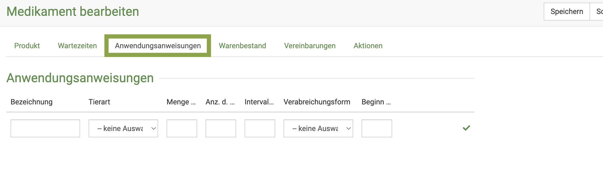  

### Verbot für lebensmittelliefernd  

Medikamente, die nicht für lebensmittelliefernde Tiere eingesetzt werden dürfen, müssen hier via Checkbox aktiviert werden, bzw.
sind dies bereits durch die Überlieferung aus der Barsoi Liste.  

:::danger ACHTUNG  

Wenn dieser Haken gesetzt ist, kann dieses Medikament bei einem Tier, welches als lebensmittelliefernd markiert ist, NICHT
angewandt werden. Das bedeutet, dass bei dem Versuch, dieses in der Behandlung einzutragen, dieses NICHT eingetragen wird. Es kann 
also dort "nicht abgerechnet" werden. Das Programm verweigert automatisch die Behandlung damit.

:::  

## Produkt GTIN scannen  

Um Ihre Produkte (betrifft vor allem die Medikamente) schneller und leichter verwalten zu können, können Sie den Barcode scannen.
Das ist zwar erstmalig etwas arbeit, erleichtert aber Ihren Mitarbeitern bei ankommenden Lieferungen die Zeit, die es braucht, um die 
Lieferung einzugeben extrem.  

Drücken Sie hierzu das grüne Symbol neben dem GTIN (EAN) Eingabefeld am Produkt und scannen Sie anschließend die Nummer.  

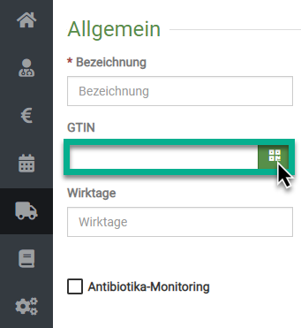   

Nun können Sie bei kommenden Lieferungen dieses Medikaments dieses einfach nur noch scannen, statt alle Daten bei der Lieferung 
manuell einzutragen.  

## Produkte suchen und finden   

In der Übersichtsliste Ihrer Produkte können Sie nach Produkten suchen.

Tippen Sie in das Suchfenster wie bei einer Suchmaschine Begriffe ein, die auf das gewünschte Produkt passen und drücken
Sie die **Entertaste** oder klicken Sie auf das **Lupensymbol.**.

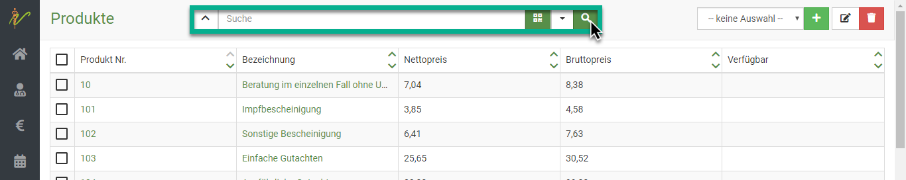  

### Suche filtern

Wenn Sie neben dem Eingabefeld für die Schnellsuche oben auf den Pfeil nach unten klicken, können Sie auch nach gezielten 
Parametern bzw. weiteren Suchbegriffen **filtern**.  

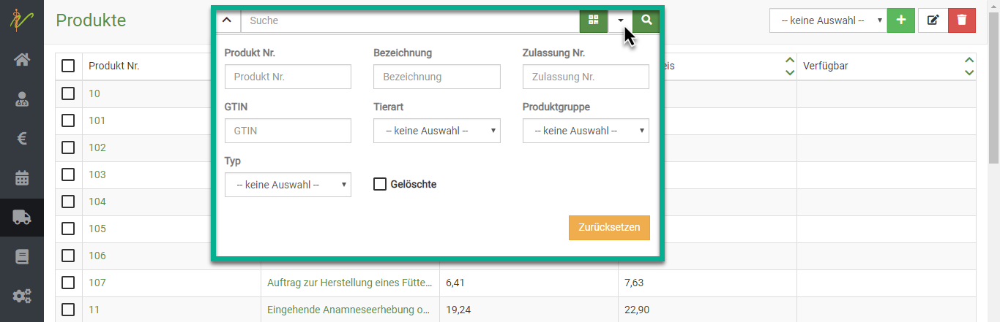  

### Suchenfilter zurücksetzen  

Wenn Sie eine Suche ausgeführt haben, ist die Produktliste gefiltert, was dadurch angezeigt wird, dass der Pfeil nach unten 
neben den der Schnellsuche *gelb* ist. Klicken Sie auf den Pfeil nach unten und dann auf Zurücksetzen, um die Produktliste
wieder ungefiltert angezeigt zu bekommen.   

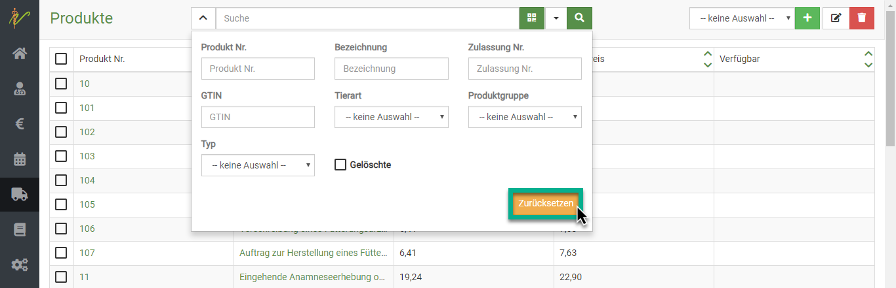  

## Produkte bearbeiten und weitere Details  

Klicken Sie in der Liste Ihrer Produkte auf den Link in der Spalte **Produkt Nr.** oder **Bezeichnung**, um auf die 
Bearbeitungsseite des Produktes zu gelangen.   

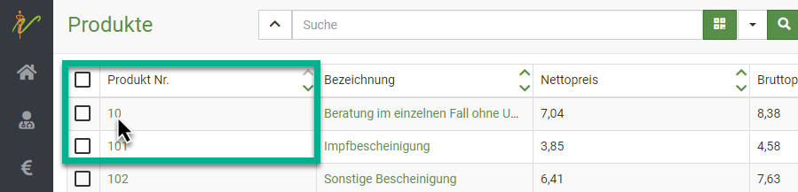   

## Mehrere Produkte bearbeiten oder löschen  

Um mehrere Produkte zu bearbeiten oder zu löschen, wählen Sie die **Checkboxen** der gewünschten Produkte an und drücken
danach oben rechts auf das jeweilige Symbol:

* **Stiftsymbol**, wenn Sie die Produkte bearbeiten wollen  
* **Mülltonnensymbol**, wenn Sie die Produkte löschen möchten  

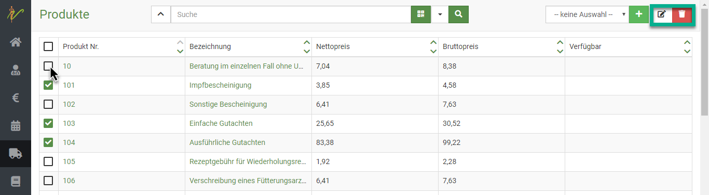   

## Produkte mit Aktionen verknüpfen  

Sie können Produkten bestimmte Aktionen zuweisen. So können Sie z.B. zu einem Impfstoff als Aktion eine Impferinnerung 
hinzufügen, um automatisch nach jedem Verwenden dieses Impfstoffes eine Impferinnerung für den behandelten Patienten in
x Tagen hinzuzufügen.    

Klicken Sie hierfür am gewünschten Produkt den Reiter **Aktionen**.  

   

:::tip Tipp   

Nutzer der App aroundpet bekommen nicht nur einfach eine Email, sondern werden über Erinnerungen dieser Form direkt via
push-Nachricht auf Ihrem Handy benachrichtigt.  

:::  

 
