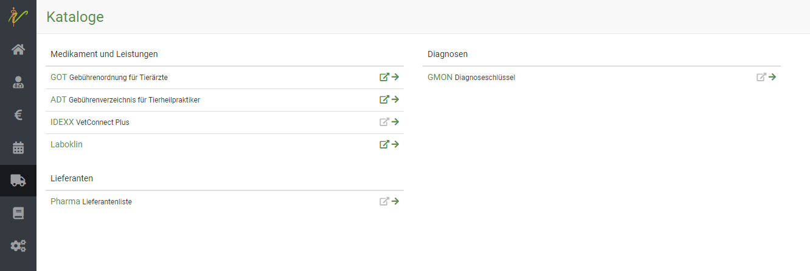
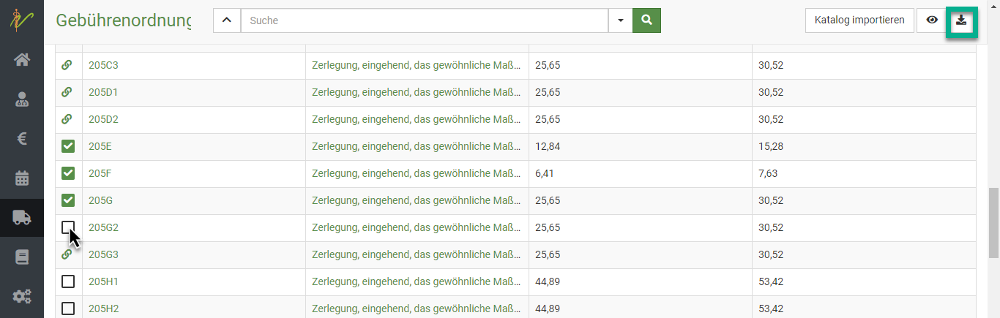
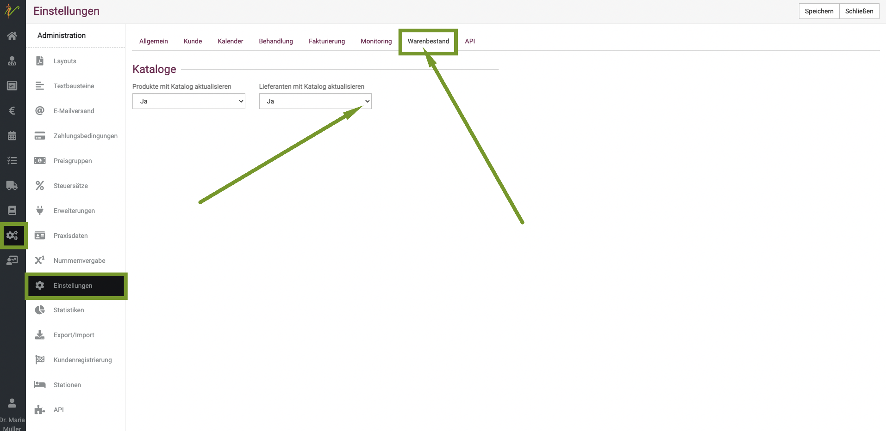
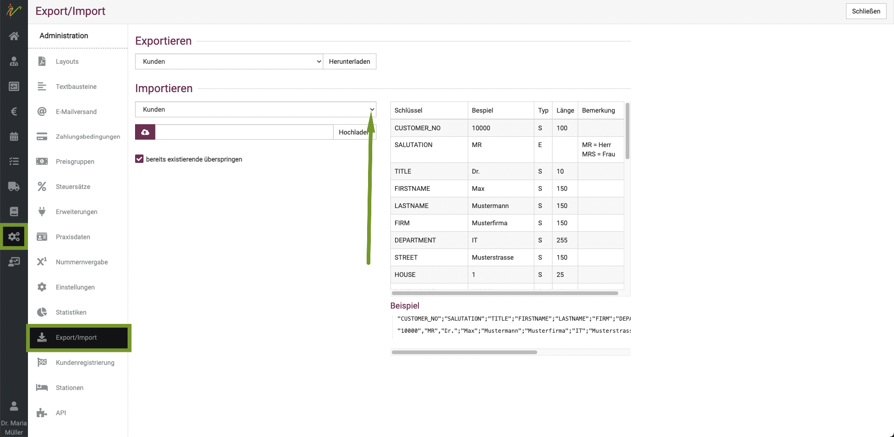
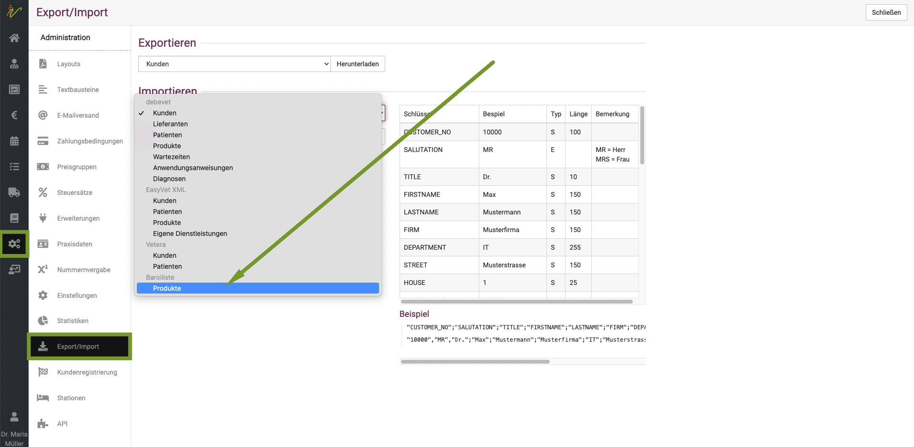
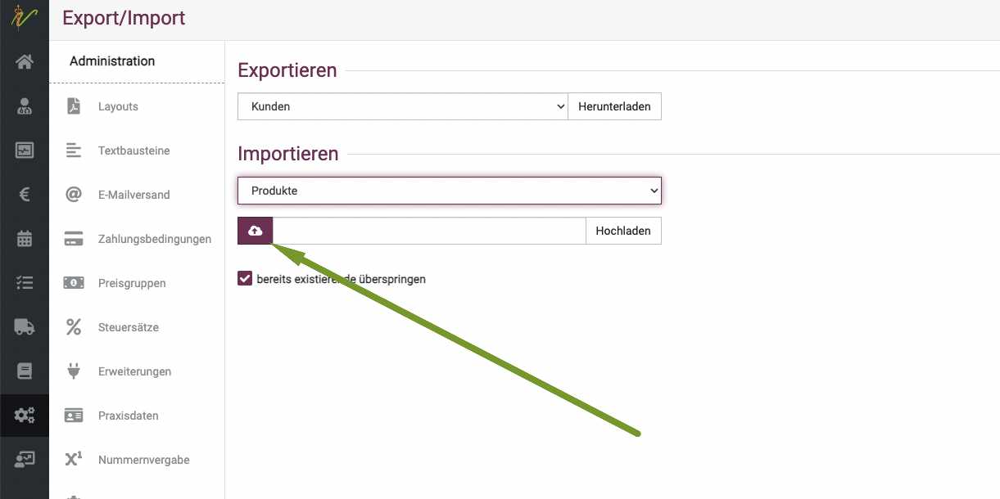

# Kataloge

debevet stellt diverse Katalog-Verzeichnisse kostenlos zur Verwendung. Sie können diese Kataloge in Ihr debevet 
übernehmen und dort optional bearbeiten oder aber auch in Zukunft durch debevet automatisch aktualisieren lassen.   

  

Folgende Kataloge werden aktuell zur Verfügung gestellt

* GOT - Leistungen inkl. Preise nach der Gebührenordnung für Tierärzte inkl. Gebührenziffer
* ADT - Leistungen inkl. Preise für Tierheilpraktiker gemäß ADT
* IDEXX - Laborleistungen inkl. Preise (Einkauf und Verkauf, beinhaltet ebenfalls die möglichen Tests mittels VetLab-Station)
* Laboklin - Laborleistungen inkl. Preis (Einkauf und Verkauf)
* Pharmaliste - Liste der gängigsten Pharmahersteller als auch Distributoren
* GMON - Diagnoseschlüssel für Hunde, Katzen, Pferde, Rinder und Schweine 
* Barsoi-Liste - Medikamentenpreise (vorausgesetzt, Sie haben die digitale Version der Liste, welche bei Barsoi erworben werden kann)  

## Katalog importieren  

Klicken Sie auf **Warenwirtschaft** (LKW-Symbol) und dann **Kataloge**.  

  

Klicken Sie auf den Pfeil nach rechts neben dem gewünschten Katalog, den Sie importieren oder näher begutachten möchten. 

Die Liste stellt alle Leistungen des ausgewählten Katalogs - hier GOT - dar. Sie können die Liste wie alle Listen in 
debevet wie gewohnt filtern und sortieren.  

  

### Ausgewählte Einträge eines Katalogs übernehmen  

Jeder Eintrag (Zeile) kann einzeln angekreuzt werden, um so mit dem Button ganz rechts oben im Menü der Seite importiert
zu werden. Hat ein Eintrag kein Ankreuzfeld, sondern als Symbol eine Büroklammer, so haben Sie diesen bereits in Ihr debevet 
importiert.  

  

### Vollständigen Katalog importieren  

Klicken Sie auf den Button **Katalog importieren**, so wird der ganze Katalog in Ihr debevet übernommen. Bei einigen Katalogen,
wie in diesem Beispiel der GOT, erhalten Sie noch eine Vorauswahl, bei der Sie bspw. Einträge ausgewählter Spezies vorselektieren können.

Klicken Sie hier abschließend auf **Importieren**, so wird der Katalog gemäß Ihrer Auswahl importiert.   

  

## Aktualisierung der Kataloge und individuelle Anpassungen  

Aus Katalogen übernommene Einträge finden Sie nach dem Import wie alle Produkte und Dienstleistugen in Ihrem Gesamtkatalog
unter **Warenwirtschaft** → **Produkte**.   

Im Gegensatz zu Produkten und Leistungen, die von Ihnen manuell erfasst wurden,
werden Einträge aus Katalogen allerdings von debevet automatsich und kontinuierlich aktualisiert.  

Wenn Sie importierte Katalogeinträge nach dem Import ändern bzw. selber verwalten möchten, sollten Sie die **Aktualisierung 
deaktivieren**, da debevet sonst bei der nächsten Aktualisierung Ihre Änderungen zurücksetzt. 

Um die Aktualsierung zu deaktivieren, gibt es zwei Möglichkeiten.   

1. Klicken Sie auf **Administration** (Zahnradsymbol) - **Einstellungen** und 
wählen Sie den Reiter Warenbestand aus. Dort können Sie die Aktualisierung für alle Kataloge oder das Lieferantenverzeichnis abbestellen. 

   

2. Wenn Sie nur einzelne ausgewählte Einträge von der Aktualisierung ausschließen möchten, können Sie den Eintrag unter
**Warenwirtschaft** → **Produkte** suchen und auf der Bearbeitungsseite des Produktes das Feld **Mit Katalog aktualisieren** deaktivieren.  
  
   

  

## Angepasste Preise zurücksetzen

:::tip Tipp   

Sollten Sie einen Katalogeintrag z.B. aus der GOT individuell angepasst haben, so können Sie diesen jederzeit wieder auf 
die Eingaben aus dem Katalog zurücksetzen indem Sie nach dem Aufrufen der Dienstleistung oben rechts auf **Zurücksetzen** klicken. 

:::  

## Barsoi Liste integrieren/ importieren  

Natürlich haben Sie bei debevet die Möglichkeit, die Barsoi-Liste zu hinterlegen, um alle Medikamentenpreise direkt nutzen zu können.

Dies geht allerdings nicht über einen Katalog, sondern über unsere Import Funktion. Klicken Sie hierzu auf **Administration** und dann **Import/Export**.

  

Nun klicken Sie bei Import auf den Dropdown-Pfeil und wählen ganz unten aus der Liste **Barsoi Liste - Produkte**.

  

Nun klicken Sie auf das **Wolkensymbol** und wählen dann die Datei, die Sie auf Ihrem Rechner haben. (Diese können Sie bei Bardoi erwerben!).
Anschließend klicken Sie auf **Hochladen**.  

