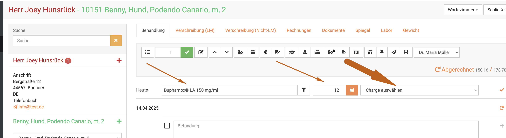
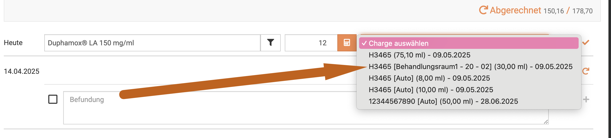
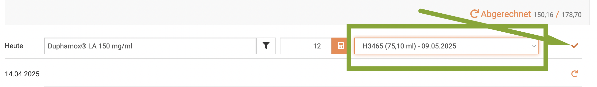
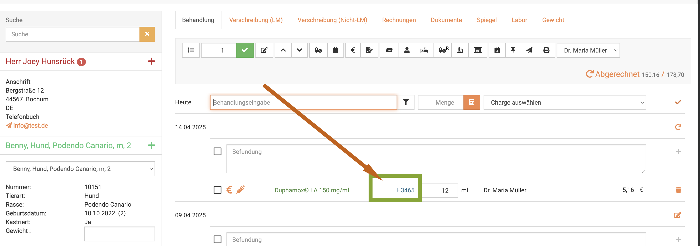

# Apothekenverwaltung 

Oftmals erreichen uns Anfragen, wie die Apothekenverwaltung im debevet funktioniert. In den anderen Unterpunkten hier an 
der Warenwirtschaft finden Sie zu den hier genannten Unterpunkten genaue Anleitungen.  

Dieser Abschnitt soll Ihnen als Einstieg zunächst helfen, das Logikprinzip von debevet zu verstehen, um es dann anzuwenden.  
Die Schritte dann durchzuführen wird in den jeweiligen Artikeln einzeln erklärt!

## Unterschied Produkte /Warenbestände  

Zunächst müssen Sie den Unterschied zwischen einem "Produkt" und einem "Warenbestand" verstehen.   

Ein Produkt ist im debevet alles, was in der Behandlung "zu Geld gemacht", also eingegeben werden kann. Dieses zieht debevet immer
aus dem Produktkatalog. Dienstleistungen kommen dabei gängigerweise aus dem GOT Katalog, je nachdem, welchen Sie importiert haben, 
sind das dann unterschiedliche GOT Posten.  
Bei Medikamenten können diese auf drei Wegen zunächst in den Produktkatalog gelangen:   
1. Über den Import der Barsoi Liste (diese müssen Sie bei Barsoi erwerben)   
2. Über die Nutzung von Vitrapet, welches aber deutlich weniger Produkte umfasst   
3. Über die manuelle Eingabe, das Anlegen von Produkten   

Alle drei Punkte haben hier eigene Hilfekapitel, damit Sie diese durchführen können.     

Ein **Produkt**  enthält nur die Infos, wie groß die Packung ist, was es ist, evtl. Wartezeiten, Anwendungshinweise etc. können
hinterlegt werden, ebenso wie der Preis, Einkaufspreis, Abgabepreis etc.  Ist das Produkt vorhanden im Katalog, so "kennt" debevet dieses 
und es kann verkauft werden und ein Warenbestand dafür angelegt werden.

Ein Warenbestand wird dann angelegt, wenn Sie dieses Produkt bestellt und erhalten haben. Erst jetzt geht es mit der "echten Apothekenverwaltung" los. 

Sie legen den Warenbestand an mit einer Charge, einem Ablaufdatum und der Menge der jeweiligen Packungen, die Sie erhalten haben.   

Erst nun ist der Warenbestand vorhanden.   

:::caution  Wichtig!   

Ohne das Anlegen eines Warenbestandes kann keine Apothekenverwaltung stattfinden!   

:::   

## Warenverbrauch dokumentieren    

Der häufigste Konflikt bei der Nutzung unserer Warenwirtschaft besteht darin, dass debevet immer nur dann einen Warenverbrauch aufzeichnet, wenn
der Nutzer auch eine Charge auswählt beim Nutzen des Medikaments. Dabei spielt es keine Rolle, ob dieses abgegeben oder angewandt wurde.   

Wann immer Sie wollen, dass der Verbrauch dokumentiert wird, MÜSSEN Sie beim Anwenden/Abgeben des Medikaments eine Charge auswählen.   

Achten Sie deshalb immer darauf, dass eine aktuell gültige, nicht abgelaufene Charge in der entsprechend benötigten Menge vorhanden ist!    

Wenn Sie also ein Medikament eingeben, wählen Sie IMMER die Charge und klicken erst dann den orangenen Haken, um es in die Behandlung hinzuzufügen.  

   

  

Hier im Bild sehen Sie mehrere Chargen, wovon bei einigen auch nicht mehr die entsprechende Menge vorhanden wäre, diese würden sich dann nicht anwenden lassen.   

Nachdem die Charge gewählt wurde, fügen Sie diese mit dem orangenen Haken in die Behandlung hinzu.   

   

In der Behandlung sehen Sie nun, welche Charge verwendet wurde.     

    

:::caution Achtung!   

Wenn Sie dort KEINE blaue Zahl und Charge sehen, wird auch KEIN Verbrauch dokumentiert!    

:::   

## "Inventurpflicht" nutzen   

Damit Sie nicht vergessen können, eine Charge einzugeben, könnten Sie sich alle wichtigen Produkte auf "inventurpflichtig" setzen.   

Dann wird das Programm immer eine Charge setzen, wenn eine vorhanden ist. Dabei wählt es zunächst die Charge aus, die das älteste "Einbuchungsdatum" hat.  

Wir empfehlen aber IMMER, noch einmal abzugleichen, welche Sie nutzen und zu kontrollieren, ob die korrekte gewählt wurde.  

Nachteile, bzw. "Probleme", die entstehen können, wenn Sie mit allen Produkten "inventurpflichtig" arbeiten:   

1. Wenn keine noch gültige Charge vorhanden ist, kann das Medikament nicht eingegeben werden in die Behandlung (z.B. abgelaufen)   
2. Wenn zu wenig Menge vorhanden ist, weil Sie die neue Lieferung noch nicht im Warenbestand eingegeben haben, kann das Medikament nicht genutzt werden   
3. Wenn Sie den Warenbestand anlegen, kann die Behandlung mit einer Charge nicht zurück datiert werden auf ein Datum, was vor dieser Buchung liegt.   
4. Eine Vorlage, die von einem der  ersten drei Punkte betroffen ist, kann GAR NICHT angewandt werden     

Dies wurde absichtlich so programmiert, um rechtliche Aspekte zu berücksichtigen. Wenn Sie Ihren Warenbestand immer direkt eingeben und aktiv setzen, 
sowie Ihre abgelaufenen Chargen sauber im Blick halten und ausbuchen, kann es zu keinen Problemen kommen. 

