# Produkte  

Unter Produkte versteht debevet alle Dienstleistungen, alle GOT Leistungen, alle Medikamtene und sonstiges, was Sie abrechnen,
abgeben oder verkaufen wollen. 

In diesem Sektor können Sie Produkte suchen, anlegen, ändern oder löschen. Außerdem gelangen Sie über die Bearbeitungsseite des 
Produktes zu Informationen und Daten, die zu dem jeweiligen Produkt in Beziehung stehen, wie Anwendungsanweisungen, 
Warenbestände und Lagerorte.  
Um in den Bereich zu gelangen, klicken Sie **Warenwirtschaft** und dann **Produkte**.  

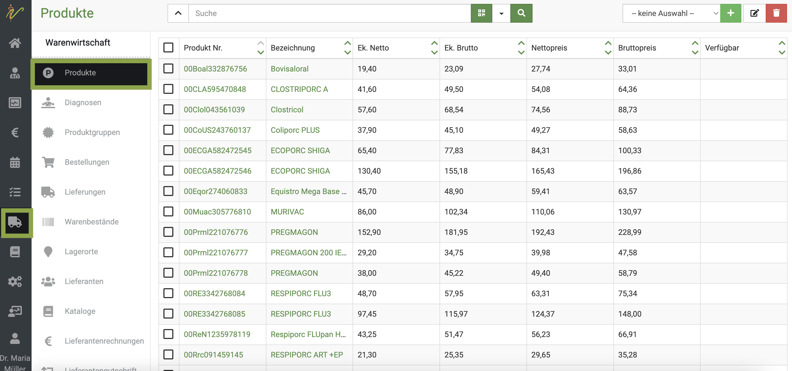

## Neue Produkte anlegen  

Falls Sie neben den aus den Katalogen importierten Produkten noch eigene Produkte haben, die Sie anlegen wollen, können Sie beliebig
viele eigene Produkte anlegen.  

Wählen Sie zunächst aus dem Dropdownmenü rechts oben aus, welche Produktart Sie hinzufügen möchten (Medikament, Dienstleistung 
oder Sonstiges). Klicken Sie nun auf das grüne 'Plussymbol', um auf die Seite zur Eingabe eines neuen Produktes zu gelangen.    

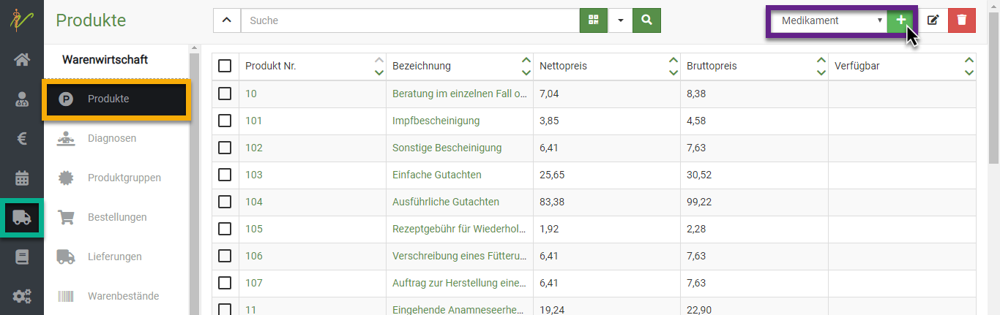   

Geben Sie in der Eingabeseite die gewünschten Informationen ein und speichern Sie das neue Produkt anschließend, 
in dem Sie oben rechts auf 'Speichern' klicken.   

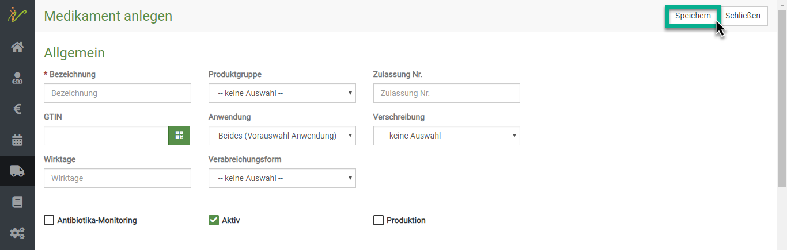   

:::caution Achtung  

Bevor Sie ein Produkt speichern können, müssen Sie ganz unten die Checkbox aktivieren, um damit die Richtigkeit der Preise 
zu bestätigen.  

:::  

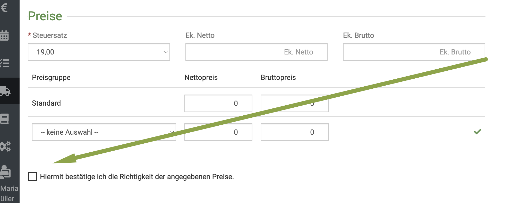  

### Preise der Produkte 

Wenn Sie die Barsoiliste oder Vitrapet nutzen, sind die Preise der Produkte damit bereits gesetzt.   

Sollten Sie jedoch eigene Produkte anlegen wollen oder so wenige Medikamente haben, dass sich die Nutzung der Barsoiliste nicht lohnt, können Sie auch selbst die Preise der Medikamente oder Dienstleistungen 
anlegen bzw. die Preise selbst eintragen. 

Dabei gibt es beim Anlegen von **Medikamenten** einen automatisch eingebauten Rechner, der Ihnen die Arbeit abnimmt, die korrekten Verkaufspreise mit Mindermengenzuschlag etc.
korrekt nach §3 der Arzneimittelverordnung  auszurechnen. 

Hier erklären wir zunächst die Bereiche der Preise, damit Sie diese verstehen können.

### **Packungsgröße**  (inneres und äußeres Behältnis) 

Da die Preise, wenn Sie diese manuell eingeben wollen, mit unserem automatischen Rechner anhand der Packungsgröße berechnet werden, muss diese zwingend 
korrekt hinterlegt werden. Ansonsten funktioniert die Berechnung der korrekten Abgabepreise nicht. 

Dabei unterscheidet debevet (NEU seit 2024!) zwischen innerem und äußeren Behältnis.

1. Inneres Behältnis meint die Packung an sich, also beispielsweise eine 5ml  Ampulle, eine 5mg Tube, eine 100ml Flasche, 60 Tabletten etc.
2. Äußeres Behältnis meint das Packungsgebinde. Dies kommt vor allem dann zum tragen, wenn gewisse Ware in 10er Gebinden, 5er Gebinden oder Ähnlichem
geliefert werden. (beispielsweise Ovogest, Cremes, Tuben, 1 Flasche mit 100ml Inhalt etc.) 

**Dabei wird die Abgabeeinheit am inneren Behältnis gesetzt!**

:::caution Bitte beachten: 

Aktuell (Stand April 2024) werden noch keine äußeren Behältnisse aus der Barsoi übernommen. Die Logik ist aktuell also nur bei Nutzung von
Vitrapet bzw. dem manuellen Anlegend der Produkte voll umfänglich verfügbar. 
Selbstverständlich kann die Logik auch auf ein Barsoi Produkt angewendet werden, hier muss nur ein bestehender Warenbestand zunächst
auf Null gesetzt werden, um Einheiten zu verändern.

:::

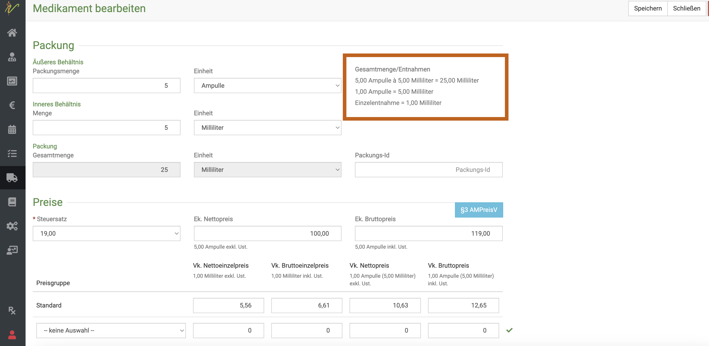

Zum besseren Verständnis wird Ihnen rechts im Feld immer angezeigt, wie bei der aktuellen Einstellung die Logik funktioniert. 
Hier im Beispielbild habe ich ein Beispiel wie Ovogest angelegt, bei dem eine Packung beim Bestellen als 5 Ampullen mit je 5ml geliefert wird.

Abgabeeinheit wären dann ml.
Bei Wareneingängen wird das Packungsgebinde dann mit berechnet. Bei einer Lieferung von Ovogest besteht eine Packung aus 5 Ampullen mit je 5ml, so dass
die Bestellung einer Packung automatisch einen Bestand von 25ml erfasst und als Warenbestand anlegt.
(Eine Packung = äußeres Behältnis mal inneres Behältnis).

Bei fehlenden Gebinden kann das äußere Behältnis auch weggelassen werden.

Üblich ist, dass die Abgabeeinheit auf dem inneren Behältnis basiert. Ein gängiges Beispiel wäre Buscopan, das äußere Behältnis ist 1 Flasche, das
innere Behältnis ist 100ml. So wird in ml Schritten abgegeben und der Preis berechnet.

### Preislogik inneres und äußeres Behältnis

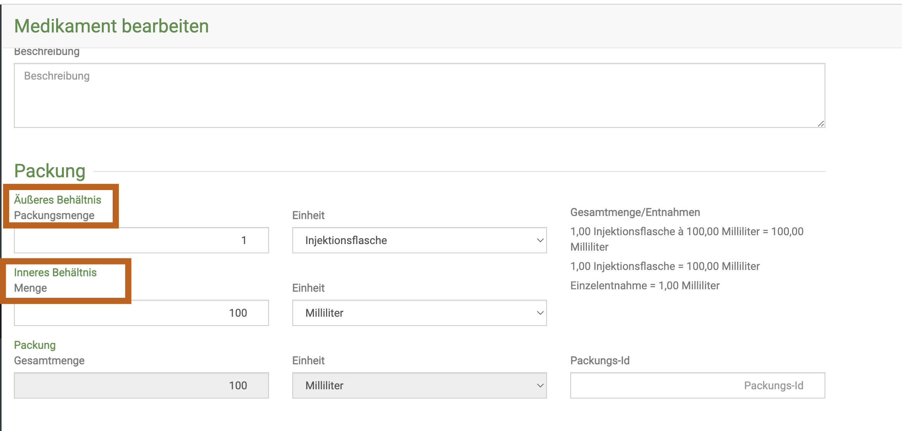

:::caution Achtung  

Die Packungsgröße und der Bereich der automatischen Preisberechnung fehlt bei der Anlage von "Dienstleistungen" und "Sonstiges".

:::    

Tragen Sie nach der Packungsgröße nun den Mehrwertsteuersatz mit dem Dropdownmenü ein und Ihren Einkaufspreis (netto) in das Feld **Ek Netto**.
Klicken Sie dann auf den blauen Button **§3 AMPreisV**.

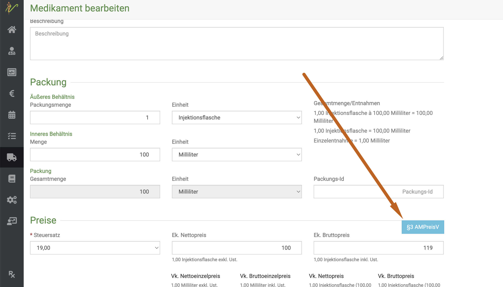

Ist das äußere Behältnis gleich 1, so werden die Mindermengenzuschläge nach §3AMV mit Klicken des blauen Buttons direkt so berechnet, dass
jede Abgabe diesen Zuschlag erhält, es sei denn, man gibt die gesamte Menge ab (Ein Beispiel wäre Buscopan, jeder ml kostet den Mindermengenaufschlag,
es sei denn, man würde die gesamten 100ml spritzen)

Die debevet Software berechnet den korrekten Preis nun automatisch. (Hier im Bild gut zu erkennen, da ich einen Beispielpreis von 100 Euro netto EK gesetzt habe).

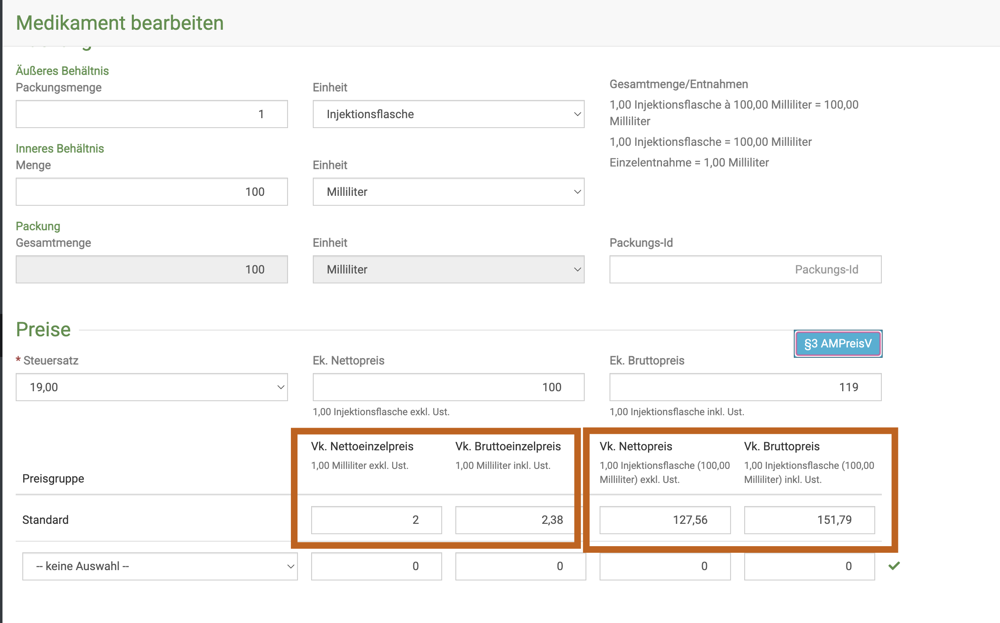

**Sobald das äußere Behältnis größer als 1 ist, gibt es in der Preislogik eine Besonderheit:**

Ist nun das äußere Behältnis wie in meinem Ovogest Beispiel 5 Ampullen mit dem inneren Behältnis von je 5ml, so gilt der "Volle Packung Preis"
(also ohne Mindermengenzuschlag) für die 5ml Ampulle. 

In diesem Bild ist dies gut zu sehen:

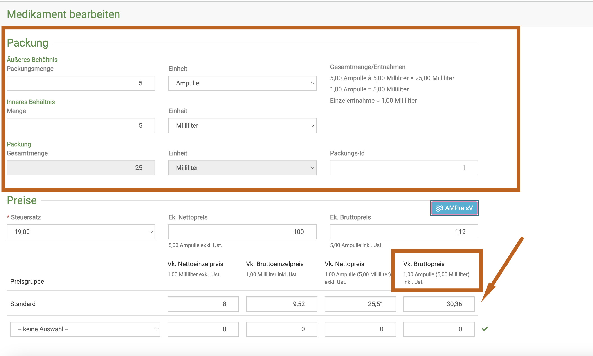

Wenn Sie aber dennoch einen Mindermengenaufschlag für eine Ampulle erreichen möchten, müssen Sie die Packung als "inneres Behältnis" mit 25ml 
anlegen. In dem Fall wird auf jeden Milliliter, bis zur Abgabe der vollen 25ml der Mindermengenaufschlag berechnet. 

In diesem Bild sehen Sie, wie sich die Preise verändern im Vergleich zum vorherigen Bild:  (der Milliliterpreis bleibt gleich, aber die 
Logik, wie viel eine ganze Packung ist, ändert sich!)

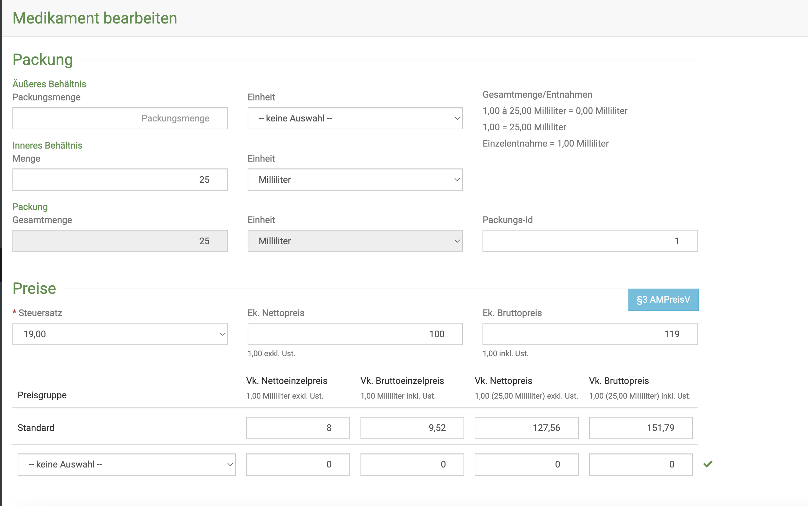

## Abgabepreis und Abgabeeinheit später/im Nachhinein ändern    

:::danger ACHTUNG!

Um im Nachhinein Einheiten (und damit auch evtl. Abgabepreise) an einem Produkt zu ändern, an dem bereits ein Warenbestand vorhanden ist, muss dieser zunächst auf Null 
korrigiert werden. Anschließend kann die Einheit geändert werden und ein neuer Warenbestand mit den neuen Einheiten angelegt werden. In der Inventurliste
wird dann der Verbrauch "getrennt" dargestellt.

:::  

### Inventurpflicht  

Eine praktische Funktion ist die Checkbox **Inventurpflichtig** bei Medikamenten. Wenn Sie dieses Feld aktivieren, wird bei
der Nutzung/Abrechnung bei der Behandlung (oder der Abgabe) eines Tieres mit diesem Medikament automatisch eine Chargennummer
gesetzt.   

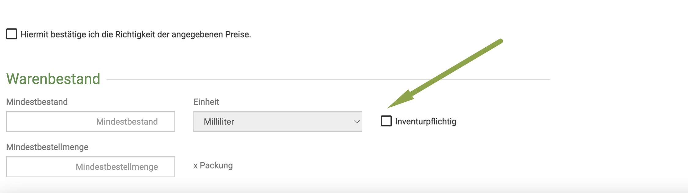

:::caution Achtung  

Wenn Sie mehrere angebrochene Packungen (z.B. in verschiedenen Räumen, oder in einem Notfallkoffer) nutzen, müssen Sie 
dennoch kontrollieren, dass Sie die richtige Charge nutzen und diese evtl. sonst manuell ändern.  Sobald verschiedene Chargen aktiv gebucht
sind, wird KEINE automatisch gesetzt!

:::   

### Mindestbestand nutzen  

Um einen schnelleren Überblick zu haben, welche Medikamente nach bestellt werden sollten, können Sie für die Medikamente (oder Futter) 
auch Mindestbestände ganz unten am Produkt hinterlegen. Wenn Sie in Ihrer Dashboard-Ansicht den Haken gesetzt haben, wird Ihnen
immer direkt angezeigt, welche Medikamente bestellt werden müssen.   

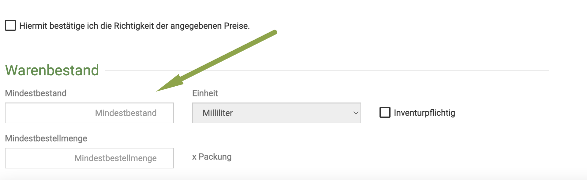  

### Wartezeiten  

Damit Ihre AUA Belege sauber ausgefüllt sind, müssen bei lebensmittelliefernden Tieren die Wartezeiten korrekt hinterlegt sein.   

Klicken Sie am Produkt den Reiter **Wartezeiten**, um diese dann individuell nach Tierart setzen oder ändern zu können. 
Denken Sie daran, nach der Eingabe erst den **grünen Haken** zu klicken und anschließend oben rechts auf **Speichern** zu klicken.

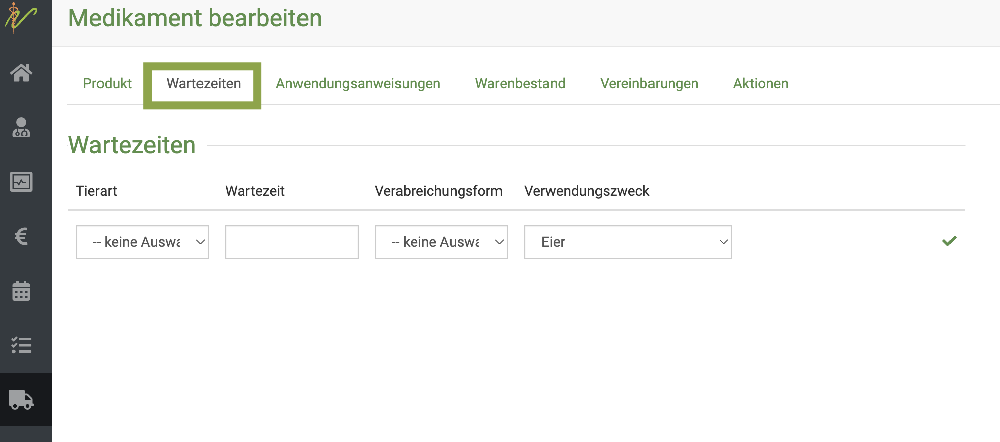  

:::danger  ACHTUNG  

Die Wartezeiten werden in einigen Versionen der Barsoi Liste überliefert, aber oftmals fehlen die Verabreichungsformen und oder Tierarten.
Wenn diese Daten fehlen, hat Barsoi diese nicht überliefert. Tragen Sie diese bitte manuell ein und/oder wenden sich direkt an Barsoi.

:::

### Anwendungsanweisungen

Für Medikamente, die Sie abgeben, sind Sie verpflichtet, die Anwendungshinweise mit auf den AUA Beleg zu schreiben. Damit dieser
im debevet dann automatisch korrekt ausgefüllt ist, können und müssen Sie die Anwendungshinweise am Medikament hinterlegen.  
Klicken Sie hierzu den Reiter **Anwendungsanweisungen** und hinterlegen dort die entsprechenden Daten.  
Dabei müssen folgende Felder gesetzt werden:  

* **Bezeichnung** Titel der Anweisungsanwendung z.B. Abgabe Mastitis 3 Tage 
* **Tierart**  
* **Menge** Menge pro Tier und Anwendung
* **Anzahl d.**  Anzahl der Anwendungen gesamt
* **Intervall** Alle wieviel Stunden muss das Medikament gegeben werden? (bei einmal tägl. z.B. 24 setzen)
* **Verabreichungsform** hier wählen Sie via Dropdown, wie das Medikament zu verabreichen ist
* **Beginn**  Beginn in x Tagen (Also ab wann die Gabe beginnt)

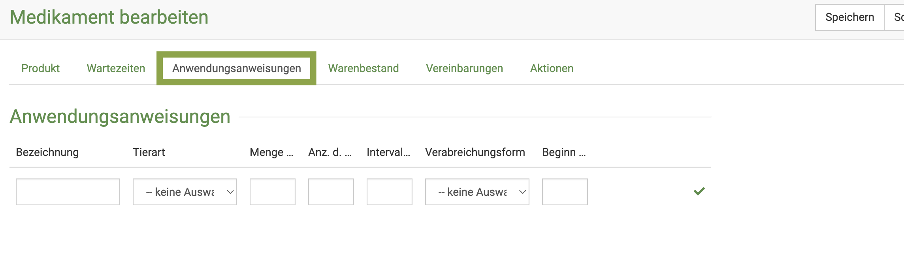  

### Wirkstoffe   

Falls Sie die Barsoi plus nutzen oder Vitrapet, werden die Wirkstoffe an den Produkten automatisch hinterlegt und auf Verschreibungen
auch dargestellt.  
Sollten sie diese nicht nutzen, müssen Sie die Wirkstoffe manuell an den von Ihnen genutzten Produkten hinterlegen. Öffnen Sie zunächst  
die Liste der Wirkstoffe und klicken Sie dann oben rechts das grüne Plussymbol, um einen neuen Wirkstoff hinzuzufügen.   

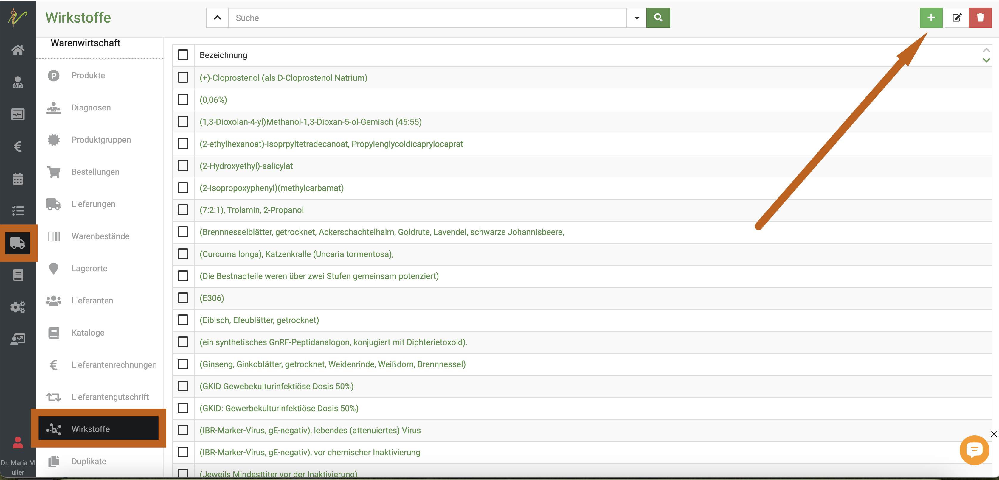   

Geben Sie den neuen Wirkstoff nun ein und klicken "Speichern". (oben rechts)

Öffnen Sie  nun das gewünschte Produkt aus der Produktliste. Klicken sie nun den Reiter "Wirkstoffe".   

   

Wenn sie in das Feld unten nun den Wirkstoffnamen beginnen einzutippen, schlägt das Programm direkt den Treffer vor.  
Dann können Sie die Konzentration und EInheit hinzufügen und speichern.  

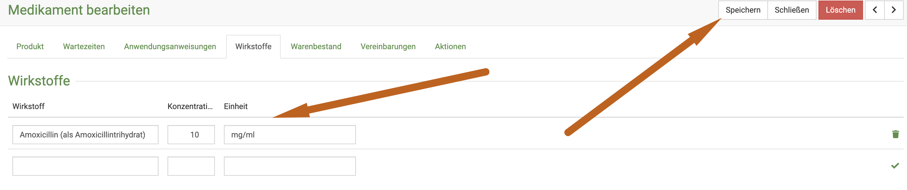

### Verbot für lebensmittelliefernd  

Medikamente, die nicht für lebensmittelliefernde Tiere eingesetzt werden dürfen, müssen hier via Checkbox aktiviert werden, bzw.
sind dies bereits durch die Überlieferung aus der Barsoi Liste.  

:::danger ACHTUNG  

Wenn dieser Haken gesetzt ist, kann dieses Medikament bei einem Tier, welches als lebensmittelliefernd markiert ist, NICHT
angewandt werden. Das bedeutet, dass bei dem Versuch, dieses in der Behandlung einzutragen, dieses NICHT eingetragen wird. Es kann 
also dort "nicht abgerechnet" werden. Das Programm verweigert automatisch die Behandlung damit.

:::  

### Umwidmungen Humanmedikamente  

Aufgrund der Vorgaben für die Umwidmung von Humanarznei stellen wir hier einige Tipps für Sie zusammen, wie diese am besten in der Praxis
umgesetzt werden können. Bitte sprechen Sie mit Ihrer Kontrollinstanz, welche Umsetzungen von dieser gewünscht wird, da dies sehr stark 
voneinander abweichen kann.  

**1. Humanarznei rezeptieren** 

Für die Erstellung von Rezepten, die umgewidmet werden, empfiehlt es sich, eine Vorlage eines Briefes zu nutzen. 
Gehen Sie hierzu auf den Sektor **Administration** und dann **Textbausteine**.   

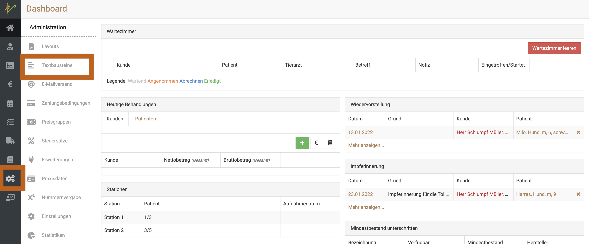  

Wählen Sie dort die Sektion **Vorlagen**  

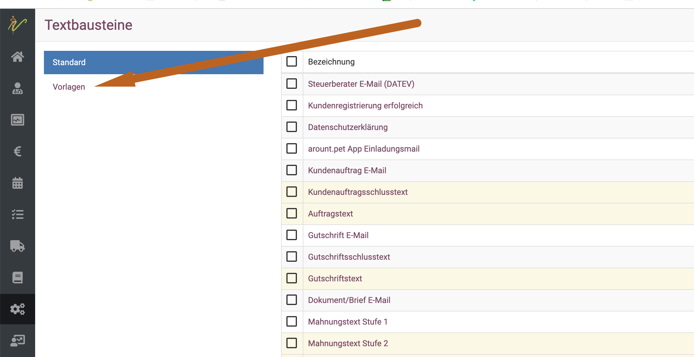   

Dort wählen Sie oben rechts aus der Dropdown Liste nun "Brief" und klicken dann das grüne **Plus-Symbol**.  

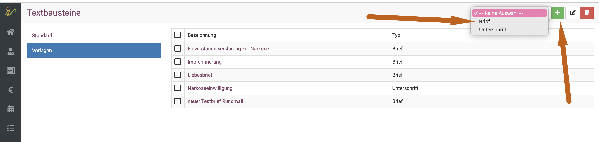  

Geben Sie nun einen Vorauswahl Text mit den hier gezeigten Variablen ein. Vergessen Sie nicht, die Vorlage nun zu speichern!

Dieser Beispieltext wird empfohlen: 

1 OP

Für den Hund "{PATIENT_CALLNAME}" der Familie  {CUSTOMER_LASTNAME}.

Dosierung:  2-3 x tgl.    eingeben.

Hinweis: Das Medikament wurde im Einklang des TAMG in Kombination mit den Anforderungen der (EU)2019/6, Artikel 112, 113 und 114 umgewidmet.

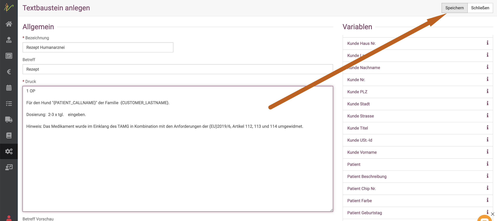  

:::caution: Achtung!   

Wenn Sie am Patienten diesen "Brief" nun erstellen, müssen Sie das Medikament, die Packungsgröße und die Dosierung noch ändern/
eingeben. Dann haben Sie ein gesetzlich konformes Rezept mit wenig Aufwand erstellt.  

:::  

Um dieses Rezept für einen Patienten zu nutzen, gehen Sie wie folgt vor:  

Klicken Sie in der Patientenkartei auf das **Briefsymbol**.   

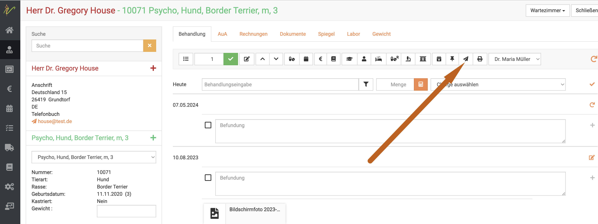

Wählen Sie nun die Vorlage "Rezept Humanarznei", die Sie vorab erstellt haben.  

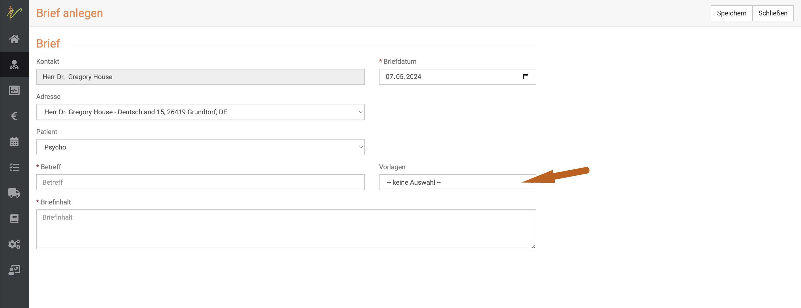   

Ändern Sie nun den Text im Textfeld mit den fehlenden Angaben für den Patienten (Medikamentenname, Packungsgröße, Darreichungsform,
Dosierung, Verabreichung)  

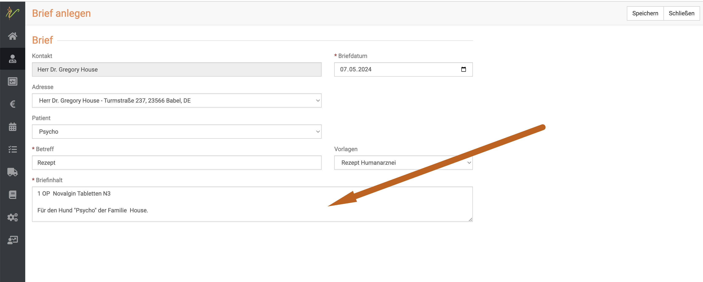  

Speichern Sie den Brief.  

Nun können Sie mit einem Klick auf das Druckersymbol das Rezept drucken und unterschreiben.   

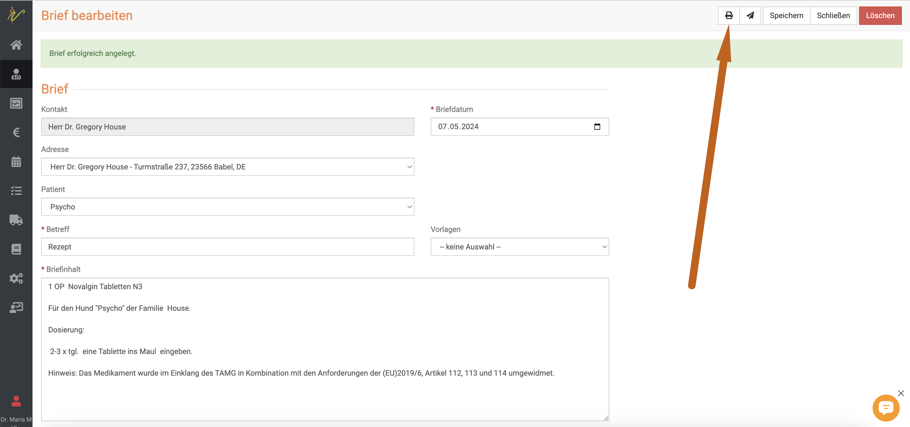  

:::tip Tip: 

Wenn Sie unter den Layouts an den Briefen Ihr Logo hinterlegt haben, wird dieses mit auf das Rezept gedruckt. Datum und Ihre Praxisdaten werden
immer mit abgebildet.  

:::  

**2. Humanarznei abgeben**  

Wenn Sie Humanmedikamente lagern und verkaufen, müssen Sie mindestens am Produkt den Satz in die Beschreibung am Produkt ergänzen: 

**Hinweis: Das Medikament wurde im Einklang des TAMG in Kombination mit den Anforderungen der (EU)2019/6, Artikel 112, 113 und 114 umgewidmet.**

Vielen Kontrollinstanzen reicht dies. 

Falls Sie bei jeder dieser Abgaben einen Eintrag in die Kartei benötigen, empfehlen wir, hierfür eine Vorlage anzulegen, die Sie "Abgabe Humanmedikament" nennen. 

Legen Sie an diese Vorlage den Text in den Befund. Speichern Sie die Vorlage ohne Produkte und ohne Klassifizierung.  

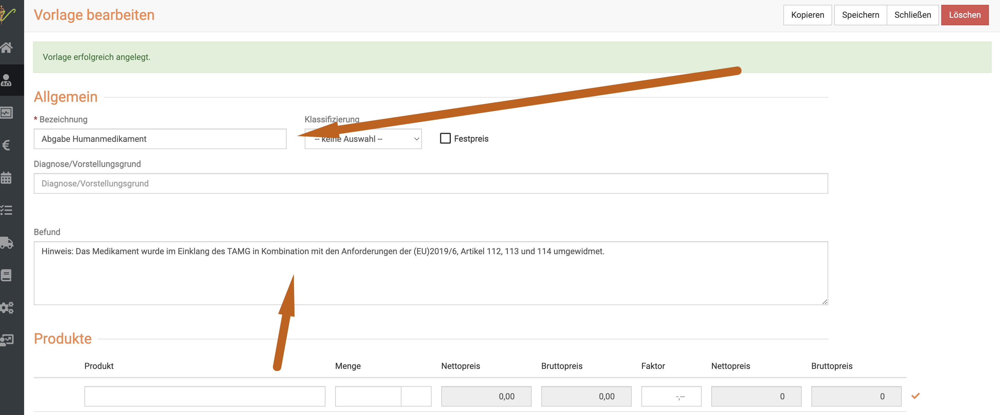  

Wenn Sie diese nun anwenden, erscheint der Text ohne weiteres Tippen in der Kartei und kann vom Kunden nicht eingesehen werden und
wird auch nicht berechnet oder erscheint auf der Rechnung. 

Sollte Ihre Kontrollinstanz parallel immer ein "Begleitschreiben" für den Patienten mit diesem Text wünschen, empfehlen wir hierfür einen weiteren Brief 
ähnlich des Rezeptes zu entwerfen und zu nutzen.  

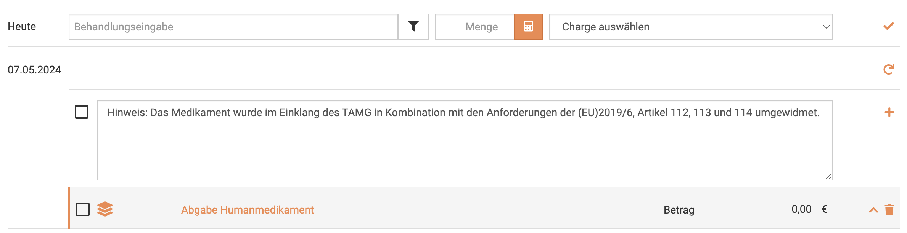  

:::tip Tip:  

Natürlich können Sie auch eine einzelne Vorlage und ein einzelnes Rezept für jedes genutzte Medikament einzeln anlegen. Ich 
persönlich finde es so ausreichend und ergänze bei Bedarf die Daten.   

:::  

## Barcode Scanner nutzen  

Um Ihre Produkte (betrifft vor allem die Medikamente) schneller und leichter verwalten zu können, können Sie den Barcode scannen. Leider muss 
an jedem Medikament der Barcode einmalig eingelesen und hinterlegt werden, um dann bei eingehenen Lieferungen einfach scannen zu können.
Das ist zwar *erstmalig* etwas Arbeit, erleichtert aber Ihren Mitarbeitern bei ankommenden Lieferungen die Zeit, die es braucht, um die 
Lieferung einzugeben extrem.  

Drücken Sie hierzu das grüne Symbol neben dem GTIN (EAN) Eingabefeld am Produkt und scannen Sie anschließend den Barcode. 

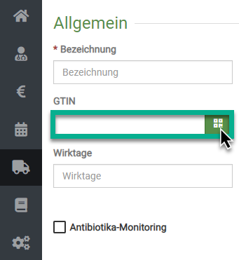   

Nun können Sie bei kommenden Lieferungen dieses Medikaments dieses einfach nur noch scannen, statt alle Daten bei der Lieferung 
manuell einzutragen.  

Hier ein Bild des zu scannenden Codes:  

  

:::info Videotip:

Zum Einscannen haben wir ein kleines Hilfevideo erstellt:

<iframe width="560" height="315" src="https://www.youtube.com/embed/Z699k1Q_1fU" title="YouTube video player"
frameborder="0" allow="accelerometer; autoplay; clipboard-write; encrypted-media; gyroscope; picture-in-picture" allowfullscreen></iframe>

:::

## Produkte suchen und finden   

In der Übersichtsliste Ihrer Produkte können Sie nach Produkten suchen.

Tippen Sie in das Suchfenster wie bei einer Suchmaschine Begriffe ein, die auf das gewünschte Produkt passen und drücken
Sie die **Entertaste** oder klicken Sie auf das **Lupensymbol.**.

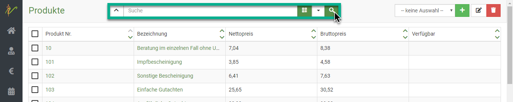  

### Suche filtern

Wenn Sie neben dem Eingabefeld für die Schnellsuche oben auf den Pfeil nach unten klicken, können Sie auch nach gezielten 
Parametern bzw. weiteren Suchbegriffen **filtern**.  

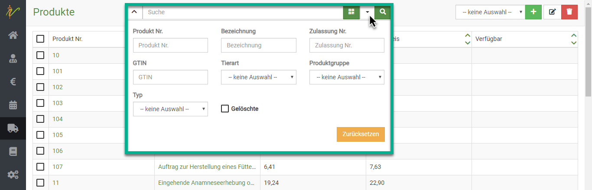  

### Suchenfilter zurücksetzen  

Wenn Sie eine Suche ausgeführt haben, ist die Produktliste gefiltert, was dadurch angezeigt wird, dass der Pfeil nach unten 
neben den der Schnellsuche *gelb* ist. Klicken Sie auf den Pfeil nach unten und dann auf Zurücksetzen, um die Produktliste
wieder ungefiltert angezeigt zu bekommen.   

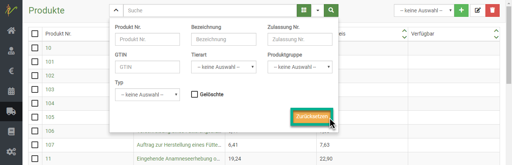  

## Produkte bearbeiten und weitere Details  

Klicken Sie in der Liste Ihrer Produkte auf den Link in der Spalte **Produkt Nr.** oder **Bezeichnung**, um auf die 
Bearbeitungsseite des Produktes zu gelangen.   

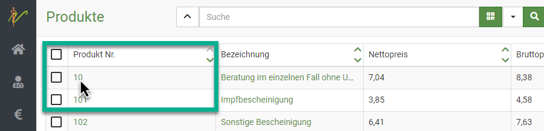   

## Mehrere Produkte bearbeiten oder löschen  

Um mehrere Produkte zu bearbeiten oder zu löschen, wählen Sie die **Checkboxen** der gewünschten Produkte an und drücken
danach oben rechts auf das jeweilige Symbol:

* **Stiftsymbol**, wenn Sie die Produkte bearbeiten wollen  
* **Mülltonnensymbol**, wenn Sie die Produkte löschen möchten  

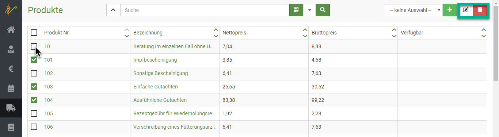   

## Produkte mit Aktionen verknüpfen  

Sie können Produkten bestimmte Aktionen zuweisen. So können Sie z.B. zu einem Impfstoff als Aktion eine Impferinnerung 
hinzufügen, um automatisch nach jedem Verwenden dieses Impfstoffes eine Impferinnerung für den behandelten Patienten in
x Tagen hinzuzufügen.    

Klicken Sie hierfür am gewünschten Produkt den Reiter **Aktionen**.  

   

:::tip Tipp   

Nutzer der App aroundpet bekommen nicht nur einfach eine Email, sondern werden über Erinnerungen dieser Form direkt via
push-Nachricht auf Ihrem Handy benachrichtigt.  

:::  

 
