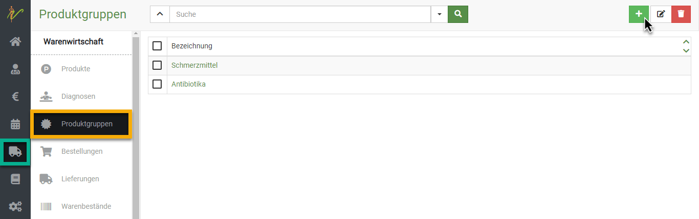
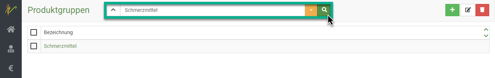
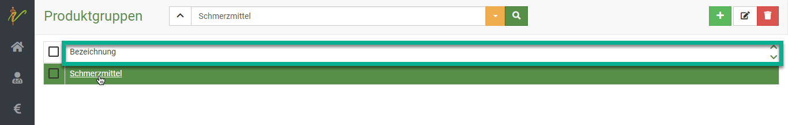
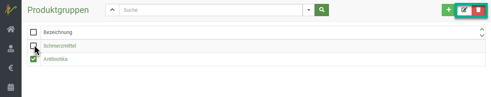
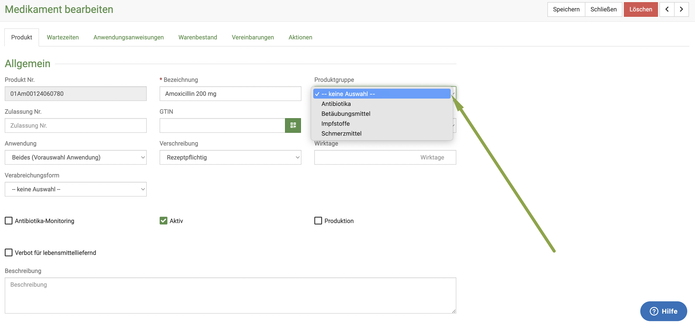
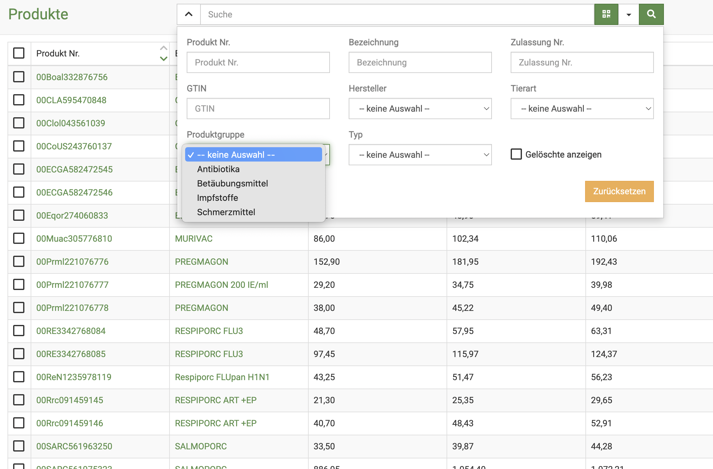

# Produktgruppen  

Produktgruppen bieten Ihnen die Möglichkeit, die verschiedenen Produkte noch übersichtlicher zu sortieren und darzustellen.  
Sie können z.B. Medikamente einteilen in Gruppen oder eine Gruppe für häufige Dienstleistungen anlegen.  

## Neue Produktgruppe anlegen

Klicken Sie im Hauptmenü auf **Warenwirtschaft** und wählen Sie den Untermenüpunkt **Produktgruppen**. S
ie sehen die ungefilterte Liste Ihrer Produktgruppen. Klicken Sie nun auf das **grüne Plussymbol**, um auf die Seite zur
Eingabe einer neuen Produktgruppe zu gelangen.

Geben Sie auf der Bearbeitungsseite den Namen der Produktgruppe an und drücken anschließend oben rechts auf **Speichern**.  

  

## Produktgruppen suchen  

Klicken Sie auf **Warenwirtschaft** und dann auf **Produktgruppen**. Das System listet alle Produktgruppen auf. 
Tippen Sie in das Suchfenster wie bei einer Suchmaschine Begriffe ein, die auf die gewünschte Produktgruppe passen 
und drücken Sie die **Entertaste** oder klicken Sie auf das **Lupen-Symbol**.  

  

## Produktgruppen bearbeiten/löschen

Um Produktgruppen zu bearbeiten, drücken Sie auf die Schrift der gewünschten Gruppe in der Spalte Bezeichnung. Sie gelangen 
auf die Bearbeitungsseite der Produktgruppe.  

  

Um mehrere Produktgruppen zu bearbeiten, wählen Sie zunächst die jeweiligen **Checkboxen** in der Liste an. 
Drücken Sie nun das **Stiftsymbol**  oben rechts, um die ausgewählten Produktgruppen zu bearbeiten.

Nutzen Sie die Pfeile < und >, um beim Bearbeiten zwischen den einzelnen Produktgruppen zu wechseln.

Um sie zu löschen, drücken Sie das **Mülltonnen-Symbol**.  

  

## Produkte einer Produktgruppe zuweisen  

Um nun ein bestimmtes Produkt in eine der Produktgruppen einzuordnen, öffnen Sie Ihre Produktliste. Klicken Sie **Warenwirtschaft** und 
dann **Produkte**.   

Wählen Sie das Produkt, indem Sie auf seinen Namen klicken. Nun können Sie den **Dropdown-Pfeil** bei **Produktgruppe** klicken
und sehen die Auflistung Ihrer Produktgruppen. Wählen Sie die gewünschte Gruppe und klicken dann **Speichern**.  

  

## Produkte nach Produktgruppe filtern  

Der Vorteil, den Sie nun haben, ist, dass Sie sich Ihre Produktliste klarer darstellen lassen können. Wenn Sie z.B. nur 
Antibiotika angezeigt haben wollen, können Sie über das Suchenfeld die Liste nun filtern.  

Klicken Sie **Warenwirtschaft** und dann **Produkte**. Nun klicken Sie den **Dropdown-Pfeil** neben dem Suchenfeld.  
Wählen Sie dann bei **Produktgruppe** die gewünschte Gruppe aus und bestätigen durch drücken der **Entertaste* oder Klick auf 
das **Lupen-Symbol**.   

  

Nun sehen Sie die Liste gefiltert, natürlich können hier aber immer nur die Produkte angezeigt werden, denen Sie zuvor auch die 
Gruppe zugewiesen haben! 

:::tip Tipp  

Wie immer sehen sie daran, dass der Pfeil *gelb* ist, dass die Suche gefiltert ist. Setzten Sie den Suchenfilter wie gewohnt zurück,
um wieder alle Einträge zu sehen.   

:::  

