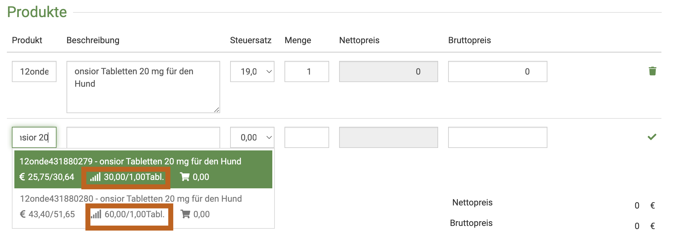

# Bestellungen  

:::tip Tipp  

Sie müssen natürlich nicht immer Bestellungen, Lieferungen und Wareneingang einzeln eingeben! Eine Bestellung kann sehr einfach
in eine Lieferung überführt werden. Aus der Lieferung können Sie dann direkt den Warenbestand buchen. So bleibt die Kette immer perfekt
nachvollziehbar!  

Alle Mitarbeiter können immer direkt den aktuellen Status nachvollziehen!  

:::  

Klicken Sie unter **Warenwirtschaft** das Untermenü **Bestellungen**. Falls Sie bereits Bestellungen angelegt hatten, werden 
diese nun aufgelistet.  
Um eine Bestellung einzusehen oder zu bearbeiten, klicken Sie unter Nummer in die gewünschte Bestellung.

  

## Neue Bestellung anlegen  

Klicken Sie in der Übersicht der Bestellungen oben rechts auf das **grüne Plus-Symbol**. Nun gelangen Sie zur Eingabeseite.  

Wenn Sie im Feld **Lieferant** beginnen zu tippen, schlägt debevet Ihnen automatisch passende Lieferanten aus Ihrer Liste vor. Wählen 
Sie den gewünschten Lieferanten aus.  

  

Geben Sie eine Bestellnummer ein- diese ist Pflicht (wir empfehlen aus Gründen der Übersichtlichkeit, auch die reelle Bestellnummer zu nutzen).  

Wenn Sie nun unten im Feld **Produkt** den Namen des bestellten Produktes eingeben,  wird Ihnen wieder alles passende vorgeschlagen und 
Sie können wählen. Im Feld **Menge** geben Sie die bestellten Packungen an. Achten sie dabei auf die Packungsgrößen!
Ergänzen Sie außerdem noch den Bruttopreis, zu dem Sie es bestellt haben.   

Wenn Sie aus der Liste der vorgeschlagenen Produkte eines anklicken, ist dieses direkt in die Liste übernommen. 

Klicken Sie nach Eingabe aller bestellten Produkte oben rechts auf **Speichern**.

  

## Bestellung in Lieferung überführen 

Nun kann die Bestellung ganz einfach in eine Lieferung überführt werden, sobald die Lieferung eingetroffen ist. 

Öffnen Sie die Bestellung, indem Sie in der Bestellungs-Liste auf die Nummer der Bestellung klicken.  

Klicken Sie nun oben rechts auf **Erweitert**.  

  

Sie haben nun folgende Optionen:  

* Lieferantenrechnung hinterlegen (um das direkt zu erledigen)
* Lieferung anlegen (um diese Bestellung in eine Lieferung zu überführen)
* Kopieren (wenn Sie eine gleiche oder sehr ähnliche Bestellung wieder tätigen, spart das viel Zeit, die Posten können ja verändert werden)  

Wenn Sie nun **Lieferung anlegen** klicken, wird die Bestellung direkt in eine Lieferung überführt.   

   

Sie bekommen hier direkt eine grüne Erfolgsmeldung.  

