# Lieferungen    

:::warning Achtung

Wir empfehlen aus Zeitersparnis-Gründen, jeden Wareneingang direkt als Warenbestand anzulegen. Es gibt keinen Grund, den "alten"
Weg zu gehen, indem noch die Bestellung die Lieferung genutzt wird. Die Funktion ist ein Überbleibsel aus Zeiten, in denen die nachvollziehbarkeit
aller Bestellungen noch nicht so gut digitalisiert war.

:::

Wußten Sie, dass Sie kinderleicht jede Bestellung in eine Lieferung überführen können und daraus direkt einen Warenbestand 
erzeugen können?  

Natürlich ist es aber auch machbar, diese Kette am Punkt der Lieferung zu beginnen. 

## Neue Lieferung anlegen 

Hierzu klicken Sie im Hauptmenü auf **Warenwirtschaft** und wählen den Untermenüpunkt **Lieferungen**.
Sie sehen die ungefilterte Liste Ihrer Lieferungen (falls es schon welche gibt). Klicken Sie nun auf das grüne **Plussymbol**,
um auf die Seite zur Eingabe einer neuen Lieferung zu gelangen.  

:::caution Achtung:  

Tragen Sie bitte unbedingt oben die korrekt Lieferschein Nummer ein! Tragen Sie nichts ein, wird bei einem Überführen der Bestellung
in eine Lieferung die Bestellnummer übernommen. Bei Teillieferungen kann dies zu Problemen im System führen.    

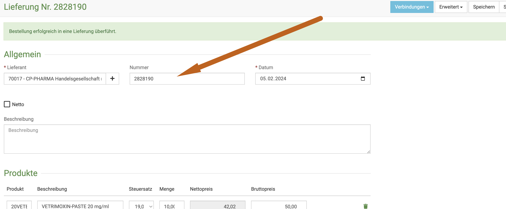  

:::

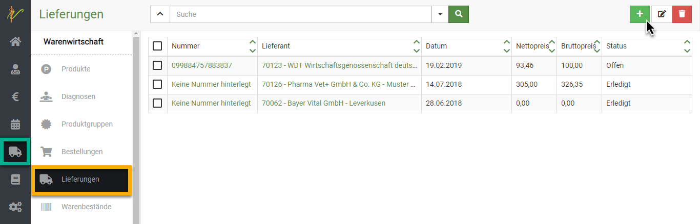  

Bei überführten Lieferungen (aus der Bestellung heraus) sind alle bestellten Produkte nun automatisch bereits eingetragen. Beim 
manuellen Anlegen verfahren Sie wie hier erklärt.

Wenn Sie im Feld **Lieferant** beginnen zu tippen, schlägt debevet Ihnen automatisch passende Lieferanten aus Ihrer Liste vor. Wählen
Sie den gewünschten Lieferanten aus.  

Wenn Sie nun unten im Feld **Produkt** den Namen des gelieferten Produktes eingeben, wird Ihnen wieder alles passende vorgeschlagen und
Sie können wählen. Im Feld **Menge** geben Sie die bestellten Packungen an. Achten Sie dabei bitte auf die Packungsgrößen!
Ergänzen Sie außerdem noch den Bruttopreis, zu dem Sie es bestellt haben.  

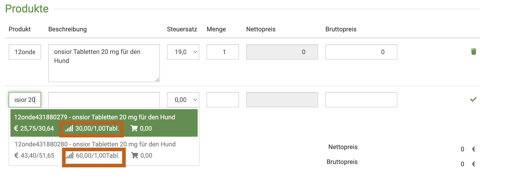  

Wenn Sie aus der Liste der vorgeschlagenen Produkte eines anklicken, ist dieses direkt in die Liste übernommen.

Klicken Sie nach Eingabe aller bestellten Produkte oben rechts auf **Speichern**.  

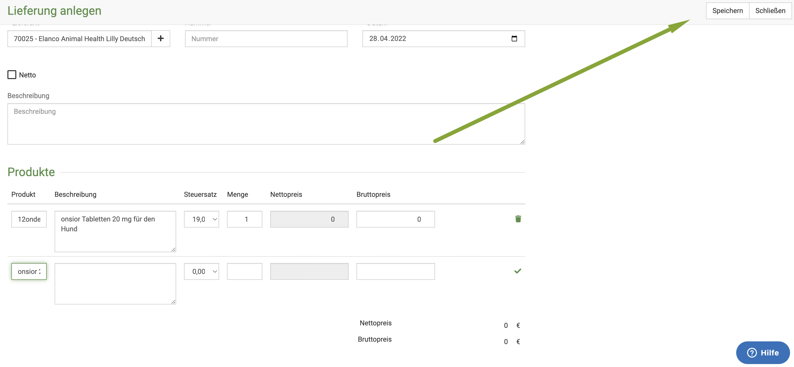  

## Teillieferung anlegen  

Falls Sie die Lieferung aus einer Bestellung generiert haben, kann es nötig sein, Teil-Lieferungen zu erzeugen, falls 
der Lieferant nur einen Teil der Ware liefert.  

Um die **nicht gelieferten** Positionen zu entfernen, klicken Sie auf das Mülleimer Symbol rechts in der Zeile des fehlenden Produktes.
Wurden z.B. von 10 nur 5 Packungen geliefert, ändern Sie die Anzahl bei "Menge" entsprechend. Klicken Sie nun zunächst **zwingend** oben rechts "Speichern".

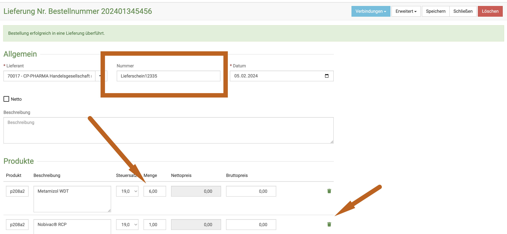  

Sie sehen nun nur noch die korrekt gelieferte Menge in der Liste (in meinem Beispiel fehlt hier nun der RCP Impfstoff).
Wenn Sie nun oben rechts auf "Erweitert" klicken, können Sie den Warenbestand anlegen.

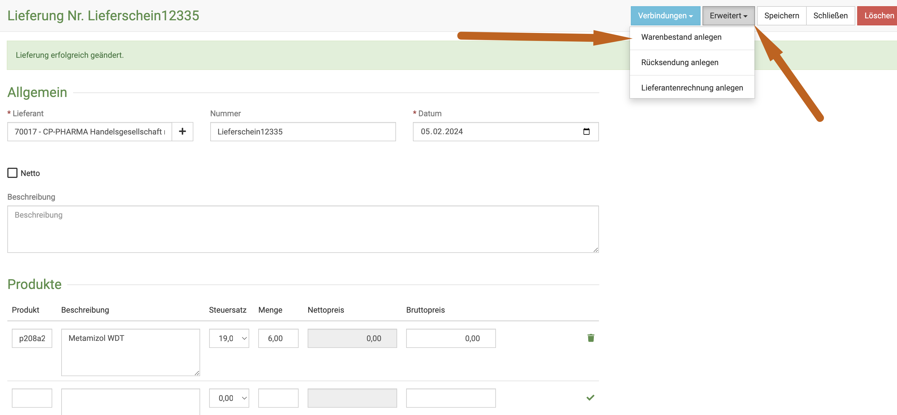

Geben Sie Chargennummer und Ablaufdatum ein und buchen den Warenbestand aktiv.  

Wenn Sie nun erneut in die Bestell-Übersicht gehen, sehen Sie, dass diese Bestelliung den Status "Teilgeliefert" hat.  

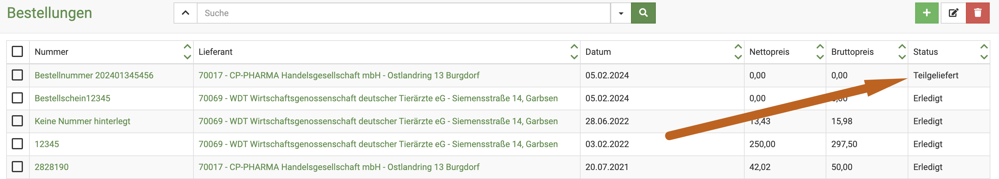  

Klicken Sie erneut auf die Bestellnummer, sehen Sie unten zwei Reiter, einmal "offen" und "geliefert". Die Voransicht 
zeigt Ihnen direkt den noch offenen Posten aus der Bestellung, damit dieser einfacher über den oben beschriebenen Weg als Lieferung
angelegt werden kann.  

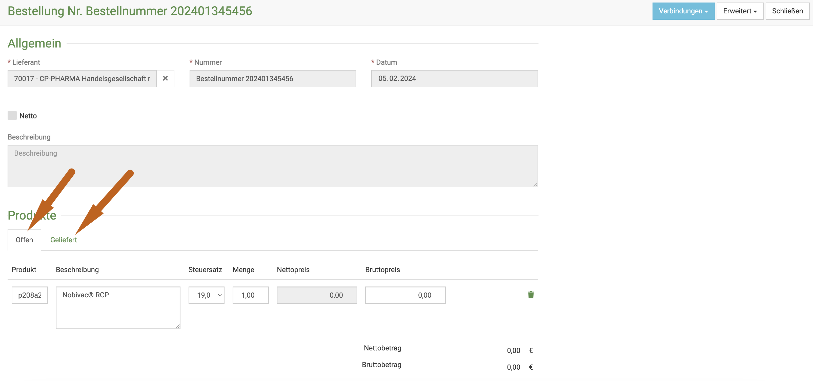

Erst, wenn alle Produkte in eine Lieferung überführt wurden, erhält diese Bestellung den Status "erledigt".

## Lieferungen suchen  

Klicken Sie auf **Warenwirtschaft** und dann auf Lieferungen. Das System listet alle Lieferungen auf. Tippen Sie in das
Suchfenster wie bei einer Suchmaschine Begriffe ein, die auf die gewünschte Lieferung passen und drücken Sie die Entertaste oder klicken Sie auf das Lupensymbol.

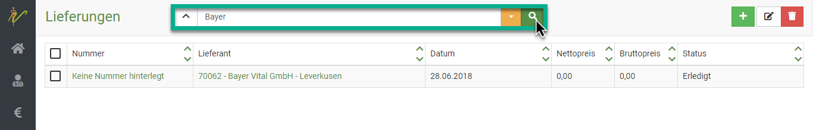  

Natürlich können Sie wie auf allen debevet Unterseiten auch hier Suchenfilter anlegen und damit nur bestimmte Details suchen.  

## Lieferungen bearbeiten und löschen  

Klicken Sie auf **Warenwirtschaft** und auf **Lieferungen**. 
Klicken Sie in der Liste Ihrer Lieferungen auf die Schrift/Nummer in der Spalte **Nummer**, um auf die Bearbeitungsseite der Lieferung zu gelangen.   

Um mehrere Lieferungen zu bearbeiten oder zu löschen, wählen Sie die **Checkboxen** der gewünschten Lieferungen an und 
drücken danach oben rechts auf das jeweilige Symbol:

Drücken Sie das **Stift-Symbol**, wenn Sie die Lieferungen bearbeiten wollen oder das **Mülltonnen-Symbol**, wenn Sie die Lieferungen löschen möchten. 

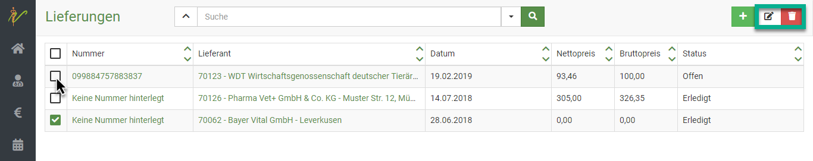  

## Lieferung und deren Verbindungen

Sie können sich sowohl bei den Bestellungen als auch bei den Lieferungen immer anzeigen lassen, mit welcher jeweiligen Bestellung 
bzw. Lieferung diese verbunden sind, also beispielsweise zu welcher Bestellung eine Lieferung gehört. Außerdem können Sie, wenn Sie
die Lieferantenrechnung hinterlegt haben, diese auch dort einsehen. 

Rufen Sie dazu wie bei der Suche beschrieben die Lieferung auf.

Klicken Sie dazu den **blauen Button Verbindungen** oben rechts und wählen dann den gewpünschten Punkt.  

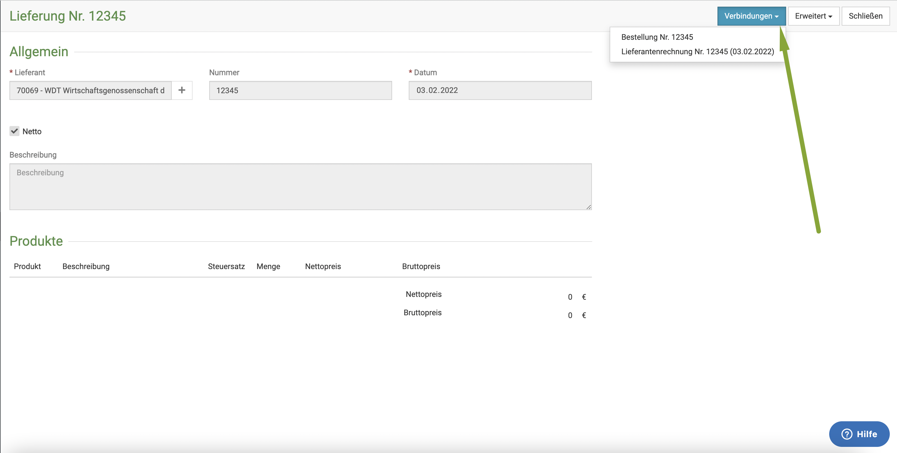  

## Lieferantenrechnung hinterlegen  

Die zugehörige Lieferantenrechnung kann hier direkt hinterlegt werden, wenn Sie dies möchten. Klicken Sie dazu auf 
**Erweitert** in der Detailansicht der Lieferung. Dort wählen Sie nun **Lieferantenrechnung anlegen**.  

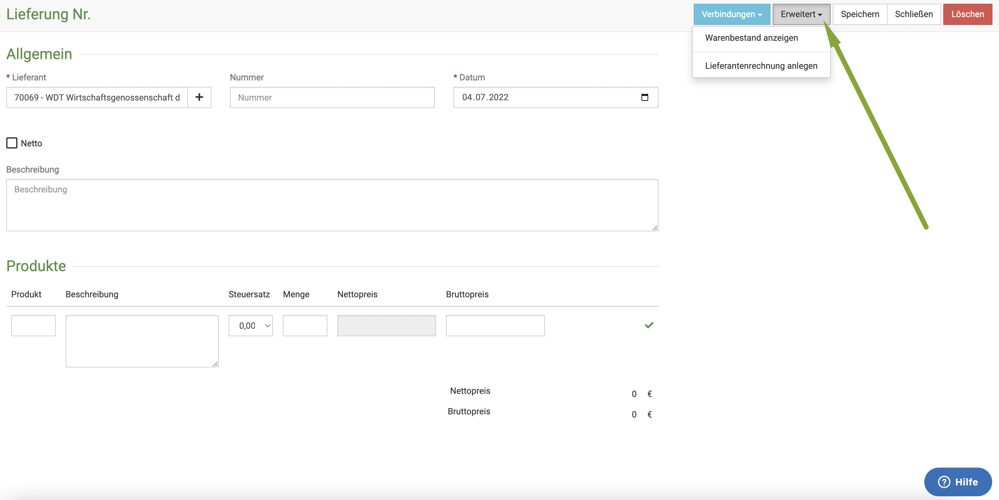 

Klicken Sie in der sich nun öffenenden Seite auf das **Wolken-Symbol** und laden dann die Datei vom Ablageort hoch. 
Sie können noch weitere Informationen eingeben, wenn Sie dies wünschen.
Klicken Sie anschließend auf **Speichern**.  

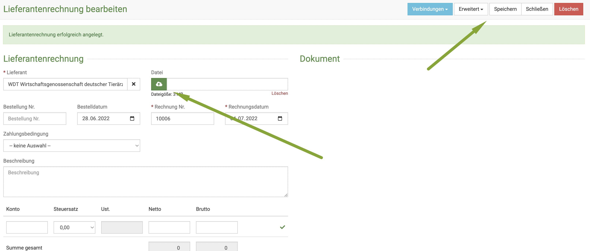     

:::caution Achtung!   

Bitte achten Sie darauf, dass Sie das jeweils korrekte Buchhaltungskonto wählen, wenn Sie 7% und 19% Lieferungen "mischen".   

:::   

## Lieferung in Warenbestand überführen

Wie bereits erwähnt kann die Lieferung nun sehr einfach in den Warenbestand übernommen werden und als Warenbestand angelegt werden.  

Sobald die Lieferung eingegangen ist, können Sie in der Detailansicht der Lieferung oben rechts auf **Erweitert** klicken und dann
**Warenbestand anlegen**. 

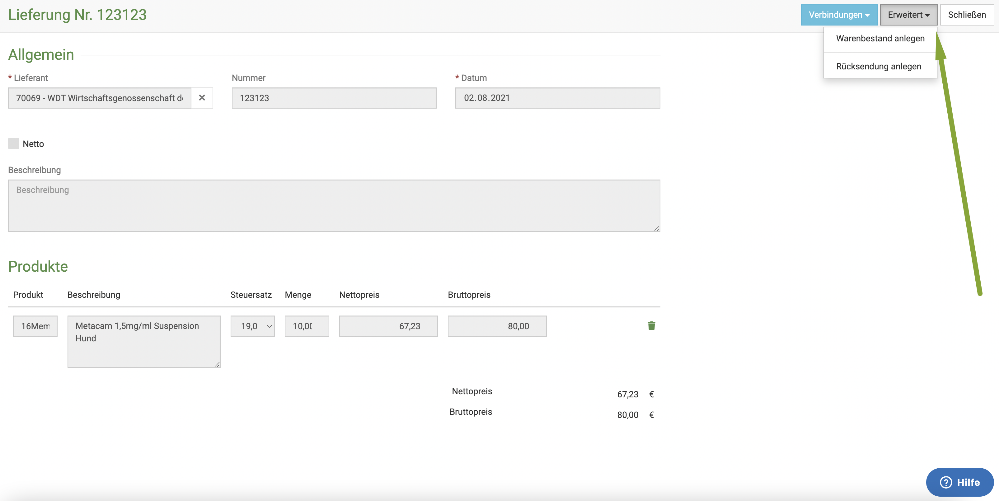  

:::caution Achtung  

Natürlich kann das Programm nicht wissen, welche Chargen geliefert wurden! Diese müssen Sie leider hier manuell hinterlegen oder 
via Barcode Scan einlesen.   

:::  

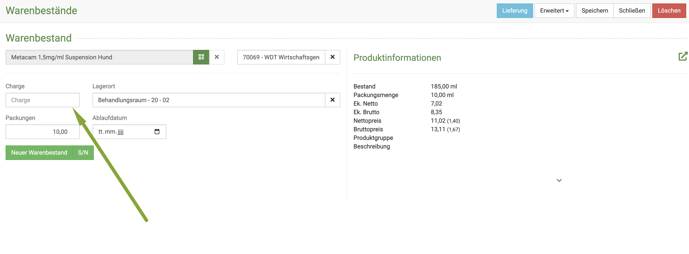
