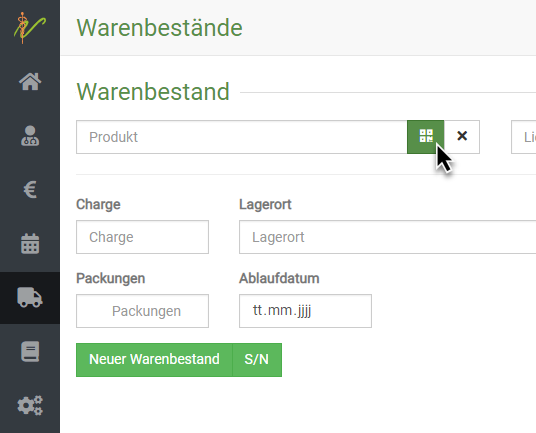
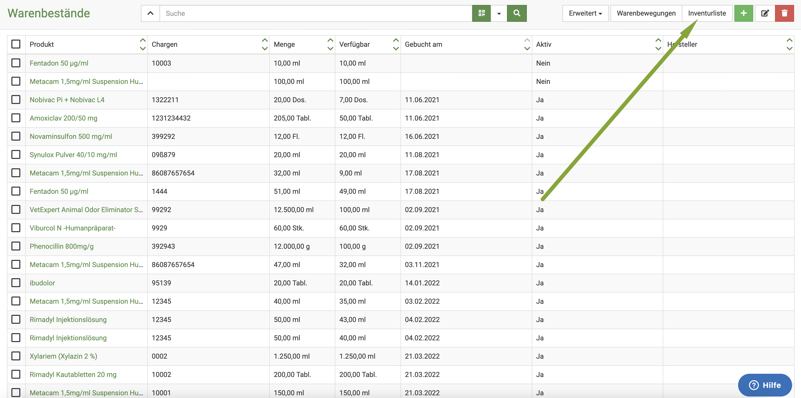
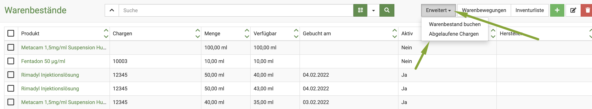
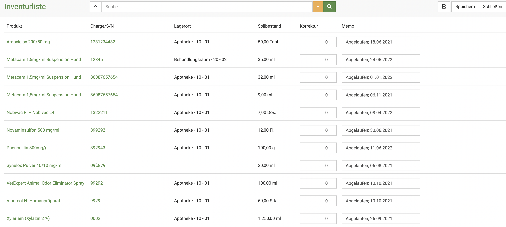

# Warenbestände 

Die Warenwirtschaft ist ein wichtiger Faktor in Ihrer Praxis. Wenn Sie die Möglichkeiten der debevet Software ideal nutzen,
ist eine Apothekenprüfung und Inventur für Sie ein Kinderspiel! 

Sie können einen Warenbestand entweder direkt anlegen, oder aber die Kette von Bestellung-Lieferung-Warenbestand recht einfach nutzen.   

## Neuen Warenbestand anlegen  

Wenn Sie die Kette nicht nutzen, können Sie auch manuell einen neuen Warenbestand anlegen. Klicken Sie hierzu auf **Warenwirtschaft** und dann
**Warenbestände**. Sie sehen die ungefilterte Liste Ihrer Warenbestände. Klicken Sie nun auf das grüne **Plus-Symbol**, um auf die
Seite zur Eingabe eines neuen Warenbestandes zu gelangen. 

  

Geben Sie in der Eingabeseite die gewünschten Informationen ein und speichern Sie den neuen Warenbestand anschließend, indem Sie auf **Speichern** klicken.  

Im Feld für **Produkt** können Sie beginnen zu tippen. Die debevet Software schlägt Ihnen dann direkt passende Treffer vor. 

  

:::caution Achtung 

Achten Sie beim Vorhandensein von verschiedenen Packungsgrößen darauf, dass Sie die korrekte Packungsgröße auswählen! 

::: 

Geben Sie nun die weiteren Daten zum Produkt ein. Wir empfehlen dabei, die Chargennummer und das Ablaufdatum auf jeden Fall zu 
setzen, um die Effizient der digitalen Lagerverwaltung zu verbessern und Apothekenprüfungen zu erleichtern.  

Die Lagerortverwaltung kann auch sehr nützlich sein, ab unserem Standard Paket haben Sie mehrere Lagerorte zur Verfügung.   

Wenn Sie alle Waren angelegt haben im Bestand, die Ihnen geliefert wurden, klicken Sie oben rechts auf **Speichern**.  

:::caution Achtung

Nach dem Speichern des Warenbestandes ist dieser noch nicht aktiv nutzbar in den Behandlungen! Erst, wenn der Warenbestand
auf **gebucht** gesetzt wird, funktioniert die Verwaltung des Bestandes in sofern, dass bei Nutzung durch Abgabe oder Behandlung
die passende Menge vom Warenbestand abgezogen wird!

:::

## Einlesen mit dem Barcodescanner  

Sie können Ihre Wareneingänge auch mit einem Barcodescanner erfassen. Klicken Sie hierzu auf das grüne **Datamatrix** Symbol
neben dem Feld **Produkt**. Und scannen Sie dann den Code auf der Verpackung.  

  

:::caution Achtung  

Das System für die Barcodes ist nicht vereinheitlicht. Vor allem die Daten zu GTIN Nummern...?!

::: 

## Verschiedene Chargen, Seriennummern oder Lagerorte auf einmal eingeben

Um verschiedene Warenbestände *des gleichen Produktes und Lieferanten* hinzuzufügen, klicken Sie nach der Eingabe der ersten Charge auf **Neuen Warenbestand**.  
Geben Sie nun die jeweiligen Daten ein. Um den Warenbestand zu löschen, drücken Sie rechts auf **Entfernen**.  

  

## Warenbestand anzeigen und Waren suchen  

Klicken Sie auf **Warenwirtschaft** und dann auf **Warenbestände**. Das System listet alle Warenbestände auf. Tippen Sie in das
Suchfenster wie bei einer Suchmaschine Begriffe ein, die auf den gesuchten Warenbestand passen und drücken Sie die **Entertaste** oder klicken
Sie auf das **Lupen-Symbol**.  

 

Natürlich können Sie wie überall neben dem Suchenfeld auf den **Dropdown-Pfeil** klicken, um nach gezielten Parametern bzw. weiteren Suchbegriffen zu filtern. 

  

Wie immer zeigt die gelbe Farbe des Pfeils an, dass ein Filter gesetzt ist. Dieser muss zurückgesetzt werden, um wieder die gesamte Liste angezeigt zu bekommen.  

  

## Warenbestände bearbeiten 

Wenn Warenbestände noch nicht gebucht sind, können sie bearbeitet werden. Klicken Sie hierzu auf **Warenwirtschaft** und auf **Warenbestände**.
Klicken Sie in der Liste Ihrer Warenbestände auf die Schrift in der Spalte **Produkt**, um auf die Bearbeitungsseite des Warenbestandes zu gelangen.  

  

Um mehrere Warenbestände zu bearbeiten, wählen Sie zunächst die jeweiligen **Checkboxen** in der Liste an. Drücken Sie nun das **Stift-Symbol** oben rechts, 
um die ausgewählten Warenbestände zu bearbeiten.

Nutzen Sie die Pfeile < und >, um beim Bearbeiten zwischen den einzelnen Warenbeständen zu wechseln.

Um sie zu löschen, drücken Sie das **Mülltonnen-Symbol**. 

  

## Warenbestand buchen  

:::caution Achtung  

Nach dem Speichern des Warenbestandes ist dieser noch nicht aktiv nutzbar in den Behandlungen! Erst, wenn der Warenbestand 
auf **gebucht** gesetzt wird, funktioniert die Verwaltung des Bestandes in sofern, dass bei Nutzung durch Abgabe oder Behandlung
die passende Menge vom Warenbestand abgezogen wird!  

:::

Wir empfehlen, nach dem Anlegen der Warenbestände in der Übersicht des Warenbestandes zu schauen, welche Bestände noch nicht gebucht sind. Hierzu können Sie
in der Spalte '**gebucht am** auf den Pfeil nach klicken, um sich die Reihenfolge zu ändern. So werden Ihnen die noch nicht gebuchten ganz oben angezeigt.  

Nun können Sie die **Checkboxen** anklicken, bei den Produkten, die Sie buchen wollen. Klicken Sie nun auf **Erweitert** und dann **Warenbestand buchen**.  

   

Nun ist die Ware "aktiv" nutzbar und wird bei Nutzung abgezogen.   

:::tip Tipp 

Kennen Sie schon die Möglichkeit, einen Mindestbestand zu hinterlegen, damit Sie direkt informiert werden, wenn dieser unterschritten wird?  

Schauen Sie hier: [Mindestbestand nutzen](/docs/Warenwirtschaft/Produkte#mindestbestand-nutzen)  

:::  

## Warenbewegungen anzeigen  

Sie haben jederzeit die Möglichkeit, sich alle Warenbewegungen anzeigen zu lassen. Das sind sowohl Zugänge als auch Abgänge. 
Besonders nützlich ist dies bei einer Apothekenprüfung. Mehr Tipps zu der präzisen Nutzung beschreiben wir hier.   

Klicken Sie in Ihrem Warenbestand zunächst oben rechts auf **Warenbewegungen**.  

  

Nun sehen Sie eine Auflistung der Zu- und Abgänge. Im Falle einer Apothekenprüfung empfehlen wir Ihnen folgendes:  

Filtern Sie sich die Liste nach verschiedenen Parametern. Um den Suchenfilter zu setzten, klicken Sie neben dem Suchenfeld oben 
rechts auf den **Dropdownpfeil**. 

Sie können nun zum Beispiel für bestimmte Zeiträume oder nur bestimmte Produkte (wie z.B. BTM Präparate) eine eigene Liste erstellen.

Geben Sie beispielsweise ein BTM Präparat in die Suche ein und setzen Sie den Zeitraum auf einen bestimmten Monat oder ein Jahr. 
Drücken Sie nun die **Entertaste** oder klicken Sie auf das **Lupen-Symbol**, bekommen Sie nur diese aufgelistet. 

Wenn Sie nun rechts oben auf das **Drucker-Symbol** klicken, können Sie diese Liste drucken oder als pdf speichern.  

### Filter zurücksetzen  

Um wieder die gesamte Warenbewegung anzuzeigen, klicken Sie auf den nun gelben **Dropdown-Pfeil** neben dem Suchenfeld.
Klicken Sie auf **Zurücksetzen**, um wieder alle Posten angezeigt zu bekommen.  

 
## Inventur   

Wenn Sie die Warenbestandsbuchungen wie angegeben nutzen, sind Ihre Inventurlisten immer sehr gut geführt. Um Ihre Inventurliste anzuzeigen,
klicken Sie auf **Warenwirtschaft** und dann **Warenbestände**. Dort klicken Sie nun oben rechts auf **Inventurliste**..  

  

Nun sehen Sie eine Auflistung Ihrer Produkte inkl. des "theoretischen" Bestandes. Wenn Sie bei der Inventur also nun bemerkten, 
dass es weniger ist als angegeben, können Sie im Feld **Korrektur** den aktuellen, reellen Bestand eintragen. Wir empfehlen, im Feld **Memo**
zum Beispiel dann "Inventur" oder "Zählung" zu schreiben.  

:::tip Tipp: 

Wenn Sie mit mehreren Mitarbeitern die Inventur durchführen, drucken Sie zunächst mit klick auf das **Druckersymbol**. Nun kann jeder
Mitarbeiter zunächst handschriftlich einen bestimmten Teil ergänzen und am Ende können Sie alles digital eintippen.  

:::  

## Abgelaufene Chargen ausbuchen  

Sie können sich in Ihrem Warenbestand direkt alle abgelaufenen Chargen anzeigen lassen. Klicken Sie dazu auf **Warenwirtschaft** und dann 
**Warenbestände**. Nun klicken Sie oben rechts auf **Erweitert** und wählen dort **Abgelaufene Chargen**.  

  

Nun listet debevet die abgelaufenen Chargen und bietet direkt die Korrektureinträge (also NULL) und ein Memo mit "abgelaufen am". 
Wenn Sie hier noch etwas ändern wollen, können Sie das natürlich erledigen, ansonsten klicken Sie einfach auf **Speichern**. 

  

## Zerbrochene Ware/ Verlust  

Wenn Ihnen ein Fläschchen herunterfällt oder etwas kaputt geht, können Sie dieses über die Inventurliste ebenso eintragen. 
Klicken Sie hierzu auf **Warenwirtschaft** und dann **Warenbestände** und öffnen Sie dann rechts oben die **Inventurliste**.  

Suchen Sie das passende Medikament über die Suche. In das Feld **Korrektur** tragen Sie den neuen Bestand ein und schreiben sich als 
Memo "Bruch" oder "Verlust". 

Klicken Sie dann oben rechts auf **Speichern**. Der neue Bestand ist dann übernommen.  

:::caution Achtung

Falls Sie mehrere Chargen lagernd haben, achten Sie darauf, die korrekte Charge auszubuchen!  

::: 