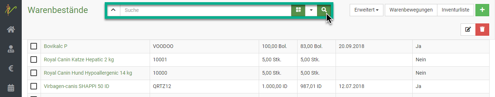

# Warenbestände 

Die Warenwirtschaft ist ein wichtiger Faktor in Ihrer Praxis. Wenn Sie die Möglichkeiten der debevet Software ideal nutzen,
ist eine Apothekenprüfung und Inventur für Sie ein Kinderspiel! 

Sie können einen Warenbestand entweder direkt anlegen, oder aber die Kette von Bestellung-Lieferung-Warenbestand recht einfach nutzen.   

## Neuen Warenbestand anlegen  

Wenn Sie die Kette nicht nutzen, können Sie auch manuell einen neuen Warenbestand anlegen. Klicken Sie hierzu auf **Warenwirtschaft** und dann
**Warenbestände**. Sie sehen die ungefilterte Liste Ihrer Warenbestände. Klicken Sie nun auf das grüne **Plus-Symbol**, um auf die
Seite zur Eingabe eines neuen Warenbestandes zu gelangen. 

  

Geben Sie in der Eingabeseite die gewünschten Informationen ein und speichern Sie den neuen Warenbestand anschließend, indem Sie auf **Speichern** klicken.  

Im Feld für **Produkt** können Sie beginnen zu tippen. Die debevet Software schlägt Ihnen dann direkt passende Treffer vor. 

  

:::caution Achtung 

Achten Sie beim Vorhandensein von verschiedenen Packungsgrößen darauf, dass Sie die korrekte Packungsgröße auswählen! 

::: 

Geben Sie nun die weiteren Daten zum Produkt ein. Wir empfehlen dabei, die Chargennummer und das Ablaufdatum auf jeden Fall zu 
setzen, um die Effizient der digitalen Lagerverwaltung zu verbessern und Apothekenprüfungen zu erleichtern.  

Die Lagerortverwaltung kann auch sehr nützlich sein, ab unserem Standard Paket haben Sie mehrere Lagerorte zur Verfügung.   

Wenn Sie alle Waren angelegt haben im Bestand, die Ihnen geliefert wurden, klicken Sie oben rechts auf **Speichern**.  

:::caution Achtung

Nach dem Speichern des Warenbestandes ist dieser noch nicht aktiv nutzbar in den Behandlungen! Erst, wenn der Warenbestand
auf **gebucht** gesetzt wird, funktioniert die Verwaltung des Bestandes in sofern, dass bei Nutzung durch Abgabe oder Behandlung
die passende Menge vom Warenbestand abgezogen wird!

:::

## Einlesen mit dem Barcodescanner  

Sie können Ihre Wareneingänge auch mit einem Barcodescanner erfassen. Klicken Sie hierzu auf das grüne **Datamatrix** Symbol
neben dem **Suchenfeld** und scannen Sie dann den Code auf der Verpackung.   

  

Hier ein Bild des Codes, der gescannt werden muss:  

:::caution Achtung  

Um eine Lieferung scannen zu können, müssen Sie immer am Produkt einmalig die GTIN eingescannt haben. Das System ist leider nicht 
einheitlich, was diesen Schritt unumgänglich macht. Sobald dies aber einmalig geschehen ist, spart das Einlesen der Lieferungen mit 
dem Scanner enorm Zeit.

::: 

:::info Videotip: 

Zum Einscannen haben wir ein kleines Hilfevideo erstellt:

<iframe width="560" height="315" src="https://www.youtube.com/embed/Z699k1Q_1fU" title="YouTube video player" 
frameborder="0" allow="accelerometer; autoplay; clipboard-write; encrypted-media; gyroscope; picture-in-picture" allowfullscreen></iframe>

:::  

## Verschiedene Chargen, Seriennummern oder Lagerorte auf einmal eingeben

Um verschiedene Warenbestände *des gleichen Produktes und Lieferanten* hinzuzufügen, klicken Sie nach der Eingabe der ersten Charge auf **Neuen Warenbestand**.  
Geben Sie nun die jeweiligen Daten ein. Um den Warenbestand zu löschen, drücken Sie rechts auf **Entfernen**.  

  

## Warenbestand anzeigen und Waren suchen  

Klicken Sie auf **Warenwirtschaft** und dann auf **Warenbestände**. Das System listet alle Warenbestände auf. Tippen Sie in das
Suchfenster wie bei einer Suchmaschine Begriffe ein, die auf den gesuchten Warenbestand passen und drücken Sie die **Entertaste** oder klicken
Sie auf das **Lupen-Symbol**.  

 

Natürlich können Sie wie überall neben dem Suchenfeld auf den **Dropdown-Pfeil** klicken, um nach gezielten Parametern bzw. weiteren Suchbegriffen zu filtern. 

  

Wie immer zeigt die gelbe Farbe des Pfeils an, dass ein Filter gesetzt ist. Dieser muss zurückgesetzt werden, um wieder die gesamte Liste angezeigt zu bekommen.  

  

## Warenbestände bearbeiten 

Wenn Warenbestände noch nicht gebucht sind, können sie bearbeitet werden. Klicken Sie hierzu auf **Warenwirtschaft** und auf **Warenbestände**.
Klicken Sie in der Liste Ihrer Warenbestände auf die Schrift in der Spalte **Produkt**, um auf die Bearbeitungsseite des Warenbestandes zu gelangen.  

  

Um mehrere Warenbestände zu bearbeiten, wählen Sie zunächst die jeweiligen **Checkboxen** in der Liste an. Drücken Sie nun das **Stift-Symbol** oben rechts, 
um die ausgewählten Warenbestände zu bearbeiten.

Nutzen Sie die Pfeile < und >, um beim Bearbeiten zwischen den einzelnen Warenbeständen zu wechseln.

Um sie zu löschen, drücken Sie das **Mülltonnen-Symbol**. 

  

## Warenbestand buchen  

:::caution Achtung  

Nach dem Speichern des Warenbestandes ist dieser noch nicht aktiv nutzbar in den Behandlungen! Erst, wenn der Warenbestand 
auf **gebucht** gesetzt wird, funktioniert die Verwaltung des Bestandes in sofern, dass bei Nutzung durch Abgabe oder Behandlung
die passende Menge vom Warenbestand abgezogen wird!  

:::

Wir empfehlen, nach dem Anlegen der Warenbestände in der Übersicht des Warenbestandes zu schauen, welche Bestände noch nicht gebucht sind. Hierzu können Sie
in der Spalte '**gebucht am** auf den Pfeil nach klicken, um sich die Reihenfolge zu ändern. So werden Ihnen die noch nicht gebuchten ganz oben angezeigt.  

Nun können Sie die **Checkboxen** anklicken, bei den Produkten, die Sie buchen wollen. Klicken Sie nun auf **Erweitert** und dann **Warenbestand buchen**.  

   

Nun ist die Ware "aktiv" nutzbar und wird bei Nutzung abgezogen.   

:::tip Tipp 

Kennen Sie schon die Möglichkeit, einen Mindestbestand zu hinterlegen, damit Sie direkt informiert werden, wenn dieser unterschritten wird?  

Schauen Sie hier: [Mindestbestand nutzen](/docs/Warenwirtschaft/Produkte#mindestbestand-nutzen)  

:::  

## Warenbewegungen anzeigen  

Sie haben jederzeit die Möglichkeit, sich alle Warenbewegungen anzeigen zu lassen. Das sind sowohl Zugänge als auch Abgänge. 
Besonders nützlich ist dies bei einer Apothekenprüfung. Mehr Tipps zu der präzisen Nutzung beschreiben wir hier.   

Klicken Sie in Ihrem Warenbestand zunächst oben rechts auf **Warenbewegungen**.  

  

Nun sehen Sie eine Auflistung der Zu- und Abgänge. Im Falle einer Apothekenprüfung empfehlen wir Ihnen folgendes:  

Filtern Sie sich die Liste nach verschiedenen Parametern. Um den Suchenfilter zu setzten, klicken Sie neben dem Suchenfeld oben 
rechts auf den **Dropdownpfeil**. 

Sie können nun zum Beispiel für bestimmte Zeiträume oder nur bestimmte Produkte (wie z.B. BTM Präparate) eine eigene Liste erstellen.

Geben Sie beispielsweise ein BTM Präparat in die Suche ein und setzen Sie den Zeitraum auf einen bestimmten Monat oder ein Jahr. 
Drücken Sie nun die **Entertaste** oder klicken Sie auf das **Lupen-Symbol**, bekommen Sie nur diese aufgelistet. 

Wenn Sie nun rechts oben auf das **Drucker-Symbol** klicken, können Sie diese Liste drucken oder als pdf speichern.  

### Filter zurücksetzen  

Um wieder die gesamte Warenbewegung anzuzeigen, klicken Sie auf den nun gelben **Dropdown-Pfeil** neben dem Suchenfeld.
Klicken Sie auf **Zurücksetzen**, um wieder alle Posten angezeigt zu bekommen.  

 
## Inventur   

Wenn Sie die Warenbestandsbuchungen wie angegeben nutzen, sind Ihre Warenbestandlisten immer sehr gut geführt. Um eine Liste anzuzeigen bzw. zu drucken,
klicken Sie auf **Warenwirtschaft** und dann **Warenbestände**. Dort klicken Sie nun oben rechts auf **Erweitert** und dann **Drucken**.  

Nun öffnet sich eine Maske, in der Sie entweder nur einen Teil der Warenbewegungen drucken können oder aber alle. 

:::tip Tipp: 

Sehr praktisch ist die Funktion, am Feld **Verschreibung** alle BTM ausdrucken zu lassen! 

:::  

Nun sehen Sie eine Auflistung Ihrer Produkte inkl. des "theoretischen" Bestandes. 

:::tip Tipp: 

Wenn Sie mit mehreren Mitarbeitern die Inventur durchführen, filtern Sie zunächst über die Suche den Bestand so, dass Sie sich jeweils eine Liste pro Lagerort
erstellen lassen. Wenn Sie den Pfeil rechts vom Suchenfeld klicken, können Sie bei Lagerort einen Ihrer Lagerorte eingeben. Klicken Sie auf das **Lupensymbol**
oder drücken Sie die **Entertaste**
Nun drucken Sie diese Liste und verfahren mit jedem Lagerort so.
Nun kann jeder Mitarbeiter zunächst handschriftlich einen Raum zählen und die veränderte Anzahl handschriftlich eintragen.
Am Ende können Sie alles digital korrigieren.   

:::  

## Warenwert - Wert der Hausapotheke  

Wenn Sie sich den Gesamtwert (oder auch nur den Wert bestimmter Produktgruppen) anzeigen lassen wollen, können Sie dies an 
den Warenbeständen.  

Klicken Sie auf **Warenwirtschaft** und dann **Warenbestände** und wählen oben rechts mit dem **Dropdown-Pfeil** bei **Erweitert** die Option
**Drucken**  

In der sich öffnenden Maske können Sie wählen, was Sie alles drucken wollen. Setzen Sie den Haken bei **Warenwert anzeigen** und 
drucken Sie dann alles gewünschte. 

  

Auf der letzten Seite sehen Sie dann den Gesamtwert der Auswahl.  

:::tip Tipp: 

Die Warenwerte werden mit Einkaufspreisen berechnet. Für den Fall, dass Sie selbst angelegte Produkte nutzen, müssen Sie 
die Einkaufspreise für eine korrekte Darstellung hinterlegen.   

::: 

## Warenbestand korrigieren  

Möchten Sie nun Änderungen vornehmen, weil in der Inventur doch eine andere Menge vorhanden ist als "theoretisch", öffnen Sie
das Medikament, welches korrigiert werden soll. Geben Sie dazu z.B. den Namen des Medikamentes unter **Warenwirtschaft** und **Warenbestände** in die Suche ein. 

Am Medikament selbst klicken Sie nun oben rechts auf **Erweitert** und dann **Korrektur**.    

Geben Sie die aktuelle Menge und unter **Memo** den Grund ein, beispielweise "Inventur, vermutlich Verlust" oder ähnliches.  

   

Klicken Sie dann auf den grünen Button **Korrigieren**. Der neue Bestand ist dann übernommen.

## Abgelaufene Chargen ausbuchen  

Sie können sich in Ihrem Warenbestand direkt alle abgelaufenen Chargen anzeigen lassen. Klicken Sie dazu auf **Warenwirtschaft** und dann 
**Warenbestände**. Nun klicken Sie oben rechts auf **Erweitert** und wählen dort **Abgelaufene Chargen**.  

Nun listet debevet die abgelaufenen Chargen und bietet direkt die Korrektureinträge (also NULL) und ein Memo mit "abgelaufen am". 
Wenn Sie hier noch etwas ändern wollen, können Sie das natürlich erledigen, ansonsten klicken Sie einfach auf **Speichern**. 

" 
ausgebucht.

## Zerbrochene Ware/ Verlust  

Wenn Ihnen ein Fläschchen herunterfällt oder etwas kaputt geht, können Sie dieses über die Korrektur ebenso eintragen. 
Klicken Sie hierzu auf **Warenwirtschaft** und dann **Warenbestände** und öffnen Sie dann das zu korrigierende Medikament.

Nun klicken Sie oben rechts **Erweitert** und dann  **Korrektur**. 

  

Es öffnet sich eine Maske. Dort tragen Sie den neuen Bestand ein und 
schreiben sich als Memo "Bruch" oder "Verlust".   

Klicken Sie dann auf den grünen Button **Korrigieren**. Der neue Bestand ist dann übernommen.  

:::caution Achtung

Falls Sie mehrere Chargen lagernd haben, achten Sie darauf, die korrekte Charge auszubuchen!  

::: 