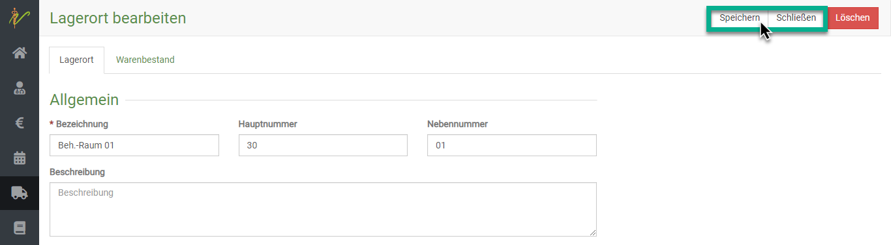

# Lagerorte  

Hier können Sie Lagerorte suchen, anlegen, ändern oder löschen. Außerdem gelangen Sie über die Bearbeitungsseite des 
Lagerortes zum Warenbestand am jeweiligen Lagerort.  

Lagerorte zu nutzen macht großen Sinn, da es die Kontrolle und Inventur erleichtert.
Vor allem, wenn Sie mehrere Praxisautos, einen Notfallkoffer oder verschiedene Behandlungsräume haben, erleichtert es
ihre Verwaltung extrem.  

## Neuen Lagerort anlegen  

Klicken Sie im Hauptmenü auf **Warenwirtschaft** und dann **Lagerorte**. Sie sehen die ungefilterte
Liste Ihrer Lagerorte. Klicken Sie nun auf das **grüne Plussymbol**, um auf die Seite zur Eingabe eines neuen Lagerortes zu gelangen.  

  

Geben Sie in der Eingabeseite die gewünschten Informationen ein und speichern Sie den neuen Lagerort anschließend, 
indem Sie auf **Speichern** klicken.  

## Lagerort einem Behandler zuweisen    

Wenn Sie beispielsweise in Ihrer Praxis feste Räume oder Praxis-Autos nutzen, die nur ein bestimmter Arzt nutzt, kann es sehr nützlich sein, einen
bestimmten Lagerort nur dem einen Behandler zuzuweisen, der diesen Raum nutzt. Vorteile: 

* Wenn Sie die Chargennummern hinterlegt haben und ein Produkt auf **inventurpflichtig** gesetzt haben, wird ja automatisch eine 
Chargennummer gesetzt. Wenn in diesem Lagerort für diesen Behandler nur beispielsweise eine Charge aktuell als **gebucht** gesetzt ist im 
Warenbestand, so spart der Behandler sich das Auswählen der Chargen 
* Vor allem bei angewandten Medikamenten behalten Sie so immer den Überblick, welche Mengen in welchem Raum noch vorhanden sind, und 
es bucht nicht aus Versehen ein Behandler in seinem Raum einen Verbrauch aus einem anderen Raum ein

Um dem Behandler den Lagerort fest zuzuweisen klicken Sie am gewünschten Lagerort unten am gewünschten Behander auf die **Checkbox**, 
um diese zu aktivieren.    
 
  

## Lagerorte suchen

Klicken Sie auf **Warenwirtschaft** und dann auf **Lagerorte**. Das System listet alle Lagerorte auf. Tippen Sie in das 
Suchfenster wie bei einer Suchmaschine Begriffe ein, die auf den gewünschten Lagerort passen und drücken Sie die **Entertaste** oder
klicken Sie auf das **Lupen-Symbol**.  

  

## Lagerort bearbeiten und weitere Details  

Klicken Sie auf **Warenwirtschaft** und auf **Lagerorte**. Klicken Sie in der Liste Ihrer Lagerorte auf die Schrift in
der Spalte Bezeichnung, Hauptnummer oder Nebennummer um auf die Bearbeitungsseite des Lagerortes zu gelangen.

In der Bearbeitungsansicht können Sie am Reiter **Warenbestand** den aktuellen Warenbestand der Produkte am jeweiligen Lagerort abrufen.  

## Mehrere Lagerorte bearbeiten oder löschen  

Um mehrere Lagerorte zu bearbeiten, wählen Sie zunächst die jeweiligen **Checkboxen** in der Liste an. Drücken Sie nun das
**Stiftsymbol** oben rechts, um die ausgewählten Lagerorte zu bearbeiten.

Nutzen Sie die Pfeile < und > (oben rechts), um beim Bearbeiten zwischen den einzelnen Lagerorten zu wechseln.

Um sie zu löschen, drücken Sie das **Mülltonnensymbol**.  

