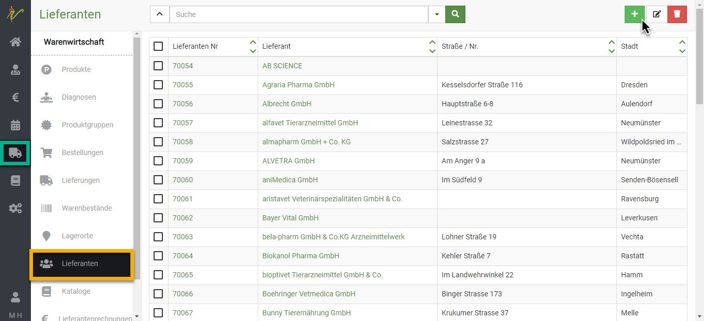
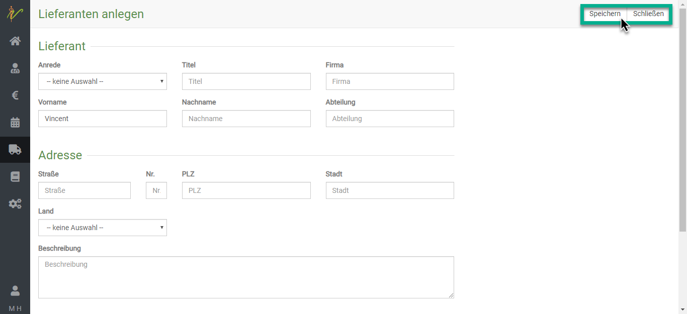
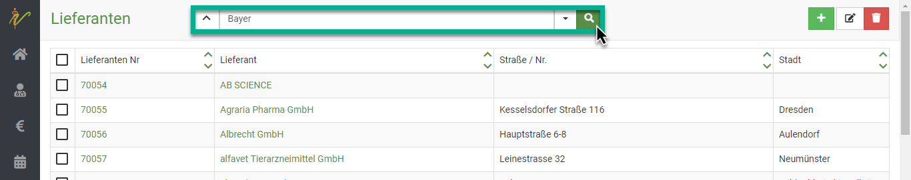
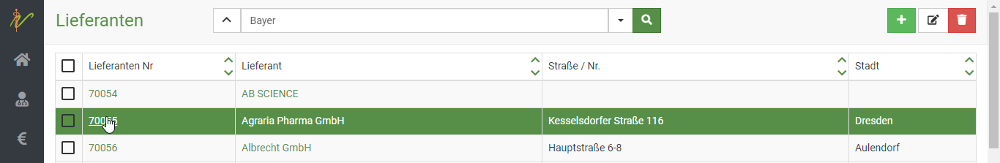
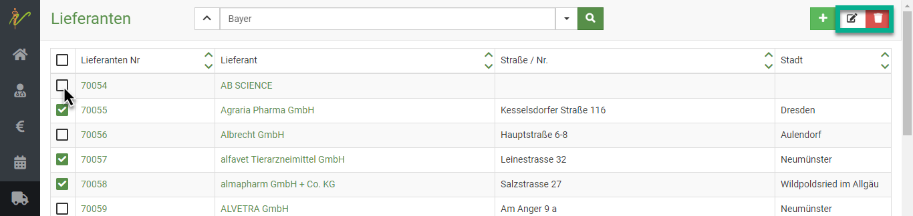
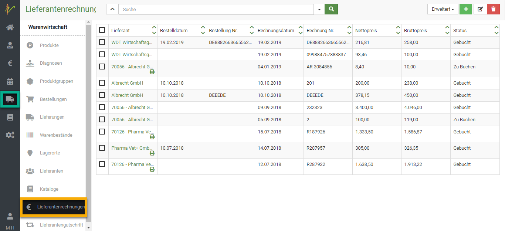
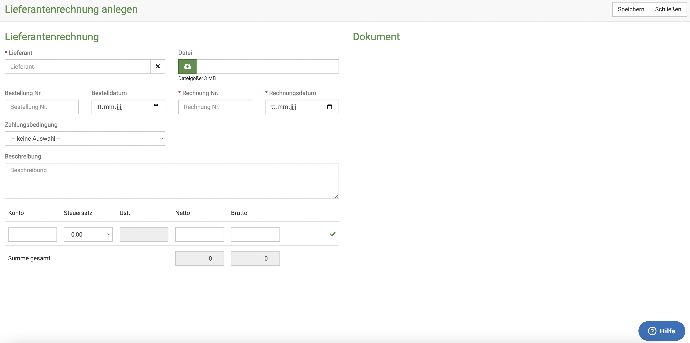
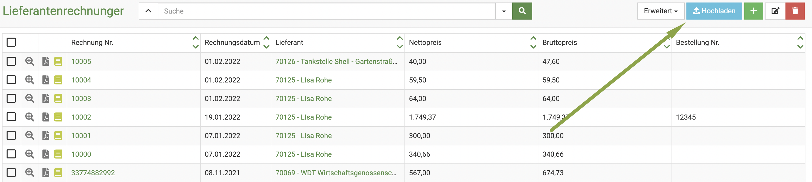

# Lieferanten   

Hier können Sie Lieferanten suchen, anlegen, ändern oder löschen. Außerdem gelangen Sie über die Bearbeitungsseite 
eines Lieferanten zu Informationen und Daten die zum jeweils ausgewählten Lieferanten in Beziehung stehen, wie z.B. 
Konten oder Vereinbarungen.  

## Neuen Lieferanten anlegen 

Klicken Sie im Hauptmenü auf **Warenwirtschaft** und wählen Sie den Untermenüpunkt **Lieferanten**. Sie sehen die ungefilterte 
Liste Ihrer Lieferanten (wovon Sie vermutlich etliche aus dem Katalog importiert haben). Klicken Sie nun auf das **grüne Plus-Smbol**,
um auf die Seite zur Eingabe eines neuen Lieferanten zu gelangen.  

  

Geben Sie in der Eingabeseite die gewünschten Informationen ein und speichern Sie den neuen Lieferanten anschließend, in dem Sie auf **Speichern**
klicken.  

  

## Lieferanten suchen   

Klicken Sie auf **Warenwirtschaft** und dann auf **Lieferanten**. Das System listet alle Lieferanten auf. Tippen Sie in das
Suchfenster wie bei einer Suchmaschine Begriffe ein, die auf den gewünschten Lieferanten passen und drücken Sie die **Entertaste** oder klicken
Sie auf das **Lupen-Symbol**.  

## Lieferanten bearbeiten und weitere Details  

Klicken Sie auf **Warenwirtschaft** und auf **Lieferanten**. Klicken Sie in der Liste Ihrer Lieferanten auf die Schrift in 
der Spalte Lieferanten Nr. oder Lieferant, um auf die Bearbeitungsseite des Lieferanten zu gelangen.   

  

## Mehrere Lieferanten bearbeiten oder löschen

Um mehrere Lieferanten zu bearbeiten, wählen Sie zunächst die jeweiligen **Checkboxen** in der Liste an. Drücken Sie nun das **Stift-Symbol**
oben rechts, um die ausgewählten Lieferanten zu bearbeiten.

Nutzen sie die Pfeile < und > um beim bearbeiten zwischen den einzelnen Lieferanten zu wechseln.

Um sie zu löschen, drücken Sie das **Mülltonnen-Symbol**.  

 
## Lieferanten-Rechnungen hinterlegen  

Natürlich können Sie die Rechnungen Ihrer Lieferanten hinterlegen.   

Um eine Rechnung hochzuladen oder eine bereits eingefügte aufzurufen, klicken Sie **Warenwirtschaft** und dann **Lieferantenrechnungen**. 

 

Um eine neue Rechnung hinzuzufügen, können Sie drei Wege gehen:  

1. Um eine Rechnung mit mehr Informationen zu hinterlegen, klicken Sie auf das **Plus-Symbol**. Anschließend öffnet sich "Lieferantenrechnung anlegen".
Dort tragen Sie den Lieferanten ein und laden die Datei hoch, indem Sie auf das **Wolken-Symbol** klicken.

Danach können Sie weitere Angaben machen - bitte beachten Sie, dass Rechnung und Rechnungsdatum Pflichtfelder sind.   

Wählen Sie außerdem, wenn gewünscht und vorhanden, eine Zahlungsbedingung aus und tragen Sie eine Beschreibung ein.  

 

2. Um sehr schnell eine Rechnung zu hinterlegen, können Sie einfach den **blauen Button** oben rechts klicken **Importieren**. 

  

Wenn Sie nun im Feld "Lieferant" beginnen, den Namen zu tippen, schlägt die Software Ihnen direkt die Lieferanten aus Ihrer Liste vor. Wählen Sie den 
gewünschten und klicken dann auf das **Wolken-Symbol**, um die Rechnung hochzuladen.

3. Lieferantenrechnungen können auch aus Lieferungen erzeugt werden. Dazu drücken Sie in der Detailansicht einer Lieferung auf den Button **Erweitert**
und dann auf **Lieferantenrechnung anlegen**
