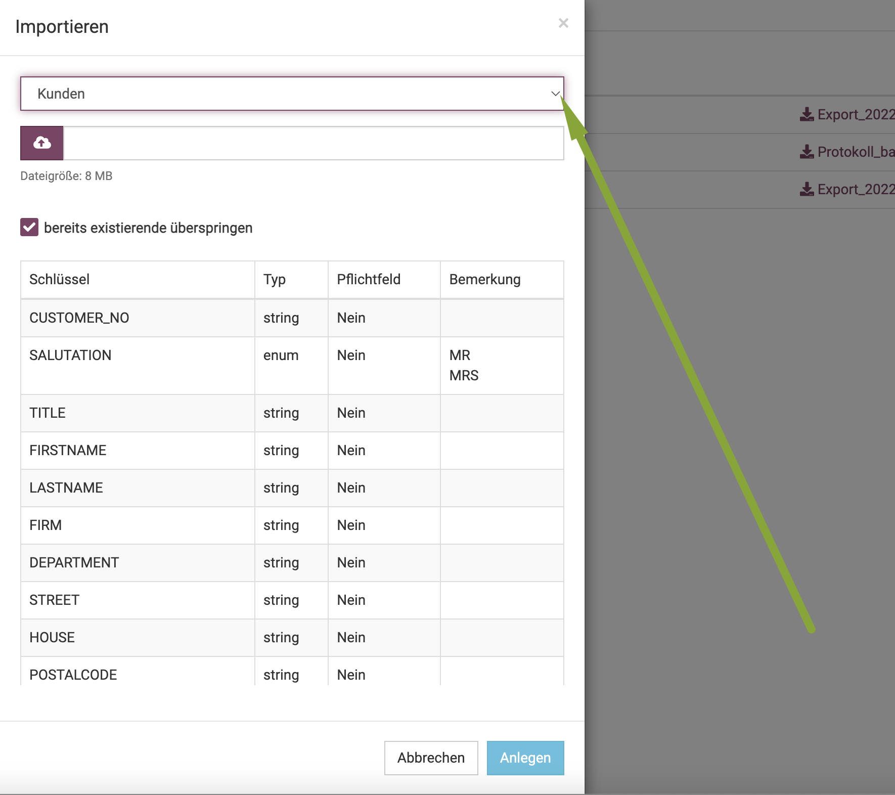
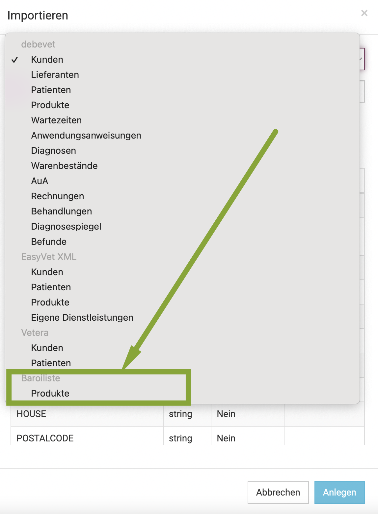
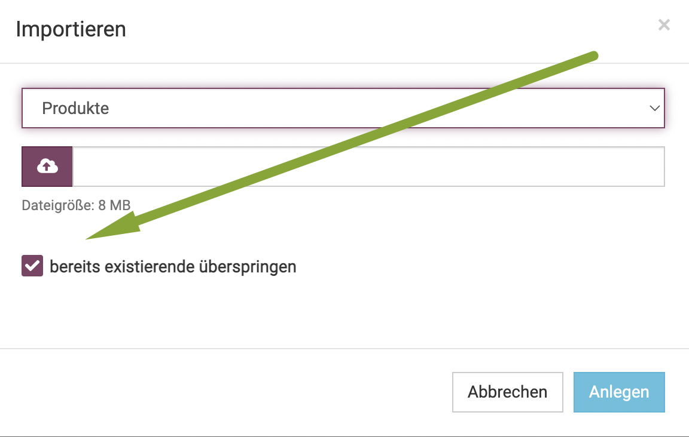
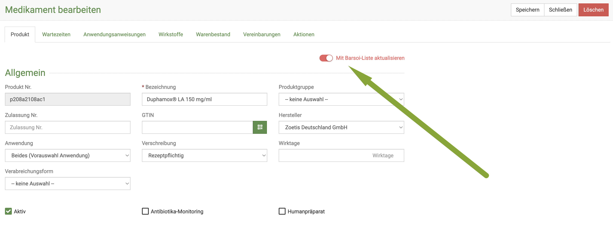
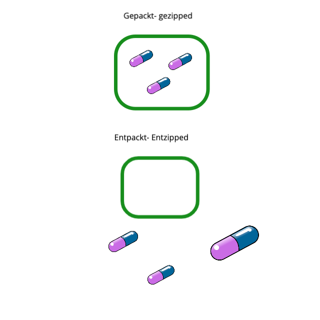

# Kataloge

debevet stellt diverse Katalog-Verzeichnisse kostenlos zur Verwendung. Sie können diese Kataloge in Ihr debevet 
übernehmen und dort optional bearbeiten oder aber auch in Zukunft durch debevet automatisch aktualisieren lassen.   

  

Folgende Kataloge werden aktuell zur Verfügung gestellt

* GOT - Leistungen inkl. Preise nach der Gebührenordnung für Tierärzte inkl. Gebührenziffer
* ADT - Leistungen inkl. Preise für Tierheilpraktiker gemäß ADT
* IDEXX - Laborleistungen inkl. Preise (Einkauf und Verkauf, beinhaltet ebenfalls die möglichen Tests mittels VetLab-Station)
* Laboklin - Laborleistungen inkl. Preis (Einkauf und Verkauf)
* Pharmaliste - Liste der gängigsten Pharmahersteller als auch Distributoren
* GMON - Diagnoseschlüssel für Hunde, Katzen, Pferde, Rinder und Schweine 
* Barsoi-Liste - Medikamentenpreise (vorausgesetzt, Sie haben die digitale Version der Liste, welche bei Barsoi erworben werden kann)  

## Katalog importieren  

Klicken Sie auf **Warenwirtschaft** (LKW-Symbol) und dann **Kataloge**.  

  

Klicken Sie auf den Pfeil nach rechts neben dem gewünschten Katalog, den Sie importieren oder näher begutachten möchten. 

Die Liste stellt alle Leistungen des ausgewählten Katalogs - hier GOT - dar. Sie können die Liste wie alle Listen in 
debevet wie gewohnt filtern und sortieren.  

  

### Ausgewählte Einträge eines Katalogs übernehmen  

Jeder Eintrag (Zeile) kann einzeln angekreuzt werden, um so mit dem Button ganz rechts oben im Menü der Seite importiert
zu werden. Hat ein Eintrag kein Ankreuzfeld, sondern als Symbol eine Büroklammer, so haben Sie diesen bereits in Ihr debevet 
importiert.  

  

### Vollständigen Katalog importieren  

Klicken Sie auf den Button **Katalog importieren**, so wird der ganze Katalog in Ihr debevet übernommen. Bei einigen Katalogen,
wie in diesem Beispiel der GOT, erhalten Sie noch eine Vorauswahl, bei der Sie bspw. Einträge ausgewählter Spezies vorselektieren können.

Klicken Sie hier abschließend auf **Importieren**, so wird der Katalog gemäß Ihrer Auswahl importiert.   

  

## Aktualisierung der Kataloge und individuelle Anpassungen  

Aus Katalogen übernommene Einträge finden Sie nach dem Import wie alle Produkte und Dienstleistugen in Ihrem Gesamtkatalog
unter **Warenwirtschaft** → **Produkte**.   

Im Gegensatz zu Produkten und Leistungen, die von Ihnen manuell erfasst wurden,
werden Einträge aus Katalogen allerdings von debevet automatsich und kontinuierlich aktualisiert.  

Wenn Sie importierte Katalogeinträge nach dem Import ändern bzw. selber verwalten möchten, sollten Sie die **Aktualisierung 
deaktivieren**, da debevet sonst bei der nächsten Aktualisierung Ihre Änderungen zurücksetzt. 

Um die Aktualsierung zu deaktivieren, gibt es zwei Möglichkeiten.   

1. Klicken Sie auf **Administration** (Zahnradsymbol) - **Einstellungen** und 
wählen Sie den Reiter Warenbestand aus. Dort können Sie die Aktualisierung für alle Kataloge oder das Lieferantenverzeichnis abbestellen. 

   

2. Wenn Sie nur einzelne ausgewählte Einträge von der Aktualisierung ausschließen möchten, können Sie den Eintrag unter
**Warenwirtschaft** → **Produkte** suchen und auf der Bearbeitungsseite des Produktes das Feld **Mit Katalog aktualisieren** deaktivieren.  
  
   

  

## Angepasste Preise zurücksetzen

:::tip Tipp   

Sollten Sie einen Katalogeintrag z.B. aus der GOT individuell angepasst haben, so können Sie diesen jederzeit wieder auf 
die Eingaben aus dem Katalog zurücksetzen indem Sie nach dem Aufrufen der Dienstleistung oben rechts auf **Zurücksetzen** klicken. 

:::  

## Barsoi Liste integrieren/ importieren  

Natürlich haben Sie bei debevet die Möglichkeit, die Barsoi-Liste zu hinterlegen, um alle Medikamentenpreise direkt nutzen zu können. Allerdings muss die Liste manuell
importiert werden, sie aktualisiert sich nicht von selbst. 

Die Barsoi muss bei Barsoi selbst getrennt bezahlt werden, diese ist nicht in den Kosten für unsere Software enthalten.    

:::caution WICHTIG!   

Sollten Sie von einer anderen Software zu debevet wechseln, geben Sie dies bitte bei Barsoi an, indem Sie dort anrufen. Viele andere 
Softwareanbieter arbeiten mit einer anderen Version (1.12.xx), damit der Import in debevet funktioniert, benötigen Sie aber 25.xx.xx (Stand 
Okt. 2025). Um zu prüfen, welche Version Sie aktuell bei Barsoi herunterladen, öffnen Sie die barsoi.xml Datei und scrollen ganz nach rechts, in der letzten Spalte steht die Version.
Wenn Sie ein neues Abo abschließen, müssen Sie die Praxissoftware angeben, dann sollte automatisiert die passende Version bereit stehen.   

:::

Dies geht allerdings nicht über einen Katalog, sondern über unsere Import-Funktion. Klicken Sie hierzu auf **Administration** und dann **Import/Export**.

Nun klicken Sie **Neuer Import** und klicken in der sich öffnenden Seite den **Dropdown-Pfeil** und wählen ganz unten aus der Liste **Barsoi Liste - Produkte**.

 

 
Nun klicken Sie auf das **Wolkensymbol** und wählen dann die **zip Datei**. Bitte beachten Sie, dass Sie bei der Barsoi angeben müssen, dass Sie die
Versionen benötigen, die für debevet genutzt werden. Es gibt leider auch sehr alte Versionen der Barsoiliste und die Barsoi stellt diese leider 
oftmals zur Verfügung. Dies muss proaktiv dort beauftragt werden, nur, wenn Sie die Liste neu abbonieren, können Sie direkt auswählen, für welche
Software Sie diese benötigen.

:::tip Tip:  

Wenn sie kein Wissen über zip Dateien haben, haben wir weiter unten (in den Fragen zur Barsoi) dazu einen Hilfetext angelegt. 

:::

Wichtig ist, dass Sie sich entscheiden, ob existierende Einträge übersprungen werden sollen. Wenn Sie beispielsweise sehr viele
indivduelle Anpassungen haben, kann dies sinnvoll sein, damit diese nicht überschrieben werden.  

Allerdings werden dann **GAR KEINE** Informationen 
für diese Produkte aktualisiert, auch nicht der Preis. 

**Nehmen Sie den Haken also heraus, wenn die bestehenden Produkte auch aktualisiert werden sollen. ** 

Anschließend klicken Sie auf **Anlegen**.  

:::caution Bitte beachten!

Die Anforderung des Exportes wird nicht direkt durchgeführt. Es wird nur ein Auftrag, ein sogenannter "Job" erstellt, der dann zu einer
bestimmten Uhrzeit erfolgt. Um die genannte Uhrzeit steht dann Ihr Export als CSV Datei zur Verfügung (Diese können dann im Excel eingelesen werden und be
Bedarf in eine xml Datei umgewandelt werden).

:::   

### Einzelne Produkte nicht überschreiben  

Wenn Sie an einzelnen Produkten Änderungen am Preis oder den Packungsgrößen vorgenommen haben, können Sie diese Produkte einzeln 
aus der Aktualisierung "ausklammern". Um dies an einem Produkt vorzunehmen, gehen Sie wie folgt vor:   

Öffnen Sie das gewünschte Produkt. Deaktivieren Sie nun den Toggle Button "Mit Barsoi aktualisieren".   

   

Nun werden beim nächsten Barsoi Upload, auch wenn der Haken "bereits bestehende überspringen" entfernt wurde, dennoch die Daten 
dieses Produktes **nicht** überschrieben.   

### Häufige Fragen zur Barsoi Liste  

Hier möchten wir einige Fragen beantworten, die uns regelmäßig bezüglich der Nutzung der Barsoi Liste erreichen. 

1. Muss ich die Liste immer wieder hochladen, wenn es ein Update gibt, oder geschieht dies automatisch?

Aktuell gibt es keine Schnittstellen Lösung, deswegen müssen Sie die Liste, immer wenn sie aktualisiert wird, erneut hochladen.

2. Wenn ich vorher manuell Produkte angelegt habe und nun die Barsoi Liste importiere und nutzen will, muss ich die inventurpflicht manuell neu setzen?

Ja. Da die Liste alle Produkte mit neuen Produktnummern komplett neu liefert, kann die debevet Software nicht wissen, dass das diesebeln Produkte sind,
die bei Ihnen im Schrank stehen. Wenn Sie also die Produkte aus der Liste nutzen wollen, empfehlen wir, ihren Bestand auf die neuen Produkte zu übertragen und die alten,
manuell angelegten Produkte zu löschen- so bleibt es übersichtlicher.
In diesem Rahmen müssen Sie dann, wenn Sie dies nutzen wollen, auch die Produkte wieder auf "inventurpflichtig" setzen. 

:::info Zur Erinnerung: 

"Inventurpflichtig" bedeutet, dass bei der Nutzung bereits die Charge automatisch gewählt ist, wenn Sie das Medikament in die Behandlung eingeben. 
Wenn der Haken nicht gesetzt wird, muss immer erst noch manuell eine Charge gewählt werden. Nur bei gewählter Charge wird das Produkt im Bestand "abgezogen" bei Nutzung.

:::

3. Wenn ich bei einem Produkt aus der Barsoiliste etwas manuell ändere, wird das beim nächsten Import wieder überschrieben?

Ja, wenn Sie den Haken bei "vorhandene überspringen" herausnehmen, werden alle Informationen zu Preis und Packung wieder zurückgesetzt auf das, was die Liste 
überliefert. 

4. Kann ich eine Übersicht einsehen, welche Posten aktualisiert wurden?

Leider nein, tut uns leid.

### Was ist eine zip Datei?

Für diejenigen von Ihnen mit weniger Computer Erfahrung haben wir hier eine kleine, sehr stark vereinfachte Erklärung eingefügt, was eine zip Datei ist.

Sie können sich eine zip Datei vorstellen, wie ein Paket: 

* Eine oder mehrere Dateien sind in diesem Paket verpackt ( das nennt man "gepackt" oder "gezipped")
* So können die Dateien einfacher und kompakter transportiert/verschickt werden (sie sind auch im Datenvolumen dann kleiner)

Um an die Dateien heranzukommen, muss man die Datei dann "entpacken" oder "entzippen". 

Jeder Computer kann zip Dateien sowohl **packen/zippen** als auch **entpacken/entzippen**. Bei Windows Rechnern muss dazu mit der rechten Maustaste auf eine Datei
geklickt werden und dann entweder das packen oder entpacken gewählt werden.
Beim Mac muss zum entpacken mit einem Doppelklick auf die zip Datei geklickt werden, zum packen nutzen Sie mit einem Mac bitte den weiter unten aufgeführten Link.  

Die Barsoi liefert beim Download eine zip Datei, in der die Datei barsoi.xml enthalten ist. Sollten noch weitere Dateien in der zip Datei enthalten sein, 
müssen Sie die korrekte Datei "Barsoi.xml" einzeln packen. Hilfetexte, wie Sie dies erledigen können, finden Sie bei Google. 

Hier haben wir noch einen Link, der Ihnen sehr einfach eine zip Datei erstellen kann, wenn Sie dort die barsoi.xml Datei hochladen. Auf diesem Weg können Sie dann sicher sein,
dass nur eine Datei gepackt wird (besonders wichtig für Mac Nutzer, da dort sonst im Hintergrund noch MacOS Dateien erstellt werden, weshalb der Upload dann nicht funktioniert).

https://www.ezyzip.com/dateien-online-komprimieren.html

