# Kataloge

debevet stellt diverse Katalog-Verzeichnisse kostenlos zur Verwendung. Sie können diese Kataloge in Ihr debevet 
übernehmen und dort optional bearbeiten oder aber auch in Zukunft durch debevet automatisch aktualisieren lassen.   

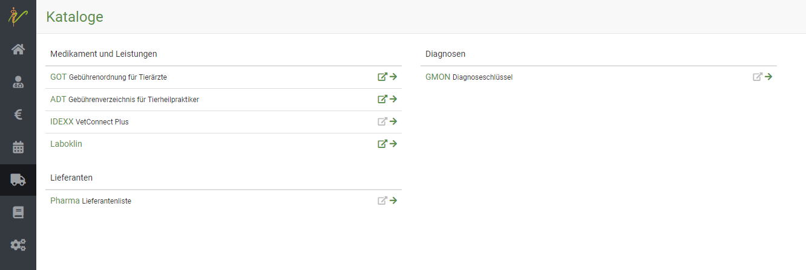  

Folgende Kataloge werden aktuell zur Verfügung gestellt

* GOT - Leistungen inkl. Preise nach der Gebührenordnung für Tierärzte inkl. Gebührenziffer
* ADT - Leistungen inkl. Preise für Tierheilpraktiker gemäß ADT
* IDEXX - Laborleistungen inkl. Preise (Einkauf und Verkauf, beinhaltet ebenfalls die möglichen Tests mittels VetLab-Station)
* Laboklin - Laborleistungen inkl. Preis (Einkauf und Verkauf)
* Pharmaliste - Liste der gängigsten Pharmahersteller als auch Distributoren
* GMON - Diagnoseschlüssel für Hunde, Katzen, Pferde, Rinder und Schweine 
* Barsoi-Liste - Medikamentenpreise  (muss getrennt bei Barsoi bezahlt werden und ist nur dann nutzbar)

## Katalog importieren  

Klicken Sie auf **Warenwirtschaft** (LKW-Symbol) und dann **Kataloge**.  

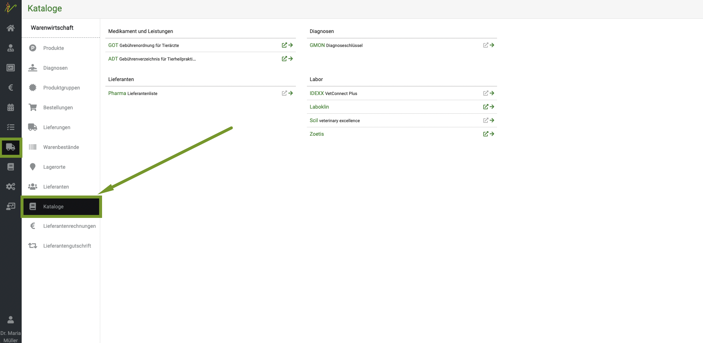  

Klicken Sie auf den Pfeil nach rechts neben dem gewünschten Katalog, den Sie importieren oder näher begutachten möchten. 

Die Liste stellt alle Leistungen des ausgewählten Katalogs - hier GOT - dar. Sie können die Liste wie alle Listen in 
debevet wie gewohnt filtern und sortieren.  

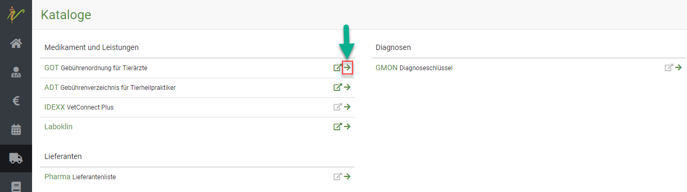

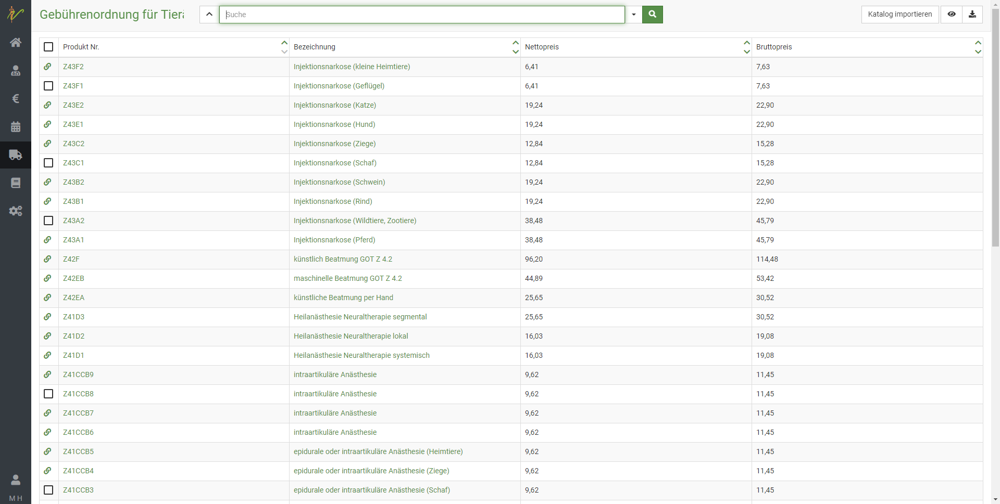  

### Ausgewählte Einträge eines Katalogs übernehmen  

Jeder Eintrag (Zeile) kann einzeln angekreuzt werden, um so mit dem Button ganz rechts oben im Menü der Seite importiert
zu werden. Hat ein Eintrag kein Ankreuzfeld, sondern als Symbol eine Büroklammer, so haben Sie diesen bereits in Ihr debevet 
importiert.  

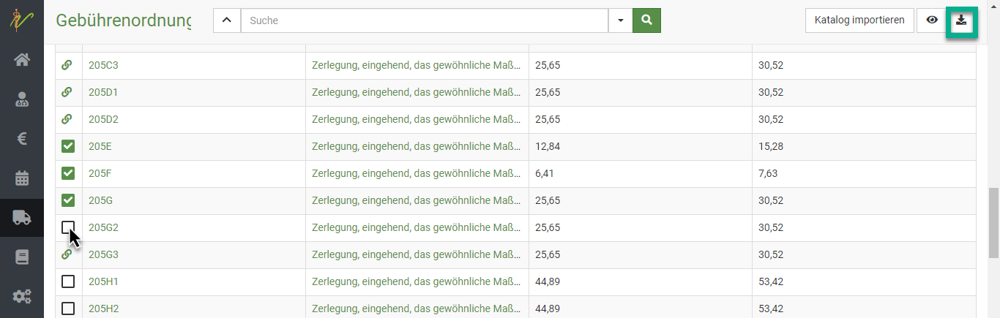  

### Vollständigen Katalog importieren  

Klicken Sie auf den Button **Katalog importieren**, so wird der ganze Katalog in Ihr debevet übernommen. Bei einigen Katalogen,
wie in diesem Beispiel der GOT, erhalten Sie noch eine Vorauswahl, bei der Sie bspw. Einträge ausgewählter Spezies vorselektieren können.

Klicken Sie hier abschließend auf **Importieren**, so wird der Katalog gemäß Ihrer Auswahl importiert.   

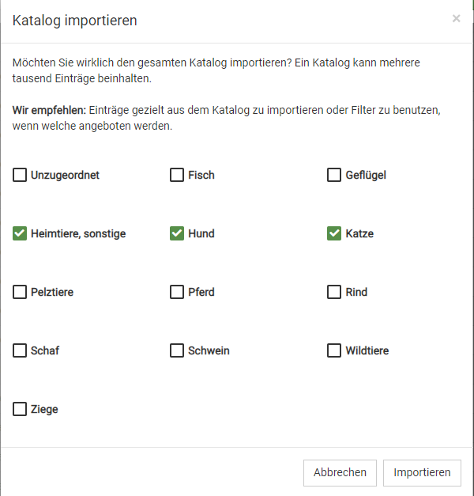  

## Aktualisierung der Kataloge und individuelle Anpassungen  

Aus Katalogen übernommene Einträge finden Sie nach dem Import wie alle Produkte und Dienstleistugen in Ihrem Gesamtkatalog
unter **Warenwirtschaft** → **Produkte**.   

Im Gegensatz zu Produkten und Leistungen, die von Ihnen manuell erfasst wurden,
werden Einträge aus Katalogen allerdings von debevet automatsich und kontinuierlich aktualisiert.  

Wenn Sie importierte Katalogeinträge nach dem Import ändern bzw. selber verwalten möchten, sollten Sie die **Aktualisierung 
deaktivieren**, da debevet sonst bei der nächsten Aktualisierung Ihre Änderungen zurücksetzt. 

Um die Aktualsierung zu deaktivieren, gibt es zwei Möglichkeiten.   

1. Klicken Sie auf **Administration** (Zahnradsymbol) - **Einstellungen** und 
wählen Sie den Reiter Warenbestand aus. Dort können Sie die Aktualisierung für alle Kataloge oder das Lieferantenverzeichnis abbestellen. 

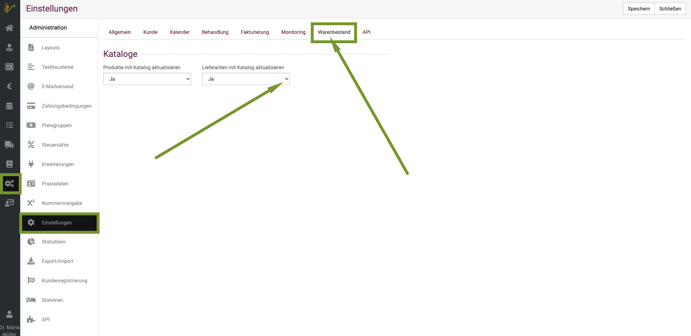   

2. Wenn Sie nur einzelne ausgewählte Einträge von der Aktualisierung ausschließen möchten, können Sie den Eintrag unter
**Warenwirtschaft** → **Produkte** suchen und auf der Bearbeitungsseite des Produktes das Feld **Mit Katalog aktualisieren** deaktivieren.  
  
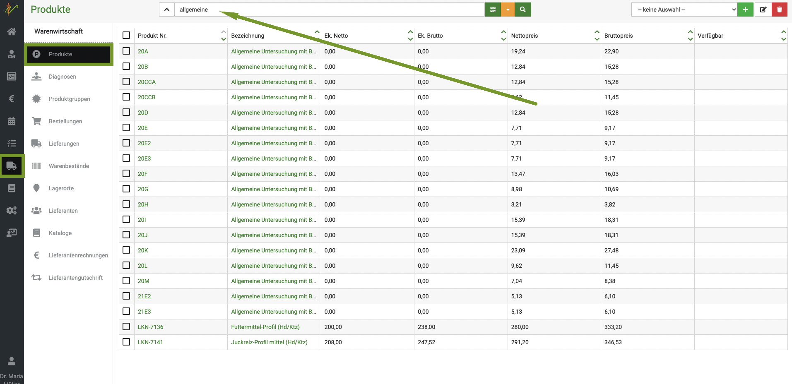   

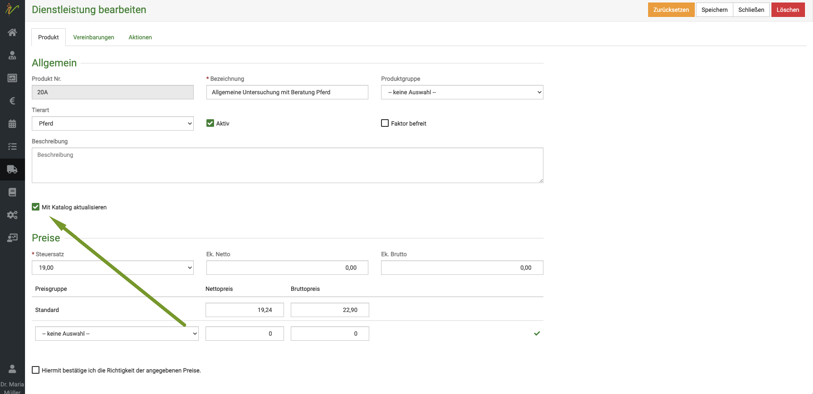  

## Angepasste Preise zurücksetzen

:::tip Tipp   

Sollten Sie einen Katalogeintrag z.B. aus der GOT individuell angepasst haben, so können Sie diesen jederzeit wieder auf 
die Eingaben aus dem Katalog zurücksetzen indem Sie nach dem Aufrufen der Dienstleistung oben rechts auf **Zurücksetzen** klicken. 

:::  

## Barsoi Liste integrieren/ importieren  

Natürlich haben Sie bei debevet die Möglichkeit, die Barsoi-Liste zu hinterlegen, um alle Medikamentenpreise direkt nutzen zu können. Ab
Juni 2026 wird diese voll automatisch eingebunden und aktualisiert sich selbst. 

Die Barsoi muss bei Barsoi selbst getrennt bezahlt werden, diese ist nicht in den Kosten für unsere Software enthalten. 

:::caution WICHTIG!   

Sie benötigen zum Nutzen der Barsoi Erweiterung Ihre Kundennummer. Die Erweiterung muss von Ihnen eingerichtet werden (wir helfen
gern!)    

:::  

Um die Erweiterung zu aktivieren, klicken Sie auf die Zahnräder und dann "Erweiterungen". Scrollen Sie herunter,  bis Sie "Barsoi" 
finden und klicken Sie "Anlegen".  

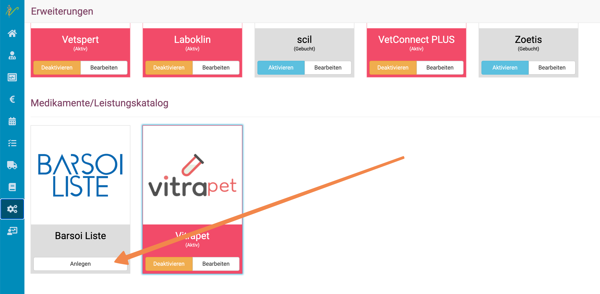

Hier müssen Sie nun Ihre Kundennummer von Barsoi eingeben und wählen, welches Paket Sie dort zahlen. Bitte geben Sie alles korrekt ein,
denn dies wird von Barsoi überprüft, sollten die Daten nicht stimmen, wird die Nutzung im debevet deaktiviert. 
  
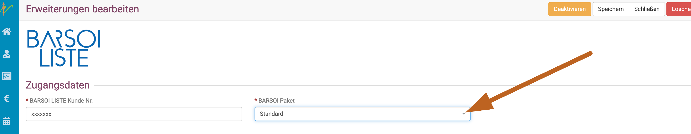

### Ganzer Katalog oder nur Teile der Barsoi nutzen 

Da wir viele Nutzer hatten, die sich wünschten, nicht alle Produkte zu importieren, da ihnen dies zu  unübersichtlich sei, haben wir
ab sofort die Möglichkeit, auch nur Teile in den Produktkatalog zu importieren. Wenn Sie dies nutzen möchten, wählen Sie "nur Auswahl importieren".
Wenn Sie den gesamten Katalog importieren wollen, wählen Sie dies. Der Katalog wird dann automatisch importiert und auch bei neuen Produkten werden 
diese immer voll automatisch importiert. 

Wenn Sie die "Auswahl" Variante wählen, müssen Sie im Barsoi Katalog (dieser ist erst nach Aktivierung der Erweiterung sichtbar) 
selbst wählen und importieren. (Selber Ablauf wie im GOT Katalog)    

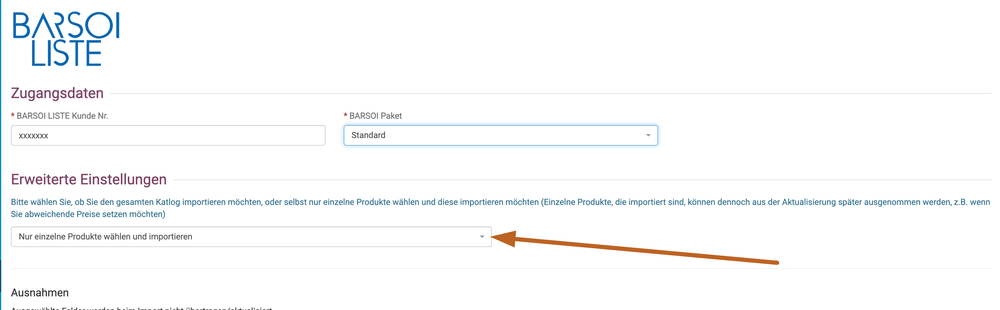

### Einzelne Felder nicht überschreiben/aktualisieren  

Da es immer wieder Nutzer gibt, die einzelne Felder ändern wollen, und diese dann nicht mit überschreiben lassen wollen, haben wir dies mit 
eingerichtet. 
Wenn der Haken an einem dieser Auswahlfelder aktiv gesetzt ist, bedeutet dies, dass die Barsoi nur alle anderen Felder "erneut abholt" und das
gewählte Feld für KEIN Produkt mehr überschreibt.    

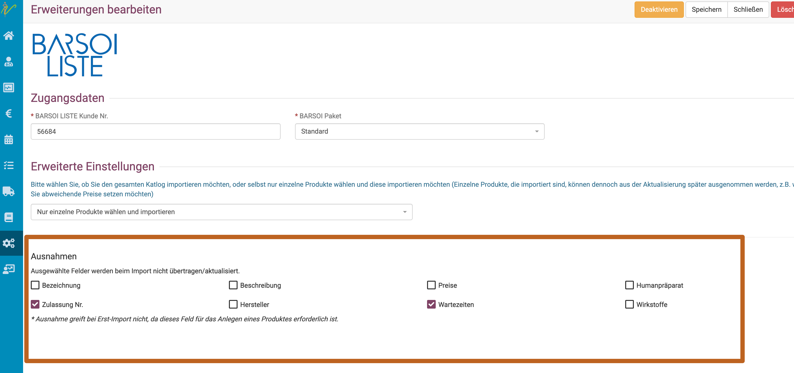

### Einzelne Produkte nicht überschreiben  

Wenn Sie an einzelnen Produkten Änderungen am Preis oder den Packungsgrößen vorgenommen haben, können Sie diese Produkte einzeln 
aus der Aktualisierung "ausklammern". Um dies an einem Produkt vorzunehmen, gehen Sie wie folgt vor:   

Öffnen Sie das gewünschte Produkt. Deaktivieren Sie nun den Toggle Button "Mit Barsoi aktualisieren".   

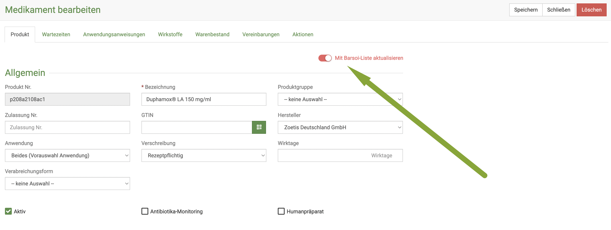   

Nun werden beim nächsten Barsoi Upload, auch wenn der Haken "bereits bestehende überspringen" entfernt wurde, dennoch die Daten 
dieses Produktes **nicht** überschrieben.   

### Häufige Fragen zur Barsoi Liste  

1. Wenn ich vorher manuell Produkte angelegt habe und nun die Barsoi Liste importiere und nutzen will, muss ich die inventurpflicht manuell neu setzen?

Ja. Da die Liste alle Produkte mit neuen Produktnummern komplett neu liefert, kann die debevet Software nicht wissen, dass das dieselben Produkte sind,
die bei Ihnen im Schrank stehen. Wenn Sie also die Produkte aus der Liste nutzen wollen, empfehlen wir, ihren Bestand auf die neuen Produkte zu übertragen und die alten,
manuell angelegten Produkte zu löschen- so bleibt es übersichtlicher.
In diesem Rahmen müssen Sie dann, wenn Sie dies nutzen wollen, auch die Produkte wieder auf "inventurpflichtig" setzen. 

:::info Zur Erinnerung: 

"Inventurpflichtig" bedeutet, dass bei der Nutzung bereits die Charge automatisch gewählt ist, wenn Sie das Medikament in die Behandlung eingeben. 
Wenn der Haken nicht gesetzt wird, muss immer erst noch manuell eine Charge gewählt werden. Nur bei gewählter Charge wird das Produkt im Bestand "abgezogen" bei Nutzung.

:::

2. Wenn ich bei einem Produkt aus der Barsoiliste etwas manuell ändere, wird das beim nächsten Import wieder überschrieben?
Sie können wie oben beschrieben, Produkte bei denen Sie nicht wollen, dass deren Daten wieder überschrieben werden, diese einzeln
ausnehmen aus der Aktualisierung. Ansonsten werden die Daten, die Barsoi liefert wieder überschrieben.

