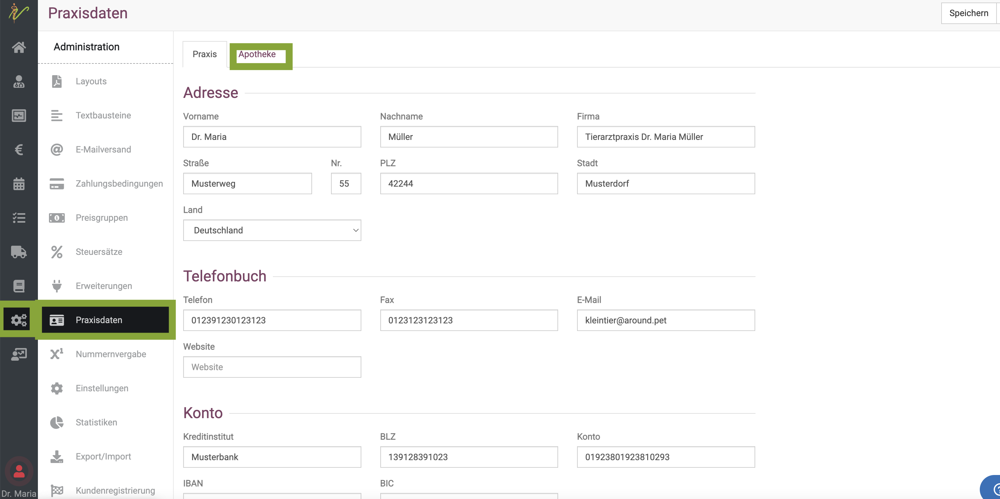
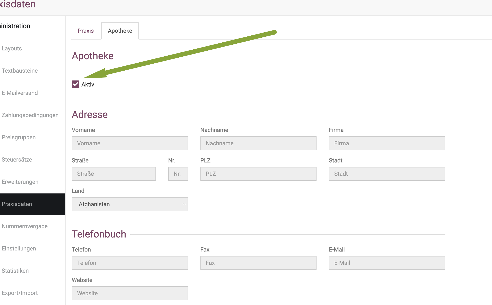
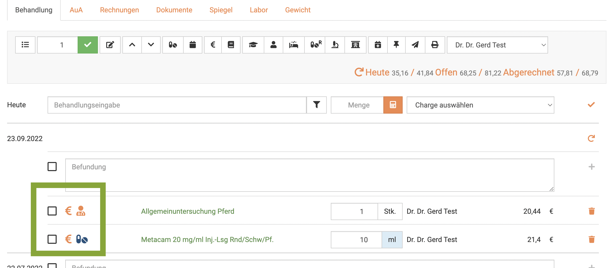
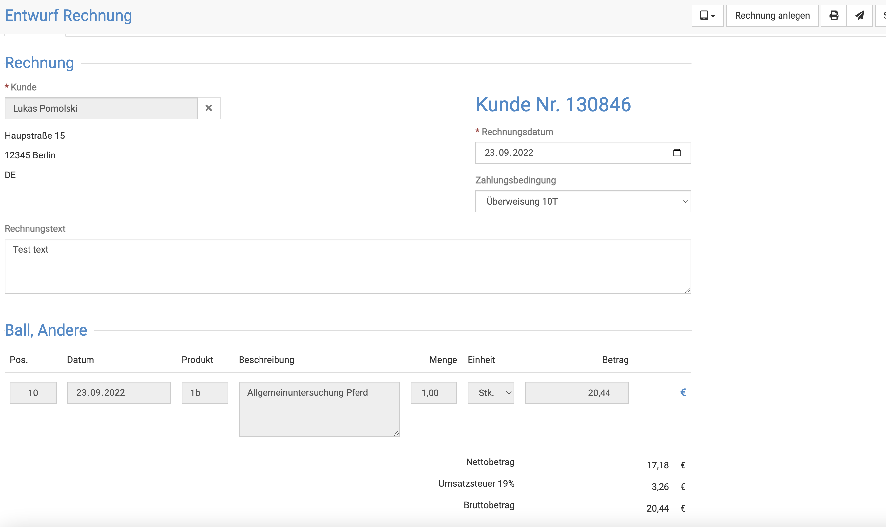
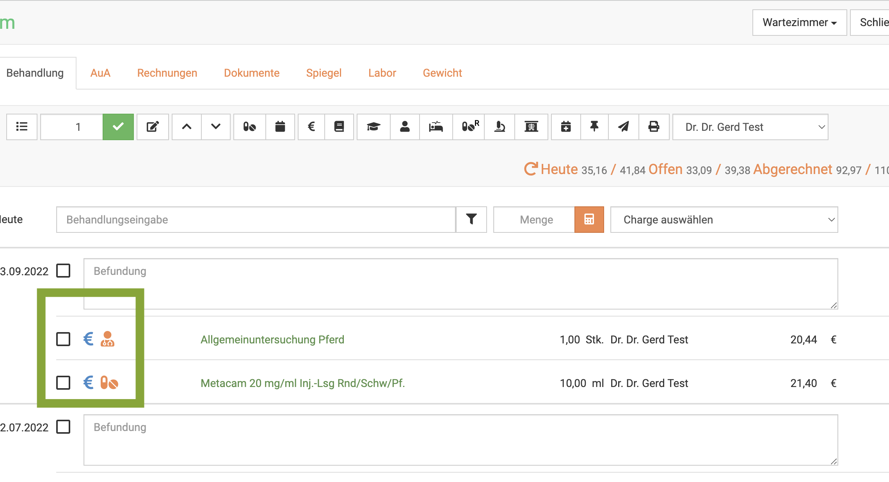

# Apotheke als eigene Firma

Sie betreiben Ihre tierärztliche Hausapotheke als getrennte Firma und benötigen also eigene Rechnungen für Ihre Hausapotheke?
Unsere debevet Software bietet die Möglichkeit, die Apotheke getrennt zu firmieren und somit eigene Rechnungen für alle abgegebenenen Medikamente zu erstellen.

:::caution Zu Bedenken:  

Dies bedeutet, dass Sie bei jeder Abgabe von Medikamenten bei Behandlungen zwei Rechnungen erzeugt werden (je nach Arbeitsweise automatisch erzeugt werden, siehe 
Anleitung). Versenden bzw. drucken müssen Sie diese aber immer getrennt. 

:::

## Apotheke als Firma anlegen  

Zunächst müssen Sie aktivieren, dass Sie die Apothekenfirmierung nutzen wollen und die Daten für Ihre Apotheke hinterlegen.

Klicken Sie auf **Administration** und dann **Praxisdaten**. Dort wählen Sie den Reiter **Apotheke**  

  

Nun müssen Sie den Haken oben auf **Aktiv** setzen und dann alle Daten für die Apotheke als eigene Firma eintragen. 
Klicken Sie anschließend oben rechts auf **Speichern**.

:::danger  ACHTUNG

Nutzen Sie diese Funktion wirklich NUR, wenn Sie Ihre Apotheke als eigene Firma steuerlich angemeldet haben! 

:::

   

Nun ist die Apotheke getrennt firmiert nutzbar.

## Rechnungen für die Apotheke erstellen 

Sie können wie gewohnt an allen Posten (inkl. der abgegebenen Medikamente) in der Behandlung die Checkbox aktivieren und dann oben auf das **Rechnung-erstellen
Symbol** klicken.
Die Rechnungsvorschau zeigt Ihnen immer nur die Rechnung für Ihre Praxis, die abfgegebebenen Medikamente fehlen darauf. 
Hier ein Beispiel einer "gemischten Behandlung" mit Abgebe und Behandlung.

Wenn Sie diese abrechnen, wird nur der Behandlungsposten auf die Rechnung gestellt:

  

Dennoch wird im Hintergrund die Rechnung für die Apotheke ebenso erstellt, was am blauen € Symbol erkennbar ist:

Um die Apothekenrechnung anzuzeigen/zu verschicken, klicken Sie auf das blaue Euro-Symbol am Medikamenten-Posten. Nun können sie diese wie gewohnt drucken/versenden 
und verbuchen.

