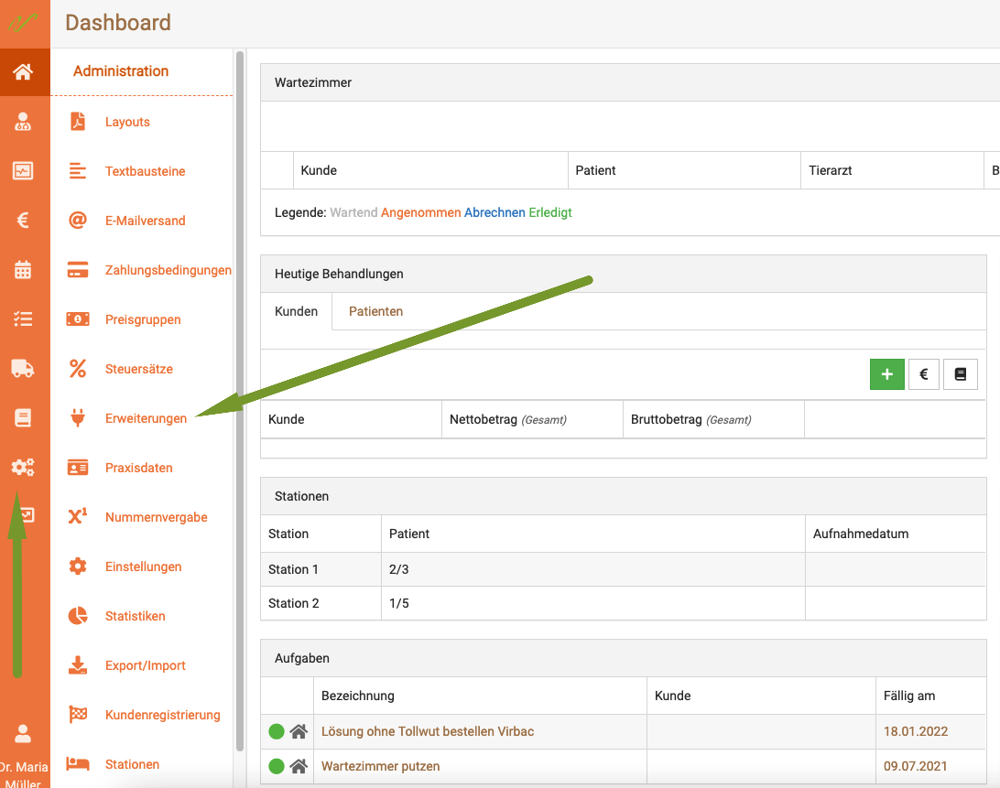
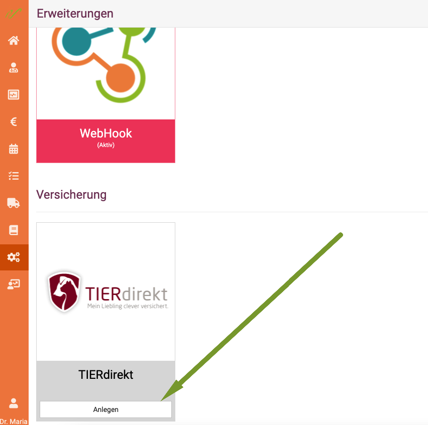
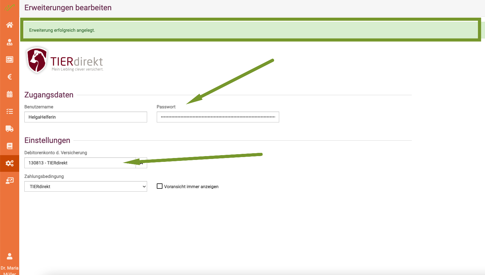
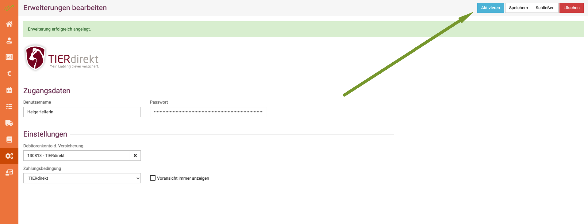

# tierDIREKT Schnittstelle einrichten  

Um die Schnittstelle einzurichten, klicken Sie zunächst auf das **Zahnradsymbol** und dann auf **Erweiterungen**.  

   
 
Scrollen Sie nun herunter, bis Sie das tierDIREKT Symbol sehen. Klicken Sie dort auf **anlegen**.  

  

In der sich nun öffnenden Maske müssen Sie Ihre Zugangsdaten von tierDIREKT eingeben. Sie haben noch keine?   
Sie bekommen diese direkt bei tierDIREKT:  https://www.tierdirekt.de/fuertieraerzte  

:::caution Achtung!   

Sie müssen zwangsläufig eine Debitorenkontonummer hinterlegen. Hierzu hinterlegen Sie bitte unter „Einstellungen“
das Debitorenkonto und die Zahlungsbedingung. Den Debitor (Kunden) müssen Sie zuvor als Kunden 
(mit dem Namen "TIERdirekt" bei Firma) anlegen. 

:::    

Dass Ihre Zugangsdaten korrekt sind, sehen Sie daran, dass oben eingeblendet wird "Erweiterung erfolgreich angelegt".  

Klicken Sie nun oben rechts auf **aktivieren**.   

:::tip Tipp  

Wir empfehlen die Voransicht (der Rechnung an die Versicherung) zu aktivieren, damit Sie immer einen sauberen Überblick
über die zugesagten Versicherungsleistungen erhalten.   

:::

