# Medikamentendatenbank "Vitrapet"  

Seit November 2023 bietet debevet eine Schnittstelle zu einer Medikamentendatenbank namens Vitrapet. 
Diese Datenbank holt die Daten zu den Medikamenten aus div. Herstellerportalen und verschiedenen Anbietern und ist nicht 
Barsoi-abhängig.

Die Daten werden jede Nacht automatisch aktualisiert, ohne, dass Sie selbst etwas aktiv einspeisen/importieren müssen.

Es gibt eine "Feedback" Funktion, mit der Sie Abweichungen/Änderungen etc. melden können, diese werden dann überprüft und bei 
Korrektheit im System direkt geändert. 

Bitte beachten Sie, dass die Vitrapet Liste ein externer Anbieter ist, wir stellen lediglich die Schnittstelle zur Verfügung. Bei Fragen 
zu deren AGB wenden Sie sich bitte an den Anbieter.

## Vitrapet Erweiterung aktivieren  

Zunächst muss die Erweiterung aktiviert werden. Klicken Sie dazu auf **Administration** und dann **Erweiterungen**- Scrollen Sie 
ganz nach unten, bis zur Kachel Vitrapet. 
Klicken Sie dort **Anlegen**. 

 

Nun müssen Sie sich für die Nutzung bei Vitrapet registrieren. Klicken Sie hierfür auf "Jetzt registrieren".   

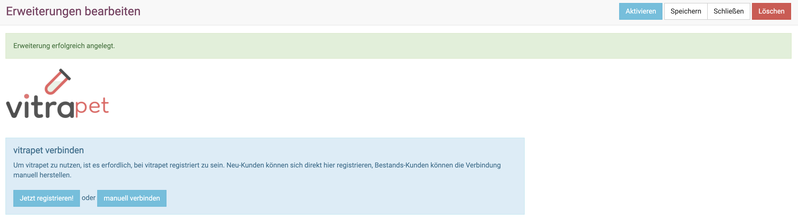  

Akzeptieren Sie die AGB von Vitrapet, um fortzufahren. 

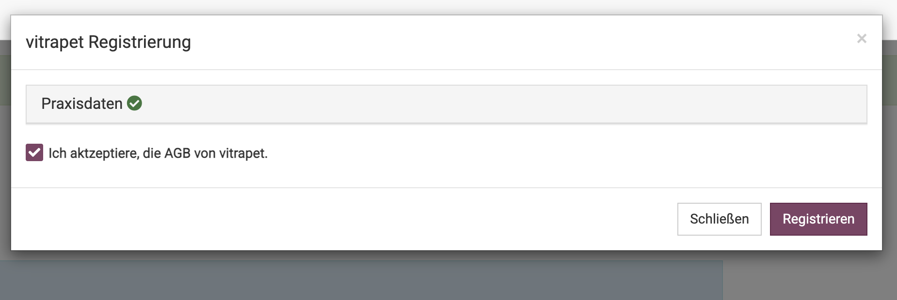

Sie erhalten eine grüne Erfolgsmeldung, dass Ihre Registrierung erfolgreich war. Ihr API Schlüssel ist automatisch erzeugt und eingefügt.

Um die Schnittstelle zu aktivieren, klicken Sie nun oben rechts **Aktivieren** (grüner Button).

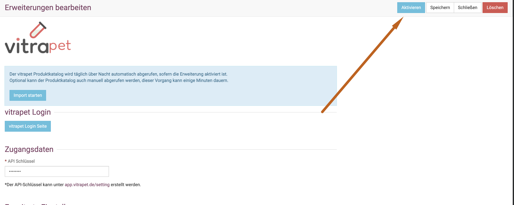

## Medikamente importieren/ anlegen 

Sie können nun den Erst-Import einmalig manuell durchführen. Die Aktualisierung der Daten erfolgt danach automatisch jede Nacht, kann
aber auch jederzeit auf Wunsch manuell angestoßen werden.   

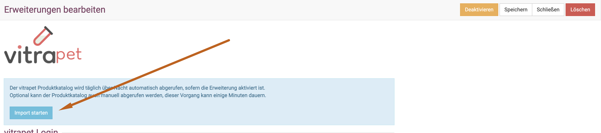  

Achtung, der erste Import kann einige Zeit dauern!  

:::caution Achtung!  

Es werden für viele Medikamente nun neue Nummern angelegt, so dass Duplikate entstehen! Lernen Sie im nächsten Schritt, wie Sie die Duplikate suchen und 
zusammenführen können, so dass es übersichtlicher wird und der Warenbestand übernommen wird. 

:::  

## Duplikate im Produktkatalog  

Um Duplikate zu suchen und zusammenzuführen, klicken Sie auf **Produkte** und dann **Duplikate**.  

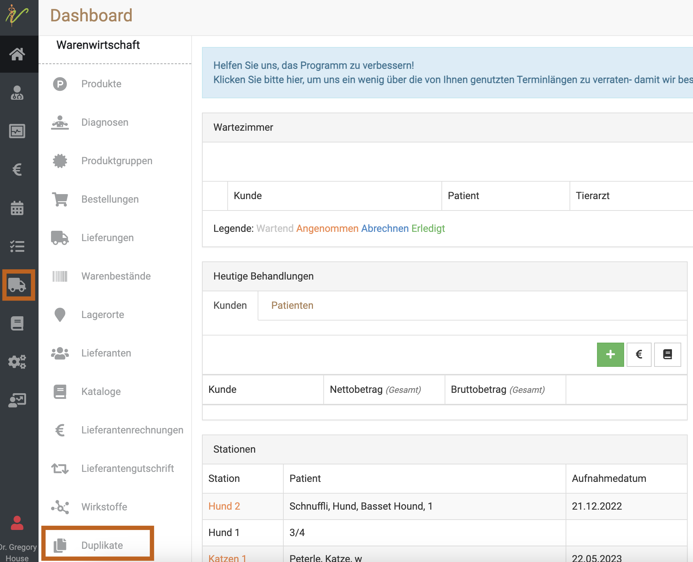

Klicken Sie nun oben rechts auf **Duplikate suchen**.  

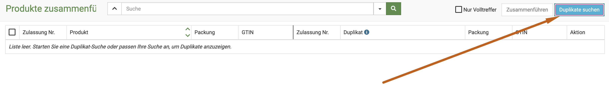

Wählen Sie nun aus, welche Duplikate geprüft werden sollen:  

* ab einem gewissen Datum oder 
* aus Barsoi/Vitrapet  

Klicken Sie dann in diesem Auswahlfeld **Duplikate suchen**.

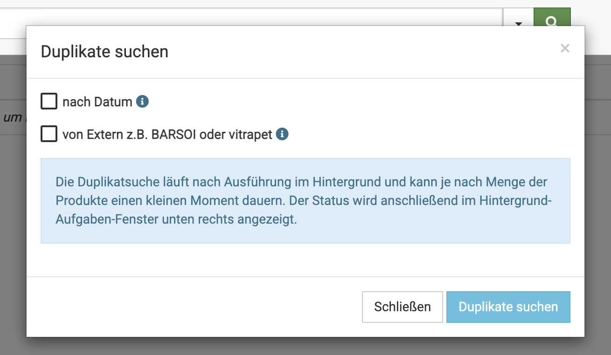

Klicken Sie nun nach einer kurzen Wartezeit unten rechts auf das kleine "Quadratsymbol", um das Ergebnis der Suche anzeigen zu lassen. 

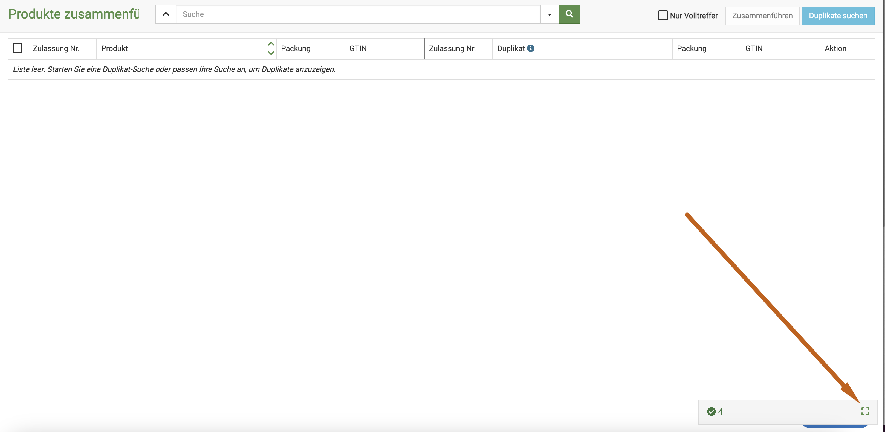  

Klicken Sie dann den grünen Button "Dupklikate zusammenführen".

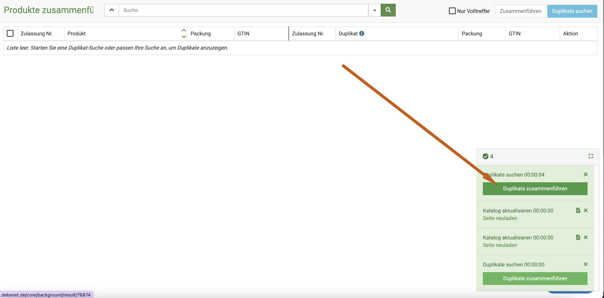 

Nun sehen Sie eine Liste, in der die Medikamente mit umit anderen bereits vorhandenen verglichen und in unterschiedlichen Farben hinterlegt sind.
(Links "alt", rechts "neu")

Grün bedeutet dabei, dass es 100% dasselbe Produkt ist.
Gelb bedeutet, dass es eventuelle Abweichungen gibt, diese Produkte sollten unbedingt von Ihnen kontrolliert werden. 

:::caution Achtung: 

Wenn bei "gelben" Produkten die Packungseinheiten abweichen, da Vitrapet ein komplexeres System zur Angabe der Einheiten hat, 
prüfen Sie bitte, ob dort ein Warenbestand vorliegt. Wir raten davon ab, Produkte mit einem Warenbestand zusammenzuführen, wenn dort eine Einheiten-Abweichung vorliegt. 

Unsere Empfehlung zum Umgang damit lesen Sie bitte weiter unten. 

:::    

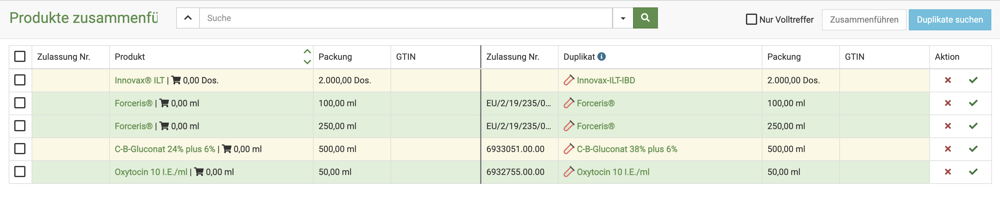

### Umgang mit den Duplikaten  

Die grünen Duplikate können Sie ohne Probleme direkt zusammenführen. Um kurzzeitig die "gelben" auszublenden, klicken Sie oben 
den Haken "nur Volltreffer". Die Liste zeigt nun zunächst alle "grünen" Produkte.   

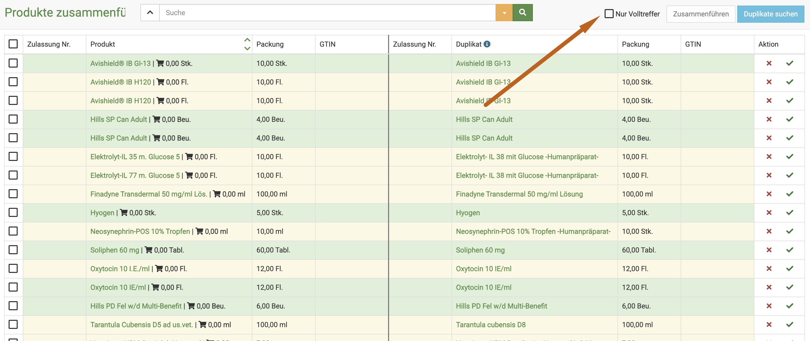  

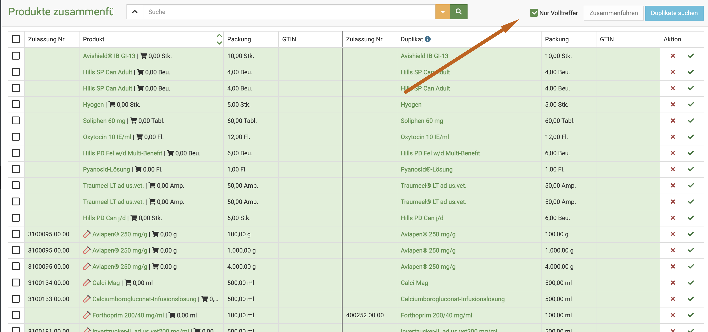
 
Markieren Sie mit einem Klick in das Kästchen oben links alle grünen Einträge.  

Anschließend klicken Sie oben rechts "zusammenführen".  

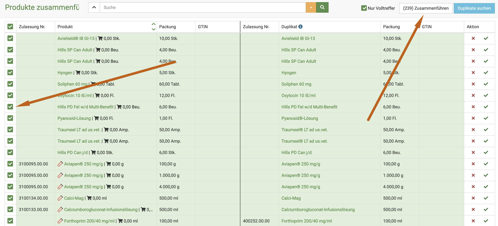

Alle diese Produkte wurden nun zusammengeführt und sind nicht mehr doppelt vorhanden.

Natürlich können Sie auch einzelne Produkte zusammenführen, klicken Sie dazu auf den grünen Haken am Ende der
betreffenden Zeile.  (Spalte "Aktion")  

Entfernen Sie nun den Haken "Volltreffer".

Nun sehen Sie alle "gelben" Produkte aufgelistet. Wir raten davon ab, diese ohne einzelne Überprüfung zusammenzuführen. 

Prüfen Sie die Namen, evtl. Konzentrationsangaben im Namen,  die Packungseinheiten und ob evtl. Warenbestände bestehen.  

Wenn Sie Differenzen sehen, können Sie mit dem Klick auf das rote Kreuz dieses Produkt "zurückstellen", es wird also nicht zusammengeführt.

Wenn die Differenzen kein sichtbares Problem darstellen für Sie, können Sie dieses mit dem Klick auf den grünen Haken zusammenführen.   

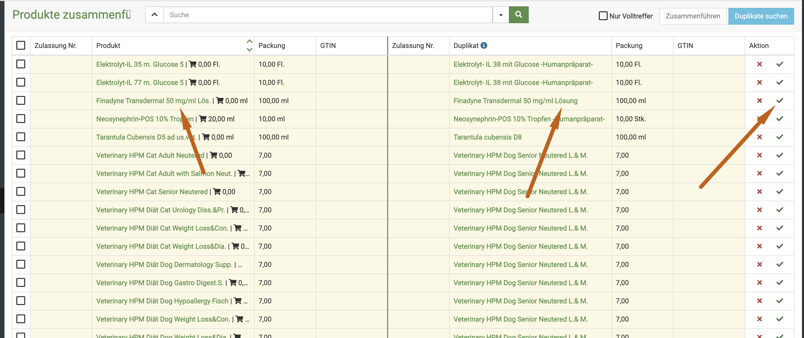

### Umgang mit Einheitenabweichungen bei Warenbestand

Da das Vitrapet System ein "inneres" und ein "äußeres" Behältnis kennt und erzeugt, kann dieses System anders als die Barsoi, die Einheiten oftmals
besser abbilden. Ein beliebtes Beispiel hierfür ist Buscopan comp. 
Die Barsoi-Import Variante dieses Produktes nutzt (leider) als Einheit " Eine Flasche", was die Abgabe extrem umständlich macht. 

Vitrapet hat hier eine andere Logik: das "äußere Behältnis" ist eine Flasche, das "innere Behältnis" ist 100ml. 
So können auch bei Packungsgebinden die Abgabeeinheiten "feiner/genauer" dargestellt und berechnet werden. 

Besteht nun ein Warenbestand an einem "gelben Produkt" müssen Sie selbst prüfen, ob dieser so sinnvoll zusammenzuführen ist. 

:::danger  ACHTUNG: 
WENN Sie die Produkte zusammenführen, wir die ALTE Einheit an das "neue" Produkt übertragen. Dies hat den Grund, dass wir die Inventur- bzw.
Verbrauchslisten nicht verändern können und dürfen. Somit ist eine Änderung einer Einheit bei einem Produkt mit bestehendem Warenbestand nicht erlaubt!)  

:::   

Wenn Sie auf die "neue" Einheit wechseln wollen, müssen Sie VOR der Zusammenführung einen der folgenden Wege wählen, um das Problem zu beheben: 

1. Sie korrigieren den Warenbestand auf NULL, merken sich die Chargennummer/schreiben diese auf und buchen die Packung am "neuen" Produkt erneut ein.
Natürlich müssen Sie anschließend am neuen Produkt den Warenbestand auf den aktuellen Bestand korrigieren. Eine genaue Anleitung dazu finden Sie hier:
   https://handbuch.debevet.de/docs/Praxisalltag/Praxisalltag#5-digitalte-verwaltung-der-apotheke-im-laufenden-betrieb

2. Sie brauchen die Packungen, die noch vorhanden sind auf und buchen bei der nächsten Lieferung den Warenbestand auf das "neue Produkt".   

Anschließend können Sie erneut eine Zusammenführung der Produkte vornehmen.

Teilweise stellen die Zusammenführungen kein größeres Problem dar, hier ein Beispiel mit einer Augensalbe, bei der die Packungseinheit 
dann von 5ml auf 5g geändert werden würde. Hier bleibt es dann Ihre individuelle Entscheidung, ob Sie diese zusammenführen wollen.

Bedenken Sie dabei bitte, dass bei bestehendem Warenbestand die ALTE Einheit übernommen wird, bei fehlendem Warenbestand die NEUE Einheit
übernommen wird. (In meinem Beispiel hier besteht ein Warenbestand, somit würde es bei Milliliter bleiben!) 

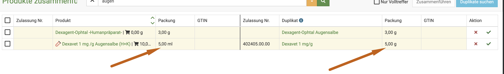

