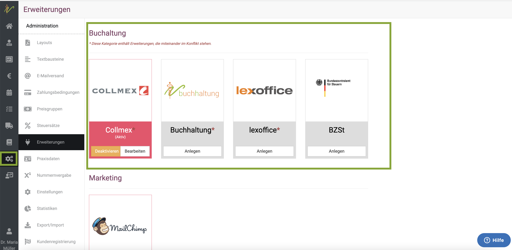
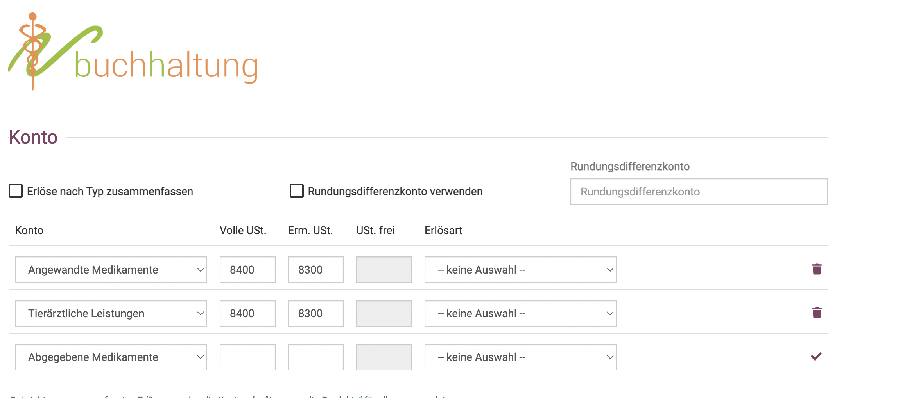
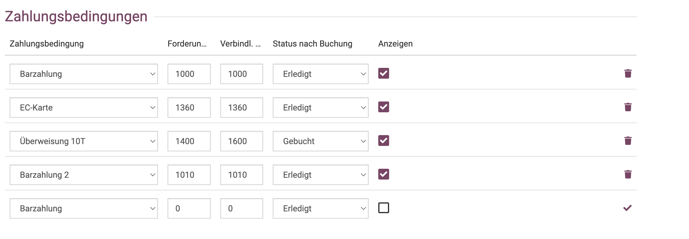
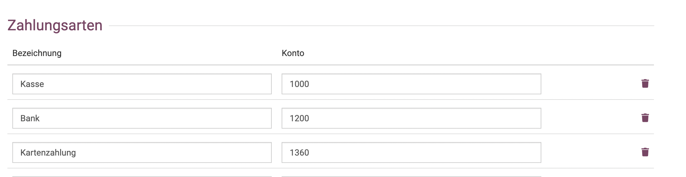
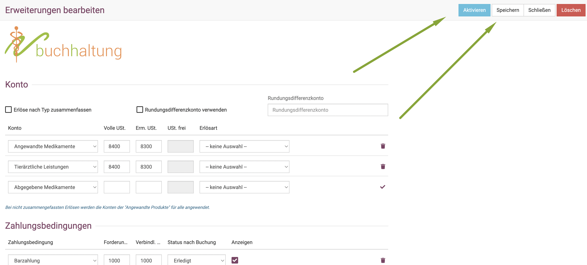
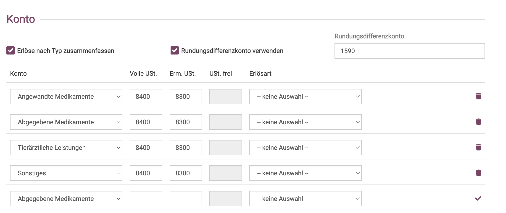

# debevet Buchhaltung

Unsere debevet Software bietet ein simples internes System, mit dem Sie einen guten Überblick über Ihre Buchhaltung haben.  

:::danger ACHTUNG!

Wir bitten zu beachten, dass die Erweiterungen der Buchhaltung, die mit einem Sternchen gekenntzeichnet sind (Collmex, lexoffice, debevet)
nicht GLEICHZEITIG betrieben werden können, und zu Konflikten miteinander führen können. Ein Wechsel zwischen den Systemen sollte 
kurz mit uns abgesprochen werden, damit wir Ihnen Tipps geben können, worauf Sie achten müssen.  

:::  

Um die Erweiterung zu aktivieren, klicken Sie auf **Administration** und dann **Erweiterungen**. 

Nun wählen Sie an der gewünschten Kachel **Anlegen**.   

  

Nun sehen Sie einen Überblick über die Möglichkeiten, verschiedene Konten zu hinterlegen. Achten Sie darauf, dass Sie bei den allgemeinen
Einstellungen den korrekten Kontenrahmen für Ihren Account hinterlegt haben. (**Administration** -> **Einstellungen** -> **Fakturierung**).

### Konten allgemein

  

### Konten für Zahlungsbedingungen  

Hier müssen Sie die Buchhaltungskonten für die Zahlungsbedingungen hinterlegen. 

:::tip Tipp: 

Wenn Sie die Häkchen bei **Anzeigen** setzen, werden diese Salden auf dem Dashboard angezeigt, wenn Sie dies in den Einstellungen
als Anzeigeoption ausgewählt haben. 

::: 

    

Bei den Zahlungsbedingungen stellen Sie außerdem ein, auf welchen Status diese nach Rechnungserstellung gesetzt werden sollen.
:::tip Tipp:  

Wir empfehlen, dort bei EC-Karte und Barzahlung direkt **Erledigt** zu setzen, denn dann sind diese Rechnungen immer direkt **bezahlt** und
Sie sparen sich den Schritt, die Rechnung manuell auf bezahlt zu setzen.  

:::

### Konten für Zahlungsarten

    

Wenn Sie diese gesetzt haben, klicken Sie oben rechts zunächst auf **Speichern** und dann auf **Aktivieren**.  

  

:::caution Achtung 

Die debevet Buchhaltungs-Software bietet aktuell keine TSE konforme Kasse.

:::  

## ### Erlöse nach Typ zusammenfassen

Wenn Sie Ihre Erlöse je Typ (Leistung, Abgaben, Anwendungsprodukte und Sonstiges) auf verschiedene Erlöskonten buchen
möchten, so aktiveren Sie dieses Merkmal durch ankreuzen und geben Sie für die Typen die jeweiligen Erlöskonten aus
der Finanzbuchhaltung für die beiden Umsatzsteuersätze an. Bitte beachten Sie, dass Sie Konten, die nicht im
Standardkontenplan enthalten sind zuvor auch in Collmex angelegt haben.

Erzielen Sie ebenfalls Erlöse mit 0% Umstatzsteuer (z.B. durch Lieferung ins EU-Ausland), so können Sie
weitere Zeilen hinzufügen für den jeweiligen Typ und bei Erlösart einen Grund für die Umsatzssteuerfreiheit auswählen.
Wählen Sie dort z.B. den Eintrag 'innergemeinschaftliche Lieferung', so können Sie bei 0% USt. ein entsprechendes Erlöskonto vordefinieren.
Wenn Sie abschließend das Häckchen am Ende der Zeile klicken, wird Ihr Eintrag in die Maske übernommen und eine weitere Zeile für weitere 0%-Regelen erzeugt.

Klicken Sie abschließend auf **Speichern** oben rechts.

### Rundungs- und Differenzkonto nutzen

Wenn Sie die Erlöse nach Typ zusammenfassen, sollten sie unbedingt ein Rundungs- /Differenzkonto anlegen. Je nach genutztem Kontenrahmen fragen Sie gern
Ihren Steuerberater, welches dieses sein soll. Dort werden evtl. bei den getrennten Buchungen entstehende cent-Differenzen verbucht.

## Salden, Privateinlagen, Privatentnahmen

Um in der debevet Buchhaltung Privatentnahmen oder Privateinlagen einzugeben, klicken Sie auf **Buchhaltung** und dann **Belege**. 

Dort sehen Sie oben rechts **Vorlagen**  

  

Wenn Sie dort klicken, öffnet sich eine Maske, in der Sie aus verschiedenen Optionen wählen können. 

* Kontoeröffnung  
* Saldenvortrag  
* Privateinlage  
* Privatentnahme  

  

Bei Jahreswechsel können Sie hier beispielsweise die Saldenvorträge eintragen, die Ihnen auf dem Dashboard angezeigt werden sollen. 
Bei Kontoeröffnung können Sie beim Start der Nutzung dann Einträge hinterlegen, damit diese korrekt angezeigt werden.

