# Lexoffice Buchhaltung  

:::danger ACHTUNG!

Wir bitten zu beachten, dass die Erweiterungen der Buchhaltung, die mit einem Sternchen gekenntzeichnet sind (Collmex, lexoffice, debevet)
nicht GLEICHZEITIG betrieben werden können, und zu Konflikten miteinander führen können. Ein Wechsel zwischen den Systemen sollte
kurz mit uns abgesprochen werden, damit wir Ihnen Tipps geben können, worauf Sie achten müssen.

:::  

Um die Erweiterung zu aktivieren, klicken Sie auf **Administration** und dann **Erweiterungen**.

Nun wählen Sie an der gewünschten Kachel **Anlegen**.

  

## Lexoffice einrichten  

Zunächst muss die Schnittstelle aktiviert und verbunden werden. Die Kosten für lexoffice und die Einrichtung des Accounts muss 
direkt über lexoffice erfolgen.  

Klicken Sie im debevet (als Administrator angemeldet) auf **Administration** und dann **Erweiterungen**. An der Kachel "lexoffice" 
klicken Sie auf **Anlegen**.  

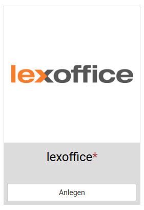  

### Authentifizieren   

Klicken Sie nun auf der sich öffnenden Seite auf den blauen Button **Authentifizieren**.   

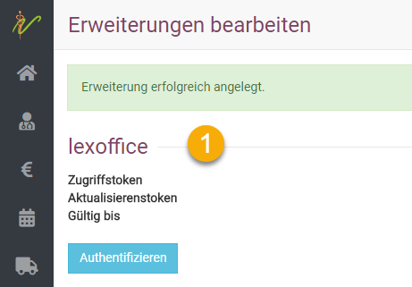  

Das Programm leitet Sie nun zur Anmeldeseite von lexoffice weiter. Dort müssen Sie Ihre lexoffice Zugangsdaten eingeben. 

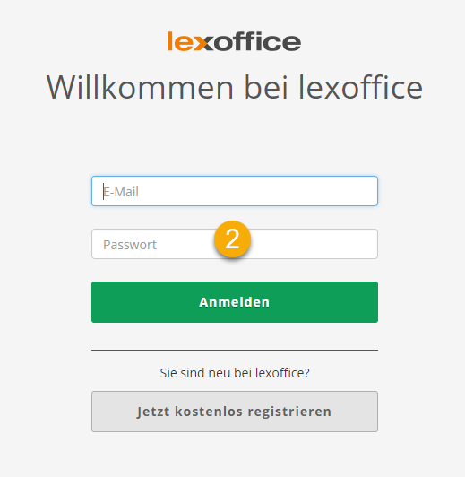   

Sie müssen nun debevet den Zugriff auf lexoffice erlauben, indem Sie den grünen Button **Zugriff erlauben** klicken. 

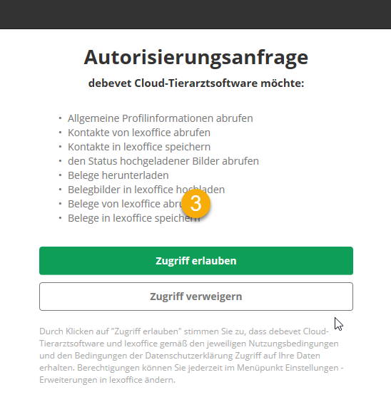  

Nun werden Sie automatisch zurück zu debevet geleitet und sehen an dem Zugriffstoken, dass die Authentifizierung erfolgreich war.  

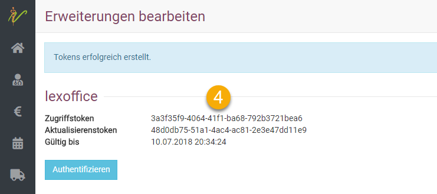  

### Synchronisiseren  

Kreuzen Sie **Belege hochladen an**, wenn Sie wünschen, dass debevet neben dem reinen Buchhaltungssatz ebenfalls das 
Original-Belegbild im PDF-Format (Kundenrechnung, Lieferantenrechnung, Gutschrift an Kunden und Gutschrift von Lieferanten) an lexoffice überträgt.

Wenn Sie **Kunden anonymisieren** oder **Lieferantendaten** anonymisieren ankreuzen, sorgt debevet dafür, dass lediglich 
ein Rückschluss über die Kunden- bzw. Lieferantennummer in lexoffice (Debitor, Kreditor) auf die Personendaten in debevet 
möglich ist und keine Personendaten aus debevet an lexoffice weitergegeben werden. Andernfalls überträgt debevet Ihre Kunden- bzw. 
Lieferantendaten (nur der primäre Rechnungsemfänger) an lexoffice und schickt auch künftige Änderungen dieser Daten in debevet 
an lexoffice (Ein-Weg-Synchronisierung).  

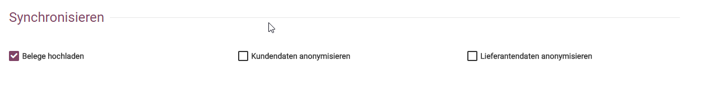

:::caution Achtung  
Zusätzliche Liefer- oder Patientenadressen werden aus debevet nicht an lexoffice übertragen.  

:::

### Medikamtenabgabe als Dienstleistung verbuchen  

Wenn Sie den Haken bei Angewendete Medikamente als Dienstleistung setzen, wird debevet Medikamente und Produkte, 
die Sie Rahmen Ihrer tierärtzlichen oder sonstigen therapeutischen Tätigkeit verwenden nicht wie Ihre sonstigen Abgaben 
und Verkäufe als Warenverkäufe in lexoffice buchen, sondern diese Produkte ebenfalls wie Ihre Tätigkeit als Dienstleistung 
unter der Berücksichtigung des jeweiligen Steuersatzes (19%, 7%) buchen.   

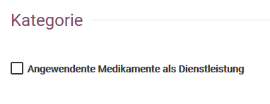  

:::caution Hinweis  

Hinweis: Dies kann wichtig sein, wenn Verkäufe einen hohen Anteil an Ihren Praxisumsätzen haben und Sie diesen Anteil 
nicht noch durch Ihre Anwendungsmedikamente (z.B. Impfstoffe) erhöhen möchten, da Sie so unter Umständen in Gefahr kommen, 
Ihr Freiberufler-Privileg zu verlieren und gewerbesteuerpflichtig zu werden. Bitte sprechen Sie hierzu mit Ihrem Steuerberater.  

:::  

### Zahlungsbedingungen  

Legen Sie in dieser Liste für jede von Ihnen in debevet hinterlegte Zahlungsbedingung fest, wie der Status der jeweiligen
Rechnung in debevet nach erfolgter Buchung ist (Erledigt, Gebucht).

Wir empfehlen, alle Zahlungen via Karte oder bar auf **Erledigt** zu setzen, damit Sie keine zusätzliche Arbeit damit haben, diese 
später noch manuell alle als bezahlt verbuchen zu müssen.  

Dahingegen werden Rechnungen mit der Zahlmethode **Überweisung** in der Regel nach erfolgter Buchung als **Gebucht** gekennzeichnet,
da Sie noch die tatsächliche Zahlung der Rechnung durch den Kunden erwarten. So können Sie leichter und schneller filtern, welche Rechnungen
noch offen sind.

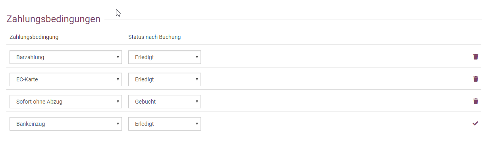   

## Kunden und Lieferanten übertragen   

Sollten Sie lexoffice in debevet erstmalig aktivieren, nachdem Sie bereits Kunden und Lieferanten in debevet erfasst
haben, so sollten Sie einmal auf den Button **Kunden nach lexoffice** und **Lieferanten nach lexoffice** klicken.
debevet überträgt dann einmal alle Kunden und Lieferanten nach lexoffice als Debitoren bzw. Kreditoren.
Bei aktiver Schnittstelle werden Kunden- und Lieferantendaten künftig stets live von debevet nach lexoffice übertragen.

Es findet keine Übertragung von Kunden- und Lieferantendaten von lexoffice nach debevet statt, sondern nur von debevet nach lexoffice.
Des Weiteren wird aus debevet nur die primäre Rechnungsadresse an lexoffice übergeben und keine weiteren Adressen wie bspw. zusätzliche 
Liefer- und Patientenstandorte in debevet.   

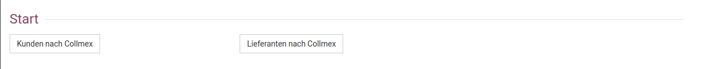

## Kunden und Lieferanten in lexoffice identifizieren   

Da Kunden- und Lieferantennummer in debevet und lexoffice nicht identisch sind, übergibt debevet an lexoffice eine 
sog. alternative Email-Adresse nach dem Muster 10004@netzfalken.lxo, wobei 10004 der Kunden- bzw. Lieferantennummer in debevet entspricht.

So könnten Sie in lexoffice Ihre Kunden als auch Lieferanten eindeutig anhand der Kunden- und Lieferantennummer aus debevet identifizieren.  

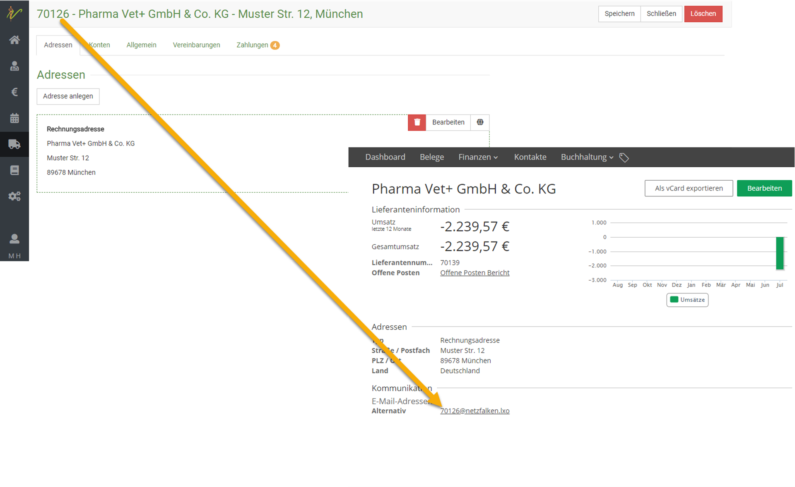   

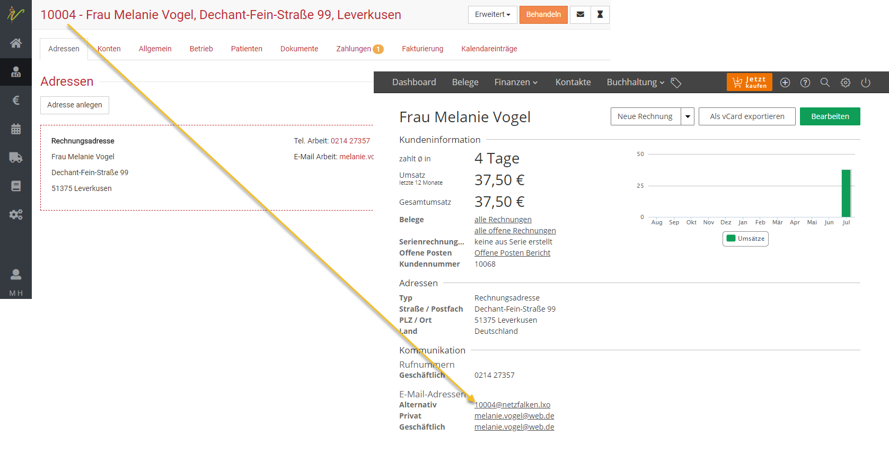  

## Rechnungen und Gutschriften buchen 

Rechnungen und Gutschriften können entweder einzeln oder gesammelt gebucht werden. 

## Kundenrechnung einzeln buchen  

Von der Bearbeitungs- und Voransichtsseite einer Rechnung steht Ihnen oben rechts mit dem Button **Erweitert** die Funktion
**Rechnung Buchen** zur Verfügung. Klicken Sie auf **Rechnung Buchen**, so wird der Original-Beleg (PDF) inkl. Buchungssatz sofort nach lexoffice übertragen.  

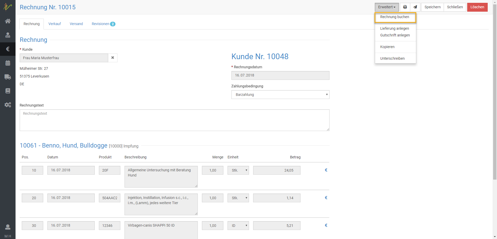  

Im Lexoffice kann der Beleg dann direkt einem Kontoumsatz zugeordnet werden bzw. oftmals passiert dies voll automatisch.  

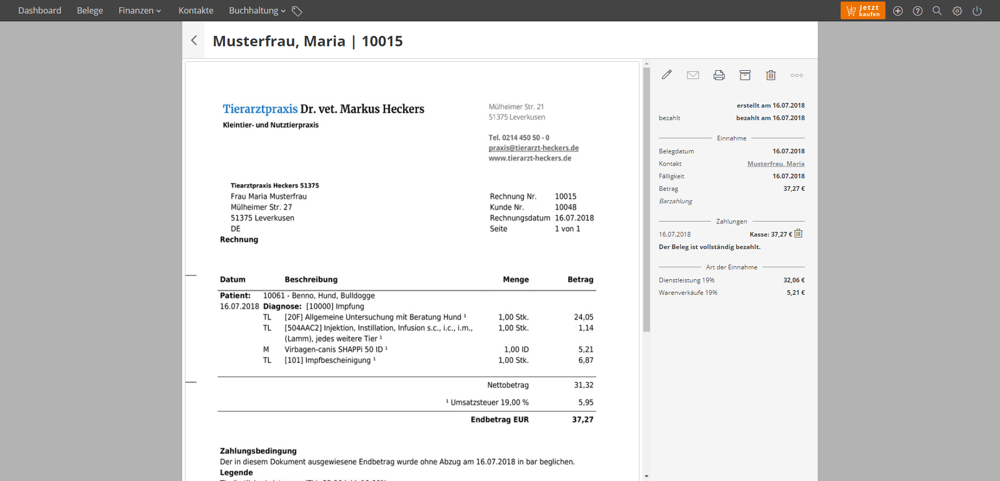

## Individuell gefilterte Rechnungsliste buchen  

Wechseln Sie in debevet auf **Fakturierung** → **Rechnungen**. Filtern Sie die Liste nach Ihren Suchkriterien, z.B. durch die Suche 
aller Rechnungen **im Status "Zu buchen"**. Wählen Sie die gewünschten Rechnungen durch Ankreuzen der **Checkboxen** aus.   

Klicken Sie oben rechts auf **Erweitert** und dann auf **Rechnungen buchen**.  

Haben Sie mehr als fünf Rechnungen ausgewählt, wird der Prozess in das sogenannte Hintergrundfenster unten rechts gestellt. 
Der erfolgreiche Abschluss wird dort signalisiert. Während des Prozesses können Sie in debevet an anderen Stellen weiterarbeiten.  

  

In Lexoffice können Sie die Rechnungen dann den Zahlungen zuordnen, bzw. im Normalfall wird dies sogar automatisch erledigt.  

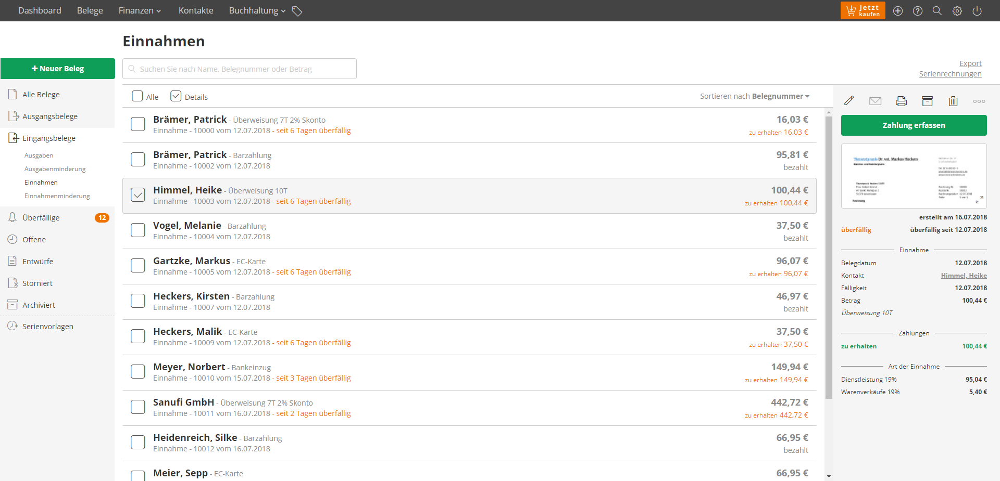
  
## Lieferantenrechnung buchen

Von der Bearbeitungs- und Voransichtsseite einer Lieferantenrechnung steht Ihnen oben rechts mit dem Button **Erweitert** 
die Funktion **Buchen** zur Verfügung.   
Klicken Sie auf Buchen so wird der Orignal-Beleg (PDF) inkl. Buchungssatz sofort nach lexoffice übertragen.  

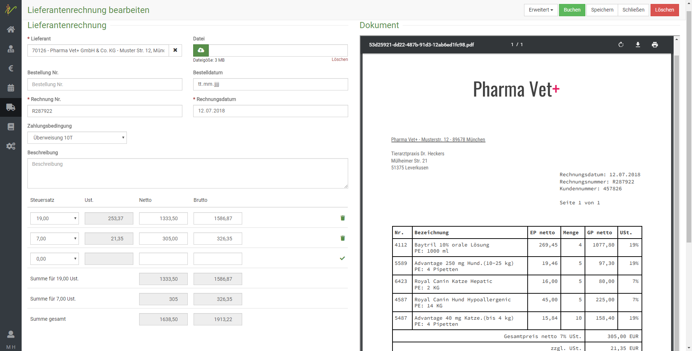  

Den Beleg können sie dann im Lexoffice direkt sehen und zuordnen (bzw. dieser wird der Zahlung meist automatisch zugeordnet)  

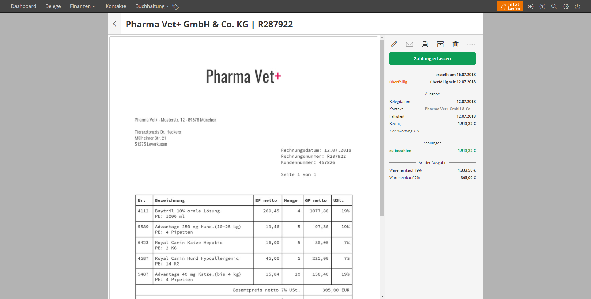  

## Ausgewählte Liste von Lieferantenrechnungen buchen   

Wechseln Sie in debevet auf **Warenwirschaft** → **Lieferantenechnungen**. Filtern Sie die Liste nach Ihren Suchkriterien, z.B.
durch die Suche aller Rechnungen im **Status Zu buchen**. Wählen Sie die gewünschten Rechnungen durch Ankreuzen der *Checkboxen** aus. 
Klicken Sie oben rechts auf **Erweitert** und dann auf **Buchen**.

Haben Sie mehr als fünf Rechnungen ausgewählt, wird der Prozess in das sogenannten Hintergrundfenster unten rechts gestellt. 
Der erfolgreiche Abschluss wird dort signalisiert. Während des Prozesses können Sie in debevet an anderen Stellen weiterarbeiten. 

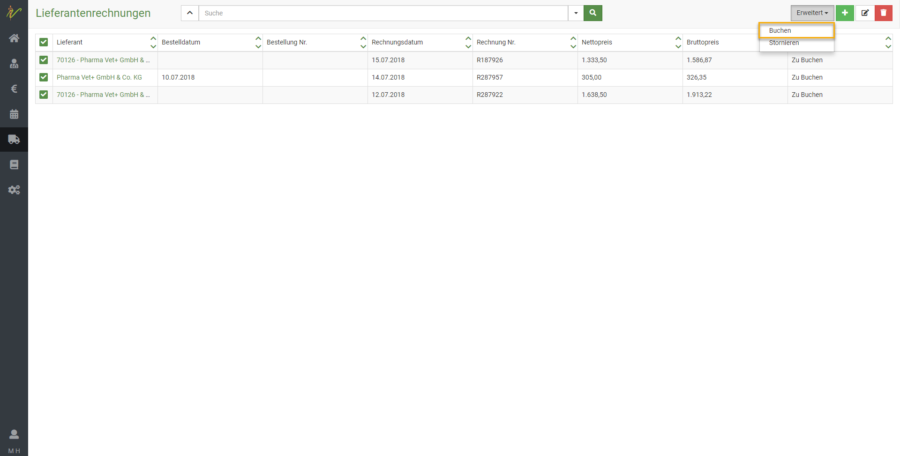  

Im Lexoffice sind diese Rechnungen dann als Ausgaben zu finden.  

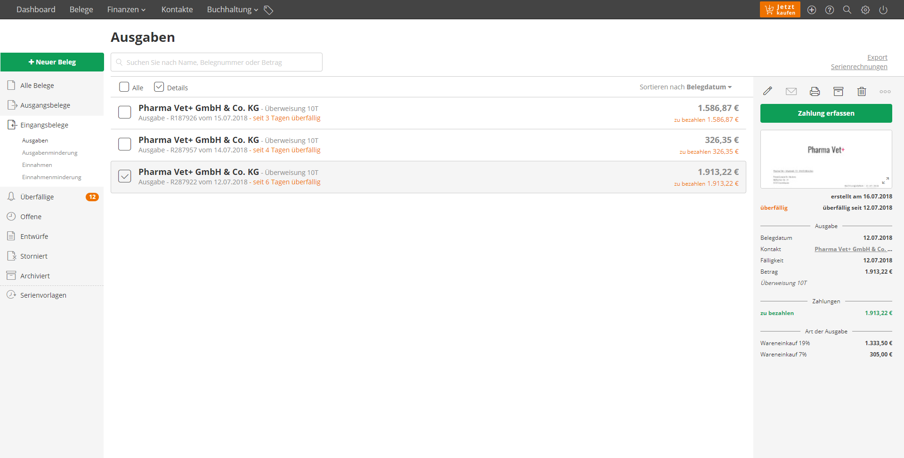 

## Kunden- und Lieferantengutschriften buchen    

Gutschriften an Ihre Kunden und von Ihren Lieferanten buchen Sie analog zum zuvor dargestellten Vorgehen für
Kunden- und Lieferantenrechnungen aus debevet heraus an lexoffice. Dabei werden Kundengutschriften in lexoffice als 
**Einnahmeminderung** und Gutschriften Ihrer Lieferanten als **Ausgabenminderung** verbucht.  

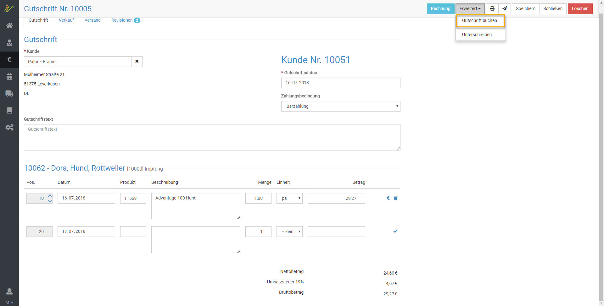

## Rechnungen und Gutschriften stornieren   

Analog zum Vorgehen beim Buchen, steht Ihnen bei Rechnungen (Lieferanten und Kunden), die erfolgreich gebucht wurden, die Funktion **Stornieren**
zur Verfügung. 

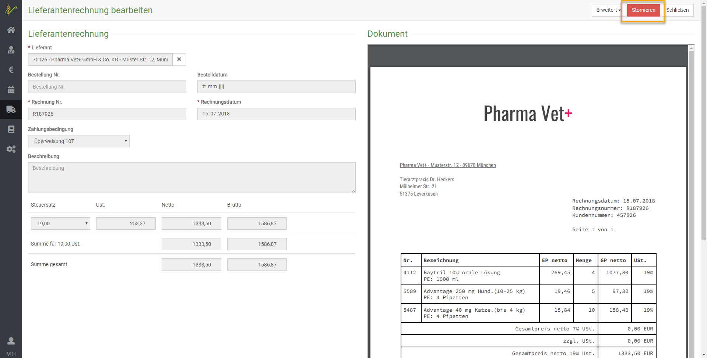  

:::caution Hinweis 

Wenn Sie eine Kunden- oder Lieferantenrechnung oder Gutschrift in debevet stornieren, so führt dies aktuell zu keiner 
Stornierung in lexoffice. Bitte beachten Sie, dass Sie die gebuchten Belege in lexoffice ebenfalls manuell stornieren müssen.  

::: 

## Zahlungseingänge und Zahlungsausgänge   

Zahlungseingänge können Sie fortan bequem und ohne Medienbrüche in lexoffice verbuchen. Dazu steht Ihnen z.B. das integrierte 
Online-Banking von lexoffice zur Verfügung, dass Zahlungen Ihrer Kunden auf Rechnungen nahezu voll automatisch erkennt und zuordnet, 
nicht zuletzt weil debevet Kundennummer und Rechnungsnummer im Buchungsbeleg ordentlich vermerkt.

Ebenso können Sie Ausgänge zu Ihren Lieferantenrechnungen schnell und einfach an Ihre Bank übermitteln.  

:::tip Tipp

Für detaillierte Hilfe und Anleitung zur Erfassung von Zahlungsein- und Ausgängen fragen Sie bei lexoffice nach. 
lexoffice bietet eine hervorragende Online-Hilfe als auch Support über Email-Anfragen.   

:::

## Offene Posten und Mahnungen  

lexoffice bietet Ihnen zahlreiche Live-Auswertungen z.B. der offenen Posten (Lieferanten, Kunden) als auch über Ihren 
betriebswirtschaftlichen Status (EÜR, Bilanz, Gewinn- und Verlustrechnung, Saldenliste etc.).

Ebenso bietet Ihnen lexoffice ein Mahnsystem, sollten Ihre Kunden ihre debevet-Rechnungen einmal vergessen zu zahlen.  
Auch hier hilft die Online-Hilfe als auch der Support des Anbieters weiter. 