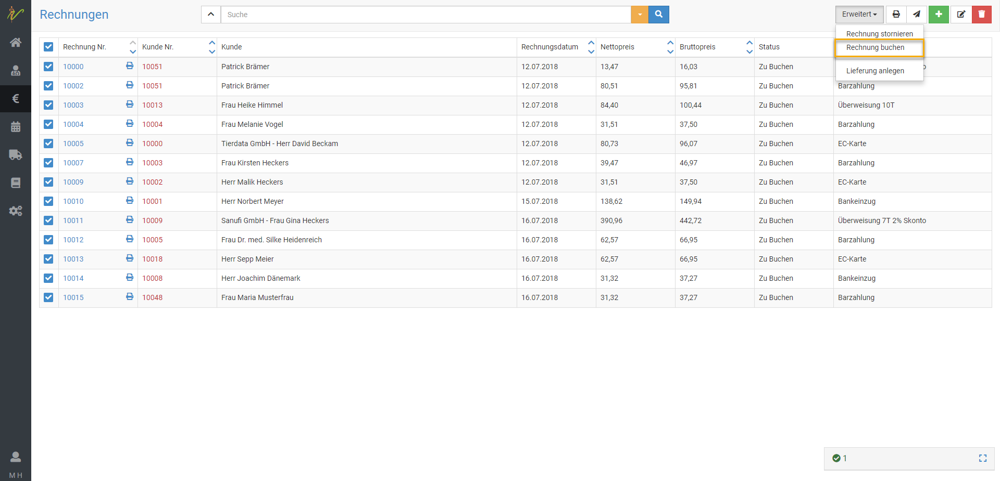

# Lexoffice Buchhaltung  

:::danger ACHTUNG!

Wir bitten zu beachten, dass die Erweiterungen der Buchhaltung, die mit einem Sternchen gekenntzeichnet sind (Collmex, lexoffice, debevet)
nicht GLEICHZEITIG betrieben werden können, und zu Konflikten miteinander führen können. Ein Wechsel zwischen den Systemen sollte
kurz mit uns abgesprochen werden, damit wir Ihnen Tipps geben können, worauf Sie achten müssen.

:::  

Um die Erweiterung zu aktivieren, klicken Sie auf **Administration** und dann **Erweiterungen**.

Nun wählen Sie an der gewünschten Kachel **Anlegen**.

  

## Lexoffice einrichten  

## Kunden und Lieferanten übertragen

## Kunden und Lieferanten in lexoffice identifizieren   

## Rechnungen und Gutschriften buchen 

## Kundenrechnung einzeln buchen  

Von der Bearbeitungs- und Voransichtsseite einer Rechnung steht Ihnen oben rechts mit dem Button **Erweitert** die Funktion
**Rechnung Buchen** zur Verfügung. Klicken Sie auf **Rechnung Buchen**, so wird der Original-Beleg (PDF) inkl. Buchungssatz sofort nach lexoffice übertragen.  

  

Im Lexoffice kann der Beleg dann direkt einem Kontoumsatz zugeordnet werden bzw. oftmals passiert dies voll automatisch.  

## Individuell gefilterte Rechnungsliste buchen  

Wechseln Sie in debevet auf **Fakturierung** → **Rechnungen**. Filtern Sie die Liste nach Ihren Suchkriterien, z.B. durch die Suche 
aller Rechnungen **im Status "Zu buchen"**. Wählen Sie die gewünschten Rechnungen durch Ankreuzen der **Checkboxen** aus.   

Klicken Sie oben rechts auf **Erweitert** und dann auf **Rechnungen buchen**.  

Haben Sie mehr als fünf Rechnungen ausgewählt, wird der Prozess in das sogenannte Hintergrundfenster unten rechts gestellt. 
Der erfolgreiche Abschluss wird dort signalisiert. Während des Prozesses können Sie in debevet an anderen Stellen weiterarbeiten.  

  

In Lexoffice können Sie die Rechnungen dann den Zahlungen zuordnen, bzw. im Normalfall wird dies sogar automatisch erledigt.  

  
## Lieferantenrechnung buchen

Von der Bearbeitungs- und Voransichtsseite einer Lieferantenrechnung steht Ihnen oben rechts mit dem Button **Erweitert** 
die Funktion **Buchen** zur Verfügung.   
Klicken Sie auf Buchen so wird der Orignal-Beleg (PDF) inkl. Buchungssatz sofort nach lexoffice übertragen.  

  

Den Beleg können sie dann im Lexoffice direkt sehen und zuordnen (bzw. dieser wird der Zahlung meist automatisch zugeordnet)  

  

## Ausgewählte Liste von Lieferantenrechnungen buchen   

Wechseln Sie in debevet auf **Warenwirschaft** → **Lieferantenechnungen**. Filtern Sie die Liste nach Ihren Suchkriterien, z.B.
durch die Suche aller Rechnungen im **Status Zu buchen**. Wählen Sie die gewünschten Rechnungen durch Ankreuzen der *Checkboxen** aus. 
Klicken Sie oben rechts auf **Erweitert** und dann auf **Buchen**.

Haben Sie mehr als fünf Rechnungen ausgewählt, wird der Prozess in das sogenannten Hintergrundfenster unten rechts gestellt. 
Der erfolgreiche Abschluss wird dort signalisiert. Während des Prozesses können Sie in debevet an anderen Stellen weiterarbeiten. 

  

Im Lexoffice sind diese Rechnungen dann als Ausgaben zu finden.  

 

## Kunden- und Lieferantengutschriften buchen    

Gutschriften an Ihre Kunden und von Ihren Lieferanten buchen Sie analog zum zuvor dargestellten Vorgehen für
Kunden- und Lieferantenrechnungen aus debevet heraus an lexoffice. Dabei werden Kundengutschriften in lexoffice als 
**Einnahmeminderung** und Gutschriften Ihrer Lieferanten als **Ausgabenminderung** verbucht.  

## Rechnungen und Gutschriften stornieren   

Analog zum Vorgehen beim Buchen, steht Ihnen bei Rechnungen (Lieferanten und Kunden), die erfolgreich gebucht wurden, die Funktion **Stornieren**
zur Verfügung. 

  

:::caution Hinweis 

Wenn Sie eine Kunden- oder Lieferantenrechnung oder Gutschrift in debevet stornieren, so führt dies aktuell zu keiner 
Stornierung in lexoffice. Bitte beachten Sie, dass Sie die gebuchten Belege in lexoffice ebenfalls manuell stornieren müssen.  

::: 

## Zahlungseingänge und Zahlungsausgänge   

Zahlungseingänge können Sie fortan bequem und ohne Medienbrüche in lexoffice verbuchen. Dazu steht Ihnen z.B. das integrierte 
Online-Banking von lexoffice zur Verfügung, dass Zahlungen Ihrer Kunden auf Rechnungen nahezu voll automatisch erkennt und zuordnet, 
nicht zuletzt weil debevet Kundennummer und Rechnungsnummer im Buchungsbeleg ordentlich vermerkt.

Ebenso können Sie Ausgänge zu Ihren Lieferantenrechnungen schnell und einfach an Ihre Bank übermitteln.  

:::tip Tipp

Für detaillierte Hilfe und Anleitung zur Erfassung von Zahlungsein- und Ausgängen fragen Sie bei lexoffice nach. 
lexoffice bietet eine hervorragende Online-Hilfe als auch Support über Email-Anfragen.   

:::

## Offene Posten und Mahnungen  

lexoffice bietet Ihnen zahlreiche Live-Auswertungen z.B. der offenen Posten (Lieferanten, Kunden) als auch über Ihren 
betriebswirtschaftlichen Status (EÜR, Bilanz, Gewinn- und Verlustrechnung, Saldenliste etc.).

Ebenso bietet Ihnen lexoffice ein Mahnsystem, sollten Ihre Kunden ihre debevet-Rechnungen einmal vergessen zu zahlen.  
Auch hier hilft die Online-Hilfe als auch der Support des Anbieters weiter. 