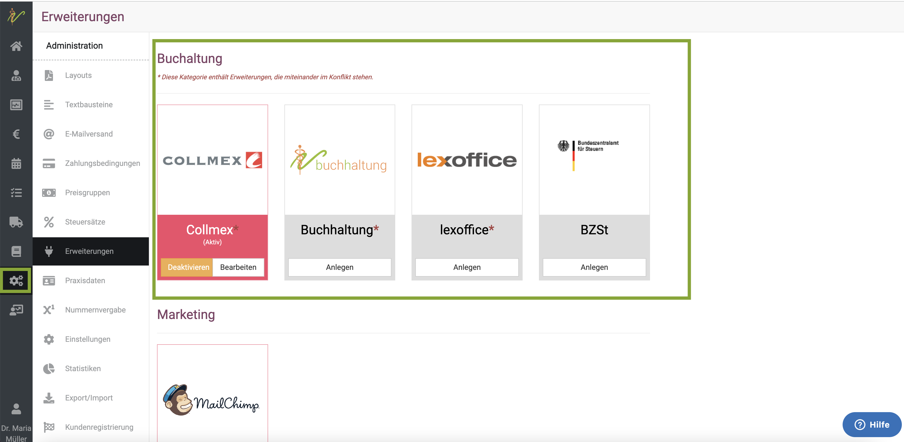

# Collmex Buchhaltung 

:::tip Tipp:  
Collmex ist ein Buchhaltungsprogramm, welches sehr ideal mit unserer Software kompatibel ist. 
Wenn Sie wollen, können wir die gesamte Einrichtung für Sie vornehmen und die Abrechnung der monatlichen Kosten kann über uns erfolgen. 

Wir benötigen dann von Ihnen die Emailadresse Ihres Steuerberaters, die Mandantennummer bei der Kanzlei und die Beraternummer Ihres Beraters bei Datev.  

:::  

Alternativ können Sie das Programm auch wie hier beschrieben selbst anbinden/aktivieren.

:::danger ACHTUNG!

Wir bitten zu beachten, dass die Erweiterungen der Buchhaltung, die mit einem Sternchen gekennzeichnet sind (Collmex, lexoffice, debevet)
nicht GLEICHZEITIG betrieben werden können, und zu Konflikten miteinander führen können. Ein Wechsel zwischen den Systemen sollte
kurz mit uns abgesprochen werden, damit wir Ihnen Tipps geben können, worauf Sie achten müssen.

:::  

## Collmex registrieren und einrichten 

Registrieren Sie sich bei Collmex für den kostenlosen und unverbindlichen 30-Tage-Test der Finanzbuchhaltung in der Variante **Buchhaltung Basic**.

[Collmex testen](https://www.collmex.de/kostenlos_testen.html?0,7?partnerId=133144)

Füllen Sie das angezeigte Formular aus und klicken Sie abschließend auf den Button **Ok, Testzugang anfordern**.  

  

Die Registrierung wird Ihnen umgehend bestätigt und die Zugangsdaten an die von Ihnen soeben hinterlegte Emailadresse gesendet.  

  

Schauen Sie nun in Ihrem Mailprogramm nach, um sich mit Ihren Benutzerdaten anzumelden, die von Collmex an die von Ihnen
angegebene Emailadresse gesendet wurden.

:::tip Tipp 

Wenn wir bei debevet Ihren Account bei Collmex für Sie aufsetzen, bekommen Sie auch die Email mit Ihren Zugangsdaten. Bitte bewahren Sie diese 
gut auf. 

:::  

## Anmelden in Collmex  

Besuchen Sie im Internet die Seite www.collmex.de. Geben Sie im Bereich Anmeldung für unsere Kunden Ihre Kundennummer aus 
der Email ein und und klicken Sie auf **anmelden**.  

  

:::tip Tipp:  

Legen Sie sich in Ihrem Browser ein Lesezeichen für diese Seite an, damit Sie diese künftig mittels Lezesezeichen 
direkt aufrufen können ohne vorher Ihre Kundennummer einzugeben.  

:::  

Geben Sie in die Felder **Benutzer** und **Kennwort**, die entsprechenden Zugangsdaten für Collmex ein und klicken Sie auf **Anmelden**.  

Sie werden nun auf die Startseite der Anwendung Collmex weitergeleitet.  

  

## Schnittstellen-Benutzer für debevet anlegen  

Sie sind nun in der Cloud-Buchhaltung von Collmex angemeldet.

Klicken Sie oben in der Maske auf den Button **Verwaltung**. Klicken Sie danach in der Kachel **Benutzer** auf den Link **Benutzer anlegen**.  

  

Kreuzen Sie die Checkbox **Nur für API** an, geben Sie im Feld Name einen Benutzernamen an (z.B. apidbv) und klicken Sie 
abschließend auf den Button **Benutzer anlegen**.  

(Für Benutzer mit der Eigenschaft "Nur für API" berechnet Collmex keine Zusatzkosten.)

  

Auf dieser Seite klicken Sie nun auf **Kennwort ändern**, um ein Kennwort für den neuen Benutzer zu hinterlegen.  

  

Geben Sie nun ein von Ihnen bestimmtes Kennwort für den API-Benutzer an. Klicken Sie abschließend auf **Speichern**.

  

## Buchhaltungseinstellungen in Collmex  

Nun müssen Sie in Collmex noch einige Einstellungen vornehmen.  

### Kontenrahmen festlegen  

Klicken Sie oben auf **Verwaltung** und in der Kachel **Firma** auf den Link **Firma anzeigen und ändern**.

Klicken Sie auf den Link **Anzeigen** neben Ihrem Firmeneintrag. Wählen Sie aus der Aufklappliste **Kontenrahmen** den passenden 
Eintrag für Ihre Praxis bzw. Ihr Unternehmen und klicken Sie abschließend auf **Speichern**.  

   

### Ist- oder Sollbesteuerung festlegen  

Klicken Sie oben auf **Verwaltung** und in der Kachel **Firma** auf **Geschäftsjahr anzeigen, ändern**. In der folgenden Liste
klicken Sie in der Zeile des aktuellen Jahres auf den Link **Anzeigen**.  

   

Den Eintrag in der Aufklappliste **Umsatzsteuerbefreiung** ändern Sie, sollte bei Ihnen eine Umsatzsteuerbefreiung vorliegen bspw. 
aufgrund der sog. Kleinunternehmer-Regelung.

Andernfalls belassen Sie den Wert und wählen in der Aufklappliste **Art der Besteuerung** aus, ob die Ist- oder Soll-Besteuerung angewendet wird.
Klicken Sie abschließend auf den Button **Speichern**.  

  

### Eigene FiBu-Konten erstellen  

Sollten Sie neben den Standardkonten des von Ihnen ausgewählten Kontenplans SKR03 oder SKR04 eigene FiBu-Konten benötigen,
um z.B. Leistungen, Abgabeprodukte und Anwendungsprodukte auf unterschiedliche Erlöskonten als die Standard-Erlöskonten
zu buchen, so müssen Sie solche Konten vor der ersten Buchung manuell anlegen.

Klicken Sie dazu auf den Button **Verwaltung** und in der Kachel **Konto und Kostenstelle** auf den Link **Konto anlegen**. 
Geben Sie die gewünschte Kontonummer in das Feld **Kontonummer** ein und klicken Sie auf den Button **Konto anlegen**.  

  

Überprüfen Sie die Angaben und passen Sie diese unter Umständen an. Es empfiehlt sich z.B. für eigene Konten 
logische eigene Namen in das Feld Bezeichnung einzugeben. Klicken Sie abschließend auf **Speichern**.  

  

### Datev Export Einstellungen  

Damit der Export der Dateien für Datev problemlos funktioniert, müssen Sie die Daten zunächst im Collmex hinterlegen. 
Klicken Sie **Buchhaltung** und dann an der Kachel **Schnittstellen** auf **Datev-Export**. Dort klicken Sie
auf **Einstellungen**.

  ƒ

Hier müssen Sie nun Ihre Mandantennummer Ihres Steuerberaters eintragen und die Beraternummer Ihres Steuerberaters bei Datev. 

Anschließend müssen Sie die Beraternummer und die Mandantennummer ebenfalls im debevet hinterlegen. Klicken Sie dazu auf **Administration** und
**Einstellungen**. Dort finden Sie unter dem Reiter **Fakturierung** die beiden passenden Felder.  

Tragen Sie die Daten dort ein und klicken Sie **Speichern** (oben rechts).  

## debevet mit Collmex verbinden  

Klicken Sie im Hauptmenü auf **Administration** → **Erweiterungen**. Auf der folgenden Liste der Erweiterungen klicken Sie auf 
der Kachel 'Collmex Buchhaltung' auf den Button **Anlegen**, um Ihr debevet mit Collmex zu verbinden. 

  

:::danger ACHTUNG!

Wir bitten zu beachten, dass die Erweiterungen der Buchhaltung, die mit einem Sternchen gekenntzeichnet sind (Collmex, lexoffice, debevet)
nicht GLEICHZEITIG betrieben werden können, und zu Konflikten miteinander führen können. Ein Wechsel zwischen den Systemen sollte
kurz mit uns abgesprochen werden, damit wir Ihnen Tipps geben können, worauf Sie achten müssen.

:::  

Im Bereich **Zugangsdaten** geben Sie im Feld Kunden Nr. Ihre Kundennummer(Mandantennummer!) bei Collmex ein. In das Feld Benutzername tragen Sie den Namen des Benutzers (API-Benutzer) 
der Collmex-Schnittstelle (lt. Anleitung hier z.B. apidbv) ein und bei Kennwort, das Kennwort, das Sie diesem Benutzer in Collmex gegeben haben.

In das Feld Firma Nr. tragen Sie den Wert '1' ein und kreuzen **Aktiv** an. Speichern Sie Ihre Eingabe abschließend durch 
Klicken auf den Button **Speichern** oben rechts.   

  

### Erlöse nach Typ zusammenfassen  

Wenn Sie Ihre Erlöse je Typ (Leistung, Abgaben, Anwendungsprodukte und Sonstiges) auf verschiedene Erlöskonten buchen 
möchten, so aktiveren Sie dieses Merkmal durch ankreuzen und geben Sie für die Typen die jeweiligen Erlöskonten aus 
der Finanzbuchhaltung für die beiden Umsatzsteuersätze an. Bitte beachten Sie, dass Sie Konten, die nicht im 
Standardkontenplan enthalten sind zuvor auch in Collmex angelegt haben.

Erzielen Sie ebenfalls Erlöse mit 0% Umstatzsteuer (z.B. durch Lieferung ins EU-Ausland), so können Sie
weitere Zeilen hinzufügen für den jeweiligen Typ und bei Erlösart einen Grund für die Umsatzssteuerfreiheit auswählen. 
Wählen Sie dort z.B. den Eintrag 'innergemeinschaftliche Lieferung', so können Sie bei 0% USt. ein entsprechendes Erlöskonto vordefinieren.
Wenn Sie abschließend das Häckchen am Ende der Zeile klicken, wird Ihr Eintrag in die Maske übernommen und eine weitere Zeile für weitere 0%-Regelen erzeugt.

Klicken Sie abschließend auf **Speichern** oben rechts.  

### Rundungs- und Differenzkonto nutzen  

Wenn Sie die Erlöse nach Typ zusammenfassen, sollten sie unbedingt ein Rundungs- /Differenzkonto anlegen. Je nach genutztem Kontenrahmen fragen Sie gern
Ihren Steuerberater, welches dieses sein soll. Dort werden evtl. bei den getrennten Buchungen entstehende cent-Differenzen verbucht. 

### Zahlungsbedingungen  

Verknüpfen Sie hier Ihre verschiedenen Zahlungsbedingungen mit einer Buchungsregel, damit debevet Ihre Rechnung gemäß
dieser Regeln und der optional eingestellten Erlöskonten buchen kann. Tragen Sie im Feld Nummer, die Nummer ein, 
die eben diese Zahlungsbedingung in Collmex hat.  
Im Feld Konto tragen Sie die Nummer des Kontos aus der Finanzbuchhaltung Collmex ein, auf das Rechnungserlöse
mit dieser Zahlart zugebucht werden.   

Haben Sie in debevet weitere eigene Zahlungsbedingungen angelegt, so können Sie diese auf die jeweiligen Zahlungsbedingungen in Collmex mappen.

Der Status nach Buchung gibt an, ob kundenseitig nach Rechnungsstellung noch eine Zahlung ausgeführt werden muss (**Gebucht**) oder aber die Rechnung in 
debevet direkt als **Erledigt** gekennzeichnet werden kann.

Mit dem Feld **Anzeigen** legen Sie fest, ob Sie das Kontosaldo im Dashboard für die jeweilige Zahlungsart anzeigen lassen wollen, 
sofern Sie dies in der Administration unter Einstellungen für das Dashboard eingestellt haben.

Kreuzen Sie dies z.B. für die Methode 'Barzahlung' an, sehen Sie den Stand des Kassenkontos 1000 bzw. 1200 jeweils live
aus Collmex auf Ihrem Dashoard. 

  

### Kunden und Lieferanten übertragen

Sollten Sie Collmex in debevet erstmalig aktivieren, nachdem Sie bereits Kunden und Lieferanten in debevet erfasst haben,
so sollten Sie einmal auf den Button **Kunden nach Collmex** und **Lieferanten nach Collmex** klicken. debevet überträgt 
bei aktivierter Schnittstelle dann einmal alle Kunden und Lieferanten nach Collmex als Debitoren bzw. Kreditoren.

:::caution Achtung 

Sollten Sie in Collmex bereits Kunden oder Lieferanten erfasst haben, werden diese bei gleicher Kunden oder Lieferantennummer überschrieben.
Bitte beachten Sie, dass Sie künftig Änderungen an Kunden oder Lieferantendaten ausschließlich in debevet vornehmen,
da debevet die Schreibhoheit über diese Daten hat. Die Schnittstelle ist derart konzipiert, dass alle Änderungen an
Kunden oder Lieferantendaten mit dem Speichern in debevet immer zeitgleich eins zu eins nach Collmex übertragen werden.

:::

  

## Zahlungseingänge und Zahlungsausgänge  

### Zahlungseingänge Ihrer Kunden buchen  

Erhalten Sie für eine in debevet erstellte Rechnung von Ihrem Kunden Geld (Teilzahlung, Vollzahlung) zum Beispiel 
über das Bankkonto, so wird dies ausschließlich in Collmex verbucht, z.B. automatisch durch Abruf der Bankumsätze via HBCI.
(Diesen müssen Sie im Collmex einrichten!)

Ist eine Rechnung in Collmex erledigt, erfährt debevet davon voll automatisch über die Schnittstelle und
stellt die jeweilige Rechnung vom Status **Gebucht** auf **Erledigt** oder **Teilgezahlt** um. 

### Zahlungsausgänge an Ihre Lieferanten  

Bezahlen Sie Ihre Lieferanten Rechnungen aus debevet in Collmex z.B. mit dem dort integrierten Onlinebanking, so zeigt
debevet die jeweilige Lieferantenrechnung (wenn Sie diese hochgeladen haben) automatisch als **Erledigt** an.    

### Collmex Mahnungen und offene Posten

Collmex bietet Ihnen zahlreiche Live-Auswertungen z.B. der offenen Posten (Lieferanten, Kunden) als auch über Ihren 
betriebswirtschaftlichen Status (EÜR, Bilanz, Gewinn- und Verlustrechnung, Saldenliste etc.).

Ebenso bietet Ihnen Collmex ein bewährtes Mahnsystem, sollten Ihre Kunden ihre debevet-Rechnungen einmal vergessen zu 
zahlen. Sie müssen allerdings Ihre gewünschen Zahlungs- bzw. Mahnungsfristen einmalig im Collmex manuell einstellen, denn diese
kann die Schnittstelle leider nicht automatisch übernehmen. Gehen Sie hierfür wie folgt vor:

1. Die Zahlungsfrist bis zur ersten Mahnung wird im Collmex an der Zahlungsfrist der Zahlungsbedingung festgelegt. Sie müssen also auf
der Collmex Seite abgleichen, ob die dort hinterlegte Frist auch Ihrer geewünschten entspricht. Schauen Sie dazu zunächst im debevet,
welche Frist dort hinterlegt ist. Klicken Sie auf **Administration** und dann **Erweiterungen** und an der Collmex-Kachel dann **bearbeiten**.
  
Hier steht an der Zahlungsbedingung "Überweisung (Beispiel hier 10T)" eine Zahl (Beispiel hier **1**), diese sollten Sie nun auf die Nummer **6** ändern. 
Klicken Sie anschleißend oben rechts auf **Speichern**.

2. Loggen Sie sich in Ihren Collmex Account ein und klicken Sie ganz oben auf **Verwaltung** und dann **Zahlungsbedingungen**.

Nun öffnet sich eine Übersicht der Standard-Zahlungsbedingungen von Collmex. Dies sind mehr, als Sie nutzen, ignorieren Sie die nicht benötigten bitte.  

Suchen Sie dort die Nummer **6**. Dies ist normalerweise die Zahlungsbedingung **Zahlbar in 14 Tagen ohne Abzug**. Klicken Sie dort auf **Anzeigen**. 

  

Hier können Sie nun die gewünschte Zahlungsfrist, nach der die **erste** Mahnung erstellt werden soll, eingeben. Die gewünschte Periode wird unten im Feld bei **Periode 1** eingegeben.
Klicken Sie dann auf **Speichern**.

Die Mahnungsfristen selbst, die zwischen den Mahnungen bestehen sollen, setzen Sie im Collmex im Bereich **Verwaltung** und dann **Mahnungen**.  

:::caution Achtung: 

Die Frist, die bei 1. Mahnung steht, bezieht sich auf den Zeitraum, bis wann diese Mahnung bezahlt sein muss, damit die zweite Mahnung erstellt wird. Die Frist bis zur
ersten Mahnung wird über die Zahlungsbedingung gesetzt.  

::: 

