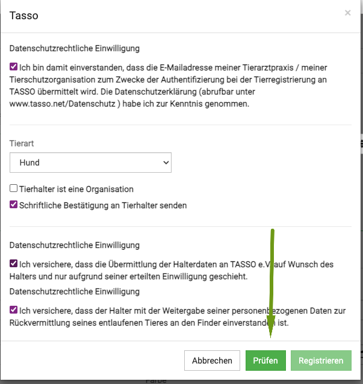

# Tasso Schnittstelle  

Im Dezember 2022 hat die debevet Software eine Schnittstelle zu Tasso bekommen. Nun können Sie als Tierarzt direkt live und digital
von Ihnen gechippte oder generell noch nicht registrierte Hunde direkt bei Tasso melden. 

## Registrierungsschlüssel anfordern  

Um die Schnittstelle einzurichten, benötigen Sie zunächst die Zugangsdaten von Tasso. Rufen Sie dazu im debevet die Tasso Schnittstelle auf. 

Klicken Sie dazu auf **Administration** und dann **Erweiterungen**. Dort scrollen Sie nach unten, bis Sie die **Tasso Schnittstelle** sehen und klicken
dort auf **Anlegen**.  

  

Nun klicken Sie auf **registrieren**.  

  

In dem Fenster, was sich nun öffnet, tragen Sie Ihre Daten ein. Wenn Sie dann auf **Registrieren**.    

  

Nun kommt der Registrierungssschlüssel via Email. Den Schlüssel müssen Sie nun noch aktivieren, indem Sie auf den Button in der Email klicken.

## Schnittstelle im debevet aktivieren

Um die Tasso Schnittstelle nun zu aktivieren, tragen Sie in der Erweiterung Ihre Emailadresse und Ihren Registrierungssschlüssel ein.  

Klicken Sie dann auf **Aktivieren**. 

## Tiere bei Tasso registrieren 

Um mit der debevet Software ein Tier direkt digital und live online zu registrieren, hinterlegen Sie zunächst alle Daten am Patienten (Chipnummer, Farbe, Name,etc.)  

In der Ansicht des Patienten sehen in der Sektion **Identifikation** den Tasso Button **registrieren**. Klicken Sie diesen an.

Eventuell fehlende Daten am Tier werden Ihnen nun als Fehlermeldung angezeigt. Sollte dies passieren, schließen sie das Fenster zunächst wieder und ergänzen die Daten.  

Ansonsten müssen Sie die Haken zur Datenschutzerklärung aktivieren.  

 

Klicken Sie nun unten den grünen Button **prüfen**.  

  

Die Daten werden geprüft, anschließend wird der grüne Button **registrieren** anklickbar. Klicken Sie diesen, um die Registrierung abzuschleießen.  

Bei einem durch Sie bei Tasso registrierten Patienten steht an der Sektion **Identifikation** nun das Datum der Registrierung und die Tasso Nummer.

