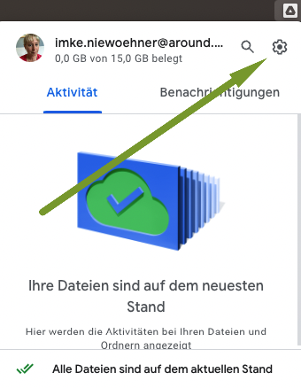
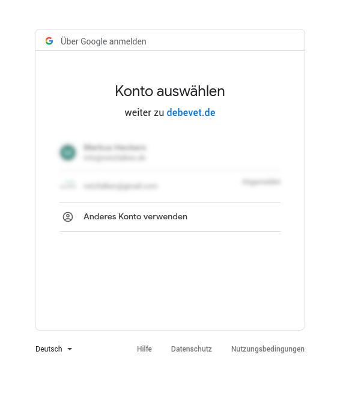
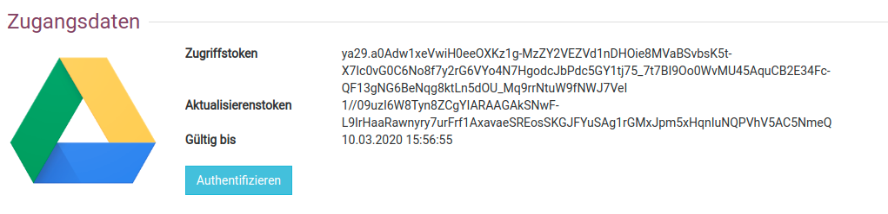

# EiVIS Röntgen Erweiterung  

Wir freuen uns, dass wir Ihnen die Anbindung einer EiVIS Schnittstelle bieten können. So können Sie kinderleicht alle Bilddaten aus verschiedenen Geräten beauftragen 
und wieder einlesen, diese sind dann direkt in der Kartei des Patienten abgelegt. Die Software erhalten Sie hier: 

https://www.eickemeyer.de/Neu-bei-EICKEMEYER/EiVIS-EICKEMEYER-Veterinary-Imaging-Software-vet.html?listtype=search&searchparam=eivis

Die Kosten dieser Anwendung sind einmalig (Kaufpreis) und werden nicht an uns gezahlt, sondern direkt an die Firma Eickemeyer.
Die Kosten hierfür betragen ca. 1500 Euro netto.

## G-Drive einrichten 

Die debevet Software nutzt zur Anbindung von EiVIS den kostenlosen Online-Speicher "G-Drive" von Google und deren G-Drive Desktop Anwendung.  
Erstellen Sie sich ein kostenloses Google-Konto oder nutzen Sie ein vorhandenes.

[Kostenloses Googlekonto anlegen](https://myaccount.google.com/?utm_source=sign_in_no_continue&pli=1&nlr=1)

## G-Drive für Desktop herunterladen

Laden Sie G-Drive Desktop herunter und installieren Sie es.

[G-Drive Desktop installieren](https://support.google.com/drive/answer/7329379#zippy=%2Cgoogle-drive-f%C3%BCr-den-desktop-herunterladen-und-installieren)

### G-Drive für Desktop installieren

:::tip Hinweis:

Erstellen Sie bitte auf Ihrem Rechner einen Ordner mit dem Namen **EiVIS GDT**.

:::

Öffnen Sie die G-Drive Anwendung an Ihrem Rechner, nachdem Sie diese heruntergeladen haben. Hier finden Sie eine Ansicht, wo Sie am Apple die Anwendung
sehen und öffnen. (oben in der Funktionsleiste das kleine dreieckige Symbol)

Klicken Sie dort nun rechts auf das Zahnradsymbol und wählen dann "Einstellungen".

Nun können Sie den passenden Ordner wählen, in dem Sie auf "Ordner hinzufügen" klicken. Wählen Sie von Ihrem Rechner den Ordner **EiVIS GDT**.

Nach Abschluss setzen Sie die Auswahl "mit Google Drive synchronisieren".

## EiVIS Erweiterung aktivieren

Nun können Sie in debevet die EiVIS Erweiterung aktivieren.  
Klicken Sie auf **Administration** (Zahnradsymbol) und dann **Erweiterungen**.   
Wählen Sie dann die EiVIS Erweiterung und klicken den Button “Anlegen”. 

## EiVIS G-Drive Verbindung verknüpfen

Die Anbindung von EiVIS erfolgt über Google Drive.   

Klicken Sie nun auf **Aktivieren** und anschließend auf **Authentifizieren**, um Ihr Google Konto mit debevet zu verknüpfen.   
Sie werden zu Google weitergeleitet. Geben Sie hier Ihr Google Konto ein oder wählen Sie ein bereits angemeldetes Konto aus und bestätigen Sie, 
indem Sie auf **Zulassen** drücken. Es öffnet sich wieder debevet. 

Bei erfolgreicher Anmeldung sind Felder “Zugriffstoken”, “Aktualisierungstoken” und “Gültig bis” ausgefüllt.

Wählen Sie, wenn gewünscht, die Option “Kundendaten anonymisieren” aus. (NICHT empfohlen) 

## Synchonisierungsordner erstellen   

Damit die Schnittstelle und das Gerät perfekt "zusammen arbeiten" können, müssen Sie nun auf Ihrem Rechner noch einen Ordner mit dem
Namen "EiVIS GDT" erstellen. 

Klicken Sie im Anschluss per Rechtsklick auf diesen Ordner und wählen Sie aus der Liste "Diesen Ordner synchronisieren oder sichern".

Anschließend wählen Sie in der  debevet Erweiterung "EiVIS" den soeben erstellten Synchronisationsordner ("EiVIS GDT").

## EiVIS Anbindung in der Behandlung nutzen  

Wählen Sie nun in der Behandlungsmaske das Röntgen-Symbol und gehen Sie in der ausgeklappten Liste auf **Auftrag senden**.   

Nehmen Sie nun Ihr(e) Röntgenbild(er) oder Ultraschall, CT oder MRT Bilder auf und bearbeiten und speichern Sie diese in EiVIS.   

Gehen Sie nun in debevet wieder auf das Röntgen-Symbol und wählen Sie in der Auswahlliste **Ergebnisse abrufen**. 

Aktualisieren Sie ggf. die Seite des Browsers. Nun werden Ihnen die aufgenommenen Bilder in der Kartei des Patienten angezeigt.

