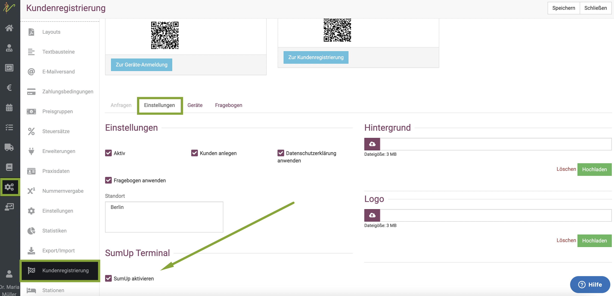
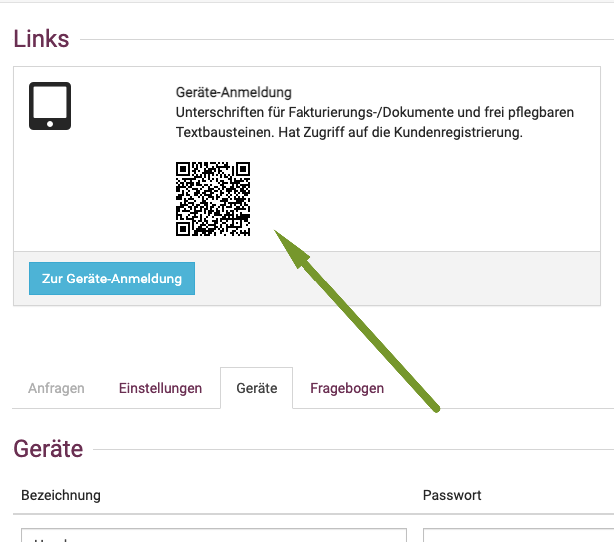
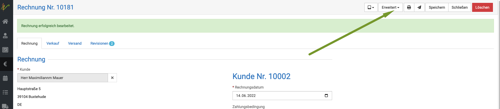

# SumUp Kartenzahlung

SumUp ist ein Kartenzahlungssystem, welches Ihnen ohne monatliche Grundgebühren und vollkommen mobil (also unabhängig von der Telefonleitung bei Ihnen zu Hause) 
die Möglichkeit bietet, Ihren Kunden Kartenzahlung anzubieten. Alles, was Sie benötigen, ist ein Bluetooth fähiges Mobilgerät (Tablet, Handy)mit einer SIM Karte und Datenvolumen.  
Das Kartenzahlgerät ist über Bluetooth mit Ihrem Handy (oder Tablet) verbunden. SumUp bietet eine App, die kinderleicht zu bedienen ist und mit debevet perfekt funktioniert.

Wir erklären hier, wie Sie die Anbindung und Nutzung im debevet einrichten.

Ein Kartenzahlgerät und die Anleitung dessen finden Sie hier:  

https://sumup.de/  

## SumUp in debevet aktivieren 

Zunächst müssen Sie SumUp aktivieren. Klicken Sie auf **Administration** und dann **Kundenregistrierung**. Dort wählen Sie
den Reiter **Einstellungen** und setzen dann unten das Häkchen in die Checkbox "SumUp akivieren".   

## Gerät anmelden/hinterlegen  

Zunächst müssen Sie ein Endgerät (Handy, Tablet) für Ihre Praxis anlegen/registrieren/hinterlegen. Klicken Sie hierzu auf 
**Administration** (Zahnradsymbol) und dann **Kundenregistrierung**.   

   

Klicken Sie dann auf den Reiter **Geräte**   
Geben Sie einen Namen für das Gerät ein und setzen ein Passwort. Bitte klicken Sie danach unbedingt den Haken an, um beides zu aktivieren.  

:::tip   Tipp

Wenn Sie mehrere Geräte angemeldet haben, z.B. noch ein Tablet zum Unterschreiben, geben Sie den Geräten eindeutige Namen.  

:::

## Geräte aktivieren

Um die SumUp Zahlung nutzen zu können, muss das Endgerät (also Handy/Tablet) nicht nur eingerichtet sein, sondern unter **Administration**
und dann **Kundenregistrierung**  muss am Reiter "Einstellungen" das Häkchen bei **Aktiv** gesetzt sein.

**Aktiv:**
Ist "Aktiv" ausgewählt, können Sie Ihre Geräte, die Sie angelegt haben nutzen. 

:::caution Achtung:

Setzen Sie diesen Haken nicht, bekommen Sie eine Fehlermeldung **Service unavailable**!

:::

Nun können Sie auf dem Gerät einen QR Code Scanner (meist vorinstalliert, sonst im App Store suchen) öffnen und mit diesem den QR Code oben links scannen.  

  

Ihr Gerät zeigt dann einen Link an, diesen klicken Sie bitte an. Dort müssen Sie die gesetzen Daten (Passwort) nun eingeben.  

Nun ist Ihr Gerät angemeldet und kann für die Abrechnung mit sumup genutzt werden.     

## Rechnung mit sumup Kartenzahlung abrechnen   

Um nun bei einem Kunden die Kartenzahlung zu nutzen, wählen Sie beim erstellen einer Rechnung bei **Zahlungsart** statt bisher z.B. Barzahlung aus dem Dropdown 
nun **SumUp**. Klicken Sie anschließend auf **Speichern**  

  

Wählen Sie nun oben rechts beim Dropdown **Erweitert** die Option **mit SumUp abrechnen**. 

  

Es öffnet sich nun ein Fenster, in welchem Sie Ihr Zahlungsgerät auswählen müssen.  

  

Wenn das Gerät korrekt über das Barcode scannen aktiviert und angemeldet ist, wird es mit einem grünen Button angezeigt.

Wenn Sie das Gerät nun wählen, öffnet Ihr Gerät automatisch eine Maske, in der es Ihnen den Patient und die Summe erneut nennt.  

Bestätigen Sie diese Auswahl, stellt es automatisch die Verbindung zu Ihrem Kartenzahlgerät her und die passende Summe erscheint in der SumUP App.

Der Kunde muss nun das Kartenzahlgerät bedienen. Die Rechnung ist im debevet direkt automatisch als verbucht hinterlegt. 

Sie können dem Kunden wie gewohnt direkt die Rechnung mailen.

## Rechnung mit sumup buchen /Buchungsprobleme sumup  

Sollten Sie eine Fehlermeldung bekommen, dass das Buchen der Rechnung nicht möglich ist, prüfen Sie bitte, ob die Buchhaltungskonten
für die Zahlung mit sumup korrekt hinterlegt sind.  

Gehen Sie hierfür wie folgt vor:  

Klicken Sie auf **Administration** und dann **Erweiterungen**. Prüfen Sie, welche der Buchhaltungserweiterungen Sie nutzen.   

Klicken Sie an der von Ihnen genutzten Buchhaltungsweiterung auf **Bearbeiten**.  

   

Scrollen Sie nun nach unten, bis Sie die Konten unter Zahlungsbedingungen sehen. Dort klicken Sie in der untersten Zeile den 
Dropdown-Pfeil und wählen "sumup" aus.   

  

Tragen Sie nun dieselben Daten wie bei "Ec-Karte" ein und setzen den Status auf "Erledigt". 

:::caution Achtung:   

Wenn Sie Collmex als Buchhaltungserweiterung nutzen, müssen Sie die Zahlungsbedingung sumup dort noch einmal gesondert anlegen. Diese bekommt dann
meistens die Nummer 100, welche dann hier auch einzutragen ist. 
Schauen Sie hier, wie Sie die Zahlungsbedingung im Collmex anlegen:   

https://handbuch.debevet.de/docs/Erweiterungen/collmex#zahlungsbedingungen   

:::  
~~~~
Klicken Sie den Haken in der Zeile und erst danach **Speichern** oben rechts.   

  

Alle Rechnungen sollten nun auch mit der Zahlungsart "sumup" buchbar sein.
