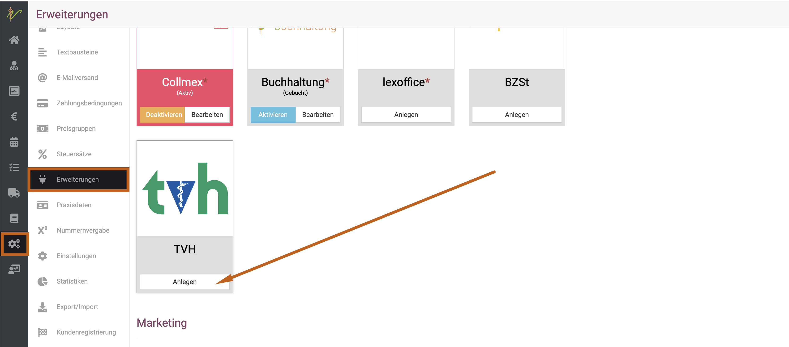
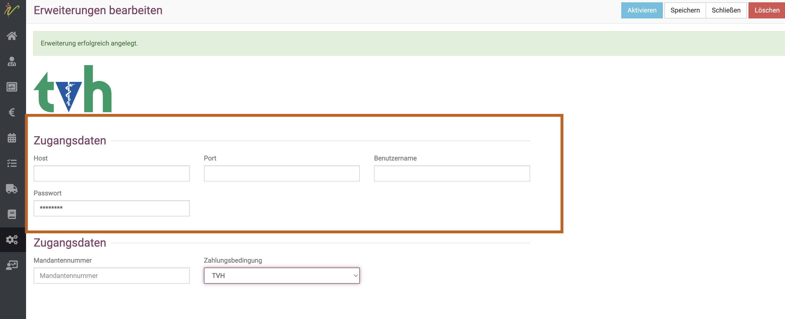
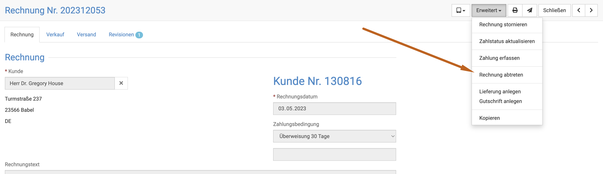

# Tierärztliche Verrechnungsstelle Heide  

Seit Mai 2023 bietet Ihnen die debevet Software eine direkte Schnittstelle zur TVH! Damit können Sie Ihre Rechnungen direkt mit
einem Klick abtreten und brauchen sich nicht mehr um die offenstehenden Posten zu kümmern!

Wir bieten Ihnen die Schnittstelle ohne einen Aufpreis. Die Konditionen der TVH finden Sie auf der Homepage: 

https://www.tvheide.de/   

## Einrichtung der TVH Schnittstelle  

Klicken Sie auf **Administration** und dann **Erweiterungen**. Suchen Sie die Kachel **TVH** und klicken Sie dort auf **Anlegen**. 

  

Nun gelangen Sie in die Einrichtungsmaske. Dort müssen Sie alle Daten, die Sie von der TVH erhalten, eintragen.

Die Mandantennummer ist Ihre 5-stellige Kundennummer der TVH.  

  

Wählen Sie unten anschließend noch die Zahlungsbedingung **TVH** aus. Sie können auch eine andere Zahlungsbedingung hinterlegen, aber der Übersichtlichkeit 
halber empfehlen wir TVH zu wählen. 

:::caution Achtung  

Nur die Rechnungen, die Sie mit der jeweils mit derselben Zahlungsbedingung wie hier in der Erweiterung angewählten Zahlungsbedingung 
erstellen, können über die TVH abgerechnet werden! 

:::

## Abrechnen über die TVH  

Wenn Sie nun eine Rechnung über die TVH abrechnen wollen, muss diese Rechnung an die TVH abgetreten werden. Setzen Sie die Zahlungdbedingung einer 
Rechnung auf die passende Zahlungsbedingung (z.B. TVH). Gehen Sie nun wie folgt vor:

1. Klicken Sie oben rechts einmal auf **Speichern**  
2. Klicken Sie auf **Erweitert**  
3. Klicken Sie auf **Rechnung abtreten**   

Die Rechnung wird nun direkt an die TVH übermitteln, sofern alle Zugangsdaten korrekt hinterlegt sind.   

