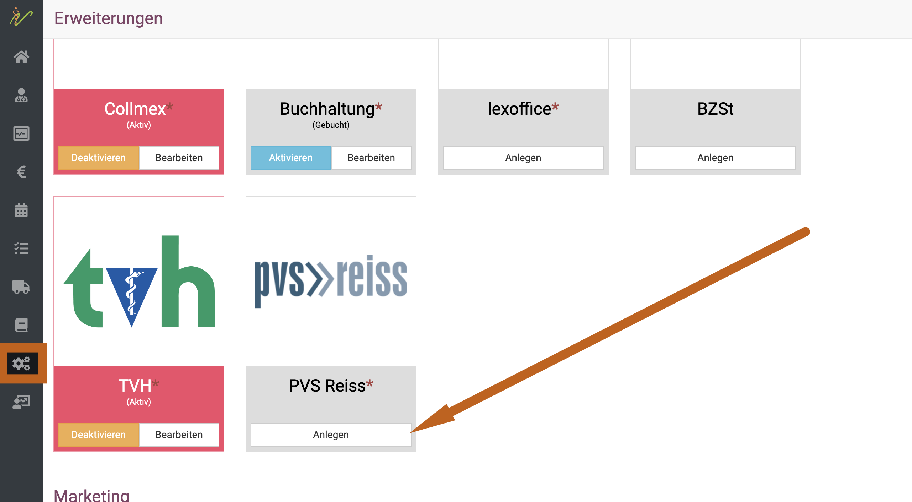

# PVS Reiss Abrechnungsstelle

Seit Januar 2024 bieten wir in unserer debevet Software eine Schnittstelle zum Abrechnungs Anbieter PVS Reiss. 

Sie können die Konditionen und Ihre Zugangsdaten direkt bei PVS Reiss erfragen bzw. beantragen:
[PVS Reiss Abrechnung für Tierärzte](https://www.pvs-reiss.de/dienstleistungen/tiermedizin/?gad_source=1&gclid=CjwKCAiA0PuuBhBsEiwAS7fsNdJ7UmmK-PygPMKm31SKTPpJc24L3h0B5A8_GHWM8biPVQII_Ny4JRoCSzcQAvD_BwE)

## Die Schnittstelle aktivieren 

Im ersten Schritt müssen Sie die Schnittstelle in unserer Software aktivieren. Klicken Sie hierzu auf **Administration** und dann
**Erweiterungen**. Klicken Sie an der Kachel "PVS Reiss" auf "anlegen". 

  

Im nächsten Schritt müssen Sie die erhaltenen Zugangsdaten eintragen und anschließend auf "Aktivieren" oben rechts klicken.   

:::tip Hinweis:  
Die neue Zahlungsbedingung "PVS Reiss" wird von debevet direkt automatisch eingerichtet. Bitte denken Sie aber daran, dass Sie diese
in der Buchhaltung noch hinterlegen müssen. Hinweise dazu finden Sie hier im Handbuch, für alle Kunden ab dem Paket "Praxis" und höher 
übernehmen wir diese Einrichtung gern für Sie.  

:::  

## Rechnungen an die Verrechnungsstelle abtreten

Erstellen Sie Rechnungen wie gewohnt und wählen nun als Zahlungsbedingung "PVS Reiss".

:::caution Achtung

Nur die Rechnungen, die Sie mit der jeweils mit derselben Zahlungsbedingung wie in der Erweiterung angewählten Zahlungsbedingung
erstellen, können über die PVS Reiss abgerechnet werden!

:::

Klicken Sie nun oben rechts auf "Erweitert" und dann "Rechnung abtreten".  

  

## Kundenbonität abfragen  

Die PVS Reiss bietet die Möglichkeit, eine Bonitätsprüfung des Kunden direkt durchzuführen. Um dies zu absolvieren, muss am Kunden
zunächst das Geburtsdatum hinterlegt werden. Klicken Sie dazu an der Kundenübersicht an der Adresse des Kunden auf "Bearbeiten".   

  

Tragen Sie das Geburtsdatum ein und klicken oben rechts "Speichern".  

   

Anschließend können Sie am Kunden unter "Allgemein" den Button "Bonität prüfen" klicken.  

Alternativ kann auch immer wieder erneut die Bonität aktualisiert werden, dies kann am Kunden unter "Allgemein" erneut erfolgen oder 
nach dem Erstellen einer Rechnung.  

