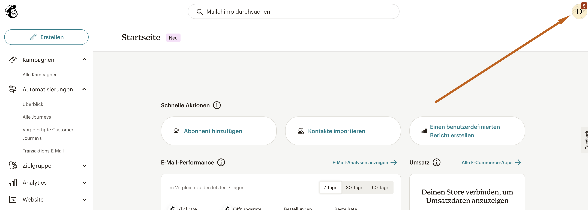
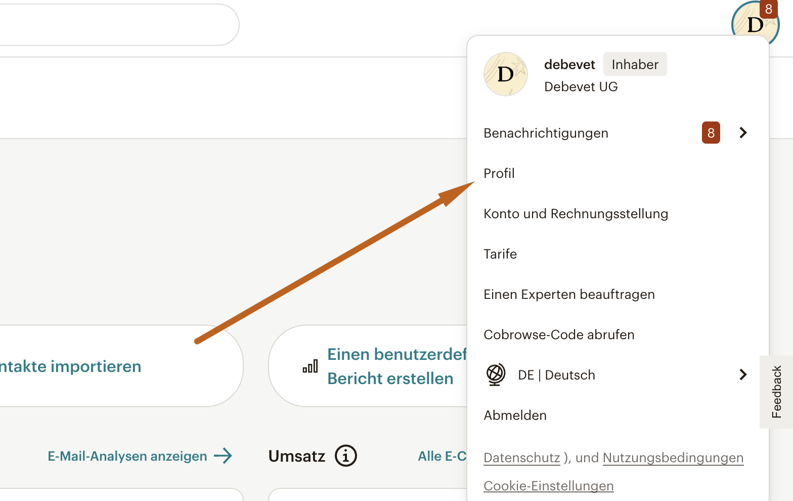
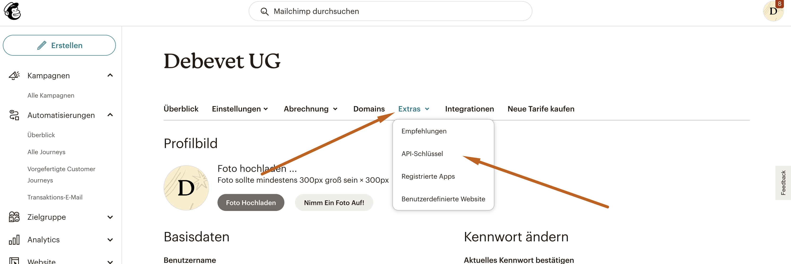
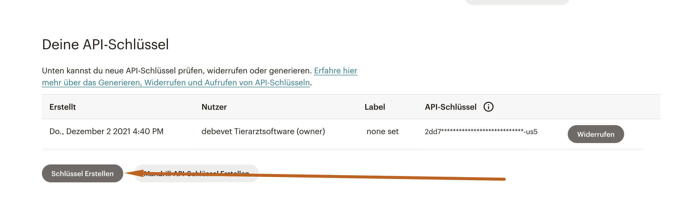
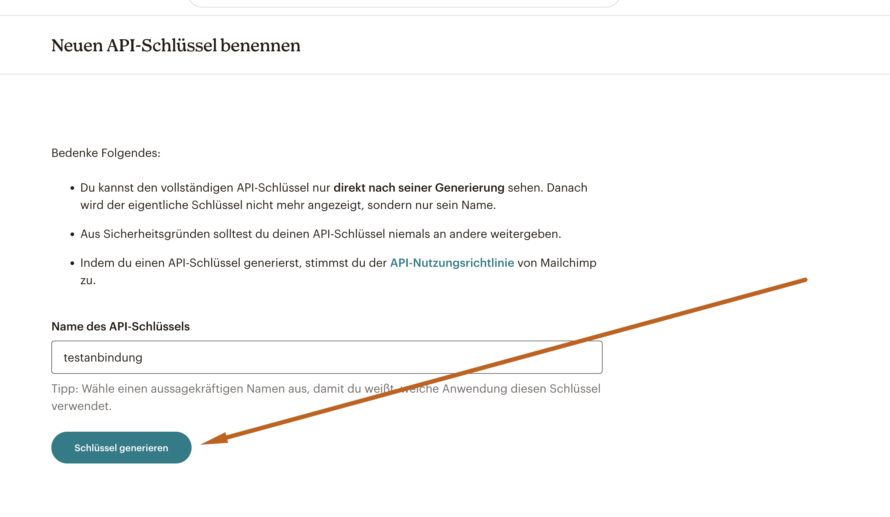
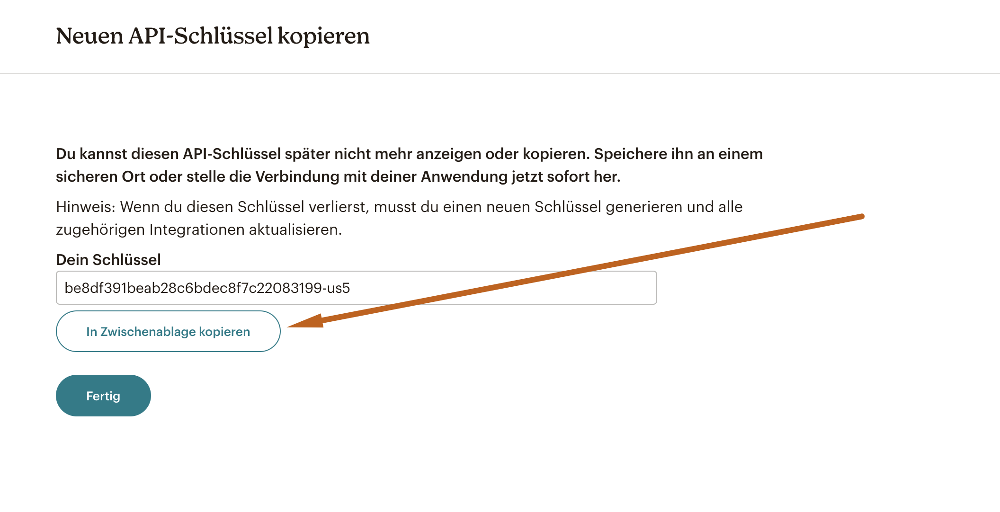
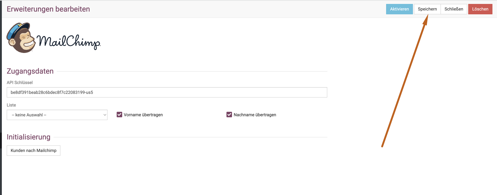
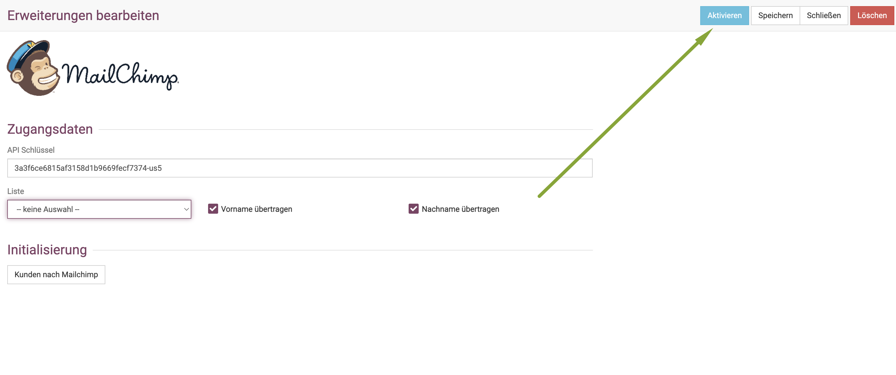
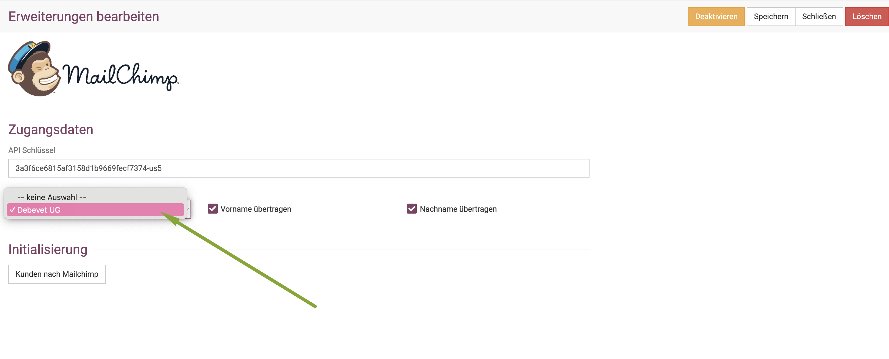

# Mailchimp  

Wenn Sie professionelle Newsletter an Ihre Kunden verschicken möchten, bietet debevet eine Schnittstelle zu 
Mailchimp.

:::caution Achtung:  

Bitte beachten Sie, dass Mailchimp Kosten produziert und diese nach Kontakten bezahlt wird. Die Anwendung von Mailchimp selbst
ist komplex und muss erlernt werden, hierfür ist der Support von Mailchimp zuständig, wir können dabei nicht behilflich sein.  

:::   

Sie müssen sich zunächst in Ihrem Mailchimp-Account einen API Schlüssel erzeugen. Loggen Sie sich in Ihren Mailchimp Account ein.  

Klicken Sie nun oben rechts auf das Account Symbol.

  

Klicken Sie nun auf "Profil"  

  

Klicken Sie nun "Extras" und dann "API-Schlüssel"   

  

Klicken Sie dann "Schlüssel erstellen", geben Ihrem Schlüssel einen beliebigen Namen und klicken dann "Schlüssel generieren".  

  

  

Kopieren diesen dann in die Zwischenablage.     

  

Gehen Sie nun zurück in Ihren debevet Account und klicken Sie auf das **Zahnrad-Symbol** und dann **Erweiterungen**. Scrollen
Sie bis zur Mailchimp Erweiterung und klicken nun "Anlegen".  

Fügen Sie hier den API Schlüssel ein und klicken **Speichern**. (Ohne Speichern funktionieren die weiteren Schritte nicht!)

   

Klicken Sie nun zunächst "Aktivieren".  

  

Anschließend steht nun unten im Bereich "Liste" Ihre Firma als Auswahl zur Verfügung. Wählen Sie diese aus und Speichern erneut.    

Anschließend können Sie auf "Kontakte nach Mailchimp" klicken, um alle Kontakte initial zu übermitteln. 

Im weiteren Verlauf werden Ihre neuen Kontakte immer automatisch zu Mailchimp übertragen. 

Alle weiteren Vorhaben, wie beispielsweise Kunden in Gruppen sortieren, bestimmte Kunden aus Mailinglisten ausschließen etc. müssen
im Mailchimp selbst vorgenommen werden. 

:::tip Hinweis:

Unsere Schnittstelle ist nur zur automatischen Synchronisierung der Kontakte vorgesehen. Alle weiteren Vorhaben liegen bei Mailchimp.   

:::   

