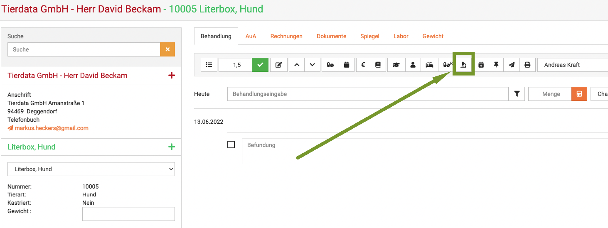
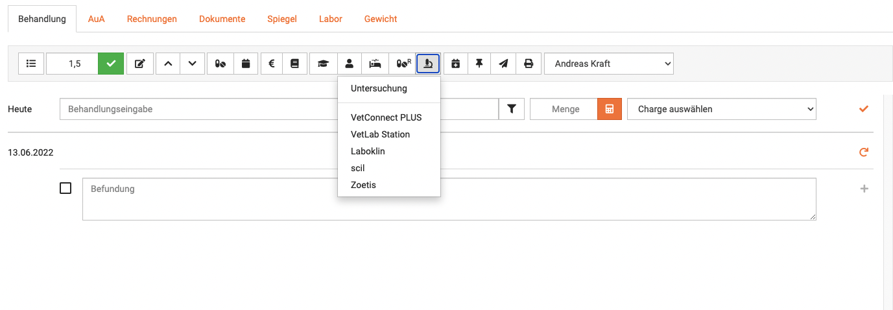
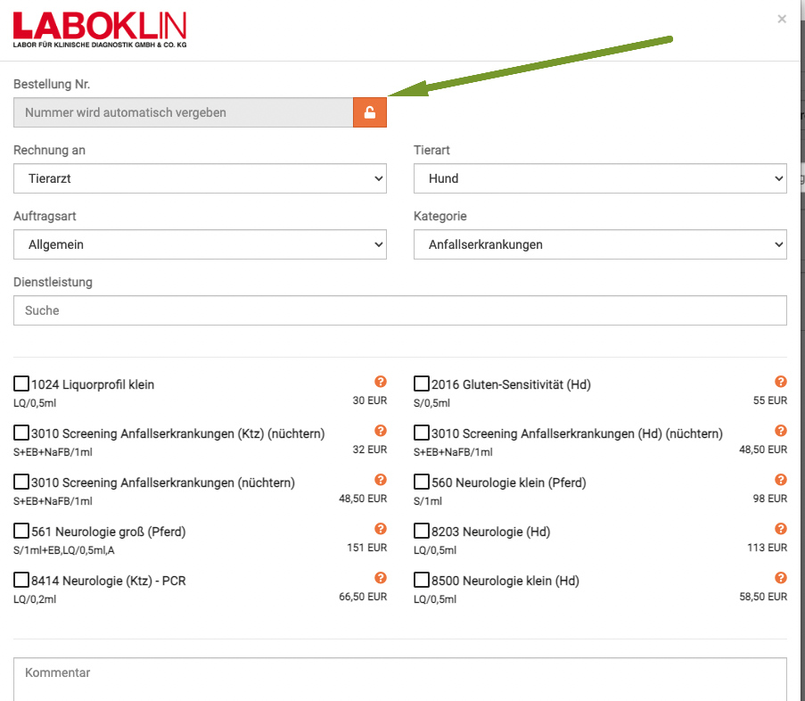
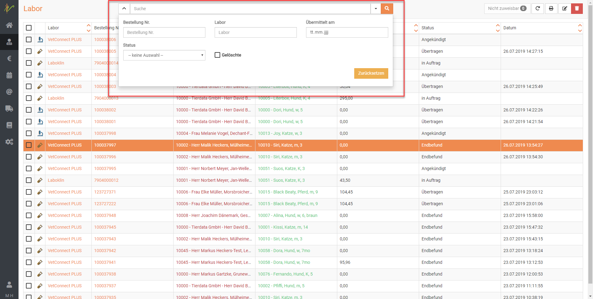
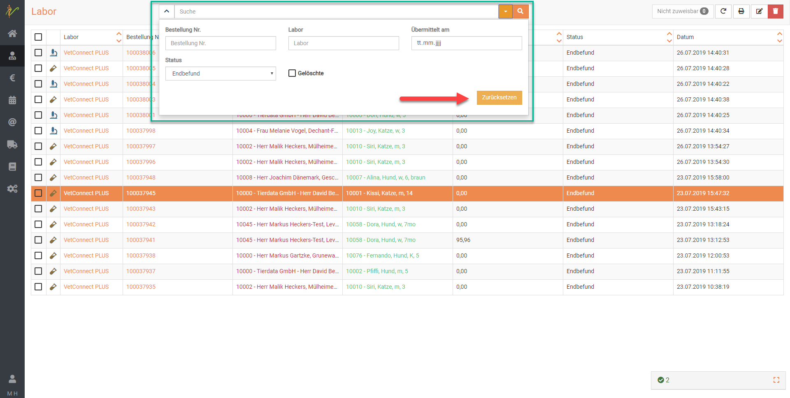
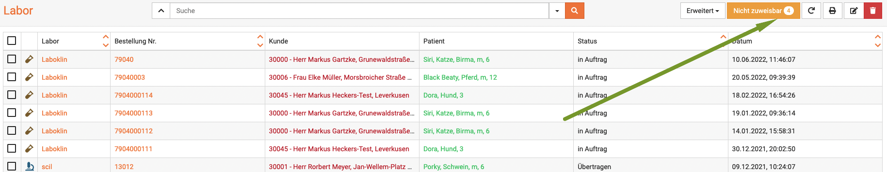
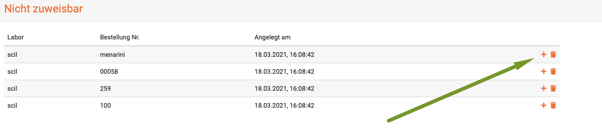

# Labor nutzen  

Hier finden Sie alle wichtigen Hilfetexte zu der Nutzung der Laborbefunde in debevet.    

## Laborauftrag erstellen   

Um für einen Patienten einen Laborauftrag zu erstellen, müssen Sie sich in der Behandlung des Tieres befinden. KLicken Sie dann in der Behandlungsmaske
oben auf das kleine Mikroskop Symbol.

Es öffnet sich nun eine Dropdownliste, die Ihnen alle Möglichkeiten aufzeigt, die sie an Laboranbindungen aktiviert haben.  

  

### Laboklin Auftrag erstellen  

Wenn Sie nun z.B. Laboklin auswählen, öffnet sich die Maske, in der Sie wählen können, was Sie beauftragen wollen. Im Normalfall wird die Nummer für die Probe automatisch 
gesetzt. 

   

:::danger ACHTUNG  

Wenn Sie bereits Befundbögen haben und die dort aufgedruckten Barcodenummern nutzen wollen, müssen Sie diese wie folgt manuell anlegen!  

:::

### Eigene Barcodenummern nutzen  

Um eine eigene Barcode-Nummer zu nutzen, klicken Sie in der Maske (z.B. Laboklin), die sich beim Erstellen des Auftrags geöffnet hat auf das **Schloß-Symbol**
neben der Barcodenummer.  

  

Nun ist dieses Feld entsperrt und Sie können eine eigene Nummer manuell eintragen.

## Laborbefunde einsehen  

Um generell eine Übersicht über alle Ihre internen und externen Laborbefunde zu sehen, klicken Sie auf **Praxis** und dann **Labor**.  
Sie bekommen in der Auflistung direkt diverse wichtige Informationen: 

* handelt es sich um ein internes Labor ( Mikroskop Symbol links) oder
* ein externes Labor (Reagenzglassymbol links)  
* Laborname
* ist die Probe "im Auftrag", "in Bearbeitung", "Endbefund" oder "Übertragen"   
* Patienten/ Besitzerdaten  

  

## Laborbefunde aktualisieren  

:::caution Achtung  

Falls Sie sich wundern, warum Ihre Befunde nicht aktuell sind: Sie müssen diese abrufen, damit Sie aktuell sind. 

:::

Kicken Sie dazu in der Laborübersicht oben rechts auf das **Aktualisierungs- Symbol**. 

## Laboraufträge suchen und finden  

Tippen Sie in das Suchfenster wie bei einer Suchmaschine Begriffe ein, die auf den gewünschten Laborauftrag 
(z.B. Kunden- oder Patientename) passen und drücken Sie die Entertaste oder klicken Sie auf das Lupensymbol.  

  

### Suche filtern  

Wenn Sie neben dem Eingabefeld für die Schnellsuche oben auf den **Pfeil nach unten** klicken, können Sie auch nach gezielten
Parametern bzw. weiteren Suchbegriffen filtern.  

### Suchenfilter zurücksetzen  

Wenn Sie eine Suche ausgeführt haben, ist die Liste gefiltert, was dadurch angezeigt wird, dass der **Pfeil nach unten** neben 
den der Schnellsuche **gelb** ist. Klicken Sie auf den **Pfeil nach unten** und dann auf **Zurücksetzen**, um die Liste wieder 
ungefiltert angezeigt zu bekommen.  

## Laborauftrag bearbeiten bzw. einsehen  

Klicken Sie auf **Praxis** → **Labor**.

Klicken Sie in der Liste ihrer Laboraufträge auf den Link in der Spalte **Labor** oder **Bestellnummer**, um auf die
Bearbeitungsseite des Laborauftrags zu gelangen. Natürlich können Sie die Liste vorher über die Suche filtern. 

:::tip Tipp  

Das Reagenzglas-Symbol zeigt an, das es sich um einen externen Laborauftrag handelt, das Mikroskop hingegen bedeutet, 
das es sich um einen internen Laborauftrag z.B. an Ihrer IDEXX VetLab-Station handelt.   

:::   

   

### Details zum Laborauftrag

  

Auf der Detailseite des Laborauftrages sehen Sie nebem dem Befund alle im System hinterlegten Details.   

Folgende Funktionen können mit diesem Seiten-Menü (von links nach rechts) ausgeführt werden:
* Direkt in die Behandlung (Kartei) dieses Patienten wechseln  
* Details zum Auftrag in VetConnect darstellen  
* Probenbegeleitschreiben ausdrucken  
* Barcode-Etikette für diese Probe ausdrucken  
* Auftrag aktualisieren bzw. abfragen im Labor  
* Schließen und zurück zur Liste  
* Laborauftrag löschen

## Mehrere Laboraufträge bearbeiten, löschen oder drucken  

Um mehrere Laboraufträge zu bearbeiten, zu löschen oder zu drucken, wählen Sie zunächst die jeweilige **Checkbox** in der Liste 
für die gewünschten Aufträge.

Klicken Sie nun auf das **Bleistift-Symbol** im Menü oben rechts, gelangen Sie auf die Detailseite des zuerst ausgewählten 
Laborauftrages auf dieser Liste. Auf der Detailseite können Sie zwischen den hier vorausgewählten ("angekreuzten") Aufträgen hin- und her navigieren.

Drücken Sie nun das **Stiftsymbol** oben rechts, um die ausgewählten Aufträge zu bearbeiten. Sie können auch einen Sammeldruck 
(Etiketten, Probenbegleitschreiben) für die ausgewählten Aufträge anstoßen.

Drücken Sie das **Mülltonnensymbol**, werden die hier ausgewählten Aufträge nach Rückfrage gelöscht.  

Drücken Sie auf das **Druckersymbol**, werden die Probenbegleitschreiben zu den ausgewählten Aufträgen in einem Sammeldruck (PDF) zum Druck dargestellt.  

  

## Befund nicht zuweisbar   
In seltenen Fällen kann es passieren, dass debevet Befunde vom Labor erhält, die keinem Patienten automatisch zugeordnet werden können. 
In diesem Fall steht auf dem Button **Nicht zuweisbar** eine umrandete Zahl.

Klicken Sie dann bitte auf den Button **Nicht Zuweisbar**. 

  

Dort finden Sie nun eine Auflistung der nicht zuweisbaren Aufträge. Um einen Auftrag manuell einem Patienten zuzuweisen, klicken
Sie auf das **Plus Symbol** in der Liste rechts.   

   

Nun öffnet sich eine Maske, in der Sie den Befund einem Patienten oder einem Untersuchungsauftrag zuweisen können.  

