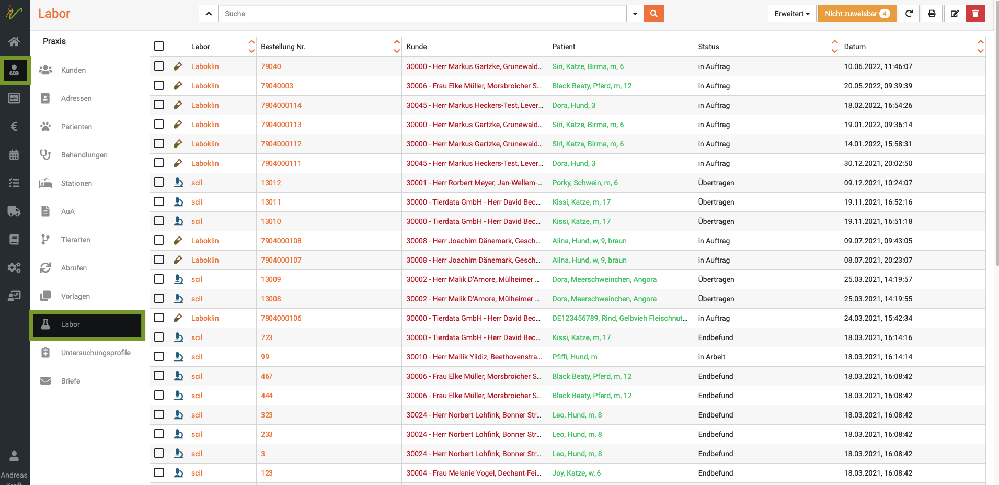
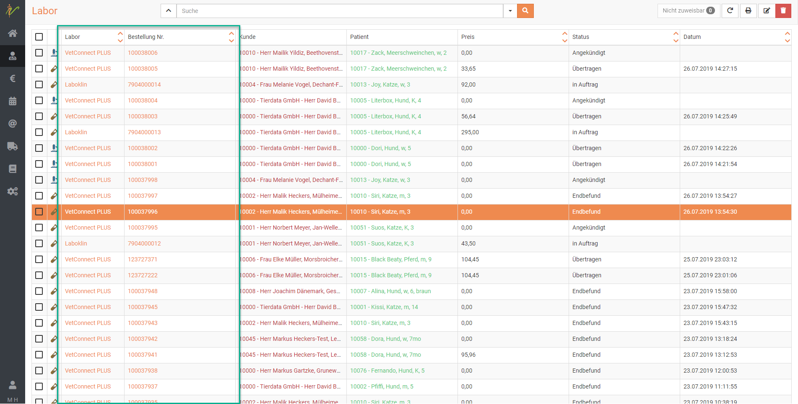
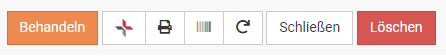

# Labor 

Um generell eine Übersicht über alle Ihre internen und externen Laborbefunde zu sehen, klicken Sie auf **Praxis** und dann **Labor**.  
Sie bekommen in der Auflistung direkt diverse wichtige Informationen: 

* handelt es sich um ein internes Labor ( Mikroskop Symbol links) oder
* ein externes Labor (Reagenzglassymbol links)  
* Laborname
* ist die Probe "im Auftrag", "in Bearbeitung", "Endbefund" oder "Übertragen"   
* Patienten/ Besitzerdaten  

  

## Laboraufträge suchen und finden  

Tippen Sie in das Suchfenster wie bei einer Suchmaschine Begriffe ein, die auf den gewünschten Laborauftrag 
(z.B. Kunden- oder Patientename) passen und drücken Sie die Entertaste oder klicken Sie auf das Lupensymbol.  

  

### Suche filtern  

Wenn Sie neben dem Eingabefeld für die Schnellsuche oben auf den **Pfeil nach unten** klicken, können Sie auch nach gezielten
Parametern bzw. weiteren Suchbegriffen filtern.  

### Suchenfilter zurücksetzen  

Wenn Sie eine Suche ausgeführt haben, ist die Liste gefiltert, was dadurch angezeigt wird, dass der **Pfeil nach unten** neben 
den der Schnellsuche **gelb** ist. Klicken Sie auf den **Pfeil nach unten** und dann auf **Zurücksetzen**, um die Liste wieder 
ungefiltert angezeigt zu bekommen.  

## Laborauftrag bearbeiten bzw. einsehen  

Klicken Sie auf **Praxis** → **Labor**.

Klicken Sie in der Liste ihrer Laboraufträge auf den Link in der Spalte **Labor** oder **Bestellnummer**, um auf die
Bearbeitungsseite des Laborauftrags zu gelangen. Natürlich können Sie die Liste vorher über die Suche filtern. 

:::tip Tipp  

Das Reagenzglas-Symbol zeigt an, das es sich um einen externen Laborauftrag handelt, das Mikroskop hingegen bedeutet, 
das es sich um einen internen Laborauftrag z.B. an Ihrer IDEXX VetLab-Station handelt.   

:::   

   

### Details zum Laborauftrag

  

Auf der Detailseite des Laborauftrages sehen Sie nebem dem Befund alle im System hinterlegten Details.   

Folgende Funktionen können mit diesem Seiten-Menü (von links nach rechts) ausgeführt werden:
* Direkt in die Behandlung (Kartei) dieses Patienten wechseln  
* Details zum Auftrag in VetConnect darstellen  
* Probenbegeleitschreiben ausdrucken  
* Barcode-Etikette für diese Probe ausdrucken  
* Auftrag aktualisieren bzw. abfragen im Labor  
* Schließen und zurück zur Liste  
* Laborauftrag löschen

