# Labor einrichten/ Erweiterung Labor

Um die Labormöglichkeiten in debenvet voll ausnutzen zu können, müssen Sie zunächst die gewünschte Laborschnittstelle aktivieren.
Die Zugangsdaten, die Sie dafür benötigen, bekommen Sie von Ihrem jeweiligen Laboranbieter. Zur Zeit können wir folgende Schnittstellen bieten:

* IDEXX
* LABOKLIN
* scil  
* Zoetis

##  IDEXX anbinden

Für die Einrichtung benötigen Sie Zugriff auf debevet mit einem Benutzer, der Administrator ist.

Klicken Sie in debevet auf **Administration** (Zahnradsymbol) → **Erweiterungen**. Scrollen Sie dann bis zu den Laboranbindungen herunter.

Klicken Sie auf den grauen Button *Anlegen* bzw. *Bearbeiten*
(falls die Erweiterung bereits verwendet wird) auf der Kachel der Erweiterung IDEXX VetConnect Plus.

:::tip Tipp

Im Gegensatz zu den Buchhaltungs-Erweiterungen können Sie auch mehrere Labor-Erweiterungen parallel nutzen, diese behindern sich nicht
gegenseitig.

:::

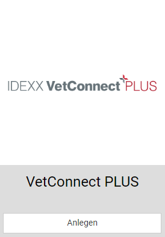

### Zugangsdaten eingeben

Im Bereich Zugangsdaten geben Sie bitte den Benutzernamen als auch das Kennwort für den Webservice VetConnect-Plus von IDEXX ein.
Die Daten erhalten Sie direkt von IDEXX.

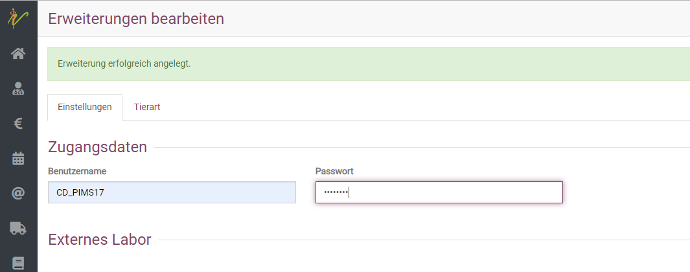

### Individuelle Praxis-Einstellungen für Idexx

Aktivieren Sie anschließend durch Ankreuzen, ob Sie externe (Untersuchungen im externen IDEXX-Labor) und/oder interne
Laboraufträge (Untersuchung an Ihrer VetLab-Staion) in debevet managen möchten (beauftragen, abfragen und in der Kartei managen).

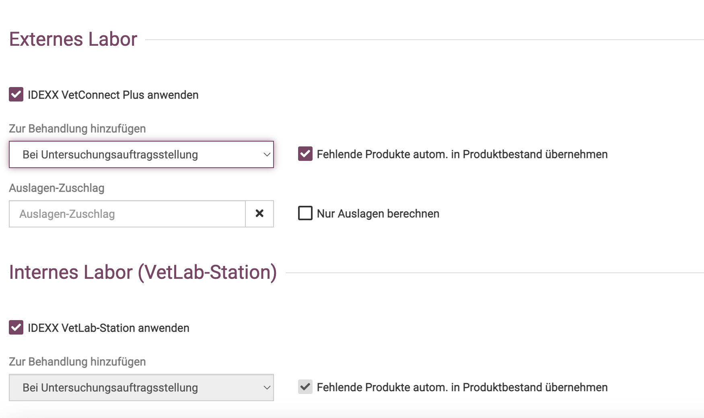

**Zur Behandlung hinzufügen:**   
Legen Sie fest, ob und wann Labortests inkl. Preis in die Behandlungshistorie des Patienten (Kartei) übernommen werden.
Dabei gibt es zwei Möglichkeiten: 
1. Am Tag der Untersuchungsbeauftragung
2. Am Tag des Endergebnisses

:::caution Achtung

Dabei handelt es sich NUR um die Abrechnungsposten. Das Ergebnis des Tests wird nach dem Import/Abrufen an den Tag zugeordnet, an dem
Sie das Endergebnis abgerufen haben in die Kartei gelegt.

:::

**Fehlende Produkte autom. in Produktbestand übernehmen:**

Wenn dieses Feld aktiviert ist, werden Tests automatisch aus dem IDEXX-Katalog in Ihren Produktkatalog in debevet aufgenommen
und aktualisiert.

:::caution Achtung

Bitte beachten Sie, dass Sie beim internen Labor, Ihre Preise für die Labortests (Dienstleistungsprodukte)
eigenverantwortlich erfassen müssen. Sollten Sie einen Preis erfasst haben, ist es ratsam, die Katalogaktualisierung für den jeweiligen
Test zu deaktivieren, damit bei der nächsten Aktualisierung des Tests durch die IDEXX, der Preis nicht wieder auf 0 Euro gesetzt wird.

:::

**Nur Auslagen berechnen:**

Diese Funktion hat nur Auswirkung, wenn Sie im Bestellprozess keine Rechnung an den Tierhalter direkt veranlassen.
Ist dies aktiviert, werden bei externen Tests die Preise für den Test in die Kartei übernommen, welche durch die IDEXX Ihrer Praxis berechnet werden.

### Preisgestaltung 

Sie haben mehrere Möglichkeiten:
1. Sie berechnen nur den Tierarztpreis (Auslagen nicht berechnen)
2. Sie berechnen den Brutto VK
3. Sie lassen die Rechnung zum Brutto VK an den Tierhalter schicken 

**Auslagen-Zuschlag:**

Hier können Sie ein eigenes Auslagenprodukt (Dienstleistung, z.B. "GOT 144) suchen und festlegen, dass diese GOT Leistung beim 
beantragen der Laborleistung immer direkt automatisch mit eingetragen und berechnet wird (das spart das manuelle eingeben). 

Wenn Sie **Nur Auslagen berechnen** anklicken/aktivieren, rechnen Sie nur Ihren Tierarztpreis mit Ihrem Kunden ab. Der Auslagen Zuschlag bleibt davon unbeeinflusst.

Aktivieren Sie **Nur Auslagen berechnen** nicht und wählen keinen Auslagen-Zuschlag,
werden die Verkausfspreise der IDEXX (Endkundenpreise, brutto) in die Kartei übernommen und können später von dort berechnet werden.

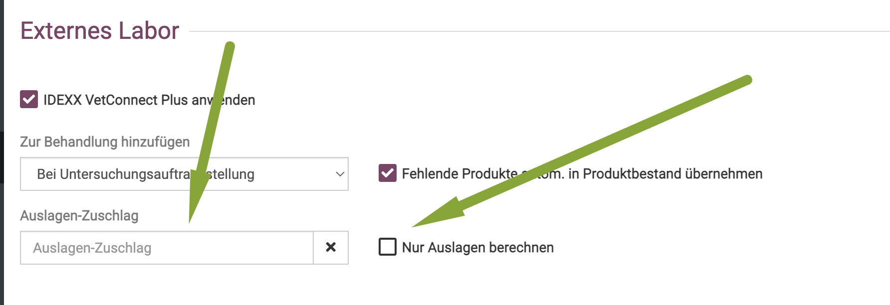

Die weiteren Einstellungen für das interne Labor sind aktuell nicht abweichend einstellbar und werden aus den Einstellungen
für das externe Labor übernommen.

:::tip Tipp

Ob die Rechnung bei externen Laboraufträgen direkt an den Tierhalter erfolgt oder nicht, legen Sie jeweils im Bestellprozess fest.

:::

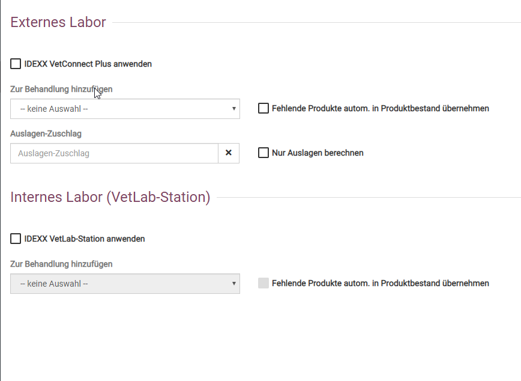

### Aktivieren bzw. Deaktivieren der IDEXX-Erweiterung

Abschließend können Sie oben rechts auf **Aktivieren** bzw. **Deaktivieren** klicken, je nach Zustand der Schnittstelle,
um die IDEXX-Schnittstelle in debevet zu nutzen bzw. die Nutzung auszusetzen. Klicken Sie auf **Löschen** wird die erstellte Konfiguration
für IDEXX aus debevet komplett entfernt und kann später jederzeit neu angelegt werden.

Bitte achten Sie darauf, dass alle Eingaben auf dieser Seite für die IDEXX-Schnittstelle erst nach dem Klicken auf den Button **Speichern** übernommen werden.

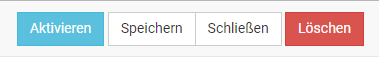

### Tierarten

Für einige Tests ist die genaue Kenntnis der Tierarten unerlässlich. Damit die Tierarten in debevet, vor allem wenn Sie eigene
Spezies erfasst haben, von IDEXX richtig erkannt werden, können Sie in dieser Liste Ihre Tierart der IDEXX-Tierart zuweisen.

Wenn Sie einen neuen Eintrag am Ende der Liste erfassen, klicken Sie nach der Eingabe auf den Haken am Ende der neuen Zeilen und vergessen Sie nicht am Ende zu speichern.

Nun ist Ihre Schnittstelle nutzbar und Sie können im nächsten Schritt lernen, wie Sie Laboraufträge erstellen und erfassen.
  
## LABOKLIN anbinden  

Für die Einrichtung benötigen Sie Zugriff auf debevet mit einem Benutzer, der Administrator ist.

Klicken Sie in debevet auf **Administration** (Zahnradsymbol) → **Erweiterungen**. Scrollen Sie dann bis zu den Laboranbindungen herunter.

Klicken Sie auf den Button *Anlegen* bzw. *Bearbeiten*
(falls die Erweiterung bereits verwendet wird) auf der Kachel der Erweiterung LABOKLIN.

:::tip Tipp

Im Gegensatz zu den Buchhaltungs-Erweiterungen können Sie auch mehrere Labor-Erweiterungen parallel nutzen, diese behindern sich nicht
gegenseitig.

:::  

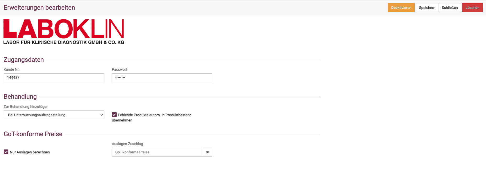  

### Zugangsdaten eingeben

Im Bereich Zugangsdaten geben Sie bitte den Benutzernamen als auch das Kennwort für den Webservice von LABOKLIN ein.
Die Daten erhalten Sie direkt von LABOKLIN.  

**Zur Behandlung hinzufügen:**   
Legen Sie fest, ob und wann Labortests inkl. Preis in die Behandlungshistorie des Patienten (Kartei) übernommen werden.

**Fehlende Produkte autom. in Produktbestand übernehmen:**

Wenn dieses Feld aktiviert ist, werden Tests automatisch aus dem LABOKLIN-Katalog in Ihren Produktkatalog in debevet aufgenommen
und aktualisiert.

**Nur Auslagen berechnen:**

Diese Funktion hat nur Auswirkung, wenn Sie im Bestellprozess keine Rechnung an den Tierhalter direkt veranlassen.
Ist dies aktiviert, werden bei externen Tests die Preise für den Test in die Kartei übernommen, welche durch die LABOKLIN Ihrer Praxis berechnet werden.

**Auslagen-Zuschlag:**

Hier können Sie ein eigenes Auslagenprodukt (Dienstleistung) suchen und festlegen, dass dem Tierhalter für Ihre Auslage
zusätzlich in Rechnung gestellt wird. Aktivieren Sie **Nur Auslagen berechnen** nicht und wählen keinen Auslagen-Zuschlag,
werden die Verkausfspreise der LABOKLIN (Endkundenpreise) in die Kartei übernommen und können später von dort berechnet werden.

:::tip Tipp

Ob die Rechnung bei externen Laboraufträgen direkt an den Tierhalter erfolgt oder nicht, legen Sie jeweils im Bestellprozess fest.

:::
  
## scil anbinden  

Die Einrichtung der Schnittstelle für scil Laborgeräte funktioniert ein wenig anders, als die beiden zuvor genannten.  

### G-Drive einrichten  

debevet nutzt zur Anbindung von scil vIP den kostenlosen Online-Speicher "G-Drive" von Google und deren G-Drive Desktop Anwendung. 
Registrieren Sie sich ein kostenloses Google Konto oder nutzen Sie ein vorhandenes.  

[Kostenloses Googlekonto anlegen](https://myaccount.google.com/?utm_source=sign_in_no_continue&pli=1&nlr=1)  

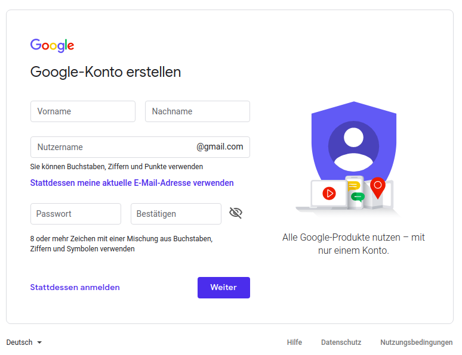  

### G-Drive für Desktop herunterladen  

Laden Sie G-Drive Desktop herunter und installieren Sie es. Wenn Sie dies bereits erledigen, kann die Einrichtung durch den Servce Techniker 
von Scil schneller erfolgen. Falls Sie dies nicht selbst erledigen können oder wollen, kann dies durch den Scil-Techniker bei der Einrichtung Ihrer
scil vIP vorgenommen werden. In diesem Fall springen Sie direkt zur Einrichtung in debevet.  

[G-Drive Desktop installieren](https://support.google.com/drive/answer/7329379#zippy=%2Cgoogle-drive-f%C3%BCr-den-desktop-herunterladen-und-installieren)   

### Scil VIP Konsole einrichten

Damit die Synchronisation der Aufträge und Ergebnisse fließend funktioniert, müssen bestimmte Einstellungen in der VIP Konsole von
Scil erfolgen. Dafür machen Sie einen Termin mit dem dortigen Kundenberater, der via Teamviewer auf Ihren Rechner zugreift und die entsprechenden Einstellungen
vornimmt.

Erst durch diese Einstellungen in der Scil VIP Konsole wird der Synchronisationsordner erstellt, den Sie für die Einstellungen der Synchronisation benötigen.
(Scil VIP Data) 

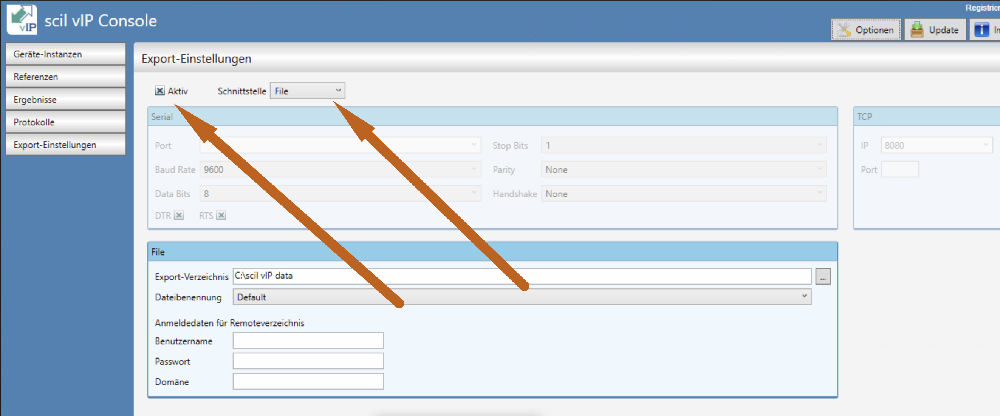

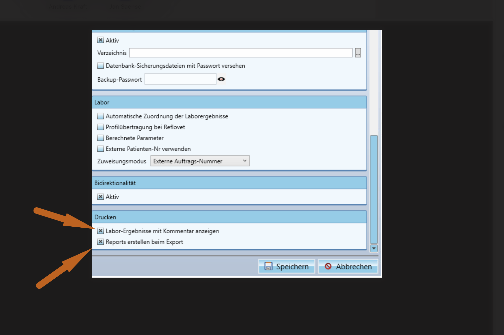  

### G-Drive für Desktop installieren  

Öffnen Sie die G-Drive Anwendung an Ihrem Rechner, nachdem Sie diese heruntergeladen haben. Hier finden Sie eine Ansicht, wo Sie am Apple die Anwendung sehen und öffnen.  
(oben in der Funktionsleiste das kleine dreieckige Symbol)

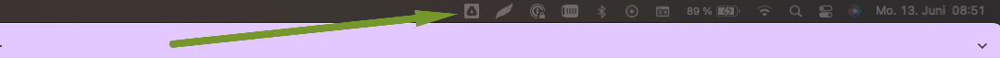 

Klicken Sie dort nun rechts auf das Zahnradsymbol und wählen dann "Einstellungen".  

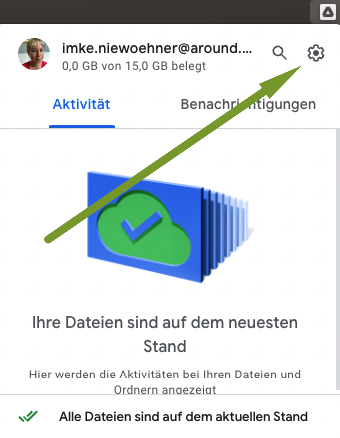  

Nun können Sie den passenden Ordner wählen, in dem Sie auf "Ordner hinzufügen" klicken. Wählen Sie von Ihrem Rechner den Ordner **scil vIP data**.

Nach Abschluss setzen Sie die Auswahl "mit Google Drive synchronisieren".  

:::danger  ACHTUNG:

Der Ordner "Scil vIP data" wird erst nach Einrichtung der Scil vIP Konsole durch den Service Techniker von Scil erstellt!  

::: 

### scil aktivieren

Nun können Sie die scil Erweiterung aktivieren. Klicken Sie auf **Administration** (Zahnradsymbol) und dann **Erweiterungen**. 

Wählen Sie dann die scil Erweiterung und klicken den grauen Button **Anlegen**.

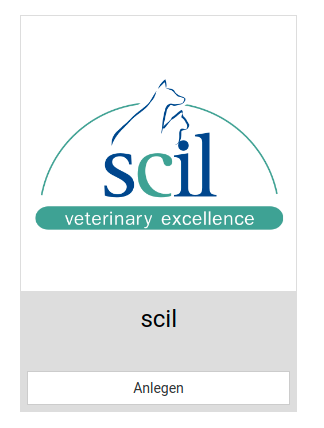  

### scil G-Drive Verbindung verknüpfen

Die Anbindung von scil vIP erfolgt über Google Drive. Klicken Sie nun auf “Authentifizieren”, um Ihr Google Konto mit debevet zu verknüpfen. Sie zu Google weitergeleitet. 
Geben Sie hier Ihr Google Konto ein oder wählen Sie ein bereits angemeldet aus und bestätigen in dem Sie auf “Zulassen” drücken.

Es öffnet sich wieder debevet. Bei erfolgreicher Anmeldung sind Felder “Zugriffstoken”, “Aktualisierungstoken” und “Gültig bis” ausgefüllt.  

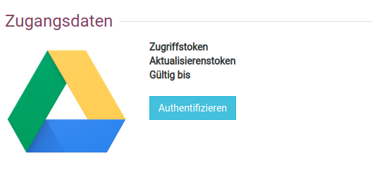  

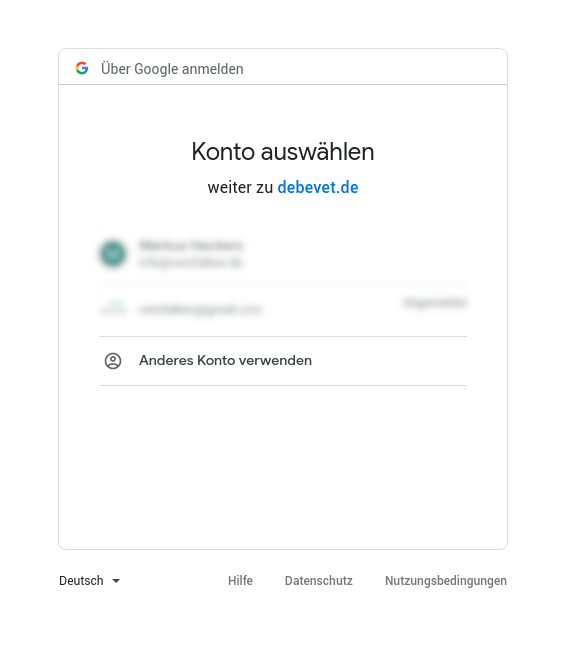  

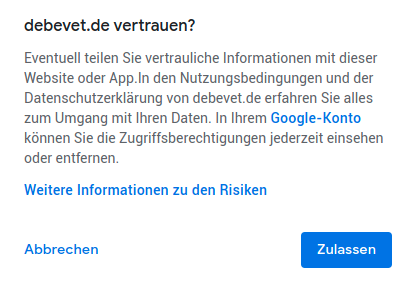  

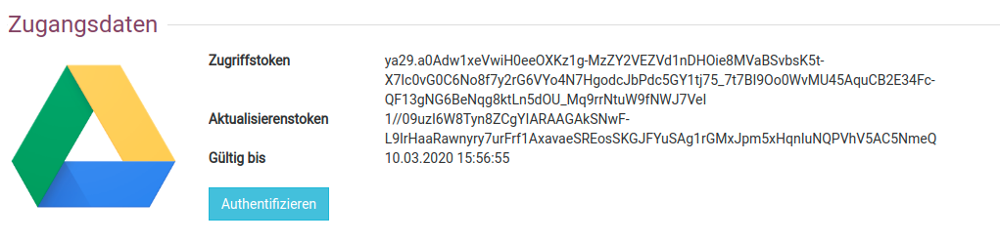  

### scil Laborgeräte auswählen 

Bereits nachdem Sie die scil Erweiterung aktiviert haben, können Sie Ihre Laborgeräte auswählen. Aktivierte Laborgeräte werden als erstes gelistet,
danach folgen alle zur Verfügung stehenden Laborgeräte.

Farbig hervorgehobene Laborgeräte werden nach dem Speichern Ihrer scil Erweiterung hinzugefügt oder bleiben bestehen. Ausgegraute werden entsprechend entfernt.  

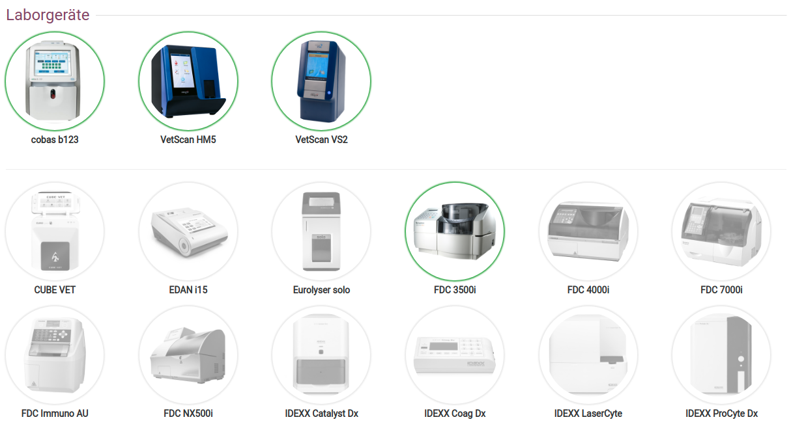  

## Zoetis anbinden  

Sie erhalten von Zoetis eine Client ID. Diese müssen Sie an der Erweiterung hinterlegen.  

Klicken Sie **Administration** und dann **Erweiterungen** und wählen an der Kachel **Zoetis** dann **Anlegen**.

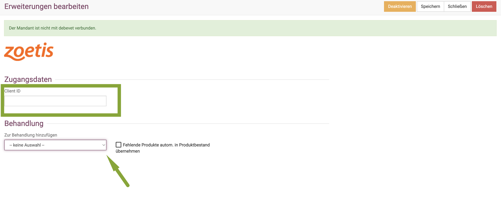  

Auch hier können Sie am **Dropdown-Pfeil** wählen, wann die Untersuchungen der Behandlung hinzugefügt werden sollen.  

Klicken Sie abschließend oben rechts auf **Speichern** und auf **Aktivieren**.

