# Labor nutzen  

Hier finden Sie alle wichtigen Hilfetexte zu der Nutzung der Laborbefunde in debevet.    

## Laborauftrag erstellen   

Um für einen Patienten einen Laborauftrag zu erstellen, müssen Sie sich in der Behandlung des Tieres befinden. KLicken Sie dann in der Behandlungsmaske
oben auf das kleine Mikroskop Symbol.

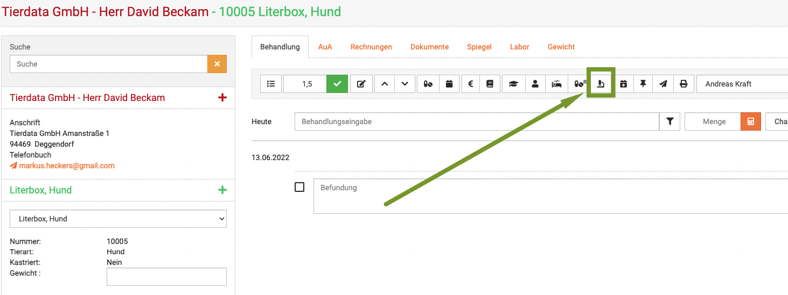

Es öffnet sich nun eine Dropdownliste, die Ihnen alle Möglichkeiten aufzeigt, die sie an Laboranbindungen aktiviert haben.  

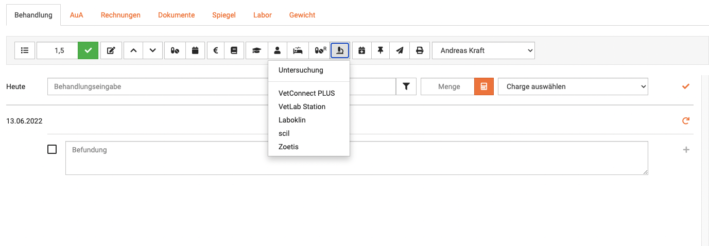  

### Laboklin Auftrag erstellen  

Wenn Sie nun z.B. Laboklin auswählen, öffnet sich die Maske, in der Sie wählen können, was Sie beauftragen wollen. Im Normalfall wird die Nummer für die Probe automatisch 
gesetzt. 

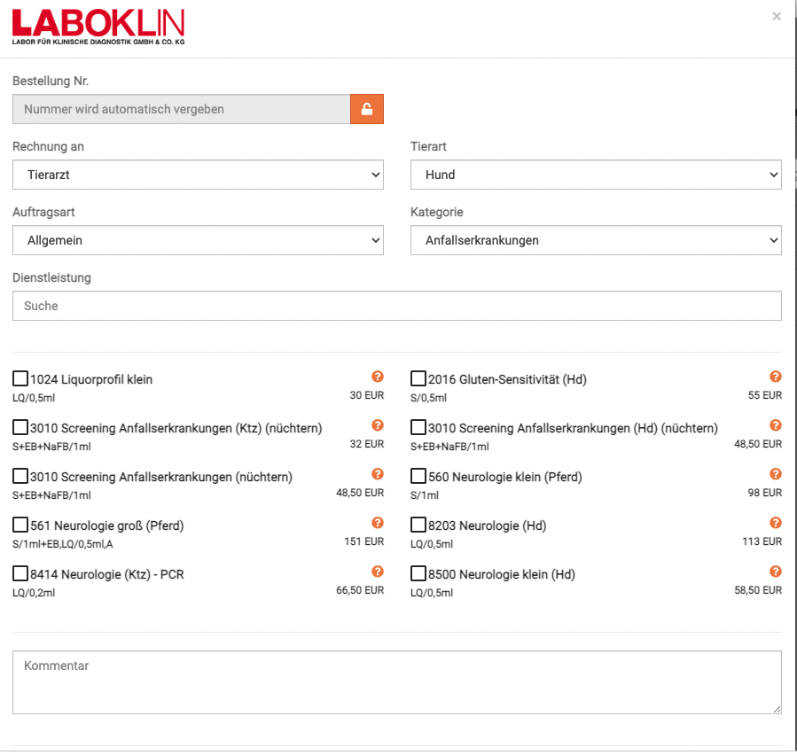   

:::danger ACHTUNG  

Bitte beachten Sie, dass Sie in jedem Fall den Anforderungsbogen über debevet ausdrucken und mitsenden müssen! 
Eine Anleitung finden Sie in den folgenden Schritten!
:::
### Eigene Barcodes nutzen  

Um die von Laboklin gelieferten Abreißbögen mit Barcodes zu nutzen, kleben Sie immer EINEN auf den Auftragsbogen, den Sie wie
folgt erstellen bzw drucken, und die anderen auf die Proben wie gewohnt. Ansonsten kann KEINE voll automatische Zuordnung erfolgen!

### Anforderungsbogen nutzen und drucken

Klicken Sie zunächst am gewünschten Patienten den Reiter **Labor**. Alternativ können Sie auch über **Praxis** und dann **Labor**
ALLE beauftragten Laboranträge einsehen. 

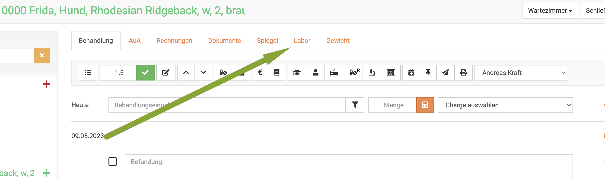  

Klicken Sie nun auf die Auftragsnummer. 

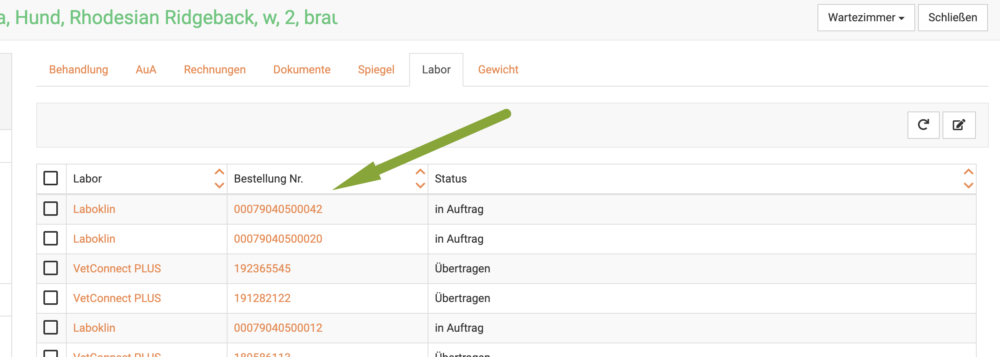  

In der Ansicht klicken Sie dann das Druckersymbol.   

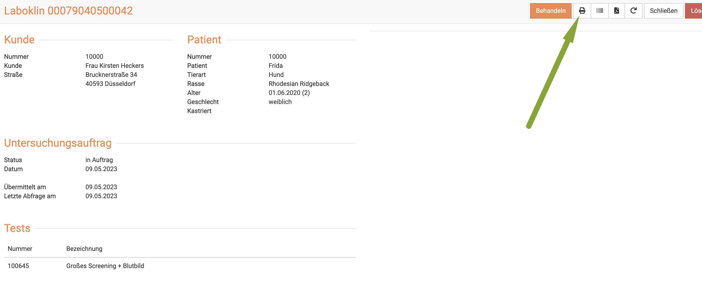  

Und dort erneut auf das Druckersymbol. Nun kann Ihr Drucker den Begleitschein drucken und Sie können diesen mitschicken.   

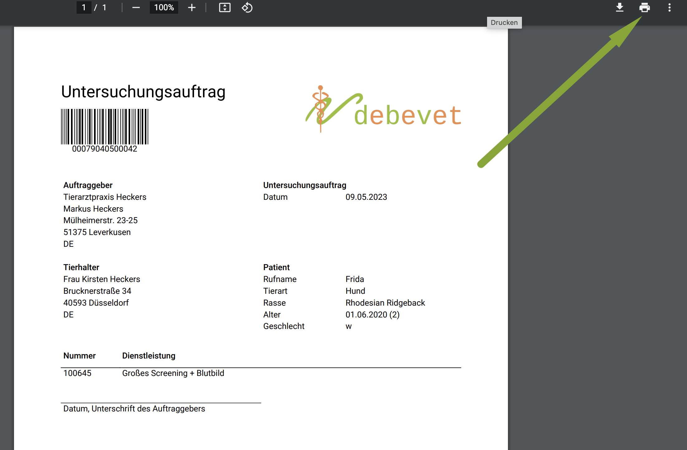

### scil Auftrag erstellen  

Wenn Sie beim Klick auf das **Mikroskop-Symbol** im Dropdown **scil** wählen,  öffnet sich ein Fenster für den Untersuchungsauftrag. 

Es stehen Ihnen folgende Felder zur Verfügung:

* “Bestellung Nr.” wird automatisch über den Nummernkreis von debevet vergeben oder kann manuell gesetzt werden  
* “Tierart” wird automatisch für die von debevet vorgegebenen Tierarten gesetzt  
* “Laborgeräte” eine Auswahl Ihrer aktivierten Laborgeräte 
* “Untersuchungsprofile” eine Auswahl freiplfegbarer Profile für Ihre Laborgeräte. Die Auswahl ist nicht auf das ausgewählte Laborgerät begrenzt.
Die Auswahl eines Untersuchungsprofil setzt entsprechende Laborgerät und wählt die Parameter aus.  
* “Parameter” die von dem Laborgerät unterstützten Parameter, die frei anwählbar sind. Wenn ein Untersuchungsprofil ausgewählt ist, gelten folgende Regeln:  
  * beim Abwählen von Parametern, die dem Untersuchungsprofil zugeordnet sind, wird das Untersuchungsprofil entfernt. Beim Hinzufügen in die Behandlungsakte werden Einzelparameter aufgeführt
  * beim Hinzuwählen von Parametern, wird das Untersuchungsprofil plus die Einzelparameter der Behandlungsmaske hinzugefügt
* “Beschreibung” Freitextfeld

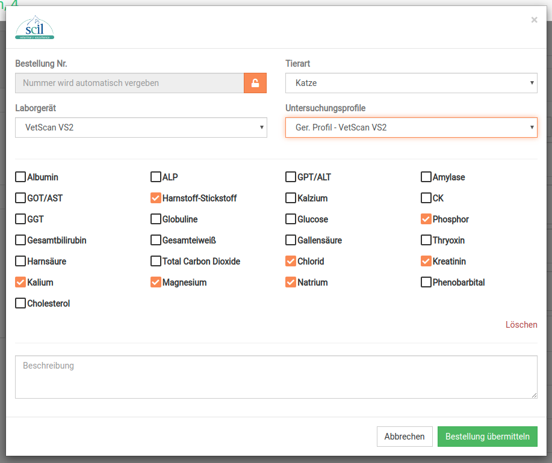  

### Idexx Auftrag erstellen  

Nach dem Klick auf das **Mikroskop-Symbol** können Sie entweder ihr Idexx Heimlabor Gerät wählen, oder zum Einsenden einer Probe
wählen Sie **Vet Connect Plus**.  

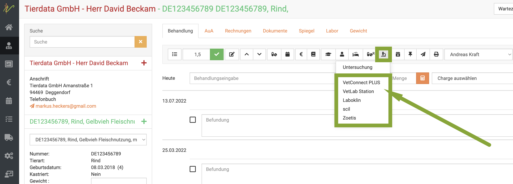  

Nun öffnet sich die Maske, in der Sie das gewünschte Laborprofil oder die Laborwerte, die Sie beauftragen wollen, angeben können.
Ebenso können Sie wählen, ob die Rechnung an den Tierhalter oder an Sie erfolgen soll.  

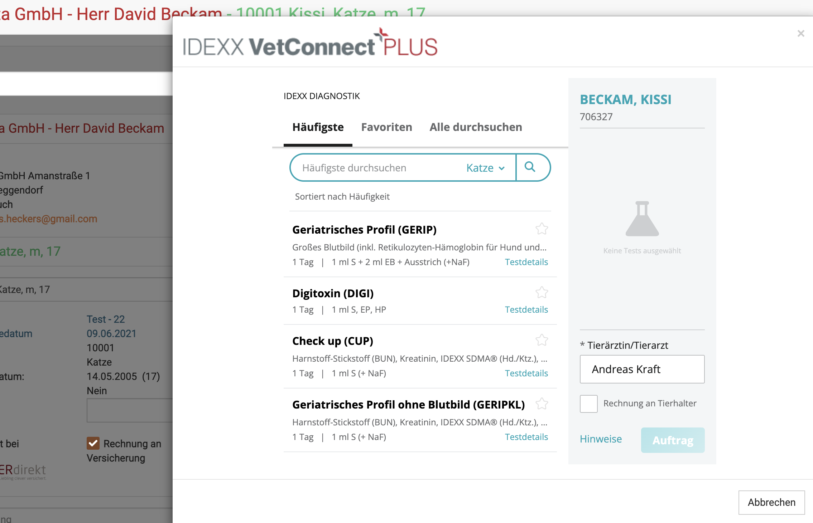  

Klicken Sie abschließend auf **Auftrag**.  

### Idexx Werte nachfordern  

Bisher bietet unsere Schnittstelle leider noch keine Möglichkeit, Werte nachzufordern. Wir haben aber einen Tipp für Sie:
Idexx hat eine eigene App entwickelt, die sehr reibungslos funktioniert. Aufträge, die Sie aus dem debevet erzeugt haben, sind immer in Ihrem Vetconnect Plus
auch via Browser oder der App einzusehen. Über die App (oder den Browser) können zu jedem Auftrag blitzschnell noch Werte nachgeforder werden,
die nach dem Aktualisieren/Abrufen im debevet dann direkt in der Kartei des Patienten liegen!

Die App können Sie im Appstore bzw. Playstore herunterladen und mit Ihren Vetconnect Plus Zugangsdaten direkt nutzen.

### zoetis Auftrag erstellen  

Um Ihr hausinternes zoetis Gerät mit einem Auftrag zu versehen, wählen Sie nach Klick auf das **Mikroskop-Symbol** 
in der Liste **zoetis**. 

Wenn Sie nun das gewünschte Gerät auswählen, bekommen Sie den Überblick, welche Untersuchungen beauftragt werden können. 

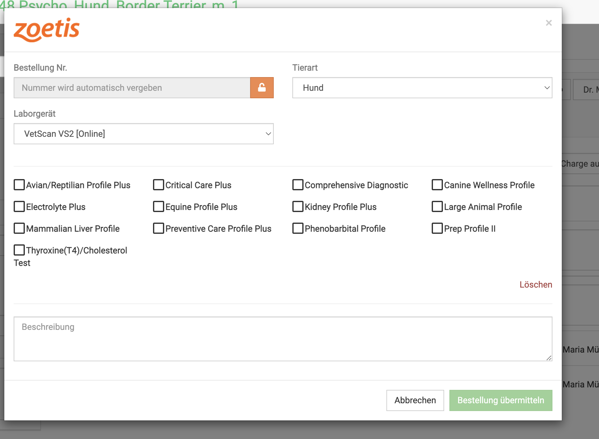

Klicken Sie abschließend auf **Bestellung übermitteln**.  

## Laborbefunde einsehen  

Um generell eine Übersicht über alle Ihre internen und externen Laborbefunde zu sehen, klicken Sie auf **Praxis** und dann **Labor**.  
Sie bekommen in der Auflistung direkt diverse wichtige Informationen: 

* handelt es sich um ein internes Labor ( Mikroskop Symbol links) oder
* ein externes Labor (Reagenzglassymbol links)  
* Laborname
* ist die Probe "im Auftrag", "in Bearbeitung", "Endbefund" oder "Übertragen"   
* Patienten/ Besitzerdaten  

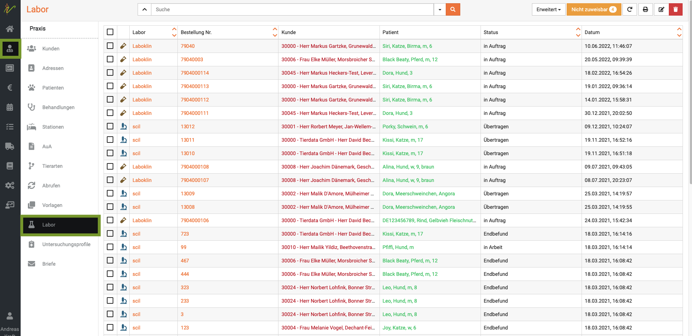  

## Laborbefunde abrufen

:::caution Achtung  

Falls Sie sich wundern, warum Ihre Befunde nicht aktuell sind: Sie müssen diese abrufen, damit Sie aktuell sind. 

:::

Wählen Sie die Checkboxen der gewünschten Laborbefunde (oder alle durch Klick ganz oben). 
Klicken Sie dann in der Laborübersicht oben rechts auf das **Aktualisierungs- Symbol**. 

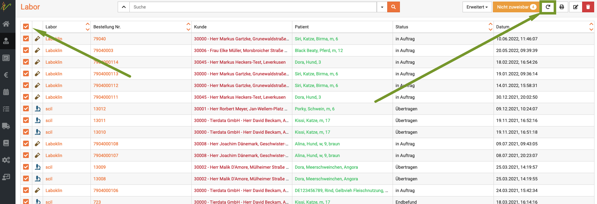

Alternativ können Sie auch an dem Patienten, den Sie gerade behandeln, die Laborbefunde einzeln noch einmal abrufen.
Klicken Sie dazu in der Behandlung auf den Reiter **Labor**. Dort klicken Sie dannauf das **Aktualisierungs-Symbol**.  

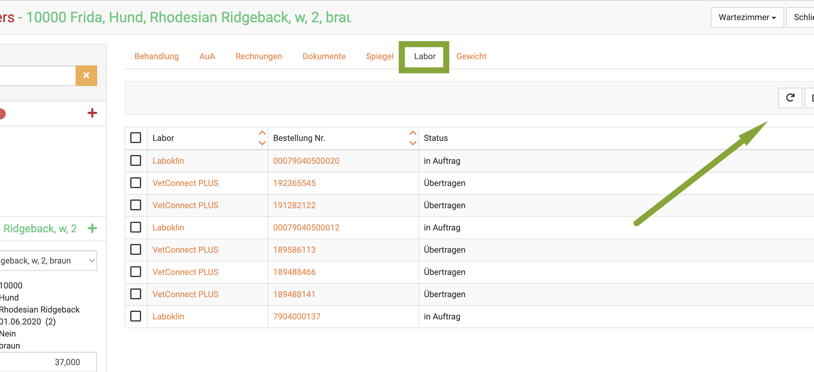

## Laboraufträge suchen und finden  

Tippen Sie in das Suchfenster wie bei einer Suchmaschine Begriffe ein, die auf den gewünschten Laborauftrag 
(z.B. Kunden- oder Patientename) passen und drücken Sie die Entertaste oder klicken Sie auf das Lupensymbol.  

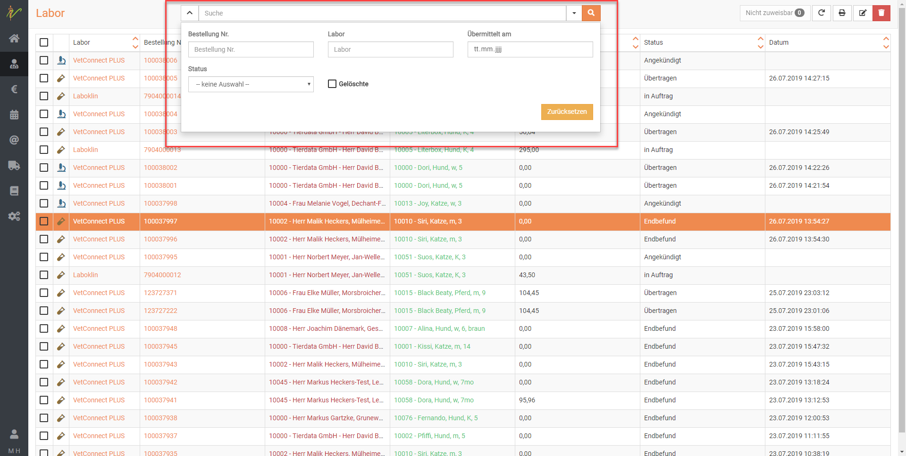  

### Suche filtern  

Wenn Sie neben dem Eingabefeld für die Schnellsuche oben auf den **Pfeil nach unten** klicken, können Sie auch nach gezielten
Parametern bzw. weiteren Suchbegriffen filtern.  

### Suchenfilter zurücksetzen  

Wenn Sie eine Suche ausgeführt haben, ist die Liste gefiltert, was dadurch angezeigt wird, dass der **Pfeil nach unten** neben 
den der Schnellsuche **gelb** ist. Klicken Sie auf den **Pfeil nach unten** und dann auf **Zurücksetzen**, um die Liste wieder 
ungefiltert angezeigt zu bekommen.  

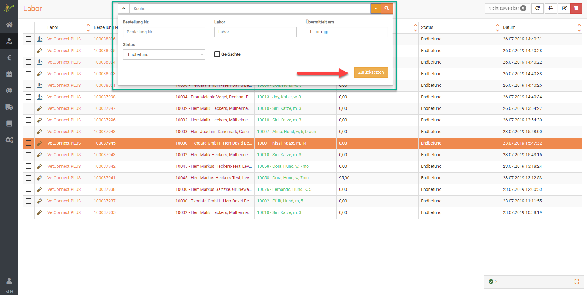

## Laborauftrag bearbeiten bzw. einsehen  

Klicken Sie auf **Praxis** → **Labor**.

Klicken Sie in der Liste ihrer Laboraufträge auf den Link in der Spalte **Labor** oder **Bestellnummer**, um auf die
Bearbeitungsseite des Laborauftrags zu gelangen. Natürlich können Sie die Liste vorher über die Suche filtern. 

:::tip Tipp  

Das Reagenzglas-Symbol zeigt an, das es sich um einen externen Laborauftrag handelt, das Mikroskop hingegen bedeutet, 
das es sich um einen internen Laborauftrag z.B. an Ihrer IDEXX VetLab-Station handelt.   

:::   

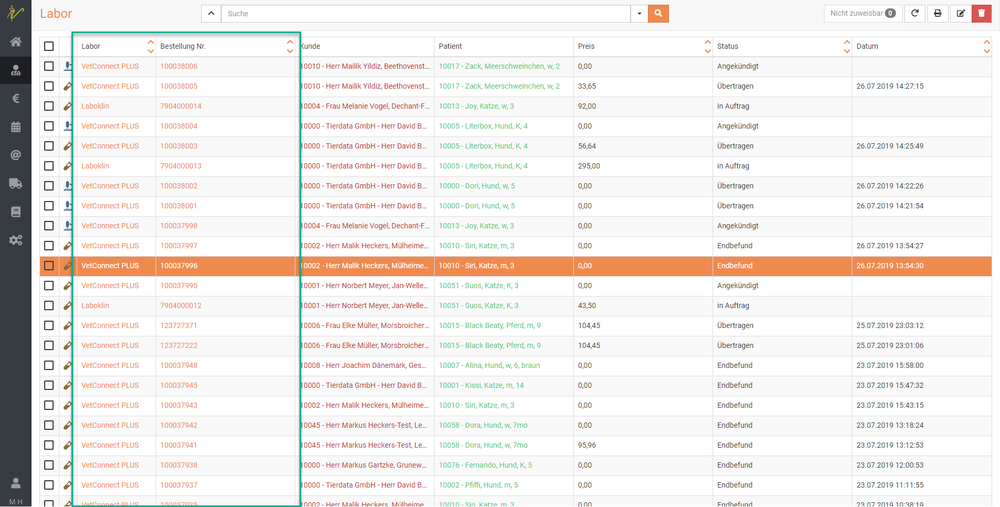   

### Details zum Laborauftrag

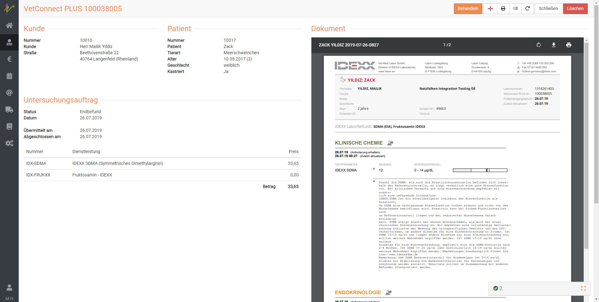  

Auf der Detailseite des Laborauftrages sehen Sie nebem dem Befund alle im System hinterlegten Details.   

Folgende Funktionen können mit diesem Seiten-Menü (von links nach rechts) ausgeführt werden:
* Direkt in die Behandlung (Kartei) dieses Patienten wechseln  
* Details zum Auftrag in VetConnect darstellen  
* Probenbegeleitschreiben ausdrucken  
* Barcode-Etikette für diese Probe ausdrucken  
* Auftrag aktualisieren bzw. abfragen im Labor  
* Schließen und zurück zur Liste  
* Laborauftrag löschen

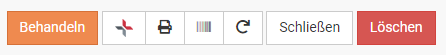

## Mehrere Laboraufträge bearbeiten, löschen oder drucken  

Um mehrere Laboraufträge zu bearbeiten, zu löschen oder zu drucken, wählen Sie zunächst die jeweilige **Checkbox** in der Liste 
für die gewünschten Aufträge.

Klicken Sie nun auf das **Bleistift-Symbol** im Menü oben rechts, gelangen Sie auf die Detailseite des zuerst ausgewählten 
Laborauftrages auf dieser Liste. Auf der Detailseite können Sie zwischen den hier vorausgewählten ("angekreuzten") Aufträgen hin- und her navigieren.

Drücken Sie nun das **Stiftsymbol** oben rechts, um die ausgewählten Aufträge zu bearbeiten. Sie können auch einen Sammeldruck 
(Etiketten, Probenbegleitschreiben) für die ausgewählten Aufträge anstoßen.

Drücken Sie das **Mülltonnensymbol**, werden die hier ausgewählten Aufträge nach Rückfrage gelöscht.  

Drücken Sie auf das **Druckersymbol**, werden die Probenbegleitschreiben zu den ausgewählten Aufträgen in einem Sammeldruck (PDF) zum Druck dargestellt.  

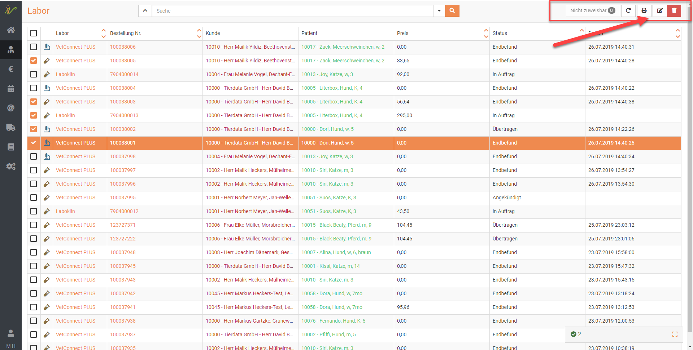  

## Befund nicht zuweisbar   
In seltenen Fällen kann es passieren, dass debevet Befunde vom Labor erhält, die keinem Patienten automatisch zugeordnet werden können. 
In diesem Fall steht auf dem Button **Nicht zuweisbar** eine umrandete Zahl.

Klicken Sie dann bitte auf den Button **Nicht Zuweisbar**. 

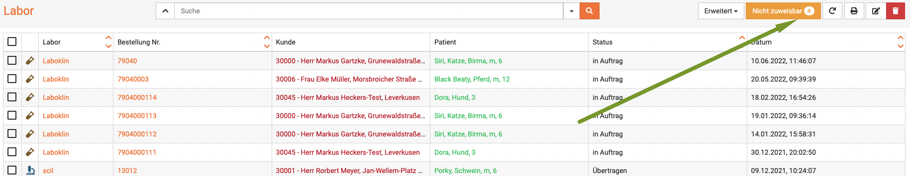  

Dort finden Sie nun eine Auflistung der nicht zuweisbaren Aufträge. Um einen Auftrag manuell einem Patienten zuzuweisen, klicken
Sie auf das **Plus Symbol** in der Liste rechts.   

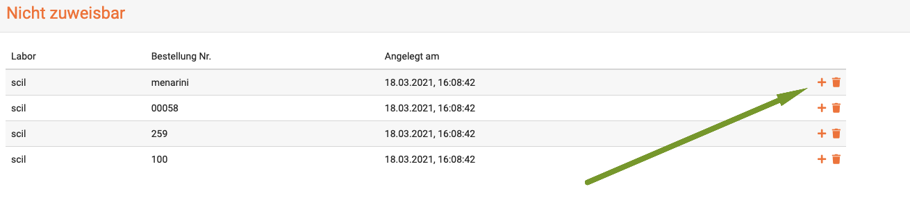   

Nun öffnet sich eine Maske, in der Sie den Befund einem Patienten oder einem Untersuchungsauftrag zuweisen können.  

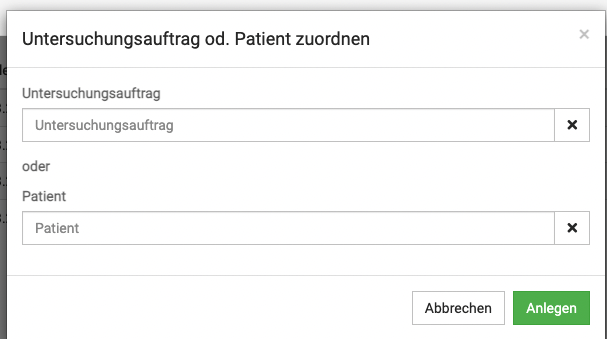

## Eigene Untersuchungsprofile anlegen

Sie können bei Ihren eigenen Geräten persönliche Untersuchungsprofile anlegen, die Sie häufig brauchen. So können Sie schneller
einen Laborauftrag für Patienten einfügen, ohne jedes Mal die Parameter zu wählen.

Wählen Sie dazu **Praxis** und dann **Labor**. Klicken Sie nun oben rechts auf **Erweitert**.

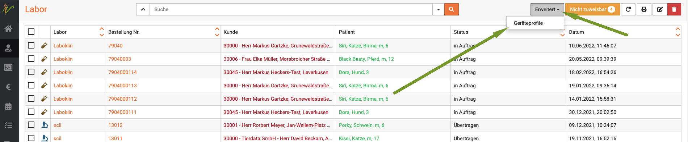

Wählen Sie dann **Geräteprofile**

Nun sehen Sie, falls vorhanden, eine Liste Ihrer bereits bestehenden Profile. Um für ein Gerät ein neues Profil anzulegen, wählen Sie
oben rechts im Dropdown Ihr Gerät und drücken danach auf das **grüne Plus Symbol**.   

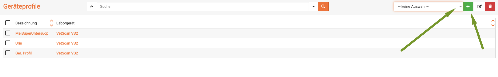   

Nun öffnet sich die Maske, in der Sie dem Profil einen Namen geben können und die gewünschten Parameter anklicken können.   

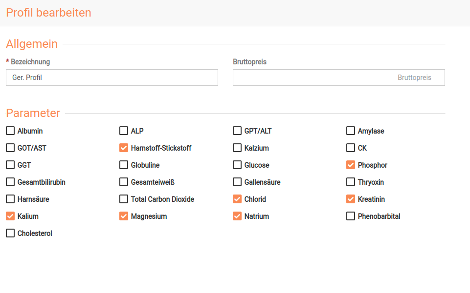

## Eigene Laborleistungen abrechnen  

Um eigene Pauschalen für Laborangebote zu nutzen und abzurechnen können Sie neben den GOT Posten natürlich auch eigene anlegen.
Diese werden dann als **Produkt** angelegt. Hier erfahren Sie, wie Sie Produkte anlegen:  

[Produkte anlegen](docs/Warenwirtschaft/Produkte#neue-produkte-anlegen)  

