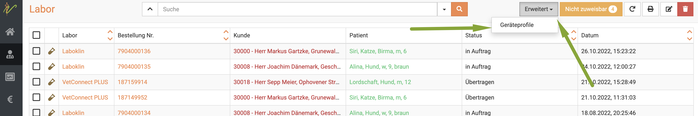
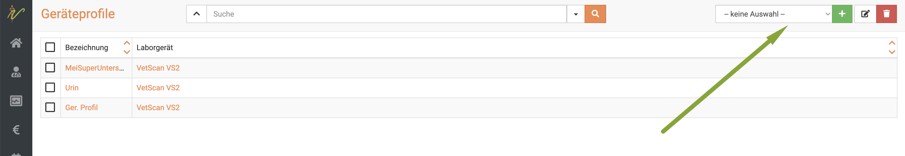
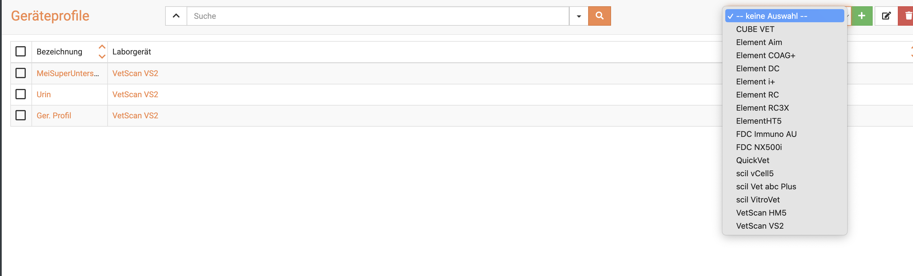
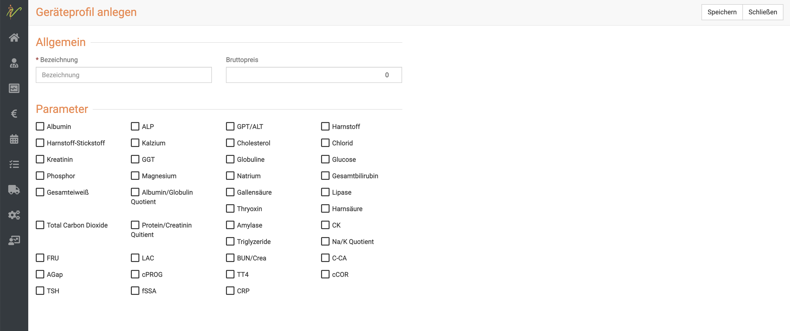

# Geräteprofile 

Für Ihre internen Laborgeräte können Sie Geräteprofile anlegen. Um die gewünschten Profile einzurichten, müssen Sie wie folgt vorgehen.

## Neues Geräteprofil anlegen  

Klicken Sie zunächst links auf das **Praxis** Symbol und dann **Labor**. 
In dieser Ansicht klicken Sie oben rechts **Erweitert** und dann **Geräteprofile**  

  

Nun wählen Sie in der Liste oben rechts Ihr Laborgerät aus.  

 

  

Klicken Sie nun auf das **grüne Plus-Symbol**.  

Nun wird Ihnen eine Übersicht gezeigt, welche Tests dieses Gerät absolvieren kann. Die einzelnen Testes können mit Checkboxen 
ausgewählt werden.

Benennen Sie das Geräteprofil nach Wunsch und geben Sie den Bruttopreis an, den Sie für das Profil veranschlagen möchten. 

Anschließend klicken Sie oben rechts auf **Speichern**.  

