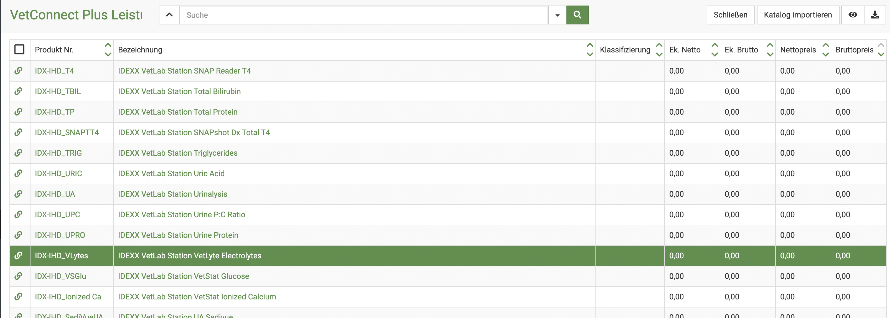
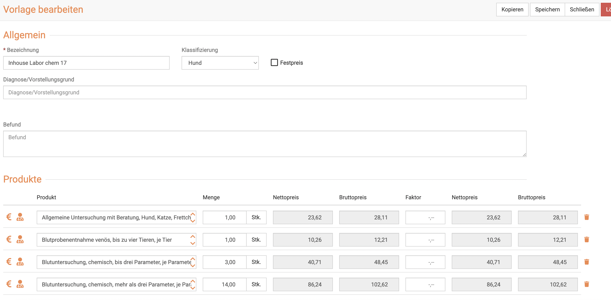

# Inhouse Labor abrechnen  

Immer wieder erreichen uns Anfragen, was wir empfehlen, um die Abrechnung der Inhouse Labore ideal zu lösen. Die meisten nutzen 
Idexx Stationen, weshalb wir diese hier als Beispiel nutzen.  

## Abrechnung bei Idexx Inhouse   

Wir würden immer empfehlen, dass Sie sich verschieden Vorlagen anlegen, die die passenden Posten enthalten, damit die Abrechnung
schnell und effizient funktioniert. 

Dies könnte z.B. zunächst (pro Tierart) eine Vorlage für die Blutentnahme sein, inkl. der Aufarbeitung der Proben.

Zusätzlich würden Sie dann die entsprechenden GOT Posten entweder in eine gesonderte Vorlage oder in dieselbe ergänzen.  

Der offiziell vorgeschriebene Weg, wäre, die ersten drei bestimmten Werte mit der GOT 610 abzurechnen und alle weiteren dann mit GOT 611.

Je nachdem, wie viele Werte Ihr Test enthält, müssen Sie dies also in der Vorlage entsprechend einsetzen.   

Weitere Tests, wie z.B. Gerinnung, Hämatokrit, Blutsenkung etc. müssten zusätzlich mit den entsprechenden GOT Posten 
eingetragen werden.   

## Warum steht der Preis des Tests auf Null Euro?  

Wenn Sie den Test über die Schnittstelle beauftragen, wird der Test selbst auf 0.00 Euro gesetzt.   

Dies hat den Grund, dass der Test an sich keine Kosten zur Abrechnung vorgesehen hat und diese somit bei Idexx mit 0,00 Euro hinterlegt sind und so im Katalog stehen.
Vorgesehen ist, dass die Kosten für den Test über die saubere Abrechnung der Posten der GOT abgerechnet werden.

Wenn Sie also beispielsweise den Chem17 beauftragen, wären das allein mit der Blutentnahme ohne Allgemeine Untersuchung bereits ca. 180 Euro netto. 

Hier wäre ein Beispiel, dabei ist alles im einfachen Satz abgerechnet. Diesen könnten Sie erhöhen, wenn Ihnen die Summe zu niedrig ist.
  

Einige Tierärzte rechnen die Verbrauchsmaterialien dennoch getrennt ab, ob dies rechtlich erlaubt ist, ist uns nicht bekannt. 

Falls Sie dies so anlegen und durchführen möchten, beschreiben wir im nächsten Schritt, wie Sie das durchführen können. 

## Testkits als Verbrauch abrechnen   

Hier haben Sie widerum, da es rechtlich nicht ganz klar ist, zwei Möglichkeiten:  

1. Sie legen einen §7 Verbrauchsmaterial Posten an  
2.  Sie legen ein Produkt mit Namen des Testkits an und tragen manuell Ihren Einkaufspreis bei Idexx ein (und lassen den VK berechnen)  

Diese Posten können Sie dann ebenfalls in der Vorlage mit einbauen, damit diese direkt mit abgerechnet werden. Ob und wie Sie das 
umsetzen, ist dabei Ihre Entscheidung. 