# Dienstplanung/ Arbeitszeitplanung  

Seit 2023 bietet die debevet Software die Funktion der Arbeitplanung an. Sie können Sie die Dienstpläne und Verfügbarkeiten Ihrer Mitarbeiter 
planen und diese in Ihren Kalendern damit buchbar (auch für Online Terminvereinbarungen) machen. 

## Dienstplan erstellen/ anlegen

Um einen neuen Dienstplan zu erstellen, klicken Sie auf **Verwaltung** und dann **Arbeitszeitplanung** und oben rechts auf **Anlegen**.   

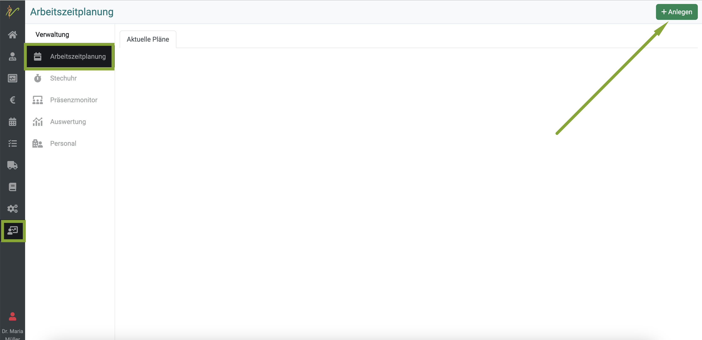  

Nun können Sie dem Dienstplan (der alle Mitarbeiter umfasst) einen Namen geben und eine Gültigkeitsdauer festlegen. So haben Sie eine 
volle Flexibilität für eventuelle Urlaubspläne oder Schichtwechsel. Klicken Sie auf **anlegen**.

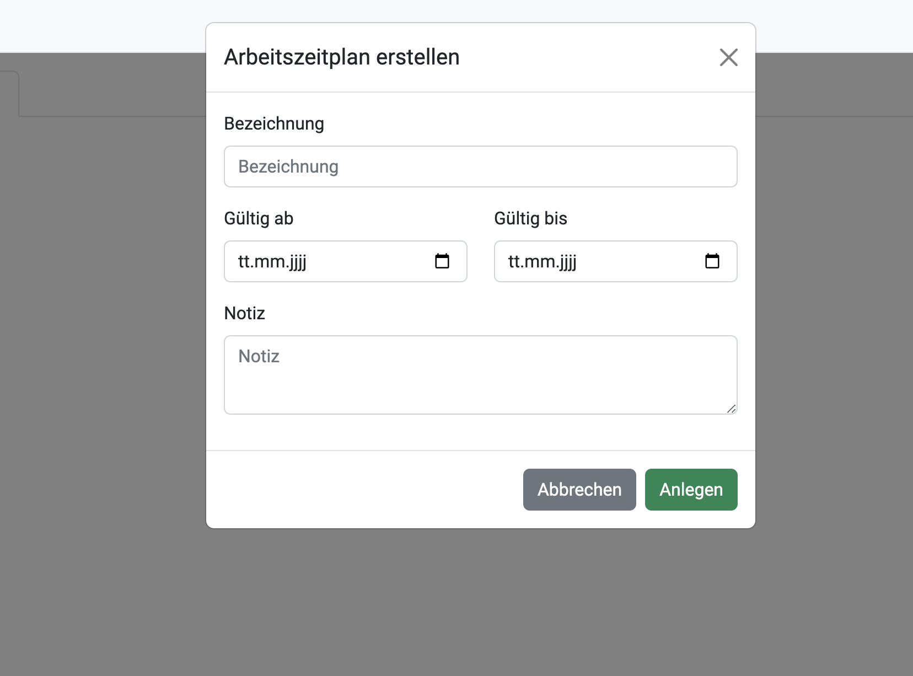  

Nun wird der neu angelegte Plan direkt in der Übersicht angezeigt. Dabei sehen Sie unten in der Leiste am Plan kleine Symbole.

* Kalendersymbol - hier gelangen Sie in die Detailplanung der Zeiten
* Stiftsymbol - hier können Sie zurück in die Bearbeitungsmaske (die beimn Anlegen sichtbar war) gelangen  
* Kopieren - hiermit können Sie den Plan duplizieren  
* Löschen - hiermit wird der Plan gelöscht  

## Mitarbeiter Arbeitszeiten einteilen

Um den Plan im Detail zu den Mitarbeitern zu gestalten (also eine Schicht zu planen), klicken Sie nun bitte auf das **Kalender-Symbol** am gewünschten Plan.   

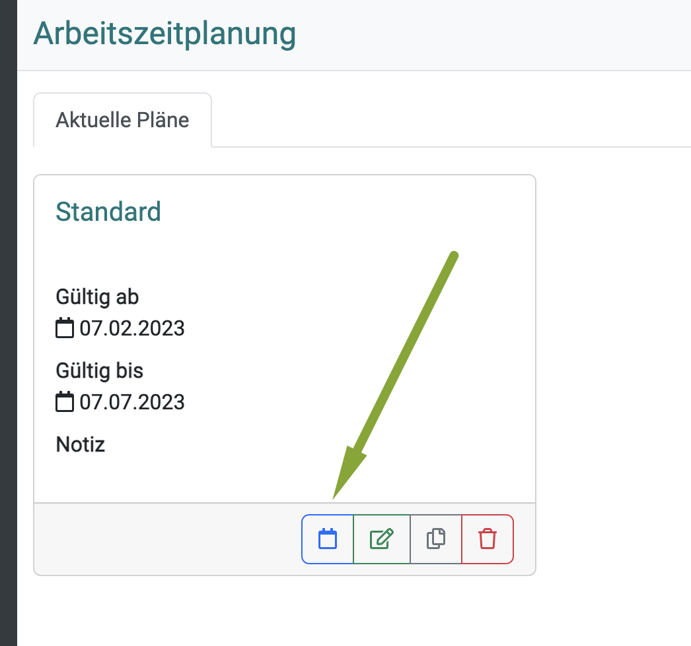  

Sie sehen zunächst die Übersicht, in der im nun noch neuen Plan noch keine Schichten angelegt sind.   

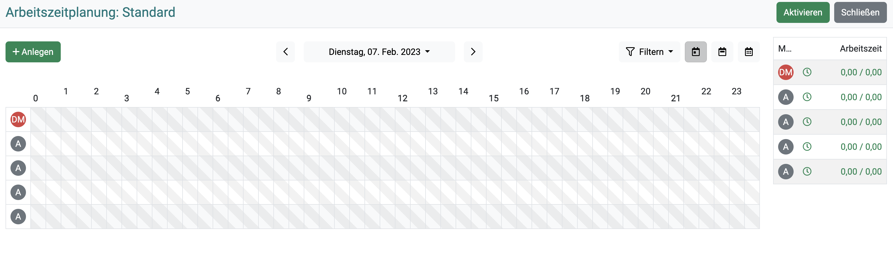  

Sie haben oben rechts die Möglichkeit, die Ansicht des Kalenders zu wechseln:  
* Tagesansicht
* Wochenansicht
* Monatsansicht   

Außerdem können Sie auf **Filtern** klicken, um sich den Kalender nach einem oder mehreren Mitarbeitern zu filtern.   

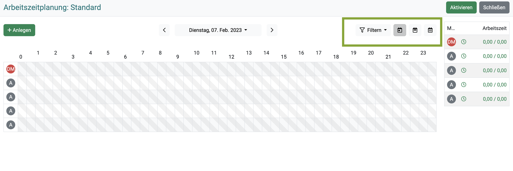  

Ganz rechts sehen Sie eine Übersicht, wie viele Stunden die Arbeitszeit eines jeden Mitarbeiters beträgt.  

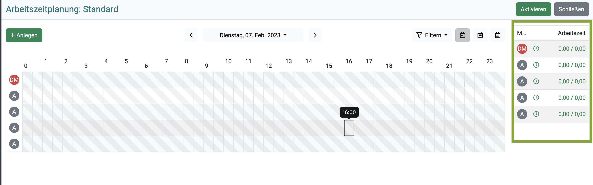   

Um einem Mitarbeiter Arbeitszeiten zuzuteilen, klicken Sie entweder auf die gewünschte Uhrzeit im Kalender oder klicken Sie **Anlegen**.  

Nun öffnet sich eine Maske, in der Sie diverse Eingabe-Möglichkeiten haben.   

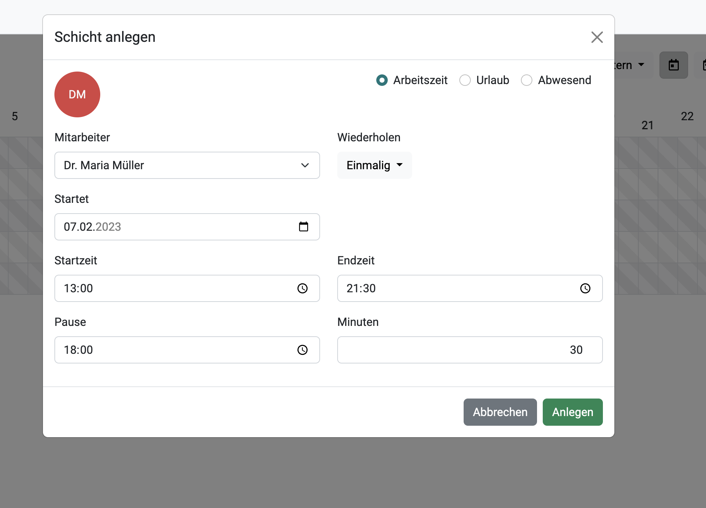  

Wählen Sie die Art der Einteilung aus: 

* Arbeitszeit
* Urlaub
* Abwesenheit  

Wählen Sie den Mitarbeiter aus. Neben dem Mitarbeiter sehen Sie die Möglichkeit, die Arbeitszeit zu wiederholen. Klicken Sie dazu auf
den **Dropdown-Pfeil**. Wählen Sie nun zwischen:  

* Einmalig  
* Täglich
* Wöchentlich
* Wöchentlich an Werktagen 
* Benutzerdefiniert (mit weiterem Untermenü)  

Nun müssen Sie das Start- und Enddatum der Planung des Mitarbeiters (innerhalb der Gültigkeitsdauer des  Dienstplanes möglich) festsetzen.  

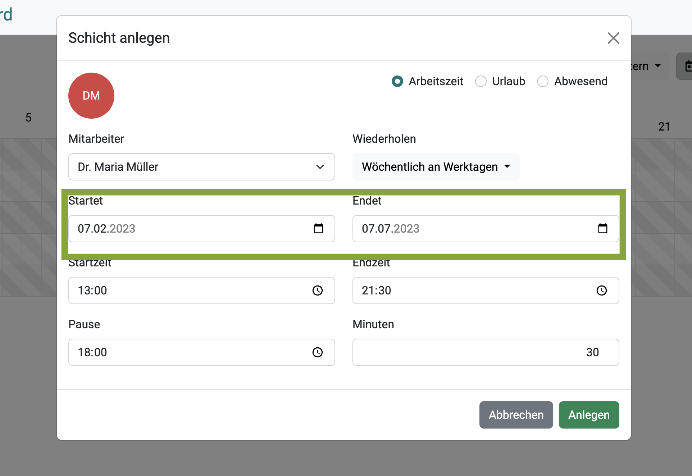  

Schließlich setzen Sie die Arbeitszeit fest. Außerdem können Sie eine Pausenzeit an einer festen Uhrzeit hinterlegen.   

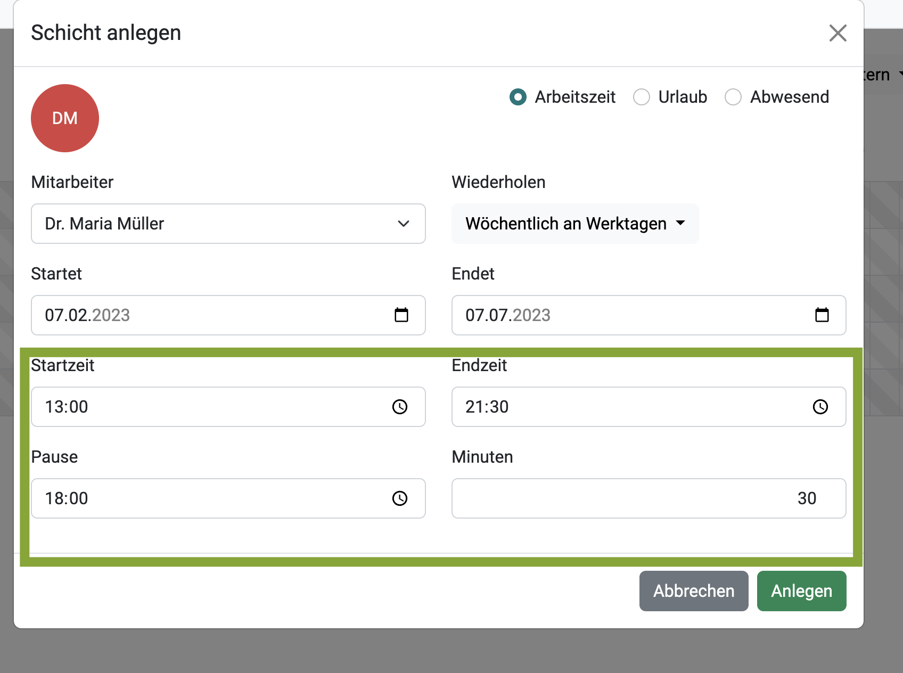   

Klicken Sie abschließend auf **Anlegen** unten rechts.  

Wenn Sie für andere Wochentage andere Zeiten für diesen Mitarbeiter erstellen möchten, wiederholen Sie diesen Schritt beliebig oft.  

:::tip Tipp:  

Um die angelegten Schichten erneut zu bearbeiten, können Sie diese einfach in der Arbeitszeitplanung in der Kalenderübersicht erneut anklicken. Beim mit der
Maus über eine Schicht fahren sehen Sie Detailinformationen.

:::   

## Einzelne Schichten löschen  

Um eine Schichtplanung eines Mitarbeiters zu löschen, öffnen Sie diese, indem Sie diese in der Übersicht der Arbeitszeitplanung 
anklicken und damit öffnen.   

Klicken Sie nun oben rechts auf das **Mülleimer-Symbol**. Bei sich wiederholenden Terminen werden Sie gefragt, ob Sie nur diesen einen oder alle Schichten
löschen möchten. 

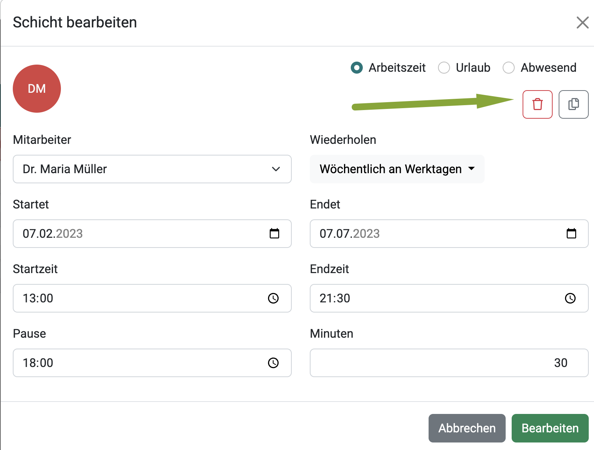

## Schicht kopieren  

In der selben Ansicht sehen Sie neben dem Mülleimer ein **Kopieren** Symbol, mit dem Sie eine Schicht duplizieren können.   

## Dienstplan aktivieren  

Um den neu erstellten Plan zu aktivieren, klicken sie abschließend oben rechts auf **Aktivieren**. 

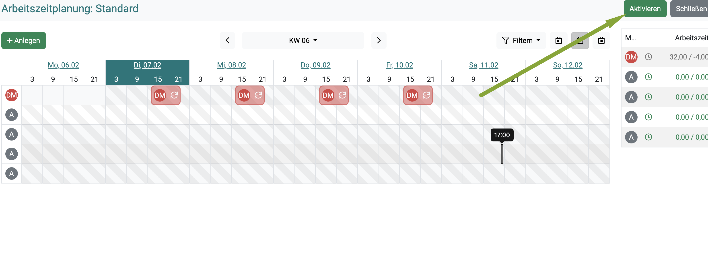   

Klicken Sie anschließend auf **Schließen**.

In der Übersicht sehen Sie dann direkt, welcher Ihrer Pläne nun aktiv ist.  

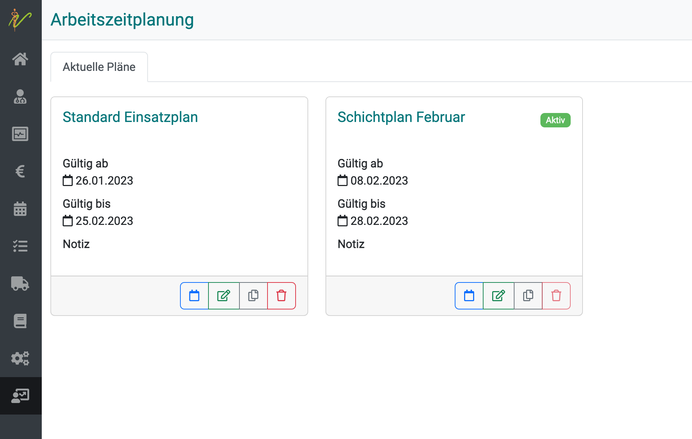  

## Personalverwaltung   

In der Sektion **Verwaltung** und **Personal** können Sie Daten zu Ihrem Personal hinterlegen. 

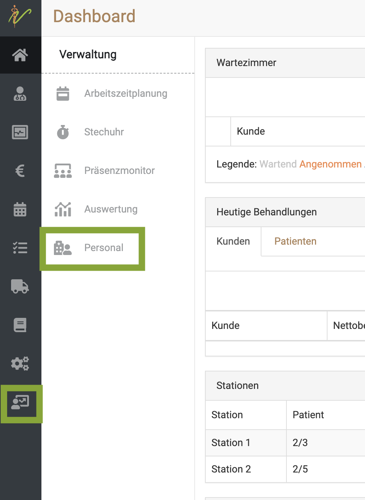  

Als erstes sehen Sie eine Übersicht, in der Sie Ihr gesamtes Personal und wichtige Informationen zu jedem Mitarbeiter direkt im Überblick haben.   

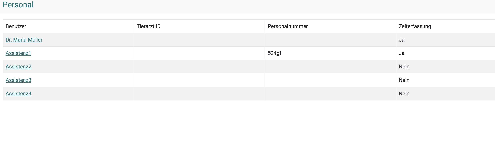

### Mitarbeiter verwalten  

Um die Daten an einem Mitarbeiter zu ändern und detaillierter zu sehen, klicken Sie einfach auf den Namen des gewünschten Mitarbeiters.  
Es öffnet sich eine Maske, in der diverse Daten hinterlegt werden können.  

Um ein Bild zu Ihrem Mitarbeiter zu hinterlegen, klicken Sie auf **Datei auswählen**. Nun können Sie ein beliebiges Bild von Ihrem Rechner hochladen.  

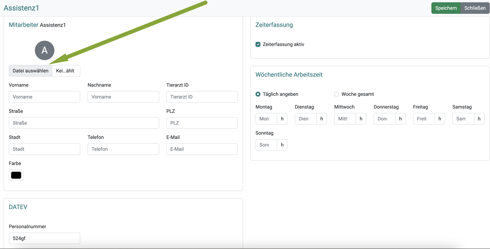  

Sie können außerdem die Adressdaten, die Tierarzt ID sowie eine gewünschte Farbe (für den Kalender) für den Mitarbeiter hinterlegen. Wenn
benötigt, kann außerdem eine DATEV Personalnummer hinterlegt werden.  

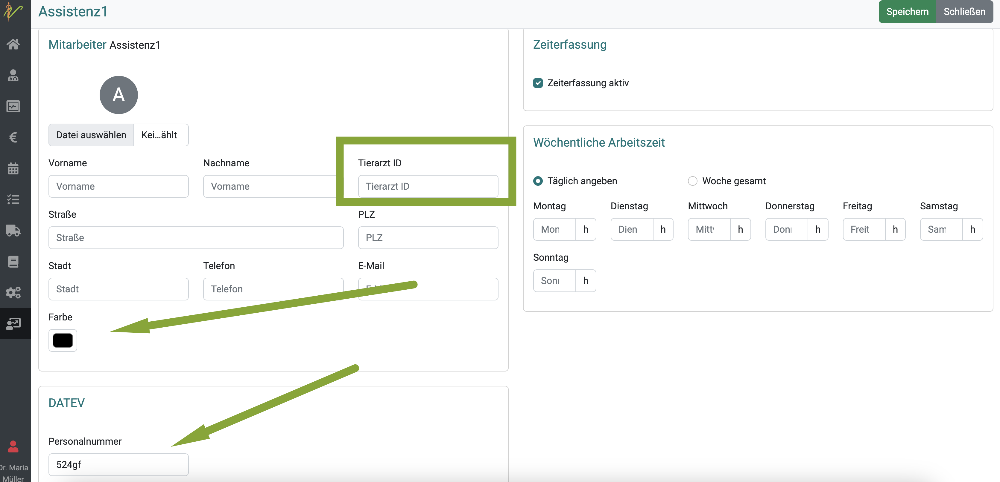  

Rechts haben Sie außerdem die Möglichkeit, die Gesamtstunden der Arbeitszeit pro Tag einzutragen sowie anzuklicken, ob die Arbeitszeiterfassung für diesen
Mitarbeiter genutzt werden soll.

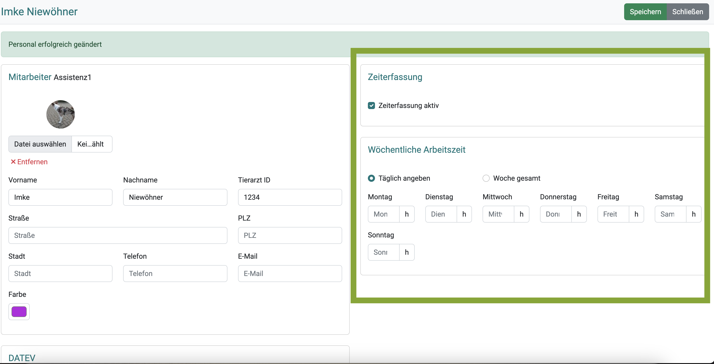 

Wenn Sie eine Farbe und ein Bild an einem Mitarbeiter hinterlegt haben, sieht eine Ansicht beispielsweise in der Wochen-Schichtplanung so aus: 

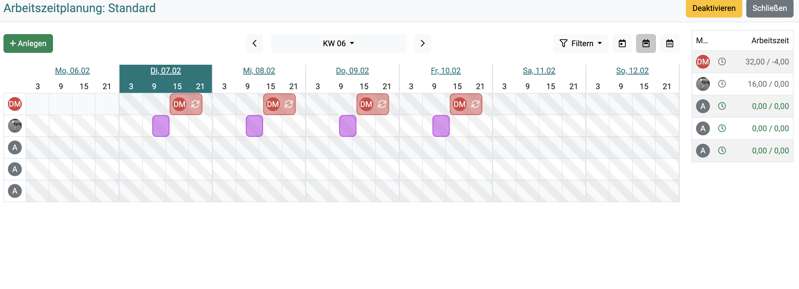

