# Zeiterfassung  

Seit September 2022 bietet debevet eine eigene, im Programm integrierte Zeiterfassung als Add-On. (bis Ende 2022 kostenfrei zum Testen,
danach gegen Aufpreis).

Um in den Bereich zu gelangen, klicken Sie in der Menüleiste ganz unten auf **Zeiterfassung**. 

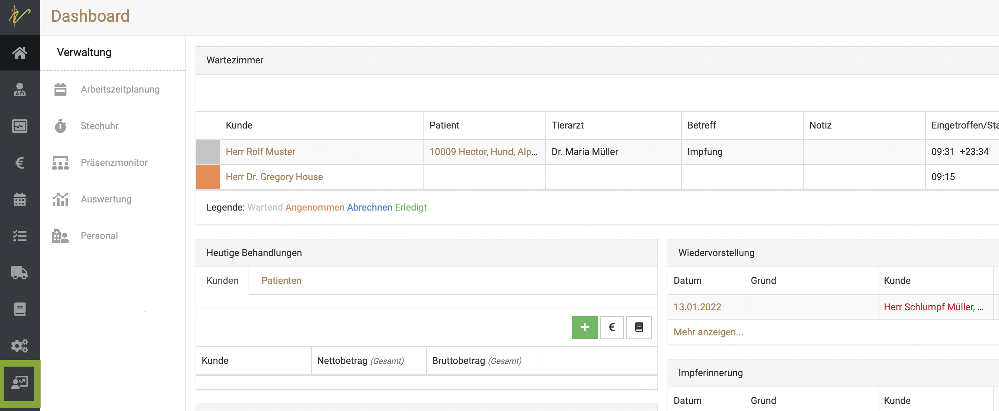

Dort finden Sie nun die unterschiedlichen Unterpunkte im Untermenü. 

:::caution Achtung: 

Es können nur die Zeiten der Mitarbeiter erfasst werden, die einen Benutzer Account haben!  

:::   

## Einstempeln /Ausstempeln  

Jeder Mitarbeiter/Benutzer kann sich selbst direkt einstempeln, indem er auf seinen Benutzernamen und das **Personensymbol** ganz unten links klickt.

Wenn die Zeiterfassung aktiv ist, wird die folgende Ansicht angezeigt.  

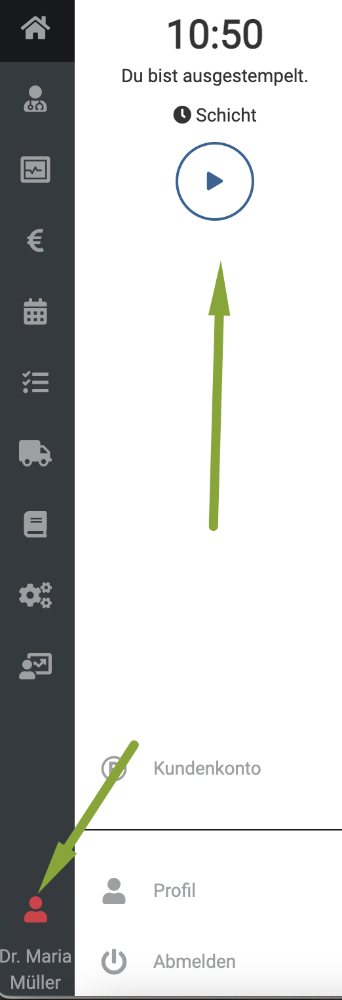

Um sich einzustempeln, müssen Sie einige Sekunden auf das **Play-Symbol** klicken. Dieses füllt sich dann blau und dann sind Sie eingestempelt.

Um eine Pause zu machen, klicken Sie unter dem Wort **Pause** dann erneut lange das **Play-Symbol**. 
Um eine Pause zu beenden, klicken Sie dann, wenn dort **Pause** steht, das **Stop-Symbol** erneut lang. 

Um eine Schicht zu beenden, klicken Sie unter dem Wort **Schicht** das **Stop-Symbol** lange.

## Personal 

Unter dieser Sektion können Sie einstellen, für welche Mitarbeiter die Zeiterfassung aktiv genutzt werden soll. Diese
Mitarbeiter finden dann auch in Ihrem Account die Zeiterfassung (in einer Nicht-Admin Version!)

Klicken Sie **Zeiterfassung** und **Personal**, um die Liste der Mitarbeiter zu sehen, für die die Zeiterfasssung aktiviert werden kann.
In der Tabelle sehen Sie auch, ob schon eine Zeiterfassung auf "aktiv" gesetzt wurde.  

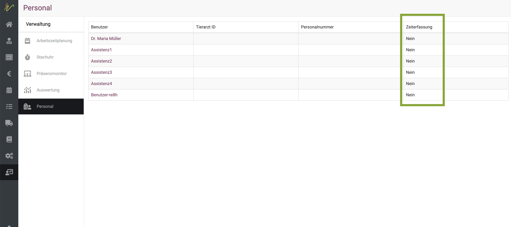  

Klicken Sie auf den Namen eines Mitarbeiters, um in die Detailansicht zu gelangen. 

Dort sehen Sie nun die Möglichkeit, auch eine DATEV Personalnummer zu hinterlegen, damit Ihr Steuerberater die Abrechnung dann direkt
korrekt vornehmen kann. 

Setzen Sie den Haken bei "aktiv", damit für den Mitarbeiter die Zeiterfassung aktiviert wird und somit genutzt werden kann.  

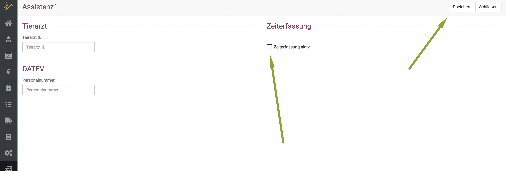  

## Auswertung  

Jeder Mitarbeiter, für den die Zeiterfassung aktiv gesetzt wurde, kann diese Sektion einsehen und seine eigenen Arbeitszeiten in 
dieser Sektion einsehen und auch herunterladen. 

Klicken Sie dazu auf **Zeiterfassung** und dann **Auswertung**. 

Nun können Sie oben den Datumsbereich wählen, für den die Arbeitszeit angesehen werden soll. 

Mit einem Klick auf den blauen Button **Herunterladen** oben rechts kann die Übersicht heruntergeladen und gespeichert werden.  

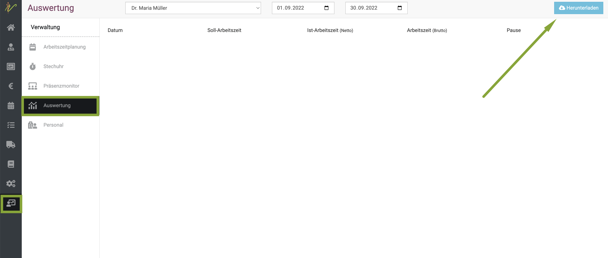  

## Präsenzmonitor  

Hierbei handelt es sich um die Admin Ansicht, diese können die Angestellten ohne Admin-Rechte also nicht einsehen. 

Klicken Sie auf ***Zeiterfassung** und **Präsenzmonitor**, um direkt einen Überblick zu haben, wer gerade aktiv eingestempelt ist. 

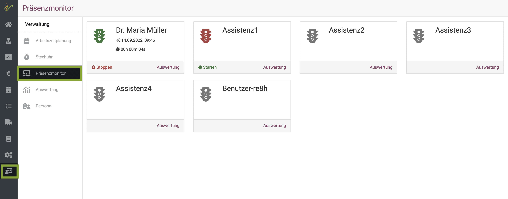

In der ersten Übersicht sehen Sie anhand einer grünen Ampel, dass der Mitarbeiter gerade eingestempelt und aktiv ist. 

Als Admin haben auch Sie hier die Möglichkeit, die Arbeitszeit des Mitarbeiters oder Ihre eigene zu starten, zu stoppen, 
oder in die Auswertung zu springen.   

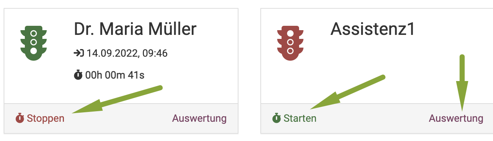  

Außerdem sehen Sie direkt auf den ersten Blick, an welchem Datum zu welcher Uhrzeit der Nutzer eingestempelt wurde und wie seine aktuelle 
Arbeitszeit ist, wenn er gerade aktiv eingestempelt ist.  

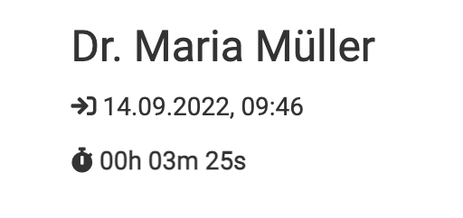   

## Stechuhr  

Die Stechuhr ist für jeden Benutzer sichtbar, der für die Zeiterfassung auf aktiv gesetzt wurde. Klicken Sie auf 
**Zeiterfassung** und dann **Stechuhr**, um diese einzusehen.

Hier sind die gestempelten Zeiten im Überblick sichtbar und können bis 24 Stunden nach Ende der Schicht noch bearbeitet werden.
Es gibt dann die Option **bearbeiten** und **bestätigen**.
Nach dem Bestätigen der Schicht kann diese nicht mehr verändert werden, ebenso wie nach 24 Stunden nach Ende der Schicht. Die Schicht wird 
24 Stunden nach Ende automatisch bestätigt, es können also nur in diesem Zeitfenster eventuelle Änderungen vorgenommen werden!   

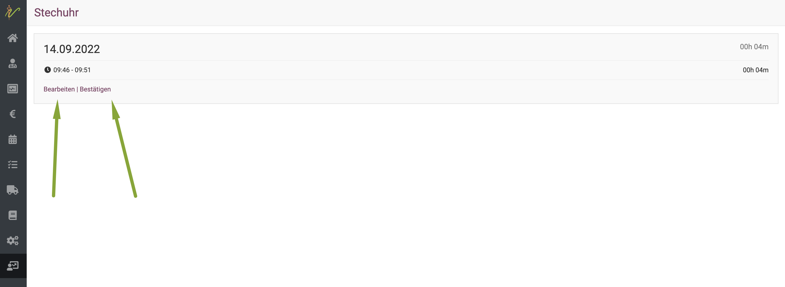  

Wenn Sie dort auf **Bearbeiten** klicken, kommen Sie in die Detailansicht dieser gestempelten Arbeitszeit.
Hier kann nun die Zeit bearbeitet und geändert werden. Außerdem kann oben recht am grünen Button **Pause hinzufügen** auch nachträglich noch die
Pausenzeit hinterlegt werden. Klicken Sie auf **Speichern** und **Schließen**, wenn Sie alle Daten wie gewünscht geändert haben.

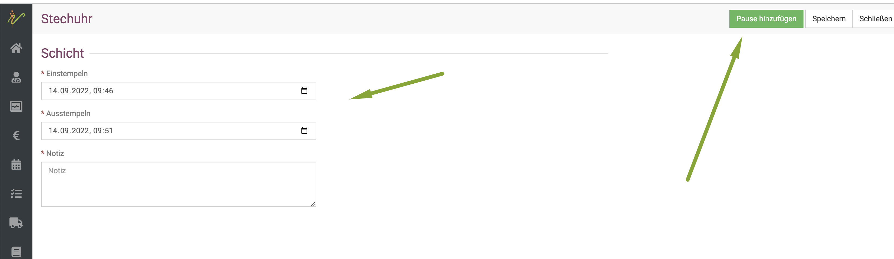

Wenn die Arbeitszeit bestätigt wurde, steht kein Button (weder "bearbeiten" noch "bestätigen") mehr zu Verfügung.
 
## Arbeitszeitplanung  

Hier kann der Admin die Arbeitszeiten der einzelnen Nutzer eintragen. Auf Basis dieser Zeiten werden bei der **Auswertung** der 
Arbeitszeiten auch die **Soll Arbeitszeiten** festgesetzt. 

Klicken Sie auf **Zeiterfassung** und dann **Arbeitszeitplanung**.  

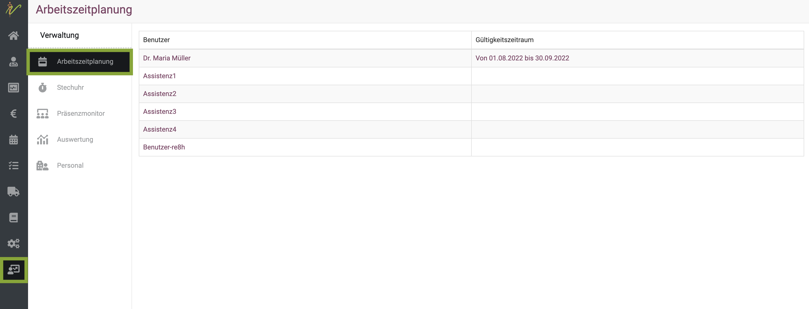  

Um nun für den einzelnen Mitarbeiter die Arbeitszeiten für einen gewissen Zeitraum zu setzen, klicken Sie auf dessen Namen.

In der Detailansicht können Sie nun zunächst oben einen **Gültigkeitszeitraum** für diesen Mitarbeiter eingeben. (z.B. den Monat, oder eine Woche, etc.)   

Nun sollte für jeden Tag, den der Mitarbeiter da ist, eine Arbeitszeit gesetzt werden.

Es kann an jedem Tag eine Uhrzeit, oder mehrere Uhrzeiten gesetzt werden. Tragen Sie zunächst die Uhrzeiten ein und klicken Sie dann unbedingt auf den **grünen Haken**
in der Zeile. Ansonsten wird diese Zeit nicht übernommen!

Wiederholen Sie dies für jede Zeile. Klicken Sie anschließend oben rechts auf **Speichern**. 

Es kann auch eine Vormittags- und Nachmittags Zeit angelegt werden und diese je in **A** und **B** eingestuft werden.  

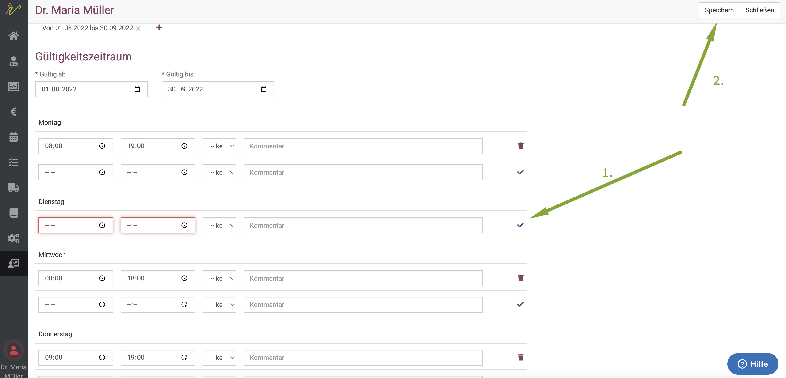  

### Arbeitszeitplanung bearbeiten  

Natürlich kann auch ein bereits bestehender Plan erneut bearbeitet werden. Klicken Sie auf **Zeiterfassung** und **Arbeitszeitplanung**. 
Nun können Sie am gewünschten Mitarbeiter auf den bestehenden Gültigkeitszeitraum in der Tabelle klicken und dieser öffnet sich. Wie im vorherigen Schritt beschrieben,
kann dieser nun bearbeitet und verändert werden.

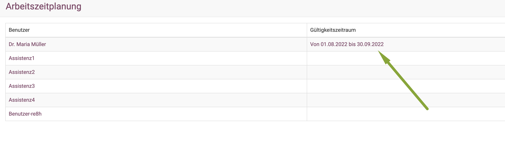
