# Videosprechstunde /Telemedizin 

Die debevet Tierarztsoftware bietet ab sofort die Möglichkeit, eine Fernsprechstunde anzubieten. Mit einer Videosprechstunde und
entsprechenden Terminen für Telemedizin können Sie etliche Dinge mti Ihren Kunden im Videocall besprechen.

Diese Variante bietet sich zum Beispiel an für: 
* Nachfragen oder kurze Beratungen
* Eventuelle Wundkontrollen bei wenig mobilen Besitzern
* Ernährungsberatung
* Verhaltenstherapie Vorgespräche oder einige Zwischen-Trainings
* Vorab Beratungen und Auskünfte generell

Vorteile: Sie haben eine bessere Grundlage, die Sie gegenüber dem Patienten in Rechnung stellen können. Der Kunde hat ein stärkeres Gefühl,
individuell beraten zu sein, da er Sie "sieht". 

## Generelle Funktionen der Videosprechstunde

Generell ist unser Videotool sehr ähnlich in den Funktionen wie Googlemeet. (Diese Funktionen haben auch die Teilnehmer) 

Beim Erstellen eines Termins mit einer Videosprechstunde wird ein Link erstellt. Aktuell gibt es zwei Möglichkeiten, wie Ihr Kunde dann teilnehmen kann:  

1. Über die around.pet App 
2. Sie schicken ihm den Link via Mail und er nutzt dann sein videofähiges Endgerät

Unten wird eine Funktionsleiste angezeigt: 

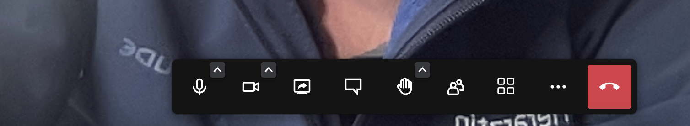  

### Mikrofon ein- und ausschalten /stumm

Hier kann sowohl verwaltet werden, welches Mikrofon und welche Lautsprecher genutzt werden sollen (mit Klick auf den kleinen Pfeil nach oben), als auch mit Klick auf das Mikrofon Symbol 
das Mikrofon ein- und ausgeschaltet werden.

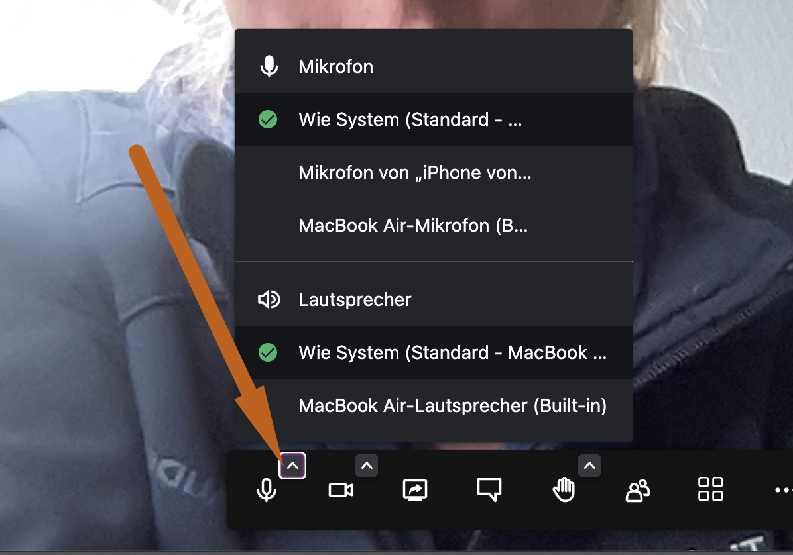  

### Kamera ein- und ausschalten

Hier können Sie (oder die Teilnehmer) die Kamera ein oder ausschalten bzw. verwalten.  

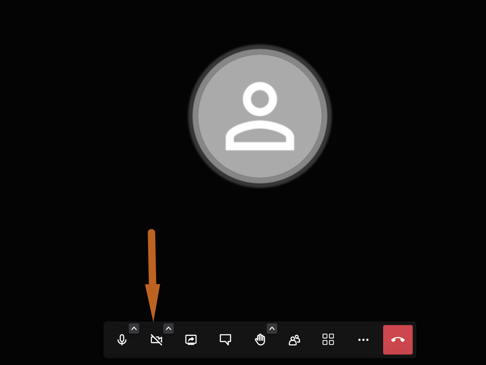

### Bildschirmfreigabe  

Hier können Sie Ihren Bildschirm teilen, um diverse Dinge (z.B. Videos, Grafiken, Röntgenbilder, Endoskopie etc.) zu zeigen.  

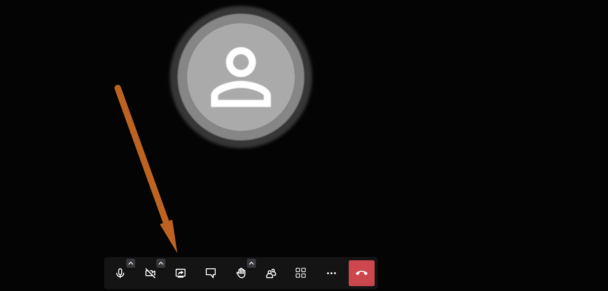  

### Reaktionen/Hand heben  

Diese Funktionen sind vor allem dann nützlich, wenn Sie mehrere Teilnehmer im Anruf haben, die Sie aus verschiedenen Gründen stumm geschaltet haben. Die Teilnehmer
könnten hier auf "Hand heben" klicken, oder andere Reaktionen senden, um auf sich aufmerksam zu machen. Sie können dann entscheiden, ob Sie z.B. dann den entsprechenden 
Teilnehmer in der Stummschaltung aufheben, um eine Frage zu gestatten.

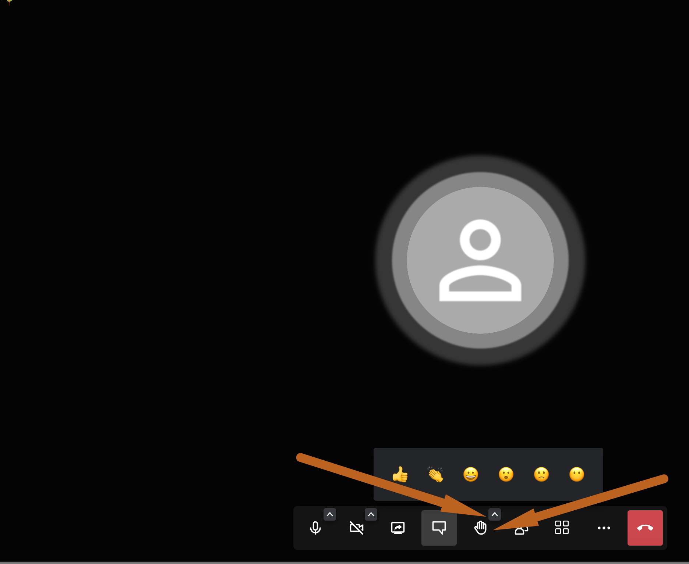

### Chat nutzen 

Wenn Sie noch etwas schriftlich übermitteln wollen, beispielsweise einen Link oder anderes, können Sie über die Chatfunktion einen Chatraum betreten. 

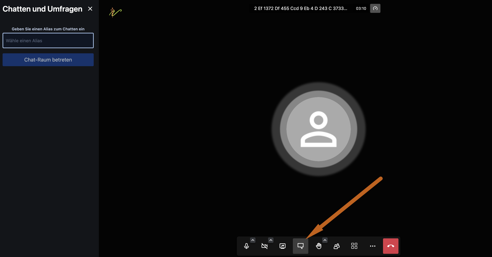

### Teilnehmer sehen/einladen 

In der Leiste sehen Sie ein kleines Personensymbol. Wenn Sie auf dieses klicken, können Sie die am Anruf teilnehmenden Personen sehen. Außerdem können
noch weitere Personen eingeladen werden.  

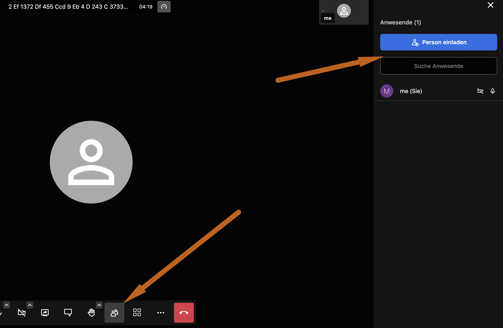

### Erweiterte Funktionen  

Weitere Einstellungen und Funktionen finden Sie, wenn Sie auf dieses Symbol klicken. Beispielsweise kann der Vollbildmodus aktiviert werden, ein Hintergrundbild
gesetzt werden, die Qualität verändert werden und vieles mehr. 

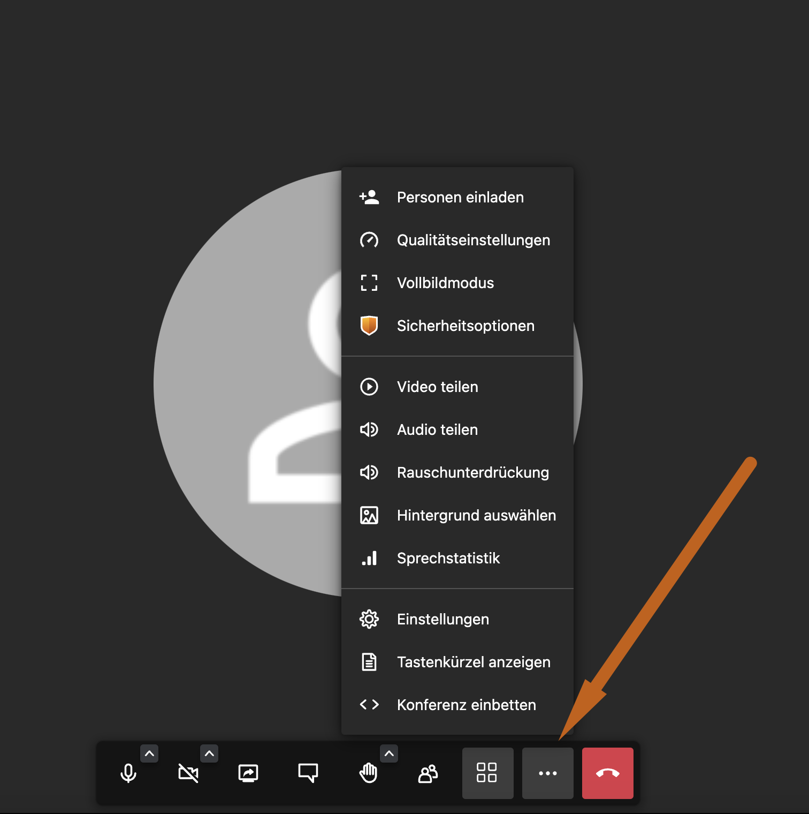

## Erstellen eines Videotermins
  
:::caution Achtung!  

Die Videocall-Funktion kann nur bei bereits aktivierter around.pet Schnittstelle genutzt werden.    
Wie Sie diese aktivieren, erfahren Sie hier:  
[around.pet Schnittstelle aktivieren](https://handbuch.debevet.de/docs/Online_Terminbuchung/Online_Terminvergabe#aroundpet-schnittstelle-aktivieren=)

::: 

Um einen Termin für eine Videosprechstunde für einen Kunden zu erstellen, klicken Sie links auf das Kalender-Symbol.

Nun klicken Sie im Kalender auf die Uhrzeit am Tag, den dem das Videotelefonat stattfinden soll oder Klicken Sie links "Termin anlegen".  

Geben Sie den Grund des Termins ein und wählen Sie als Kalender den Kalender des gewünschten Therapeuten. Wählen Sie außerdem bei "Typ" den
Typ "Videosprechstunde"   

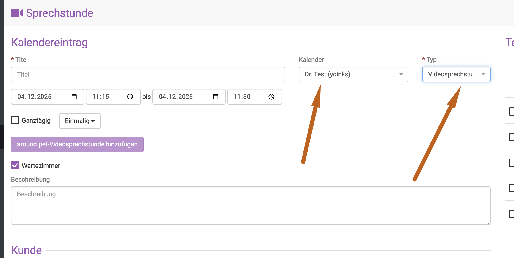

Geben Sie nun die Dauer des Termins ein und wählen unten wie gewohnt den Patienten und das zugehörige Tier. 

Klicken Sie nun oben rechts auf **Speichern**.

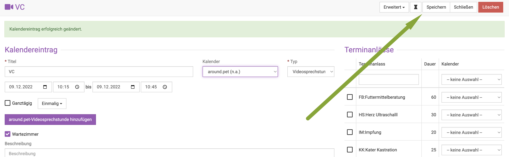  

Anschließend müssen Sie noch einmal auf den lila Button **around.pet Videosprechstunde erstellen** klicken, damit der Link erzeugt wird.

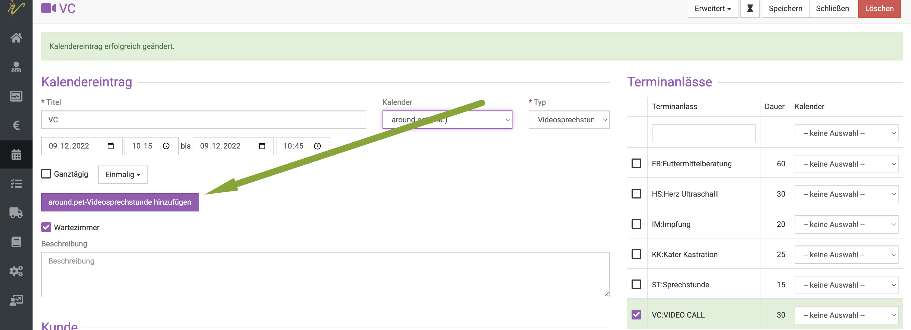 

Klicken Sie erneut **Speichern** und dann **Schließen**.  

:::tip Hinweis:

Kunden, die die around.pet App nutzen erhalten nun direkt eine Push-Mitteilung auf Ihr Smartphone oder Tablet und können sich ab einer Zeit von 5 Minuten
vor dem Termin direkt mit der App einwählen.

::: 

## Link via Mail verschicken  

Sollten sich die Kunden weigern, die App zu installieren, kann der generierte Link ebenso via Mail an den Kunden verschickt werden. 

Klicken Sie zunächst das **Link Kopieren** Symbol neben dem lila Button.  

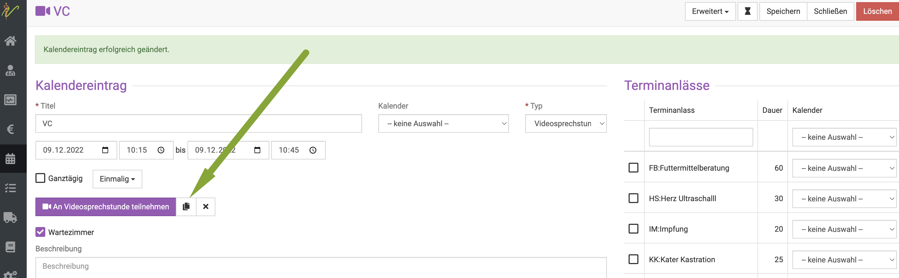 

Öffnen Sie nun den Kunden und klicken auf seine Mailadresse. Wenn Sie ein Mailprogramm nutzen, erstellt dieses direkt eine Email an den Patienten und Sie
können dort den Link hinterlegen und verschicken. Aktuell geht dies noch nicht automatisch direkt aus dem Kalender.  

## Videosprechstunde durchführen  

Wenn der Termin zeitlicht erreicht ist, öffnen Sie den Termin im Kalender und klicken Sie auf den lila Button **an Videosprechstunde teilnehmen**.  

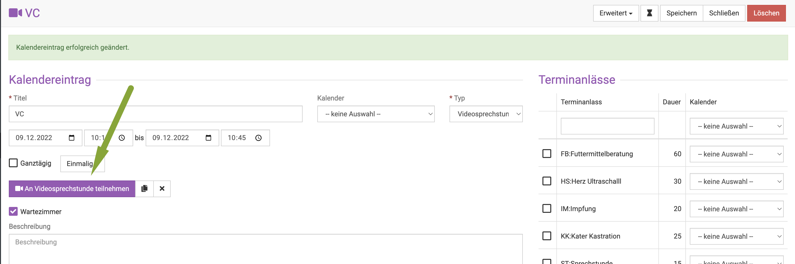

Die Verbindung wird nun direkt aufgebaut.